# Setting up GitHub Profile README


This guide provides details on how to create your own Github Profile README. Check out [my profile](https://github.com/joseeden).


## Create the Repository 

1. In your Github account, go to Repositories > New 
2. Enter a repository name that is the same as your username. Notice that a message will appear below it saying that this will be a special repository.
3. Tick the Add a README file box.
4. Click Create repository.

    <p align=center>
    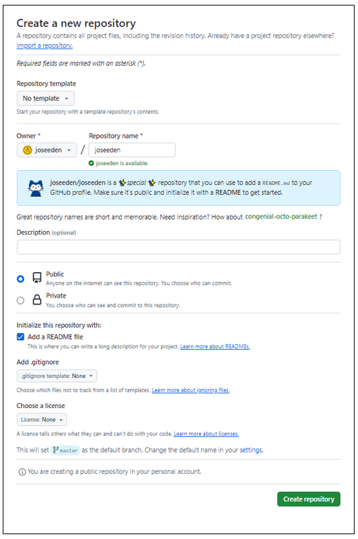
    </p>

5. Once created, it should appear at the top of your profile now. You can proceed to the next sections to learn how to customize it.


    <p align=center>
    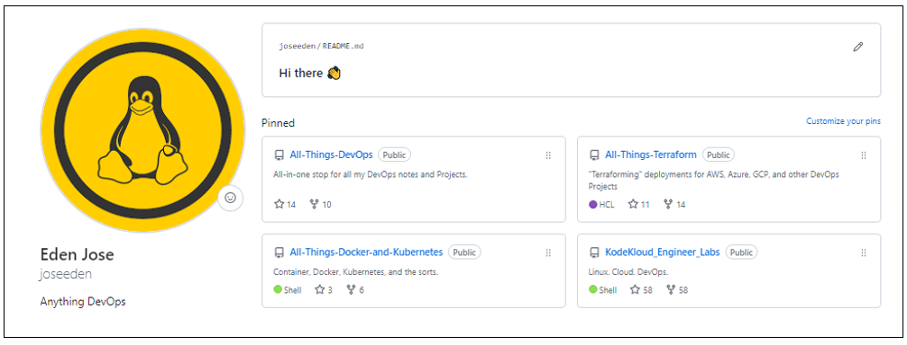
    </p>


## Adding Header 

I initially played around with headers on my Github profile README, but ended up removing it instead as I want a more simplified look. 

If you want to explore headers, see the links below:

- [capsule-render](https://github.com/kyechan99/capsule-render?tab=readme-ov-file#soft)

## Connect with me 

We can set up the "Connect with me" section using icons from [Simple Icons](https://simpleicons.org/). Another way is to download the SVG icons and then reference them in your Github profile readme.

Here is an example in markdown:

```markdown
## Connect with me

[](https://twitter.com/eden_noel08#gh-light-mode-only)
[](https://twitter.com/eden_noel08#gh-dark-mode-only)
&nbsp;&nbsp;

```

Another way to customize this section is to use shields.io.
As an example, we can search for X (Twitter) and customize the values. Click Execute to see the preview at the bottom. 

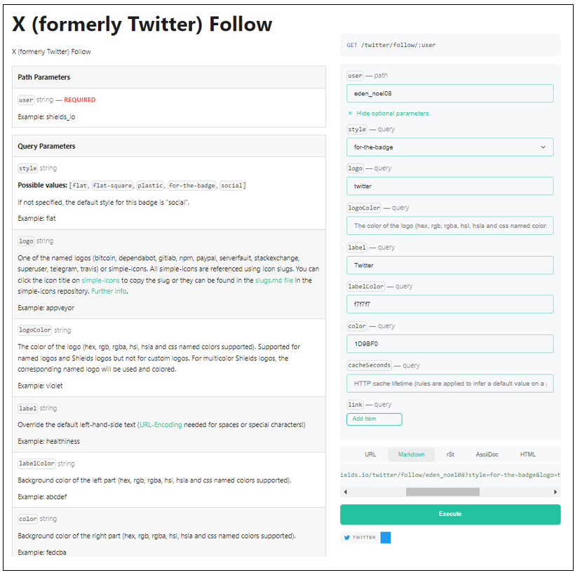

Once done, copy the Markdown URL and use it on your Github README file.

```markdown
## Connect with me

[][twitter]
```

Other badges:

- [hendrasob.github.io/badges](https://hendrasob.github.io/badges/#social-)

- [Awesome Badges](https://dev.to/envoy_/150-badges-for-github-pnk)


## Github Stats 

<small>Reference: [anuraghazra/github-readme-stats](https://github.com/anuraghazra/github-readme-stats)</small>

1. In Github, go to Settings > Developer settings > Personal access tokens.

2. Click Generate new token.

    

3. Enter a name and then click Generate token at the bottom. 

    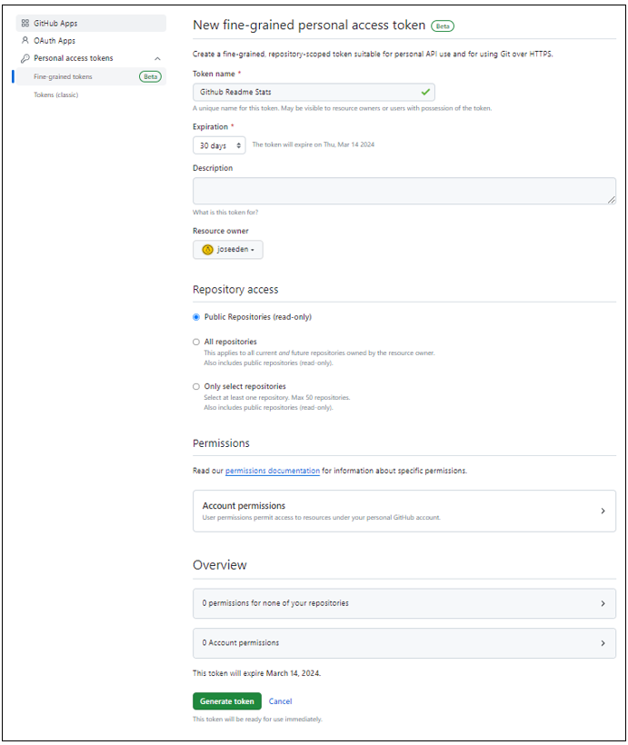

4. Copy the token and save it. This will be the only time you'll see the token in this page.

    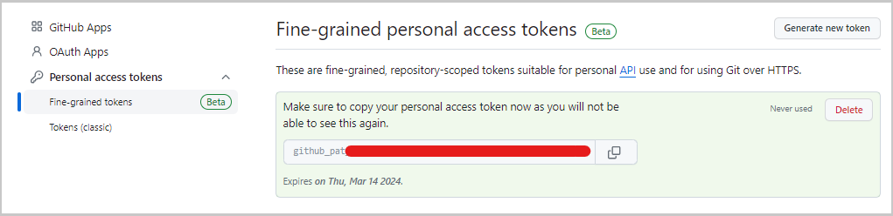

5. Go to vercel.com and sign up using your Github account. 

    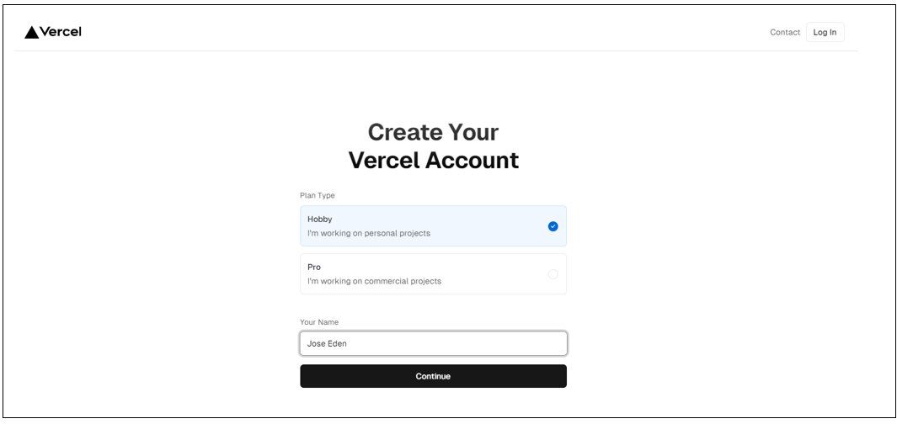

    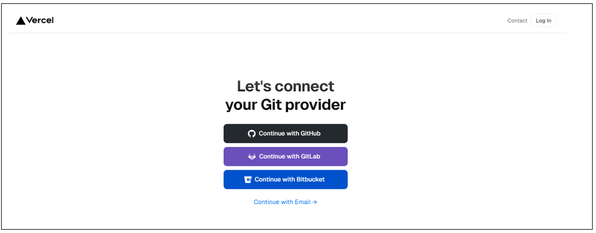


6. Go to Github and search for the [anuraghazra/github-readme-stats](https://github.com/anuraghazra/github-readme-stats) repo. Fork it. 

    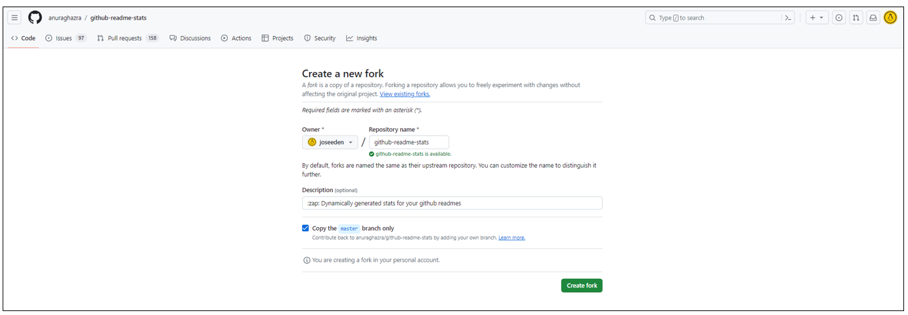

7. Copy the URL of the forked repository.

    ```bash
    https://github.com/joseeden/github-readme-stats 
    ```

8. Go back to Vercel and import repository > Add Github account.

    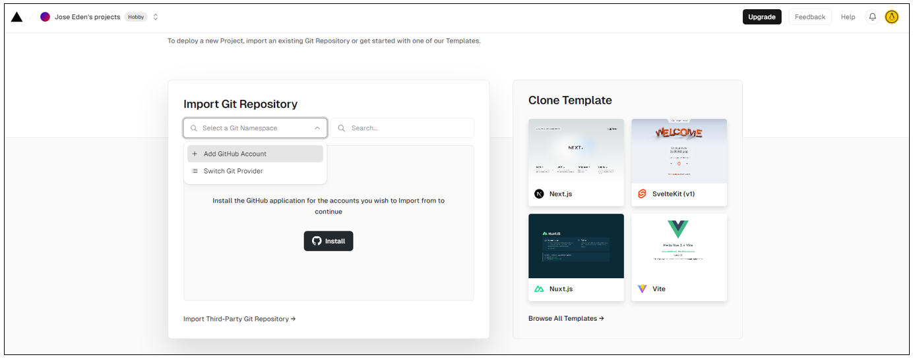

9. In the new window, click Only seelct repositories > choose the forked repository > Install.

    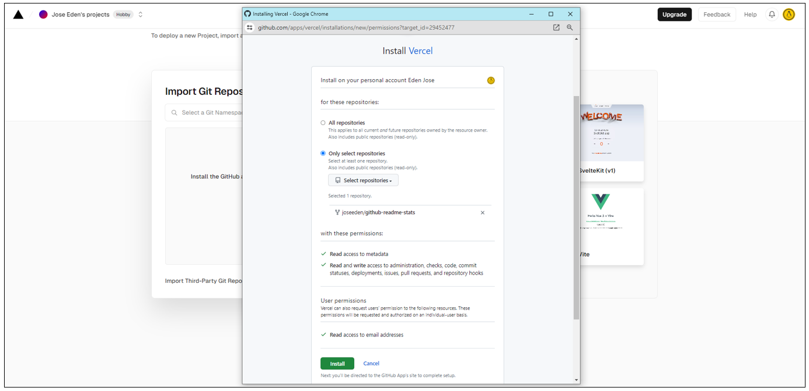

10. Click Import.

    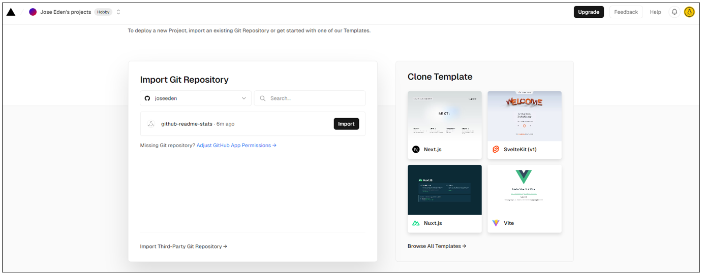

11. Click Environment Variables. Enter "PAT_1" as the Key and paste the Github token (generated in step 2) in the Value field. Click Add > Deploy.

    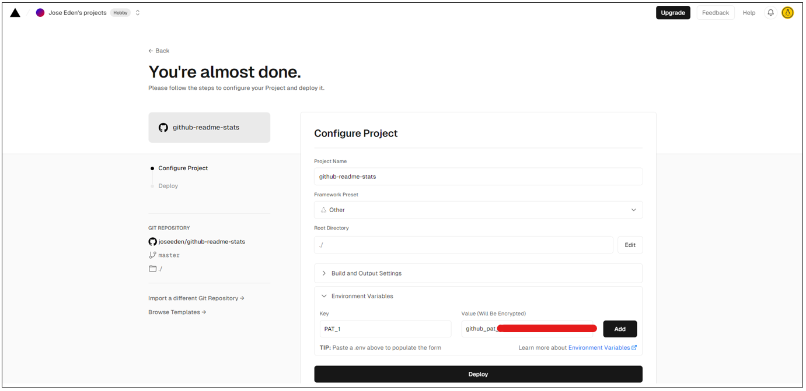

12. We should see the Congratulations page once done. Click Conttinue to dashboard.

    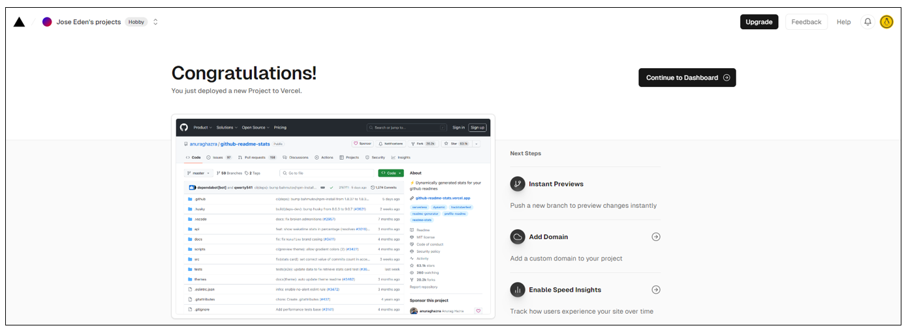

13. Copy the domain provided.

    ```bash
    github-readme-stats-blond-theta-24.vercel.app
    ```
    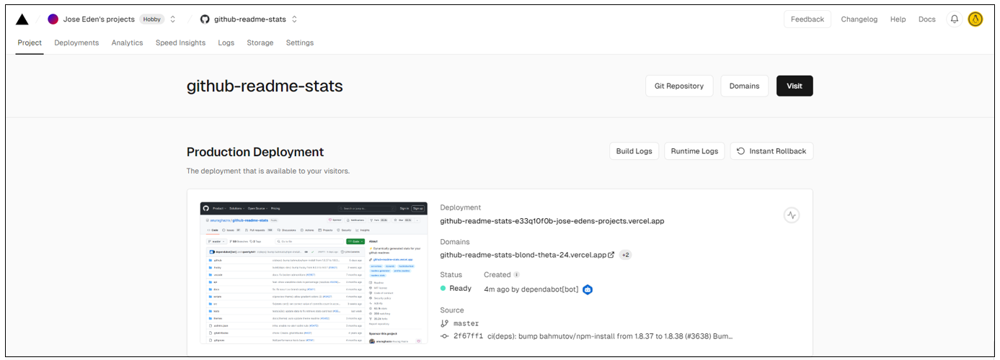

14. Go back to your Github profile README file and add the following. 

    ```markdown

    ## Github Stats 

    <!-- This section shows "Github Stats" -->

    <a href="https://github.com/joseeden/joseeden">
    


    <!-- This section shows "Most Used Languages" -->

    <a href="https://github.com/joseeden/joseeden">
    

    ```


## Recent Github Activity

Full instructions can be found in the link below:

- [GitHub Activity in Readme](https://github.com/marketplace/actions/github-activity-readme)

## References

- [Managing your profile README](https://docs.github.com/en/account-and-profile/setting-up-and-managing-your-github-profile/customizing-your-profile/managing-your-profile-readme)
- [How to create a GitHub Profile README](https://dev.to/github/how-to-create-a-github-profile-readme-jha)