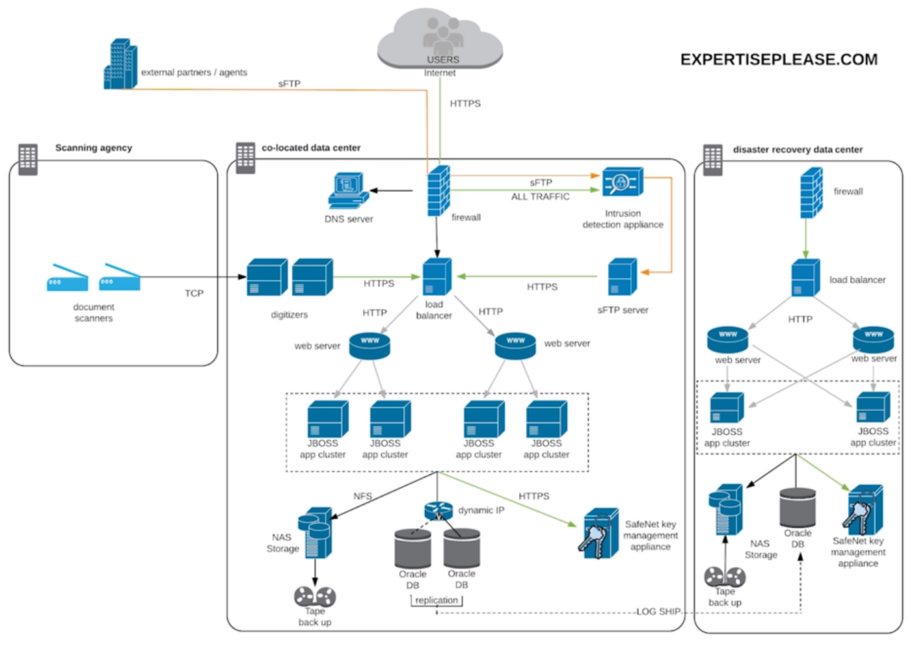

# Case Study - expertiseplease.com 

- [Introduction](#introduction)
- [Diagram](#diagram)
- [Document Sources](#document-sources)
- [Requirements](#requirements)
- [Current Architecture](#current-architecture)
- [Web Application](#web-application)
- [Current State - Services](#current-state---services)
- [Challenges](#challenges)
- [Why Consider Migrating Business Applications to Public Cloud Services?](#why-consider-migrating-business-applications-to-public-cloud-services)
- [The Cloud Transformation Maturity Model - Common Customer Journeys](#the-cloud-transformation-maturity-model---common-customer-journeys)
    - [Project Stage](#project-stage)
    - [Foundation Stage](#foundation-stage)
    - [Migration Stage](#migration-stage)
    - [Reinvention Stage](#reinvention-stage)
    - [Progressing Through Stages:](#progressing-through-stages)
- [Strategies and Techniques for Moving an Organization Forward in Cloud Maturity](#strategies-and-techniques-for-moving-an-organization-forward-in-cloud-maturity)
    - [Identifying Current Stage](#identifying-current-stage)
    - [Transition from Project to Foundation](#transition-from-project-to-foundation)
    - [Foundation Stage - Building Core Competencies](#foundation-stage---building-core-competencies)
    - [Transition from Migration to Reinvention](#transition-from-migration-to-reinvention)
    - [Best Practices in the Migration Stage](#best-practices-in-the-migration-stage)
    - [Conclusion](#conclusion)
- [Cloud Readiness Assessment Process](#cloud-readiness-assessment-process)
    - [Initiating the Cloud Readiness Workshop](#initiating-the-cloud-readiness-workshop)
    - [First Pass Portfolio Assessment: Discovery](#first-pass-portfolio-assessment-discovery)
    - [First Pass Execution: Workshop Details](#first-pass-execution-workshop-details)
    - [Classifying Applications into Buckets](#classifying-applications-into-buckets)
    - [Second Pass Portfolio Assessment: Migration Strategies](#second-pass-portfolio-assessment-migration-strategies)
    - [Qualification of Applications: Strategies Discussion](#qualification-of-applications-strategies-discussion)
    - [Swim Lane Prioritization: Quick Wins, Optimization, Transform](#swim-lane-prioritization-quick-wins-optimization-transform)
    - [Outcome and Outputs](#outcome-and-outputs)
    - [Next Steps After Workshop](#next-steps-after-workshop)
    - [Subsequent Meetings and Architecture Phase](#subsequent-meetings-and-architecture-phase)
    - [Conclusion](#conclusion)

## Introduction 

expertiseplease.com is a fictional reference company ran by Legal Advisory International. The Expertise Please service is used by customers to view and update legal documents that are scanned and stored in digital format.

- Attracts a number of customers who needs to lawyers to amend legal documents
- Service has some collaborative features such as joint signatures, but it's fallen behind the competition in this area
- CEO recognizes that collaboration on contracts needs to be easier

## Diagram

||
|-|

## Document Sources

The digital legal documents are sourced in two ways. 

- Customer grants Expertise Please the right to scan and digitize their paper based court documents. 
    - Highly automated process that only requires human intervention in scanning files. 
    - Digitized documents are stored in the Expertise Please service. - Original documents are archived by a legal processing agency on behalf of the customer.

- External third party companies send contracts as PDFs directly to Expertise Please customers. 
    - PDF files are uploaded via sFTP, and processed in batches during off peak hours. 
    - Third party companies can also log in to view contracts, and to check on the status of batch uploads. Most of the documents being stored are sensitive so there are stringent requirements. 

     
## Requirements

**Security**

- Documents can only be viewed by the end customer to whom they're addressed. 
- Data must be encrypted in transit and at rest. 
- Business must adhere to industry standards, e.g. ISO27001, ISO27018.

**Durability**

- Digital legal documents are retained for an unlimited period of time, or until a customer deletes a document, or closes the account.
- Company have observed that less than 2% of the documents older than six months are viewed.
- Service has to provide highly-durable storage of documents

**Availability**

- End consumers access the application at any time.
- Current target availability SLA is 99.5% for web service
- Goal is to increase it to 99.9%.
- Third parties can deliver digital documents at any time, 24 hour processing in SLA exists. 

**Performance**

- Customer response time to render documents is less than two seconds. 
- Current SLA is 9.5% of transactions to meet this target. 

## Current Architecture

Existing architecture is a three-tier web application comprising of:

- Apache web server
- JBOSS application server
- Oracle database

Networking:
- Connectivity is provided by co-location provider
- Peak capacity 500 megabits per second
- DNS hosted on DNS servers within the same data center 
- No CDN used 

Firewall:    
- Clustered firewall appliances
- IDS monitoring of traffic
- Manual implementation of firewall rules to block malicious traffic

LoadBalancer: 
- Front end for SSL upload 

Web servers:
- Apache 2.2 provides static content and routine to application clusters. 

Application clusters:
- JBOSS 7.1
- Two clusters providing different functions
- Session replication by multicast. 

sFTP server:
- Receives documents from external third party companies 
- Acts as batch submission gateway to the application servers. 

Database cluster: 
- Oracle database 11G with three nodes: Active, standby and DR target using Oracle data guard. 
- Virtual cluster IP using multicast technology. 

NAS storage:
- NetApp appliance with 150 terabytes of stored documents replicated within DC. 
- Off site tape back up to DRVC. 
- Storage usage increasing at five terabytes per month with 35 terabyte storage remaining. 

Hardware security module:
- Safenet HSM manages and stores encryption master keys for database. - Oracle TDE, transparent data encryption and file level encryption. 

Scanning devices and digitizers:
- Scanning devices are located in the legal support center. 
- Each scanning device is configured with the IP address of both digitizers. 
- Scanning devices communicate with digitizers over a private network to a DC using a custom TCP protocol. 
- Digitizers communicate with the digitizer application module via HTTPS. 

## Web Application 

Expertise Please application is a classic three tier model. Originally custom developed by an external third party, but now maintained in house. It consist of:

- static web content
- JAVA modules
- data access service to communicate to the database and underlying final storage. 

The JAVA modules run on two different applications clusters:

- External facing modules on cluster 1
- Internal modules on cluster 2 providing the service functions

## Current State - Services

**Registration**
- Registers new subscribers and set up unique subscriber encryption keys. 
- Subscribers sign in using their email address. 
- Password is encrypted and store in the database. 

**Login**
- Subscribers or third party company user. 

**Payment**
- Processing modules for subscriptions integrates with third party digit wallet providers via internet API. 
- No credit card data is handled within their service. 

**Doc manager**
- Manages and renders digital documents. 
- Encrypt and decrypt documents using file encryption keys. 

**Presentation** 
- Delivers rendered content to subscriber devices. 

**Core**
- Central business processing logic for the application for both subscribers and third party companies. 

**Batch processing**
- Conversion of third party company template and delivery of documents to subscribers. 

**Encryption**
- Interface to HSM to provide access to data encryption keys for file encryption. 

**Administration**
- Back end portal for application administration reporting. 

**Digitizer**
- Ingestion processing workflow module, executes similar functionality as batch processing. 

**Data access service**
- Abstraction layer for database and document storage access. 

## Challenges

- The server and network hardware has reached life and the storage capacity requires an urgent upload. 
- The data center contract for production facility is due for renewal in nine months. 
- Capex costs are driving concerns over the long term service viability based on their current business model. 
- They're looking for a more cost efficient approach.
- Operational pain points and maintenance exclusions causes challenges in meeting SLA
- Expertiseplease.com needs to increase the availability in SLA to 99.9% as their customers complain about service availability. 
- The infrastructure is unable to meet peak demand affecting the ability to meet performance SLA. 
- Reliance on monolithic applications server clusters impacts the ability to maintain and update the application at a quick pace.
- They're looking for improved agility to support more rapid application future development and deployment. 
- The volume of digital sources is increasing. 
- Third parties are trying to negotiate more real time deliver of documents as part of service contracts. 
- Batch processing is no longer an option. 
- The passive IDS and legacy firewall solution are not effective at handling application that are text. 
- They need to be more secure to be able to detect and mitigate external attacks in real time. 
- For enhanced security, they need to restrict and log management access to the application and infrastructure from a bastion host, which should only be accessible from the internal network only. 

## Why Consider Migrating Business Applications to Public Cloud Services?

Examine some of the benefits and value points of why we might consider migration to a public cloud service. 

**Ease of Use and Managed Services**

- Cloud services, being managed, eliminate the need for manual infrastructure provisioning and scaling.
- Immediate availability of resources on a pay-per-use model speeds up application development.

**Storage Expansion and Cost Efficiency**

- Contrast traditional IT provisioning delays with Amazon S3's elastic, on-demand storage.
- Cloud providers like AWS allow seamless scaling up or down, with payment only for consumed services, reducing operational costs.

**Scalability and Flexibility**

- Public cloud providers offer the ability to scale services dynamically based on demand.
- AWS, Azure, and Google Cloud's vast infrastructure facilitate easy scaling compared to smaller data centers.

**Operational Cost Reduction and Agility**

- Pay-as-you-go pricing means lower operating costs for expertiseplease.com.
- Cloud migration enables rapid iteration of business applications without provisioning servers, enhancing overall agility.

**Managed Services for Reliability**

- Cloud providers offer managed services at scale, ensuring high service level agreements.
- Offloading infrastructure management to specialists reduces the risk of infrastructure outages.

**End-to-End Security**

- Cloud providers take an end-to-end approach to security, managing both physical and operational layers.
- Shared responsibility model 
    - Cloud providers secure the infrastructure
    - Customers manage security in the cloud.

## The Cloud Transformation Maturity Model - Common Customer Journeys

The Cloud Maturity Adoption Cycle involves progressing through:

- Project
- Foundation
- Migration
- Reinvention stages.

Successive stages require clear plans, executive support, and leveraging cloud capabilities for business transformation.

### Project Stage

- Description: Initial experimentation with cloud services through one-off projects.
- Indicators:
    - Limited knowledge and ownership.
    - Projects led by individuals with minimal organizational support.
- Example (case study: expertiseplease.com):
    - Two operations team members testing Amazon S3 for object storage without full business support.
- Assessment:
    - Run informal interviews to gauge experimentation levels.
    - Consolidate results into a one-pager to guide further discussions and experimentation.

### Foundation Stage

- Description: Setting up the foundational elements for cloud adoption based on positive project experiences.
- Indicators:
    - Establishment of corporate accounts.
    - Initial ownership of security and compliance.
- Example (case study: expertiseplease.com):
    - Operations team lead reports success with Amazon S3, seeks executive support for a structured migration project.
- Assessment:
    - Check for the existence of a transformation plan; its absence indicates early stages.

### Migration Stage

- Description: Commitment to migrating workloads or services to the cloud, with potential lift and shift of applications.
- Indicators:
    - Independent migration projects underway.
    - Potential shift of mission-critical applications or entire data centers.
- Example (case study: expertiseplease.com):
    - Sysops team lead conducts cloud-readiness workshops; CEO commits to the migration project due to data center storage constraints.
- Assessment:
    - Presence of third-party proposals and ongoing migration projects.
    
### Reinvention Stage

- Description: Transformation by leveraging cloud flexibility and capabilities, focusing on innovation and time-to-market.
- Indicators:
    - Decoupling monolithic applications and adopting microservices.
    - Operational efficiencies realized, with a focus on continuous improvement.
- Example (case study: expertiseplease.com):
    - Plan to redevelop monolithic applications using microservices for scalability and faster feature implementation.
- Assessment:
    - Ongoing optimizations and operational efficiencies from cloud environment usage.
    
### Progressing Through Stages:

**Guidance**

- Project Phase to Foundation: Develop a transformation plan.
- Foundation to Migration: Seek executive commitment and support.
- Migration to Reinvention: Leverage cloud capabilities for business transformation.

**Assessment**

- Regularly evaluate the presence of transformation plans, executive support, and ongoing optimization efforts.

## Strategies and Techniques for Moving an Organization Forward in Cloud Maturity

Successful cloud adoption involves a balance of technology, business, and strategic planning.

### Identifying Current Stage

**Assessment**
- Evaluate current stage in the cloud maturity adoption cycle.
- Use a brief and informal interview process to gauge experimentation levels.
- Consolidate results into a one-pager for further discussions and experimentation.

### Transition from Project to Foundation

**Challenges**
- Overcoming lack of executive support, budget, or planning.

**Strategies**
- Develop a clear transformation roadmap.
- Petition for stakeholder buy-in by focusing on individual benefits.
- Be provider-agnostic and prioritize business and project requirements over technology.

**Outputs**
- Transformation roadmap, best practices for security, and a strong value management plan.

### Foundation Stage - Building Core Competencies

**Initiatives for Cloud Center of Excellence**
- Cloud training and knowledge sharing.
- Support and guidance for business units.
- Creation and maintenance of security standards.
- Development of common architecture blueprints.
- Consolidated cloud services account management.

**Outputs**
- Transformation roadmap, security and compliance architecture, and a strong value management plan.

### Transition from Migration to Reinvention

**Challenges**
- Risk, confidence drop, and potential project delays in the migration stage.

**Strategies**
- Prioritize small steps done often to minimize scope and risk.
- Implement an agile working approach with managed sprints.
- Establish view checkpoints to prevent program delays.

**Outputs**
- Effective and efficient migration strategy.
- Agreed and robust migration process.
- Proper cloud environment setup.
- Balanced enthusiasm with structured processes.

### Best Practices in the Migration Stage

**Key Focus Areas**
- Effective migration strategy and planning.
- Agreed or robust migration processes.
- Proper cloud environment setup.
- Avoiding the "all in" approach without structured processes.

**Strategies**
- Leverage external resources, vendors, and partners.
- Over-communicate changes at fiscal and financial layers.
- Implement small steps and rinse-and-repeat strategies.
- Ensure executive sponsorship with resource support.

**Outputs**
- Minimized risk of project failures and maximized ROI.
- Proven migration tools and methods.
- Efficient cloud environment setup.
- Balanced enthusiasm with structured processes.

### Conclusion

**Adaptive Approach**
Recognize the uniqueness of each situation.
Go back to basics when faced with challenges.
Address small problems upfront for smoother decision-making.

**Successful Transition**
- The key lies in a well-defined plan, stakeholder alignment, and strategic execution.
- Continuous evaluation and adjustment based on the organization's evolving needs.
Closing Note:

## Cloud Readiness Assessment Process 

It is a best practice for any organization, migrating IT infra, or an app to the cloud, to perform cloud assessment for smooth cloud migration while establishing an environment that caters organization’s needs.

### Initiating the Cloud Readiness Workshop

**Background:**
- John, Sys Ops Team Lead, aims to migrate services post a successful proof of concept.
- Recognizes the need for a portfolio rationalization exercise before a migration project.

**Cloud Readiness Workshop:**
- Proposal to the executive team for a workshop.
- Invite key stakeholders for a three-hour workshop.
- Emphasize a 360-degree view involving both business and technical teams.

### First Pass Portfolio Assessment: Discovery

**Assessment Criteria**
- Cloud compatibility, licensing models, compliance requirements.

**Strategic Decision:**
- Identify applications and dependencies for a high-level portfolio assessment.
- Group applications based on cloud readiness.
- Develop a draft application migration roadmap.

### First Pass Execution: Workshop Details

**Workshop Overview:**
- Outline benefits of cloud services.
- Provide basic cloud computing education for varied knowledge levels.
- Run the first pass portfolio assessment to identify current systems.

### Classifying Applications into Buckets

**Bucket Definitions:**
- Cloud Native, Cloud Eligible, Cloud Friendly, Not Cloud Ready.

**Discussion and Evaluation:**
- Evaluate each application based on compliance, licensing, dependencies, and compatibility.
- Place applications in the defined buckets.

### Second Pass Portfolio Assessment: Migration Strategies

**Migration Strategies:**
- Rehost, Replatform, Refactor, Repurchase, Retain, Retire.
- Qualify each application against these strategies.

**Business Focus:**
- Not a technical design discussion, but focused on business priorities and objectives.

### Qualification of Applications: Strategies Discussion

**Examples:**
- Rehosting images, core business app, IDS and IPS services.
- Replatforming Oracle database.
- Refactoring core business app for microservices.

**Prioritization:**
- Retire monolithic business app and proprietary scanning services.

### Swim Lane Prioritization: Quick Wins, Optimization, Transform

**Three Swim Lanes:**
- Quick Wins, Optimization, Transform.

**Prioritization Outcomes:**
- Group applications and strategies into respective swim lanes.
- Identify quick wins, optimization, and transformation tasks.

### Outcome and Outputs

**Outputs of the Cloud Readiness Workshop:**
- Business value matrix, application register, system audit, and first pass portfolio assessment.
- Snapshot of cloud readiness: Cloud Native, Cloud Eligible, Cloud Friendly, Not Cloud Ready.
- Second pass portfolio assessment detailing migration strategies for each application.

### Next Steps After Workshop

**Detailed Planning:**
- Technical teams define, quantify, and prioritize a task backlog.
- Task matrix aids in resource and budgeting decisions.

**Green Light for Project:**
- If approved, evaluate and select public cloud services based on the task matrix.
- Plan, schedule, and execute migrations in repeatable sprints.

**Governance and Operating Model:**
- Develop and implement cloud governance and operating model.
- Address access, security, compliance, and automation requirements.

### Subsequent Meetings and Architecture Phase

**Involving Providers:**
- Recognize the need for expertise in cloud governance and operating model.
- Involve providers for best practices and the latest technology in the design process.

**Objectives of Subsequent Meetings:**
- Develop migration process for each application workload.
- Include application migration tools, data migration tools, validation methods, and roles and responsibilities.

### Conclusion

**Strategic Roadmap:**
- Cloud Readiness Assessment sets the foundation for a strategic migration roadmap.
- Balancing business priorities, complexities, and migration strategies.

**Continued Collaboration:**
- Ongoing collaboration with technical teams and providers for successful execution.

**Key Outcomes:**
- Clear understanding of cloud readiness.
- Prioritized tasks and a roadmap for effective migration.
- Governance and operating model for sustained success.