# Web Fundamentals

- [Client and Servers](#client-and-servers)
- [URLs](#urls)
- [HTTP and its Interactions](#http-and-its-interactions)
- [Client Requests](#client-requests)
- [Server Response](#server-response)
- [MIME and HTTP](#mime-and-http)
- [Security Issues and HTTPS](#security-issues-and-https)

## Client and Servers 

At the very heart of how the internet works is the client server model. This model works so well that billions of users across the world now have easy access to the internet. So how does it work? Users are people like you and I and we access the internet via a client. A client is basically any device that can access the internet, like your computer or a smart device. Clients generally access the internet using a browser, like Chrome, Safari or Edge, but it can be through apps or software that have been downloaded or built into the device. But how they actually access that information so where things get a little more interesting. And a little more complex. Imagine you want to access a specific website. You'll open a browser and enter an address into the browser, right? That address is a Uniform Resource Locator, or URL. The URL has a few parts to it, and we'll get into it in more detail in other videos, but for now, it's enough that you know your client can use the URL to make a request to a server for information and the server will send that information back to your client. One part of the URL we do need to touch on quickly is the transfer protocol it uses, which is HTTP or HTTPS. This is important because this protocol is the part of the URL that actually make the request to the server, and without it, you won't be able to access anything. So that's the basics of how clients work. But servers are a little different. Servers are basically just computers that host web applications and websites. You could technically set up any computer to run as a server but most servers are extremely powerful and specialized pieces of hardware. For instance, think about a website like google.com. Google receives tens of thousands of requests to its servers every second. To be able to handle these huge numbers of requests, Google has to have amazingly powerful servers to run and host their flagship website. So servers tend to be a lot more powerful than clients but there are a few other differences between clients and servers. Servers also need to run web service software like Apache, Nginx or Microsoft Internet Information Server, IIS. This software handles the HTTP request from the client and sends back the response. And that's it for this video. The internet is basically a network of clients and servers. The servers host the information that the clients are looking to access and the clients can access that data if they have a web browser and the right URL.

## URLs 

Uniform Resource Locators, URLs, are at the heart of the web's hypertext system. A URL contains all the information your browser needs to send a request to a server and tells the server what resources you're looking for. So what are the different elements of a URL and how does it work? URLs are divided into two essential parts, separated by a colon. Basic syntax of a URL is scheme:path. The scheme tells the browser which protocol it needs to use to retrieve a resource, and the path gives the location of the server and the resource. Protocols include things like HTTP, HTTPS and FTP, and email protocols like POP3, and IMAP. In this example, the scheme is HTTPS, and the path www.qa.com. The resource is web-development-fundamentals-html-and-css-qahtmlcss. Quite a bit of a mouthful, I know. Of course, it's pretty common not to type the scheme when we enter a URL into our browsers. We might just type the path. Or in our example, www.qa.com. This isn't actually a valid URL but these days, most browsers will just automatically enter the scheme into the syntax for you so that when you type an invalid URL into your browser, it'll still work as you expect. So that's the generic form of URL syntax but HTTP and HTTPS has its own specific syntax which is important because the web uses HTTP to retrieve resources. The HTTP URL syntax is Hostname:Port and Document-Path. The Hostname is always the name of the website you're accessing and while they often start with www, this is actually more of a convention than anything else. Hostnames can be followed by a colon and a port number. Common port numbers include 80, 443 and 8080. And if no port number or protocol is included, URLs will assume you're using HTTP and default to 80. Port numbers are important because they work as a kind of gateway that lets data in or rejects it. Firewalls work with open ports to let data pass through if they're sent to the right port. All data not directed to an open port is rejected. Port 80 is used to allow HTTP data to end, 443 is used to allow HTTPS data and 25 is used to allow email through. 

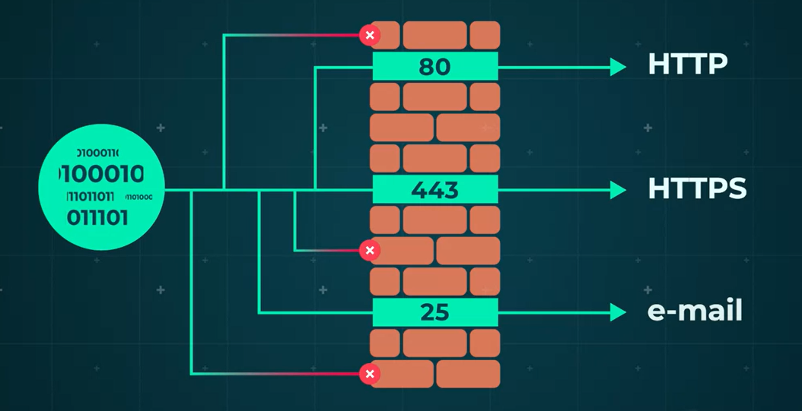  

The document path is the location of the resource in the web service directory. If you leave the document path out of your URL, it will just default the home page of the site. Home pages are server and configuration dependent. And this means they could refer to a document path like index.html or just default.html. And that's it for this video. URLs have a specific kind of syntax that they must always follow if they're gonna work. Same is true of HTML-based URLs, which also have their own unique syntax.

## HTTP and its Interactions    

The client server model may be at the heart of how users interact with the internet, but hypertext transfer protocol or HTTP is at the heart of the client server model. So what is it and how does it work? HTTP is a lightweight application level protocol which builds hypermedia or web systems. It's been used since 1990, and is currently on version 1.1. If you're interested in learning more about it, check out this site. HTTP is based on Transmission Control Protocol, or TCP, which is the connection base part of the TCP IP stack. This might sound a little like jargon right now. But all you really need to know is that it's great for HTTP because it means that like TCP, HTTP can handle large amounts of data reliably. Another unique feature of HTTP is that it's stateless. This means that each HTTP request stands alone, and no information is retained about the request in the browser, or on the server. While this is fine for simple document requests, does create problems for applications which need to track a user's identity. When you're trying to access a website, you enter the URL into your browser and hit Enter. And within a few moments, the website loads and it's as easy as that. But what actually happens between your clients and the server during this process? The client connects to the server and sends a request with a method, a Uniform Resource Identifier or URI and the HTTP protocol version. This might look something like this. 

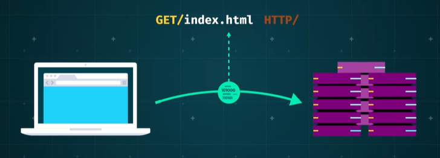  

The client will also send a mind type header and a message. The server will respond to your client with a status line, including the protocol version and an internet standard error code. Last up, the server sends a mime like message with the requested resource in it. This might look something like this. And that's it for this video. HTTP is incredibly flexible and powerful, and it facilitates the communication between all of our clients and servers.  

## Client Requests

Client requests are a core part of how HTTP works, and there are sub-components to each of the main parts of the client requests that you do need to know about. HTTP client requests are made up of a method, a URI, the HTTP version and a MIME-like message. 

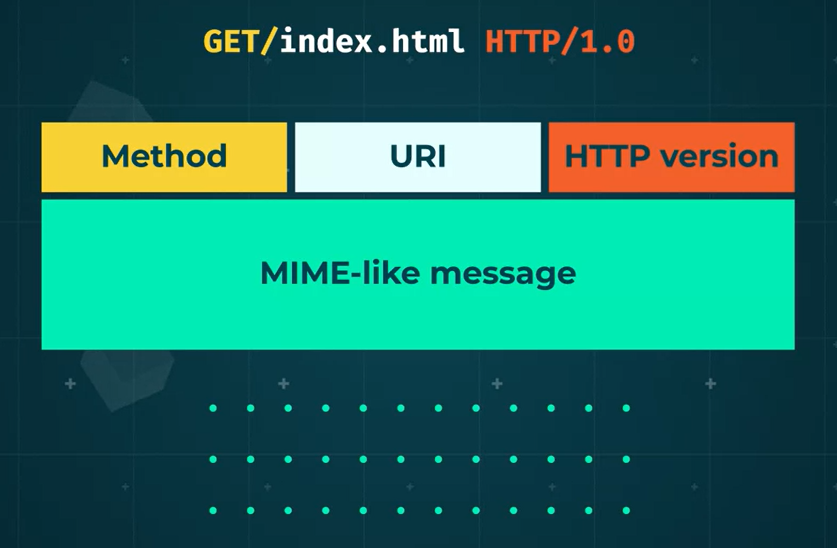  

There are three common types of method, get, head, and post. Get simply retrieves whatever information the URI identifies, head gets header information about the request URI, and post submits a stream of information to the resource identified by the URI. As you can see, the action the server takes will depend on the URI, so what is a URI? URIs are formatted strings that identify a networked resource. We say resource because HTTP servers can deal with many types of resources not just, for instance, files. There are two types of URI. Absolute and relative. Absolute URIs contain all the information to get to the resource, including the scheme, host name and port number. Relative URIs start with the path and the other elements, like the scheme and host name are taken relative to where the page is hosted. It's best practice to use relative URIs in your own pages when you're trying to point users to a resource within your own site because if anything about the scheme or host name changes, it'll still work. 

Next up, the HTTP version. HTTP version numbers are made up of a major and a minor part and look like this. Higher MIME numbers basically means it's a more advanced iteration without changing the way in which the request is dealt with. Major numbers, on the other hand, change when the format of the message is changed. 

  

Versions 1.1 and 2.0 are the most common versions at the moment, with 1.1. being the most popular. Version 0.9, the original version of HTTP, interactions can be thought of as simple requests as you like because only the get method is supported and MIME isn't used at all. Version 2.0 is widely supported by most common browsers and a large number of high-traffic websites. Version 3.0 is being developed. The newer versions make data transfer more efficient and secure. 

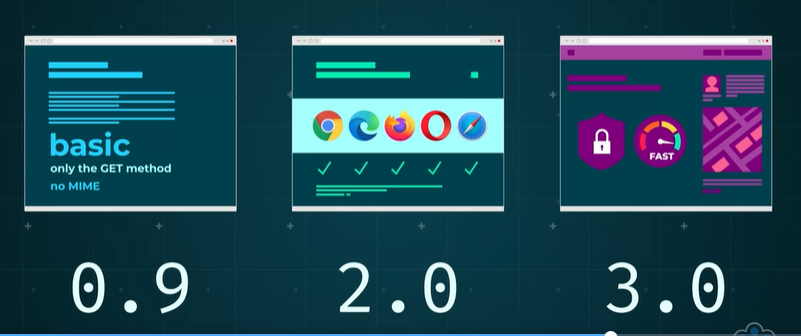  

Last up, we have MIME-like messages. This contains things like modifiers and forms data. Basically, any other data that is sent as part of the request that isn't in one of the other parts. MIME-like messages allow us to send attachments, like audio, video, images and applications as part of the transfer, so it's a powerful and useful part of a client request. That brings us to the end of this video. Client requests are simple in principle. To let the server know what the user's looking for. In practice though, there are a few parts to them, each with their own deeper levels of detail and as a web developer, it's important that you have at least a basic idea how these all work together.

## Server Response

Once a client makes an HTTP request to a server, that server will send an HTTP response. In this video, we'll focus on the different kinds of response a server can send. And the different elements that make up the response. 

First up, the server can either send a simple or a full response. A simple response happens when the server only supports HTTP 0.9 and would be a file or some data. 

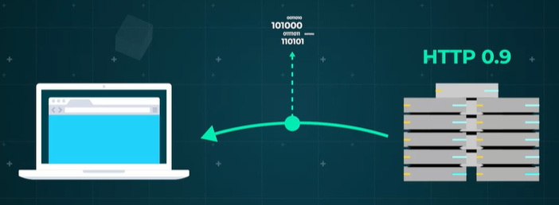  

In a full response, for a server using HTTP 1.0 and above, the first line will always be a status line. The status line includes three things. 

  

The HTTP version, a standard status code and a reason phrase. The HTTP version will be either 1.0, 1.1 or 2.0. The status code will be a standard three-letter internet server format. The reason phrase will just be a textual representation of the code. 

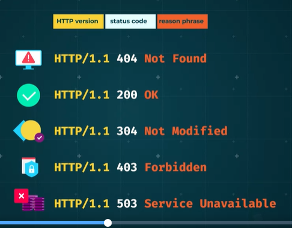  

So if a server returned a 404 status code, it's accompanied by a message that says that the resource is not found. Other popular codes are 200, which means the request was OK. 304 which means the resource has not been modified. 403 which means the request was forbidden and 503 which means that the server encountered some form of error processing the request. The second part of a full response is the MIME-like message, which is generated by the server itself. This will have various header fields separated from the message body by a carriage return line feed, or CRLF, pair. 

The header information doesn't relate to the content of the message and gives context to the response. These can describe aspects of the resource, like its content type, which could be text or plain or application, JSON, an expiry date, and the software the server uses. The header type information can be useful in helping security. The message body contains the requested resource. If the resource is an HTML file, the header information can be modified using the meta tag. The MIME message can also be generated dynamically if the resource is a backend server script. These scripts often use information supplied by a client like query parameters or form data, and may interact with other programs or resources running on the web server. 

An example of this is creating new information in a database. It's important to generate a valid MIME message as a response, complete with all the appropriate header fields. So it's necessary to have some knowledge of the MIME message format to write scripts. 

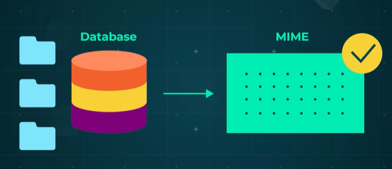  

And that's it for this video. HTTP server responses can either be simple or full. Full responses will always include a status line and MIME-like message.

## MIME and HTTP

We often need to be able to send rich media like images and videos through websites. But how do websites actually manage to do this? The answer is Multipurpose Internet Mail Extensions, or MIME. 

Let's take a closer look at how this works. Modern day web applications use loads of resources to build rich interactive experiences. These often include things like images, videos and animations. Delivering these assets along with the HTML and CSS, requires the capability to attach them to HTTP requests. Since attaching items of different types is commonplace when sending emails, the technology developed to allow this has been adapted for use with HTTP. Multipurpose Internet Mail Extensions, or MIME, was designed as a flexible message format for sending multimedia objects through email. The HTTP version does add a few features that are different from the email version though. 

For instance, there isn't a need to send the message body as a seven bit ASCII data as required by some email systems. The MIME message consists of a header, which is made up of a few colon separated fields. 

The simplest document could be nothing more than a content-type line, followed by a carriage return line feed, CRLF pair and the message body. The content-type header line identifies the data in the body and it's made up of a type and subtype field. And could be something like content-type, text forward slash HTML. 

It's used by the browser to select the right application to display the returned data. Official content types are defined by the Internet Assigned Numbers Authority, IANA, and the list is growing all the time. 

Some of the most common types are application, or JSON, plain, or text, and image, maybe PNG, for instance. 

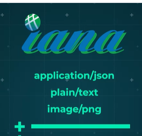  

Experimental content types are normally preceded by letters although as browsers and servers can negotiate acceptable types, this is not enforced. 

MIME also allows the server to send multipart messages. The message body can contain multiple MIME messages, each with a header specifying the type of body data. 

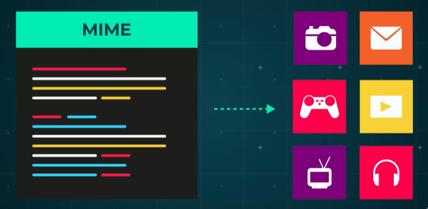  

HTTP usage differs from email in that each submessage can contain a full set of HTTP header fields, not just the content field. For example, if you wanted to upload multiple photos to a website, it will provide the interface to select and upload files. Each file to be uploaded will have its own part of the message to include the file data that is clearly defined. 

Without multipart messages, you'd only be allowed to upload a single photo at a time. And that's it for this video. Understanding how a server provides a response is important because you'll need to be able to decipher what comes back when you make a request to a service. It may be that the service is internal, and you'll be able to go and speak to the team or developer who created the backend service. But if it's an external service, you'll need to be able to know what the server is expecting and what to expect to receive back from different requests.

## Security Issues and HTTPS

As the internet has matured, security has become more and more of an issue. But, what are some of the security issues we have to deal with and how is HTTP evolved to stop them? HTTPS is the obvious answer. If a web application simply uses HTTP, then all data sent over the internet can be intercepted and read easily. 

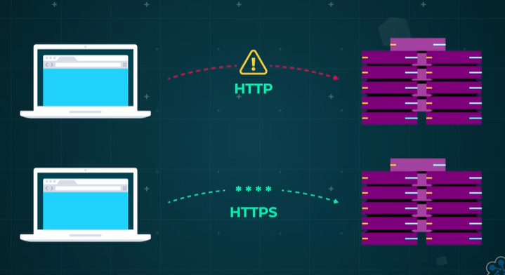  

HTTPS, on the other hand, encrypts the data at the source, which can only be decrypted using the encryption key. To enable HTTPS, web servers have to have a secure socket layer, SSL, certificate purchased from a reputable certification authority, which provide encryption keys. The server holds a private key that is never sent anywhere and a public key, which is returned to any client when a request is made to the server. Further communications can then use the public key on the client to encrypt the data to be sent. 

  

This can only be decrypted with the use of the private key, which should be safely stored on the server. At the client end, the public key will only decrypt data that has been encrypted by the private key. This means that the client can be sure that the data received has come from the server. Armed with this knowledge, HTTPS helps prevent against eavesdropping, fabrication, which is also known as the man in the middle attack, and impersonation. 

First up, eavesdropping. Networking communications are typically actually pretty insecure, especially over the internet, where any information may need to pass through any number of unknown and unaudited networks on the way to its destination. 

  

Next up, modification or fabrication. Imagine you're trying to send a message to someone, but on the way it's intercepted and changed. Even worse, imagine someone can fabricate a message to make it look like it's come from you to take advantage of someone on your network. 

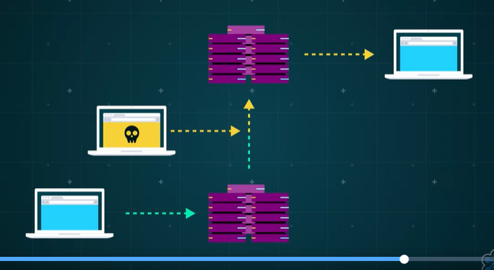  

Last up, impersonation. Hackers can sometimes impersonate a system or use it to gain access to resources they aren't actually entitled to. 

  

And that's it for this video. HTTP is insecure and has vulnerabilities. HTTPS has been delivered to deal with a few of these and while it's not foolproof, it does add an important layer of defense against hackers and fraudsters.