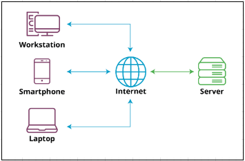

# Web Fundamentals

- [Client and Servers](#client-and-servers)
- [URLs](#urls)
- [HTTP and its Interactions](#http-and-its-interactions)
- [Client Requests](#client-requests)
- [Server Response](#server-response)
- [MIME and HTTP](#mime-and-http)
- [Security Issues and HTTPS](#security-issues-and-https)


## Client and Servers 

<p align=center>

</p>


**Client-Server Model**
The client-server model is a computing architecture that separates the functions of a computer program into two essential components: the client, which makes requests, and the server, which fulfills those requests.

- **Clients:** Devices (e.g., computers, smartphones) that access the internet and make requests. Common browsers include Chrome, Safari, or Edge.
- **Servers:** Specialized hardware designed to host web applications and websites. They respond to client requests and provide the necessary information.

**Accessing Websites**
Uniform Resource Locator is used to access specific websites. It consists of various parts, including the transfer protocol (HTTP or HTTPS).

**Request-Response Cycle:** 
- Client makes a request by entering a URL and specifying the transfer protocol.
- Server responds by sending the requested information back to the client.
- This cycle is fundamental to how clients access information on the internet.

**Server Software**
Servers run specialized web service software (e.g., Apache, Nginx, Microsoft IIS) to handle HTTP requests from clients.
- Servers are powerful and specialized to handle a large number of requests simultaneously.

**Handling Demand**
Popular websites, like Google.com, face high demand, requiring exceptionally powerful servers to manage the influx of requests. While any computer could be set up as a server, dedicated servers are often highly specialized for performance.

**Key Differences**

- **Functionality:** Clients make requests; servers fulfill requests.
- **Software:** Servers run web service software; clients use browsers.
- **Power:** Servers are more powerful, designed to handle concurrent requests.
- **Specialization:** Servers are dedicated to hosting and responding to requests.

**Importance for IT Professionals**

- **Foundational Knowledge:** Understanding the client-server model is crucial for anyone working in the IT industry.
- **Supporting Technology:** IT professionals need to support the ever-changing technology associated with the client-server model.

## URLs 

Uniform Resource Locators (URLs) are essential for the web's hypertext system. 

- They provide the information a browser needs to send a request to a server and specify the desired resource.
- URLs are divided into two parts separated by a colon: scheme:path.

**URL Elements**

- **Scheme:** Specifies the protocol the browser should use to retrieve the resource. Examples include HTTP, HTTPS, FTP, and email protocols like POP3 and IMAP.
- **Path:** Gives the location of the server and the resource.
- Example URL
    ```bash
    https:www.qa.com/web-development-fundamentals-html-and-css-qahtmlcss.
    ```
- **Scheme:** HTTPS.
- **Path:** www.qa.com/web-development-fundamentals-html-and-css-qahtmlcss.

**Simplified URL Entry**

- **Common Practice:** When entering URLs into browsers, it's common not to type the scheme. Browsers often add the default scheme (usually HTTP or HTTPS) automatically.
- **Example:** Typing www.qa.com instead of HTTP:www.qa.com.

**HTTP URL Syntax**

- **HTTP Specifics:** HTTP and HTTPS have their own syntax.
- **Syntax:** Hostname:Port and Document-Path.

**HTTP URL Components**

- **Hostname:** Represents the name of the accessed website. The convention is to start with www, but it's not mandatory.
- **Port:** Follows the hostname and may include a port number (e.g., www.example.com:80). Common port numbers include 80, 443, and 8080.
- **Default Port:** If no port or protocol is specified, URLs assume HTTP and default to port 80.

**Port Numbers Importance**

- **Gateway Function:** Port numbers act as gateways, allowing or rejecting data. Firewalls use open ports to permit data through the right port.
- **Common Ports:** Port 80 for HTTP, 443 for HTTPS, and 25 for email.

<p align=center>

</p>

**Document Path**
The document path is the location of the resource in the web service directory. 

- If you leave the document path out of your URL, it will just default the home page of the site. 
- Home pages are server and configuration dependent. 
- This means they could refer to a document path like index.html or just default.html. 

## HTTP and its Interactions    

The client-server model is governed by the Hypertext Transfer Protocol (HTTP). 

- HTTP is a lightweight application-level protocol established in 1990 and currently at version 1.1 
- HTTP is based on the Transmission Control Protocol (TCP), ensuring reliable handling of large data volumes. 
- HTTP is stateless, meaning each request is independent, lacking persistent information on the browser or server. 

Despite simplicity for document requests, it poses challenges for identity-tracking applications. When accessing a website, the client sends a request to the server comprising:

- the method,
- a Uniform Resource Identifier (URI), and 
- the HTTP protocol version.

<p align=center>

</p>

The client will also send a mind type header and a message. 

- The server will respond to your client with a status line, including the protocol version and an internet standard error code. 
- The server then sends a mime like message with the requested resource in it. 

## Client Requests

Essential Components of HTTP Client Requests

- HTTP client requests comprise a method, URI, HTTP version, and a MIME-like message.
- These elements are fundamental to the functionality of HTTP in handling client requests.

<p align=center>

</p>


HTTP defines three common methods: GET, HEAD, and POST.

- GET: Retrieves information identified by the URI.
- HEAD: Fetches header information about the URI.
- POST: Submits a stream of information to the URI's identified resource.

Understanding URIs:

- URIs, or Uniform Resource Identifiers, are formatted strings for identifying networked resources.
- They encompass both absolute and relative types.

URI Types:

- Absolute URIs: Contain all information, including scheme, host name, and port number.
- Relative URIs: Start with the path; other elements are relative to the hosting page.
- Best Practice: Use relative URIs when pointing to resources within your site for flexibility amid changes in scheme or host name.

Next up, the HTTP version. HTTP version numbers are made up of a major and a minor part.

- Higher MIME numbers are more advanced iteration without changing the way in which the request is dealt with. 
- Major numbers change when the format of the message is changed. 

<p align=center>

</p>

Versions 1.1 and 2.0 are the most common versions at the moment.

- Version 1.1 is the most popular. 
- Version 0.9, the original version of HTTP, only supports the GET method and doesn't use MIME
- Version 2.0 is widely supported by most common browsers and a large number of high-traffic websites. - Version 3.0 is being developed. The newer versions make data transfer more efficient and secure. 

<p align=center>

</p>

Last up, we have MIME-like messages. This contains things like modifiers and forms data. 

- Any other data that is sent as part of the request that isn't in one of the other parts. 
- MIME-like messages allow us to send attachments, like audio, video, images and applications as part of the transfer, 
- It's a powerful and useful part of a client request. 

## Server Response

Once a client makes an HTTP request to a server, that server will send an HTTP response. 

First up, the server can either send a simple or a full response. A simple response happens when the server only supports HTTP 0.9 and would be a file or some data. 

<p align=center>

</p>

In a full response, for a server using HTTP 1.0 and above, the first line will always be a status line. The status line includes three things. 

- The HTTP version, 
- a standard status code, and 
- a reason phrase.

<p align=center>

</p>

Full response: 

- The HTTP version will be either 1.0, 1.1 or 2.0. 
- The status code will be a standard three-letter internet server format. 
- The reason phrase will just be a textual representation of the code. 

<p align=center>

</p>


Status codes:

- If a server returned a 404 status code, it's accompanied by a message that says that the resource is not found. 
- 200 OK, which means the request was OK. 
- 304 which means the resource has not been modified. 
- 403 which means the request was forbidden 
- 503 which means that the server encountered some form of error processing the request. 

The second part of a full response is the MIME-like message, which is generated by the server itself. This will have various header fields separated from the message body by a carriage return line feed, or CRLF, pair. 

HTTP Header Information:

- Provides context to the response and doesn't directly relate to the message's content.
- Describes aspects of the resource, such as content type (e.g., text/plain, application/JSON), expiry date, and server software.
- Useful for enhancing security measures.

Message Body and MIME:

- Contains the requested resource.
- For HTML files, header information modification can be done using the meta tag.
- MIME message can be dynamically generated, especially for backend server scripts.
- Scripts often use client-supplied information like query parameters or form data.
- May interact with other programs or resources on the web server.

An example of this is creating new information in a database. It's important to generate a valid MIME message as a response, complete with all the appropriate header fields. 

<p align=center>

</p>


## MIME and HTTP

Originally designed for email and adapted for HTTP in web applications, MIME enables the sending of rich media, such as images and videos, through websites.

Resource Delivery in Web Applications:

- Modern web applications utilize various resources like images, videos, and animations.
- These assets need to be attached to HTTP requests to deliver a complete interactive experience.

MIME Features in HTTP:

- Adapted from email MIME format for HTTP use.
- No requirement for the message body to be seven-bit ASCII data, unlike some email systems.

MIME Message Components:

- Consists of a header with colon-separated fields.
- Simplest document includes a content-type line followed by a CRLF pair and the message body.

Content-Type Header Line:

- Identifies the data in the body.
- Comprises type and subtype fields, such as content-type: text/html.
- Used by the browser to select the appropriate application for displaying returned data.

Official Content Types:

- Defined by the Internet Assigned Numbers Authority (IANA).
- Growing list of content types to accommodate various data formats.

Some of the most common types are application, or JSON, plain, or text, and image, maybe PNG, for instance. 

<p align=center>

</p>

Experimental content types are normally preceded by letters although as browsers and servers can negotiate acceptable types, this is not enforced. 

MIME also allows the server to send multipart messages. The message body can contain multiple MIME messages, each with a header specifying the type of body data. 

<p align=center>

</p>


Understanding how a server responds is crucial for interpreting requests. Internal services may involve direct communication with the team or developer, while external services require knowledge of expected server responses for different requests.

**HTTP Usage vs. Email**

Header Fields in HTTP Submessages:

- Unlike email, each HTTP submessage can contain a full set of HTTP header fields, not just the content field.

Example Scenario - File Upload:

- Uploading multiple photos to a website involves selecting and uploading files through a dedicated interface.
- Each file to be uploaded has its own part in the message, clearly defining the file data.

Importance of Multipart Messages:

- Multipart messages enable the uploading of multiple files simultaneously.
- Without this feature, users would be limited to uploading one file at a time.

## Security Issues and HTTPS

As the internet has matured, security has become a critical concern. The solution to combat data interception and reading is evident in the form of HTTPS. Without HTTPS, web applications relying solely on HTTP face the risk of exposing data easily over the internet

<p align=center>

</p>


HTTPS encrypts the data at the source, which can only be decrypted using the encryption key. 

- To enable HTTPS, web servers have to have a secure socket layer, SSL, certificate purchased from a reputable certification authority, which provide encryption keys. 
- The server holds a private key that is never sent anywhere and a public key
- The public key is returned to any client when a request is made to the server. 
- Further communications can then use the public key on the client to encrypt the data to be sent. 

<p align=center>

</p>

This can only be decrypted with the use of the private key, which should be safely stored on the server. 

- At the client end, the public key will only decrypt data that has been encrypted by the private key. - This means that the client can be sure that the data received has come from the server. 

Armed with this knowledge, HTTPS helps prevent against eavesdropping, fabrication, which is also known as the man in the middle attack, and impersonation. 

Eavesdropping: Information transmitted over unknown and unaudited networks is susceptible to eavesdropping.

<p align=center>

</p>

Modification or Fabrication: Imagine you're trying to send a message to someone, but on the way it's intercepted and changed. Even worse, imagine someone can fabricate a message to make it look like it's come from you to take advantage of someone on your network. 

<p align=center>

</p>

Impersonation: Hackers can sometimes impersonate a system or use it to gain access to resources they aren't actually entitled to. 

<p align=center>

</p>
