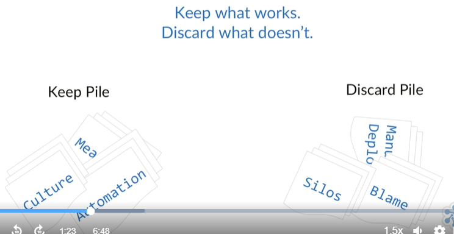
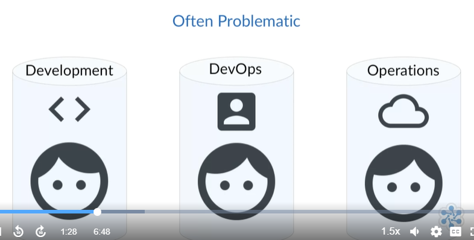
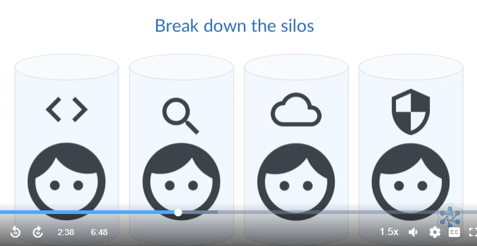
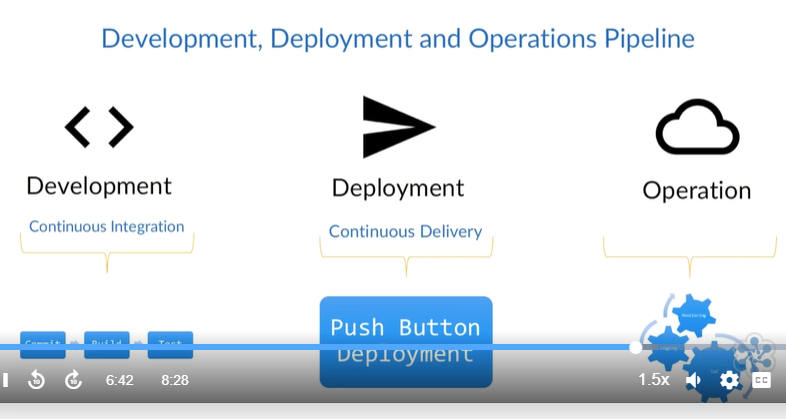
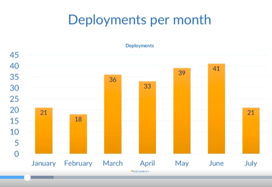
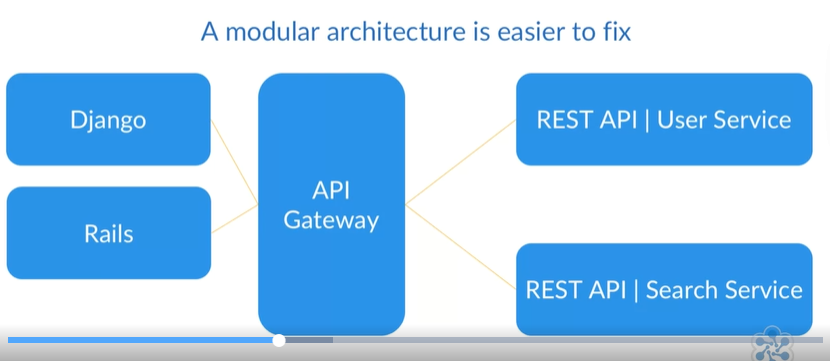
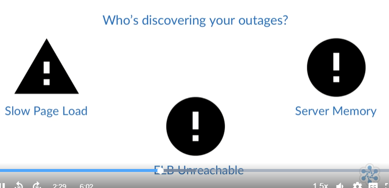
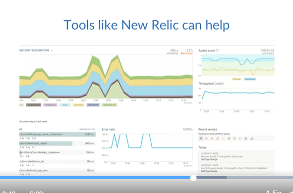
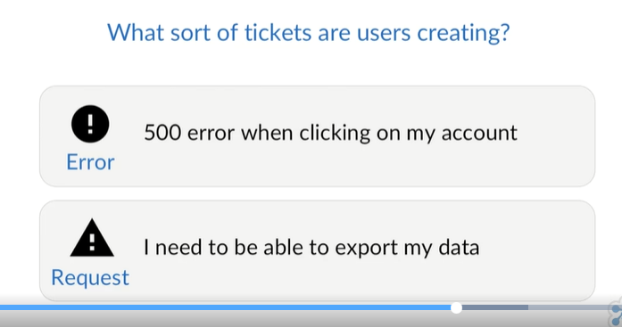
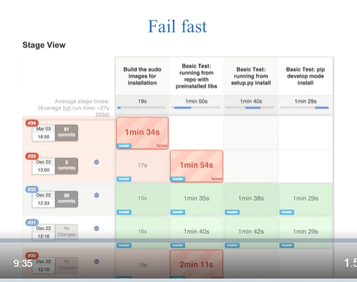

# DevOps 

- [In a Nutshell](#in-a-nutshell)
- [What is DevOps?](#what-is-devops)
- [Common Tenets of DevOps](#common-tenets-of-devops)
- [Culture](#culture)
- [Automation](#automation)
- [Metrics](#metrics)
- [How DevOps can Improve Lead Time](#how-devops-can-improve-lead-time)
- [How DevOps can Improve Stability](#how-devops-can-improve-stability)
- [How DevOps can Reduce Operational Costs](#how-devops-can-reduce-operational-costs)
- [What Companies Practice DevOps?](#what-companies-practice-devops)

## In a Nutshell 

While this is a fairly non-technical course, I do make the assumption that you're at least familiar with some aspect of the software development, deployment and operations pipeline.

The concept of the development, deployment and operations pipeline comes up a lot throughout this course, so I'd like to define it now. The concept is that from development through the deployment process and onto actually running your code in production, these three things are connected as a sort of pipeline for your software to flow through.

## What is DevOps?

If you were to ask 100 technical people what DevOps is, chances are you'll get at least 100 different answers back. So knowing that there isn't consensus on a single definition might make you a bit leery about this whole DevOps thing, and that's completely understandable. But the lack of any standard definition doesn't detract from its value. It's really quite the opposite, and that's because DevOps is a philosophy.

  

I know that's probably not what you were expecting to hear, but it really is the best way to categorize DevOps in my opinion. I like to describe DevOps as the philosophy of the efficient development, deployment, and operation of the highest quality software possible. Again, since there's no one entity in charge of defining and advancing DevOps, this definition just helps to explain DevOps to those who may not know anything about it, even if it isn't an official definition. Being a philosophy, it allows each company to implement it in the way that best supports them.

  

There's no one right way to adopt a DevOps philosophy, though there are definitely wrong ways. What we find is that some practices and strategies help support the philosophy and some don't. 

  

For instance, creating a DevOps team tends to be an example of what not to do, since it creates a new silo for engineers to become isolated in. 

Whereas, having cross-functional teams made of developers, QA, security, and operations engineers could be a useful strategy since it promotes collaboration.

  

## Common Tenets of DevOps 

The community around DevOps have coalesced around a set of generally agreed upon tenets that support the philosophy. Three of the most commonly accepted tenets are culture, automation, and measurement. 

  

Without any one of these, it would be difficult to adopt a DevOps philosophy. So again, our succinct definition, or our elevator pitch, is that DevOps is a philosophy of the efficient development, deployment, and operation of the highest quality software possible.

Okay. So you have a definition of DevOps. But it really doesn't tell you much about it. DevOps as a term is the combination of the words "development" and "operations." It started as a way to break down the silos that prevented engineers from achieving the levels of collaboration needed to both move quickly and remain stable. 

  

The goal of DevOps is to remove the inefficiencies that exist throughout the development, deployment, and operations pipeline, while promoting higher quality. Some of the traditional ways of developing, deploying, and operating don't hold up to the constant change that modern software systems undergo.

Modern software systems are complex, and there are a lot of interacting components. So the more change that is introduced anywhere in the system, whether it be code changes, configuration, infrastructure, whatever, the more chances there are that something will break. 

  

The goals of developers and operations are naturally at odds to some degree. It's the developer's job to implement change, and whenever a developer writes changes or removes a line of code, they introduce the potential for any number of problems, including bugs, security holes, and system outages.

The operations team is responsible for ensuring stability, so every time they're given new code to deploy into a production environment, they risk disrupting that stability. In the past, there was a perception that your development and deployment pipeline could either remain stable or move fast, and these two choices are not mutually exclusive. 

  

For example, companies like Etsy are able to deploy new code into production dozens of times every day, while keeping their site's availability high.

  

DevOps helps provide a better way to look at the development, deployment, and operations pipeline. It does this by promoting a culture of collaboration, and by promoting the automation of everything that it makes sense to. 

  

It also promotes the measurement of as much useful data as possible.

  

Users have high expectations for the software we create. They expect it to be up and running whenever they want to use it. Imagine your site went viral, and overnight you had 10 million new users. Would your site stay running with minimal or no intervention from your engineers, or would your operations team be scrambling to provision new servers?

Users also have high standards for quality. What about this? Your customers are reporting that the new features you released are causing them data loss whenever they click Save. How long would it take for your engineers to get a fix into production? Another question, how did such an obvious and testable bug make it into your production environment? Regarding new features, how long does it take you to develop and deploy them into production, days, weeks, months?

The DevOps philosophy can help with all of this, by providing the tenets needed to look at the development, deployment, and operations pipeline holistically. This new way of looking at things will help with identifying constraints on the pipeline that are hindering efficiency, and help to identify areas where quality can be improved.

DevOps is not a product, it's not a brand, it's not a job title or a team, and it really isn't any one thing. 

  

DevOps is an ever-evolving philosophy that provides some tenets, as well as some real-world community examples of how to efficiently develop, deploy, and run high-quality, modern software systems.

We're going to dive into these tenets, culture, automation, and measurement in the following lectures. But I want you to keep in mind throughout this course that DevOps is about efficiently developing, deploying, and operating high-quality modern software systems. I know. I'm starting to sound like a broken record. But the reason is important, because keeping in mind the problem that DevOps is trying to solve will help the rest of this course stick in your mind.

Okay. So you now have a high-level overview of what DevOps is and the problem it's trying to solve. Let's dig a bit further in how DevOps bridges the gap between development and operations, and how its tenets improve the overall development, deployment, and operations pipeline.

Our first tenet is going to be culture, and why the typical culture doesn't support efficiency or quality. All right. Let's get started.

## Culture

So, what do I mean when I say culture? Generally speaking, culture are the beliefs, values, or behaviors of a group of people, and a company's culture is the same. It's the vision, values, beliefs and habits of the company. And the company culture is woven into the fabric of the company, and it doesn't change easily. So you now know what culture is, but what kind of cultural changes might be required to support DevOps?

We talked about the DevOps tenents in the previous lecture. We talked about culture, automation, and measurement. In order for a company to support the DevOps philosophy, they need to be able to support things like automation and measurement. These two tenents are essential. By not using automation where it makes sense to, you're creating a constraint on your development, deployment and operations pipeline, and you're probably making a lot more work for your engineers than you need to. And by not measuring everything, you won't have the data you need to make the right choices.

So, a DevOps culture understands the value in automation and measurement. Now, these two things are great cultural values, but they're not the only two. A common way to see software companies structured is that there are separate teams. There's often a development team, a QA team, hopefully some form of security team, and an operations team. Each one of these departments has traditionally had their own goals and incentives, and oftentimes, these goals may contradict the goals of other teams, either implicitly or explicitly. These isolated teams are what we refer to as silos.

Here's a crude example. Your development team has a goal of deploying four new features per month. However, QA has a goal to block all major and critical bugs from being released. Now, both of these sound like great goals. However, let's imagine the development team finishes their one month sprint and they've implemented five features, and then they hand off their work to the QA team. QA run through their tests and reject four of the five new features. So, QA send back the report for the developers so that they can start fixing bugs. This goes back and forth for a couple of weeks until someone makes the executive decision to send it over to the ops team for deployment. After all, sitting on new features is expensive and while developers are performing bug fixes, they're not working on new features. At this point, neither team had met their goal.

So, culture requires the removal of silos in favor of high collaboration. It's important that everyone is working towards a common set of goals. This kind of cultural change may make some engineers uncomfortable, because their roles may not be as clearly defined as they used to be. A high level of collaboration outside of the silo can take some time to get used to. The result of breaking down the silos should be a culture of shared responsibility. At a minimum, teams need to collaborate continuously.

One method that works for some companies is that of cross-functional teams, teams that are responsible for the complete life cycle of a product. These teams consist of developers, QA, security, and operations engineers. When an autonomous cross-functional team works on a single project, the result should be a product with increased stability, security, and quality.

We mentioned in a previous lecture that some companies try adopting DevOps by introducing a DevOps team, which may sound like a good idea. However, what they usually end up with is just another silo. And worse, a silo of engineers that, assuming they know what DevOps is, will spend most of their time frustrated, because the company culture prohibits them from really doing their job.

  

The silo model can also become a bit of a blame culture. What that means is that when bugs are found in production, people start pointing fingers and saying things like, "QA approved this." This sort of environment creates friction between teams, teams that, on the most important level, should all be working towards the same goal.

So, DevOps culture should be a blameless culture, one that understands that failure is going to happen, especially where humans are involved. This doesn't mean that people get a pass to do whatever they want. Rather, it means that everyone needs to own up to their own part and mistakes, so there's enough data to learn from it. A culture of blame reduces empathy and makes for an overall lousy work environment.

Instead of blame, focus on learning what went wrong and how to prevent a similar failure from happening in the future. Every mistake that is made can serve as one fewer potential future mistakes. DevOps culture should promote collaboration and transparency, and insist on tearing down silos. Silos prevent the type of collaboration and empathy required for working towards a common goal.

If you don't take away anything else from this lecture, remember this: cultural change may not be easy, but a company culture that doesn't support its employees to do their best work is setting them up to fail. Without a culture to support it, DevOps is just another buzz word and a lot of frustrated engineers.

So, now that we've covered what kind of cultural changes might be required and the reason that cultural change is important, we should discuss automation. Automation is another key tenent of the DevOps philosophy and it also tends to be a lot of fun. All right. Let's get started.

## Automation 

The dictionary definition for automation is the “technique, method, or system of operating, or controlling a process by highly automatic means as by electronic devices, reducing human intervention to a minimum.”

Now, I know that is horribly dry. But the key point here is reducing human intervention to a minimum. So why is this important? If you've ever had to complete a manual task with a lot of steps, you probably already understand the value in automation. But let's use an example. Say you want to make your grandmother's famous Baked Alaska desert recipe. You've had her Baked Alaska dozens of times, and you know that the end result is amazing. So you dig out the recipe and you give it a look, and then you gather all the ingredients and you follow the instructions carefully. Finally, you're ready to put it into the oven. You wait for a bell to time that the recipe says, and you take a look. Now, what you see before you looks nothing like what your grandmother used to make. You're hopeful that maybe it still tastes good, but it kind of looks like a melting soccer ball. But you cut into it and have a bite, and it tastes as bad as it looks. So what went wrong? Did you not follow the directions? Did you skip steps? Did your grandmother leave something important out of the instructions? Did you get distracted and leave it in the oven for too long? Because of all the variables, there are a lot of potential reasons for this failure.

Now, imagine you could automate the process. Imagine you have a robot that you could teach to bake, so you program him to follow the same set of instructions. Now, your robot won't get distracted and he won't skip any steps unless he's programmed to. He'll follow the directions exactly, and he'll do it consistently. So if the issue was with the recipe, then we'll know, and then we'll adjust the recipe and resolve whatever issues may have caused the problem and that's it. Once the recipe is correct, your robot will make you a consistent perfect Baked Alaska.

All right. Imaginary robot chefs, interesting though they may be, may not seem like they relate to you or to DevOps. So what's the point I'm trying to make here? In our example, there was a lot of potential for human error. As humans, we can get distracted and we can miss steps, especially when it comes to mundane, repetitive tasks, and this is where automation comes in.

Having tried to create that one Baked Alaska and having it come out so poorly, imagine you were asked to make 10 of them for a party. Where manual efforts don't always scale well, automated efforts tend to. Automation provides a level of consistency, predictability, scalability, and quality, just to name a few benefits. Okay. This doesn't quite mean that we're ready to promote the robotocracy just yet. What it does mean is that you should be looking at your entire development, deployment, and operations pipeline and determining where it makes sense to automate.

Automation can help you remove or reduce constraints in the pipeline, while helping ensure quality standards are met. If your manual deployment process takes you four hours, you're limited by the maximum number of deployments you can do in a given day. If your QA team takes a week to test each build, then again you're limited by the maximum number of deployments you can do in a given month. So no matter how fast an individual portion of the pipeline moves, you'll always be constrained by the largest constraint, making optimizations performed at locations other than the constraint useless.

Throughout the development, deployment, and operations pipeline, there are a lot of places to use automation. Starting at the development side of the pipeline, you'll commonly see that after code is committed to a shared repository that it's automatically built. If the build was successful, then the test suite is automatically run, and any failures are reported to the developers so they can fix them right away. These combined tasks are referred to as "continuous integration, " or CI, and are an important first step towards an efficient pipeline. This is where code gets a chance to show that it's production-quality code.

If your code builds and passes all of the tests, then at this point, an artifact should be created and used throughout the rest of the process. An artifact should be some sort of OS installer package for your software. This will enable you to easily install your software in a predictable manner.

Okay. As we move through the pipeline, we come to the deployment section. Here, there are a lot of little things that need to be automated to allow for a push button deployment. Having the ability to pick the environment and version of your software, and then deploy it with the push of a button has a lot of value. The ability to push a button and deploy is called "continuous delivery" or CD and like CI, this is something that we'll learn about more in future courses.

If you remember earlier in this course, I said that DevOps being a philosophy, it allows companies to implement things in the way that best supports them. Well, these are two practices that are very common amongst companies that deploy multiple times per day.

Okay. Let's move into the operations side of the pipeline. There's a lot of automation to be done on the operations side. The need to be able to quickly apply changes in an environment and do it in a predictable and scalable way has led to the creation of what's called "Infrastructure as Code." Infrastructure as Code, or IaC, allows engineers to specify the configuration of servers and infrastructure in code, and then run that code to create or configure an environment. Tools such as Chef, Ansible, Puppet, and SaltStack, among others, are popular in this space. Having your infrastructure as code allows it to be stored in source control and run at any time to recreate an environment. Having a tool like this also allows developers to run it locally to ensure that their development VMs are configured in the same way that production is, at least as best as possible.

  

So automating infrastructure has become essential, especially at scale. Operations also will want to automate things like log aggregation and log management. This allows for all of the logs across all servers and apps to live in one central location so that it can be parsed by whatever tool is preferred. Monitoring is another common spot where automation is useful. By automating the collection of all stats that help development, security, operations, and QA, and having them all in one central dashboard allows decision makers to make better informed decisions.

Now, these areas for automation aren't an exhaustive list, rather just a good place to start when thinking about how to get the most out of automating your current software pipelines. Automation can help improve the efficiency of your pipeline by making a consistent and predictable process, and help to ensure quality and stability.

If all of this talk of automation seems overwhelming and your current development, deployment, and operations pipeline is a manual, documentation lacking, heart palpitation inducing nightmare, I recommend that you start with something simple. Simple in this context could be running a continuous integration server, such as Jenkins, and its sole job could be to grab any new code commenced from source control and attempt to compile the project. Then, report any instance of the code not compiling to the developers, allowing them to resolve issues quickly.

If you're not using a compiled language, maybe attempting to install any dependencies and running a linter might be a good start. Now, this shouldn't be your stopping point, it's just a nice place to start since you aren't sure where to begin.

Okay. There were two questions we said we'd cover at the start of this lecture. Namely, what is automation and why is it important to DevOps. So we've learned that automation is about reducing human intervention to a minimum, and it's important to DevOps because automation will allow your development, deployment, and operations pipeline to move faster, scale better, and at the same time produce higher-quality software.

## Metrics 

Because DevOps is the philosophy of the efficient development, deployment, and operation of the highest-quality software possible, we need to know what to measure to determine if our pipeline is becoming more efficient and if we're producing higher-quality software. There are a lot of metrics that support your team. Every role on the team will have different metrics to better help them do their job, and all these metrics should be measured and reported back to anyone that needs them. However, for this lecture what we're going to focus on are the metrics specific to determining if your DevOps practices are having any impact. Let's talk about a few of the metrics and why they're useful.

The first metric we'll talk about is going to be frequency of your deployments. Since DevOps is related to producing an efficient development, deployment, and operations pipeline, this metric can help evaluate the health of that pipeline. Ideally, you'll be trending ever upwards for a piece of software that's under active development, until it reaches a kind of natural plateau and becomes a relatively constant number. Next, mean time to recovery, abbreviated MTTR, and it's the average amount of time it takes you to resolve a problem with your production environment. When I say "problem," what I mean is anything that negatively impacts your end users. This could be outages, high and severe level bugs, security holes, etc.

  

Failure is going to happen, no matter how well we plan or how good our code and infrastructure are. If you're building your software and infrastructure to be as flexible as possible, then dealing with failure becomes easier. Your goal should be to have this number decrease over time. Again, ideally there won't be any failures. However, since we all know that won't happen, knowing how long it takes on average for a failure to be resolved helps to identify potential bottlenecks in the resolution process.

  

Next up is mean time to discovery, abbreviated MTTD. Again, failure is going to happen. But how long does it take for you to discover those failures? Are you discovering the problem via some sort of automated method, or is your customer finding it for you? 

  

Where MTTR begins from the moment of discovery, MTTD begins from the moment any failure is introduced to production. So this is useful because it tells us how quickly we're identifying problems.

Next, we have system availability. Now, even if you're not bound to some sort of uptime agreement with your customers, knowing the uptime of each system that comprises your software as well as the overall uptime percentage is valuable. Having an understanding of the availability of each of the components of your software, load balancers, web servers, CDNs, will help you identify areas that may need some attention from your engineers. For example, if your web servers have an uptime of roughly 90% for the month, this is probably a symptom of a larger problem.

  

Next is service performance. This, like availability, will help you identify potential problems. You should know at a glance if your systems are performing within the desired thresholds that you've set. For example, how long does it take for a response to come back from your REST APIs? Or how long does it take for your web pages to load? Are you optimizing your website so that people on mobile devices using non-Wi-Fi connectivity aren't pulling down three-megabyte background images? 

  

If you track the average response time for your systems and a code deployment significantly impacts those times, then you'll be able to better identify which code change caused the latency.

Next, we have customer complaints. Now, this is something you're probably already tracking. If you're seeing a large percentage of your user base complaining about problems week after week, then you'll need to evaluate what the issues are and how to incorporate preventative measures into your pipeline. 

  

As we mentioned in previous lectures, you want to be careful to avoid the blame culture, and instead determine what's going wrong and how to prevent it from going wrong in the future. Ideally, those preventative measures will be something that you can automate if it makes sense to do so.

Our final metric is lead time. Lead time is the time it takes you to go from a feature request to that feature being released. Getting the customers the features they want as quickly as possible without sacrificing quality ties into our goal of efficiency. 

  

Also, the faster you can take an idea and put it onto staging servers for review, the faster you can either approve or reject new ideas, allowing you to fail fast enough to make experimentation possible. If it takes you weeks or months to get an idea from concept to running on a staging server, then experimentation becomes unsustainable, and without that experimentation you risk your software becoming stagnant.

Okay. These have all been metrics that pertain to measuring the efficacy of your DevOps efforts. You need to look at these metrics within the context of the holistic system. No single metric should represent the complete picture, and all of these metrics are merely a conversation starter. They should be used to enhance your software pipeline, not to beat up engineers for not meeting some sort of arbitrary goal, such as lines of code per day.

## How DevOps can Improve Lead Time

The problem DevOps solves, as we've talked about in previous lectures, is that it mitigates the potential instabilities caused by constant change.

Developers create change. New features, bug fixes, code refactoring, it all introduces potential for instability, which is something that your operations team wants to prevent. So how do you balance the two? By setting up an automated environment that allows you to detect potential issues as fast as possible. Mistakes are going to happen. However, if you catch them early, you can prevent them from causing problems in production. 

  

Catching mistakes in production is expensive. Catching mistakes minutes after a developer commits their code or even before they commit their code is not.

In the context of software development and deployment, lead time is the total time that it takes for an idea to go from request to being released.

So let's define our scenario and talk about how DevOps can improve lead time. We're going to review a fictitious company called Acme Products Unlimited, or APU, and how they went from monthly code deployments to deploying dozens of times per day. APU is the leading manufacturer in pest management products. They had some quality issues a few years back, but those have since been resolved. They've created an online marketplace, and it turns out it's a huge hit. Traffic continues to increase and they have problems keeping their site up and running. 

  

They have a backlog of features that they want to get developed and released to the users, including a forum for users to chat about what works for them. They also want to release their latest annoying bird detection and capture devices.

  

However, they're concerned about pushing any changes because historically deployments have brought down the site for hours at a time. Their current process is to develop for a couple of weeks, and after resolving all of the merged conflicts, they hand over the code to QA for testing. The QA team sends back a list of defects after a few days of testing for developers to resolve. The developers stop what they're doing and resolve the bugs and send it back to QA. This back and forth happens a couple of times, and when QA are happy they sign off on the changes. Once QA has signed off, the code is sent over to the operations team. Operations reviews the change document, and if they don't have any questions, they schedule a time, usually on a Saturday, to have the developers join them to deploy.

Deployment Saturday comes around and the developers and operations show up early, coffee in hand, to start in on the deployment. The operations team pulls one of the web servers out of the load balancer, connects into it, and issues a Git pull command in the application directory. The latest code begins downloading, and in a few seconds it's complete. They open up a browser and enter the IP address of the newly updated web server and click Enter. The browser thinks about it for a second and then usually returns a 500 Error with no additional info because debug mode is turned off. 

  

So depending on the engineer, they either hit the logs in that server or they enable debug mode so they can see the error remotely. The problem at APU often comes down to some new dependency being introduced or some database change that a developer forgot to mention. The operations team and the development team gather around the screen for a little while and they inevitably resolve the issue and get the rest of the servers up and running. Or, they roll back until they can spend more time reviewing what went wrong so they can try again another day.

Typically while development and QA are doing their back and forth, operations is working on keeping the site up and running as best they can. Lately, this has meant configuring new virtual machines to act as web servers. So hopefully, for the sake of your sanity, none of this sounds familiar to you. We can see right away that APU lacks the culture required for a successful DevOps plan. They have silos working on phases of a project and then they hand it off to another silo without much collaboration. They also lack any sort of automation. They're performing manual source-based deployments and tying up a lot of time and resources.

Infrequent deployments are usually a symptom of an inefficient deployment process. Oftentimes companies feel that deployments are intrinsically difficult, so they try and do them as infrequently as possible. Now, this may seem logical, but it's actually the problem. The way to improve deployments is to perform them as often as possible. If you do deployments once per month, then it may not seem worth the investment in time and resources to automate the process. If there's an essential action that is problematic, then the answer is to figure out how to perform that action so often that it is no longer a problem.

Let's look back at our scenario company one year later, after the new CTO has adopted a DevOps philosophy. APU had a big culture change starting a year ago when the new CTO came in, and he pushed his DevOps philosophy. His first item was to start measuring everything. He established a baseline for lead time, up time, how often deployments were being done, MTTD, and MTTR, just to name a few.

  

Once he had his metrics, he started forming autonomous cross-functional teams, teams comprised of developers, QA, security, and operations engineers. No longer would there be a hand-off model. The teams each worked on their own product from start to finish. If you created it, you ran it in production. He had his engineers implement a fully automated continuous integration and continuous delivery pipeline.

  

The continuous integration was implemented with Jenkins. The developers would check their code into a Git repository and Jenkins would grab those changes. It would build the project and create an artifact, then it would run all of the tests to make sure that the build was successful, and mark it as successful only if everything passed. The QA and security members worked with the entire team to devise a complete set of tests, including things like load testing and security audits.

  

The developers began using feature toggles to ensure that features that weren't ready for release wouldn't impact the running code and production but could still be deployed, thus allowing the main branch of the repo to serve as the canonical source. 

  

And deployments were happening several times a day, usually with no impact on stability. The closer collaboration between developers and operations promoted a more efficient code base, reducing the total number of servers required. And the culture of automation inspired a complete push to the cloud and the adoption of an elastic infrastructure.

  

When the server load on the web servers gets too high, the auto scaling adds a new server. The new server is an immutable, pre-baked image made with Spinnaker. And when the server load dies down, the newly created server is terminated. The team also switched to a blue green deployment model that has allowed them to deploy multiple times per day and roll back if they need to. Overall, APU is now able to deploy multiple times per day with less down time and better lead time.

  

So, our scenario may be imaginary, but it was inspired by real companies. In this scenario, how did APU improve their lead time? Well, they implemented a series of changes that allowed code to be deployed throughout the day, thus removing their largest constraint. Now, their developers can focus on creation rather than unplanned work. What were their steps? Well, first, they established a clear baseline, allowing them to determine the success of their efforts. Then they made top down cultural changes.

Finally, they implemented a completely automated continuous delivery process. What this means is that as soon as developers check in their code, the process takes over and ensures the code meets all the requirements to be production quality. Then it allows for a person to deploy to any environment with a push of a button. In order to improve your lead time, you need to review your entire development, deployment, and operations pipeline. You need to look at it carefully and identify where the constraints are located, then you can start planning on ways to remove or reduce those constraints. This process should be continuous until you've hit your goals.

Remember that automation will help with many of the constraints and also make for a more consistent process. So, what have we learned in this lecture? We learned that lead time is the time it takes to get a feature from request to released. We also learned that a solid DevOps plan will help to identify and remove the constraints that are preventing you from moving quickly.

## How DevOps can Improve Stability

In our previous lecture, we reviewed the fictitious company, Acme Products Unlimited and their transition from monthly to daily deployments. We looked at the transition through the lens of lead time. Now, we're going to look back at that same scenario through the lens of system stability.
We've mentioned a few times already that change from development is at odds with the desire for stability that operations strives for. The more changes that are introduced, the more chances for instability there are.

If you remember the scenario, APU was having trouble keeping their E-Commerce site up and running before they adopted a DevOps philosophy. When their operations team wasn't putting out fires, they were manually configuring servers. They weren't using any automation to help them manage their infrastructure. They were performing manual deployments that brought the site down for hours, and they were probably experiencing a high degree of burn out.

So, looking at this scenario with our stability lens, what changes had the most impact on stability?

First, there was a change in the company's culture. Operations was no longer its own silo. Rather, operations engineers worked with cross-functional teams of developers, QA, and security engineers, and they all worked towards a common goal.
These cross-functional teams allowed APU to bake quality into the product. If the operations member notices a recent change is causing a 30% spike in CPU usage on all of the application servers, then they can work with the developer directly to understand what happened and how to resolve it. Or if a particular build fails a static code analysis, the security engineer can help the developer understand and fix the code before it ever gets close to production.
Because there are no longer silos, the barriers to getting issues resolved are lowered. This sort of cross-functional team allows input and collaboration from all technical disciplines, allowing a more secure, stable and higher quality product. So, increased collaboration outside of the silo helped to improve the quality of the software, which would have had a noticeable impact on stability.

The second thing that helped was the use of metrics. Knowing the baseline for system performance allows the engineers to see if their changes are impacting the system. This allows for greater stability because they're able to quickly determine if changes are causing problems.

Finally, they automated everything. By creating a continuous integration process, they were able to identify problems before they made it into production. Preventing easily testable bugs from making it to your production site has an obvious positive impact on stability.
By creating an elastic infrastructure, they made a huge impact on stability, because the site would now scale automatically to meet the demands of traffic. By using an immutable server model, they reduced instabilities by ensuring servers are only ever replaced, never changed. And by using a blue green deployment model, they ensured a smooth transition between changes.

So, how does DevOps improve stability? It's a lot of little changes really, but overall, DevOps pushes towards baking quality into your software. It also promotes automating things like infrastructure management, allowing your site to scale to meet the demand without human intervention. And automating deployments makes them predictable and consistent, traits that tend to help with stability.

## How DevOps can Reduce Operational Costs

n this lecture, we're going to talk about how DevOps can reduce operational costs. As with the previous two lectures, we'll view our Acme Products Unlimited scenario through the lens of reduced operational cost. Now, because we've already covered improved lead time and stability, there won't be much left to say about our scenario, though for completeness, I wanted to make sure it was covered.

Before we get into our imaginary company's problems, let's talk about your company. How much would an hour of downtime for your app, site or service cost your company? If we were talking about Amazon, then we could be talking about millions per hour, and the same is probably true for payment companies like PayPal or Stripe.

So, outages nowadays can become very costly. If the availability of your services impacts your bottom line, then you need to ensure that those services are as stable as possible. We talked about stability in the previous lecture. We talked about how a DevOps plan can improve stability.

  

But there are other considerations when thinking about outages that are less quantifiable, one being public perception of your product. If your service has a history of outages, people may jump to a competitor's product that may be more stable. Quantifying the value of your public image is more difficult, but outages and security issues will all have an impact on it.

Okay. Let's get a brief overview of how Acme Products Unlimited improved operational costs.

First, they made a much more stable product, starting with improved code quality and going all the way through its operations, which as we mentioned, can improve operational costs.

Second, they improved their lead time by implementing a system that allows for multiple deploys per day, thus making it easier to get features into production. If your users have to wait too long for the features they want, they may start looking at competitors.

Third, they reduced the amount of time that engineers spent on unplanned work, allowing for the vast majority of time to be spent adding value to the software.

Lastly, they reduced, or at least should have reduced the amount of stress that engineers were under, while they were trying to put out fires all day and get work done. The result should be lower turnover rates.

This is a pretty succinct list, however, between better stability, faster lead times, reduction of unplanned work, and happier engineers, it all adds up to improved operational cost.

## What Companies Practice DevOps?

In this lecture, we're going to review some real companies using DevOps practices. We'll talk about Etsy, Netflix, and Amazon. We're going to start with Etsy because when it comes to DevOps, they really get it. Etsy is an online marketplace for handmade and vintage items. Their system supports 54 million members. They have 1.4 million active sellers and 19.8 million active buyers. They deploy code around 50 times per day.

  

Now, I want to make the distinction here between deployments and releases, because throughout this course, you may have had the wrong idea about the difference between the two. Deployment is the act of pushing changes to an environment, say, production. However, if you're using feature toggles and smart database migrations, then you can deploy code that may not have been released to the user. So, released means that the feature is enabled and usable by your end users. I really like talking about Etsy. I like how they organically changed their development, deployment, and operations pipeline into a highly efficient process that promotes high quality. I respect their culture and their contributions to the open-source community. 

Etsy's tech stack started out as Ubuntu, PostGreSQL, Lighttpd, PHP, and some Python. Business logic was contained in SQL-stored procedures. Their site's uptime wasn't great, and they had regular maintenance outage windows. Twice per week they deploy, which took about four hours per deployment. The way Etsy was deploying and operating was unsustainable at scale and they knew it. Organically, the culture started to shift, and they shifted to what we now call DevOps. But to them, it was just a better way of doing things. Silos were out and collaboration, transparency, and shared responsibility were in. They implemented a continuous deployment process using a tool they called Deployinator. It allows for deployments with one push of a button. In fact, engineers perform a deployment on their first day.

  

They started using Chef for configuration management, and even started open sourcing some of their Chef plugins. 

  

They started making small code changes and deploying those frequently, rather than large deployments filled with changes. Small changes allowed engineers to better identify the source of problems. They started using an ORM and avoided having business logic in multiple occasions. They switched to a MySQL Cluster using master-master replication. And for schema of migrations, they run their migration code on half of the note, and then if all went well, they're running on the other half.

Their current tech stack is a standard LAMP stack with Memcached D for database caching. Using a tech stack that's cutting-edge, maybe fun to learn, but often the lack of documentation and skilled engineers makes it a tough investment. For Etsy, using well-established tech like a LAMP stack allowed them to build on well-tested and well-documented technologies. Now, it's not to say that you should avoid new tech, rather you should know when to use new tech and when to use well-established tech.

So, Etsy became a beacon of DevOps without ever thinking about DevOps. For them, it came organically as they grew and evolved. I encourage you to look into Etsy further. Watch some of the talks given by their team members. Hearing how they went from painful, relatively, infrequent deployments to deploying 50 times per day directly from the engineers that made it happen is pretty inspiring.

Next, let's talk about Netflix and how they do things. Netflix recently announced that they had completed their cloud migration. Their entire operation is now in the cloud. The tech stack used at Netflix seems to center around Java for the most part, though not exclusively. They used Git, Jenkins, and Nebula for continuous integration. Developers test locally using Nebula, and once everything is passed, they commit their code to Git. Jenkins builds, tests, and bundles once again using Nebula.

  

If the project is an application, then Nebula will produce an installable OS package, and then the artifact gets saved to their artifact repository. If the build was successful and passed all of its tests, then Jenkins calls Spinnaker to do its thing. Netflix uses an immutable server model which means the goal is to prebake the OS with your application code, and never to make changes to the operating system post deployment.

Spinnaker uses Aminator to bake the AMI installing the previously created artifact. If the baking job was successful, then the build is deployed to a staging environment. Once the build is staged, teams can test it and review it. Once an application is ready for production, teams can use Spinnaker to deploy it using a blue-green deployment model. And they don't stop here, Netflix understands that failures are inevitable, especially at the frequency of changes they're making and at the scale that they're at.

So, Netflix came up with what's called the Simian Army, a suite of tools that include Chaos Monkey. Chaos Monkey is a tool for ensuring that infrastructure can handle failure. Chaos Monkey identifies groups of systems and randomly terminates one of the systems in the group. By running Chaos Monkey in production, they can prove that their environment is as redundant as it needs to be.

There's also Janitor Monkey. Janitor Monkey is a service that runs in the AWS cloud and looks for unused resources to clean up. They have Conformity Monkey which is another great tool. Conformity Monkey is a service which also runs in the AWS cloud, and looks for instances that aren't conforming to a set of predefined best practices. So Netflix mitigates the potential for failure by preparing for and practicing failures. I recommend that you check out the Netflix tech blog for more information about how they do things.

Our final company review is going to be Amazon. Amazon.com started out as a monolith like most sites did. Monoliths aren't usually a problem until the site needs to scale out and add a lot of new features. So, Amazon chose to implement two-pizza teams which basically means small teams, small enough that you can feed by two pizzas, which for them was roughly six to eight people.

So, Amazon's monolith was slowly refactored into a microservices model. Each team was responsible for the complete life cycle of their product. They were given the freedom to use whatever tools and technology they thought was best. If a team built something, they ran it in production. So, if their service went down at 3 a.m., they got the call to fix it. This incentivized teams do thoroughly test their code and infrastructure.

The biggest gains in efficiency at Amazon were found when they implemented a completely automated continuous delivery pipeline. This allowed new teams the ability to automate their testing and deployments. This automation enabled Amazon to deploy over 50 million times in 2014 across through thousands of teams. Just like the other companies we talked about, Amazon has a tech blog where they share information about the things that they're doing and what's been working for them, and I highly recommend that you check it out.

Each company that we've talked about has used different tools, but they've all had a very similar path to gaining their highly efficient development, deployment, and operations pipeline. 