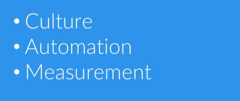
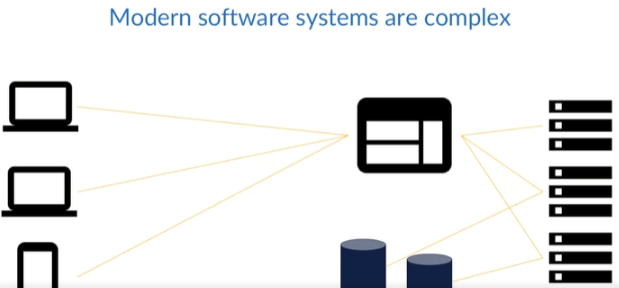
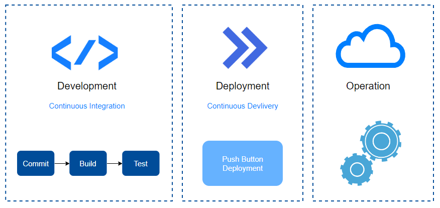

# DevOps 

- [In a Nutshell](#in-a-nutshell)
- [What is DevOps?](#what-is-devops)
- [Common Tenets of DevOps](#common-tenets-of-devops)
    - [Culture](#culture)
    - [Automation](#automation)
- [Metrics](#metrics)
    - [Deployment Frequency](#deployment-frequency)
    - [Mean Time to Recovery MTTR](#mean-time-to-recovery-mttr)
    - [Mean time to discovery MTTD](#mean-time-to-discovery-mttd)
    - [System Availability](#system-availability)
    - [Service Performance](#service-performance)
    - [Customer Complaints](#customer-complaints)
    - [Lead Time](#lead-time)
- [How DevOps can Improve Lead Time](#how-devops-can-improve-lead-time)
- [How DevOps can Improve Stability](#how-devops-can-improve-stability)
- [How DevOps can Reduce Operational Costs](#how-devops-can-reduce-operational-costs)
- [What Companies Practice DevOps?](#what-companies-practice-devops)
    - [Etsy](#etsy)
    - [Netflix](#netflix)
    - [Amazon](#amazon)

## In a Nutshell 

The concept is that from development through the deployment process and onto actually running your code in production, these three things are connected as a sort of pipeline for your software to flow through.

## What is DevOps?

If you were to ask 100 technical people what DevOps is, chances are you'll get at least 100 different answers back. So knowing that there isn't consensus on a single definition might make you a bit leery about this whole DevOps thing, and that's completely understandable. But the lack of any standard definition doesn't detract from its value. It's really quite the opposite, and that's because DevOps is a philosophy.

  

DevOps is the philosophy of the efficient development, deployment, and operation of the highest quality software possible. Being a philosophy, it allows each company to implement it in the way that best supports them.

  

There's no one right way to adopt a DevOps philosophy, though there are definitely wrong ways. What we find is that some practices and strategies help support the philosophy and some don't. 

  

For instance, creating a DevOps team tends to be an example of what not to do, since it creates a new silo for engineers to become isolated in. 

Whereas, having cross-functional teams made of developers, QA, security, and operations engineers could be a useful strategy since it promotes collaboration.

  

## Common Tenets of DevOps 

The community around DevOps have coalesced around a set of generally agreed upon tenets that support the philosophy. Three of the most commonly accepted tenets are culture, automation, and measurement. 

  

The essence of DevOps lies in its philosophy of efficiently developing, deploying, and operating top-quality software. The term "DevOps" itself is derived from the fusion of "development" and "operations." Originally, it emerged to dismantle silos, fostering collaboration among engineers to achieve a balance between speed and stability.

  

DevOps aims to eliminate inefficiencies within the development, deployment, and operations pipeline while emphasizing enhanced quality. Traditional approaches to developing, deploying, and operating software often struggle to adapt to the continual changes inherent in modern software systems. 

The complexity of these systems, with numerous interacting components, increases the likelihood of issues arising when introducing changes, whether in code, configuration, or infrastructure.

  

The goals of developers and operations are naturally at odds to some degree. 

- It's the developer's job to implement change, and whenever a developer writes changes or removes a line of code, they introduce the potential for any number of problems, including bugs, security holes, and system outages.

- The operations team is responsible for ensuring stability, so every time they're given new code to deploy into a production environment, they risk disrupting that stability. In the past, there was a perception that your development and deployment pipeline could either remain stable or move fast, and these two choices are not mutually exclusive. 

  

For example, companies like Etsy are able to deploy new code into production dozens of times every day, while keeping their site's availability high.

  

DevOps offers an improved perspective on the development, deployment, and operations pipeline. This is achieved by fostering a collaborative culture and advocating for the automation of tasks where it proves beneficial.

  

It also promotes the measurement of as much useful data as possible.

  

User expectations for software are high, demanding uninterrupted availability. Consider a sudden surge in users—could your system handle 10 million new users without immediate intervention or server provisioning chaos?

Quality standards are equally crucial. If customers report data loss due to newly released features, how swiftly can your engineers deploy a fix? How did a noticeable bug make it into production, and what's the timeframe for developing and deploying new features—days, weeks, or months?

The DevOps philosophy addresses these challenges holistically, offering principles to assess and improve the development, deployment, and operations pipeline. This approach identifies constraints impacting efficiency and highlights areas for enhancing quality.

  

DevOps represents an ever-evolving philosophy, offering principles and real-world examples to efficiently develop, deploy, and run high-quality, modern software systems. 

It's essential to remember that DevOps aims to address the challenge of efficiently managing modern software systems. Reiterating this point is crucial because it reinforces the core problem that DevOps seeks to solve

### Culture

In essence, culture refers to the beliefs, values, and behaviors shared by a group or company, encompassing its vision, values, beliefs, and habits. Company culture is deeply ingrained and resistant to change. To align with the DevOps philosophy, cultural shifts are necessary, focusing on essential tenets like automation and measurement.

**DevOps Cultural Values**

- DevOps culture emphasizes automation and measurement as critical values.
- Neglecting automation introduces constraints in the development pipeline, causing unnecessary workload for engineers.
- Inadequate measurement deprives the company of essential data for making informed decisions.

**Silos in Traditional Software Companies**

- Traditional software companies often operate with distinct teams, including development, QA, security, and operations, known as silos.
- These siloed teams pursue individual goals, sometimes conflicting with others, leading to inefficiencies.

**Challenges with Silos**

- Silos create conflicting objectives, hindering the collaboration needed for efficient development and deployment.
- An example illustrates the clash between a development team's goal to deploy new features and a QA team's goal to block critical bugs.

**Cultural Shift Towards Collaboration**

- A DevOps culture advocates breaking down silos in favor of high collaboration.
- Cultural change may discomfort engineers as roles become less rigid, requiring adaptation to collaboration beyond silos.
- Breaking down silos aims to establish a culture of shared responsibility, fostering continuous collaboration among teams.

**Cross-Functional Teams**

- Cross-functional teams, responsible for the entire product life cycle, comprise developers, QA, security, and operations engineers.
- These teams working autonomously on a project aim to enhance product stability, security, and quality.

**Caution with DevOps Teams**

- Some companies attempt to adopt DevOps by introducing a DevOps team, often resulting in another silo.
- Such a siloed structure, even within a DevOps team, can frustrate engineers, limiting their effectiveness due to cultural constraints.

  

In the silo model, a blame culture often emerges, leading to finger-pointing when bugs occur in production. This creates friction among teams that should ideally share common goals. DevOps promotes a blameless culture, acknowledging that failures are inevitable, particularly in human-involved processes. Ownership of mistakes is crucial for learning and improving. Blame cultures reduce empathy and create negative work environments.

Instead of blaming, focus on learning from mistakes to prevent future failures. DevOps culture emphasizes collaboration, transparency, and breaking down silos that hinder teamwork. Cultural change may be challenging, but a supportive company culture is essential for DevOps success.

Remember, without cultural support, DevOps is just a buzzword, leaving engineers frustrated.

### Automation 

The definition of automation involves operating or controlling a process with minimal human intervention. 

- Illustrated through the example of manually preparing a complex recipe, highlighting the significance of human error.
- Ensures consistent and error-free execution, particularly in repetitive tasks.
- Addresses challenges related to human distractions and errors.
- Provides scalability, predictability, and improved quality.

**Automation in the Pipeline**

- Continuous Integration (CI):
    - Automates code building and testing after each commit.
    - Ensures the production-quality of code.

- Continuous Delivery (CD):
    - Facilitates push-button deployments.
    - Enables quick and reliable software releases.

- Infrastructure as Code (IaC):
    - Allows engineers to specify and configure infrastructure using code.
    - Promotes consistency and scalability.
    - Utilizes tools like Chef, Ansible, Puppet, and SaltStack.

**Role of Automation in DevOps**

- Offers a solution to constraints in the pipeline.
- Enhances efficiency and maintains quality standards.
- Fundamental aspect of the DevOps philosophy.
- Enables companies to implement tailored practices.
- Supports faster and more reliable software development and deployment.

  

Operations also will want to automate things like log aggregation and log management. 

- Centralized log storage facilitates parsing by preferred tools.
- Automation in monitoring enhances decision-making by collecting stats from various domains.

**Automation's Impact on Efficiency**

- Not an exhaustive list, but a starting point for automating software pipelines.
- Improves efficiency by creating a consistent and predictable process.
- Ensures quality and stability throughout the pipeline.

**Getting Started with Automation**

- For those overwhelmed, start with simple steps.
- Consider using a continuous integration server like Jenkins for code compilation.
- Identify areas for improvement in your current pipeline.

**Addressing Automation Concerns**

- Simplify by focusing on tasks like code compilation or dependency installation.
- Emphasizes starting somewhere manageable rather than finding a perfect solution.

**Key Questions Answered**

- Automation reduces human intervention, a core concept.
- Automation's significance in DevOps lies in speeding up pipelines, enhancing scalability, and producing - high-quality software.

## Metrics 

Metrics provide insights into the impact of DevOps practices on the pipeline's efficiency and the overall quality of the software produced.

**DevOps Philosophy and Metrics**

- DevOps focuses on efficient development, deployment, and operation of high-quality software.
- To gauge efficiency and quality, specific metrics are crucial for evaluation.

### Deployment Frequency

- Key metric reflecting pipeline health.
- Ideally shows an upward trend during active development, reaching a plateau when software stabilizes.

### Mean Time to Recovery (MTTR)

- Represents the average time to resolve production environment issues.
- Encompasses various problems impacting end users, such as outages, severe bugs, and security vulnerabilities.

  

Failures are inevitable, regardless of meticulous planning or the quality of our code and infrastructure. Designing software and infrastructure for maximum flexibility eases the handling of failures. The objective is to reduce the frequency of failures over time. 

While the ideal scenario is a lack of failures, acknowledging their inevitability and understanding the average resolution time aids in identifying potential bottlenecks in the resolution process.

  

### Mean time to discovery (MTTD)

Despite the inevitability of failures, the key question is: How quickly can you identify these failures? Is it through automated methods, or are your customers the ones discovering the issues for you?

Where MTTR begins from the moment of discovery, MTTD begins from the moment any failure is introduced to production. So this is useful because it tells us how quickly we're identifying problems.

  

### System Availability

Even if you're not bound to some sort of uptime agreement with your customers, knowing the uptime of each system that comprises your software as well as the overall uptime percentage is valuable. Having an understanding of the availability of each of the components of your software, load balancers, web servers, CDNs, will help you identify areas that may need some attention from your engineers. 

For example, if your web servers have an uptime of roughly 90% for the month, this is probably a symptom of a larger problem.

  

### Service Performance

Like availability, service performance will help you identify potential problems. You should know at a glance if your systems are performing within the desired thresholds that you've set. 

For example, how long does it take for a response to come back from your REST APIs? Or how long does it take for your web pages to load? Are you optimizing your website so that people on mobile devices using non-Wi-Fi connectivity aren't pulling down three-megabyte background images? 

If you track the average response time for your systems and a code deployment significantly impacts those times, then you'll be able to better identify which code change caused the latency.

  

### Customer Complaints

This is something you're probably already tracking. If you're seeing a large percentage of your user base complaining about problems week after week, then you'll need to evaluate what the issues are and how to incorporate preventative measures into your pipeline. 

Recall that we need to avoid the blame culture, and instead determine what's going wrong and how to prevent it from going wrong in the future. Ideally, those preventative measures will be something that you can automate if it makes sense to do so.

  

### Lead Time

Lead time is the time it takes you to go from a feature request to that feature being released. Getting the customers the features they want as quickly as possible without sacrificing quality ties into our goal of efficiency. 

  

Also, the faster you can take an idea and put it onto staging servers for review, the faster you can either approve or reject new ideas, allowing you to fail fast enough to make experimentation possible. 

If it takes you weeks or months to get an idea from concept to running on a staging server, then experimentation becomes unsustainable, and without that experimentation you risk your software becoming stagnant.

**Conclusion**
No single metric should represent the complete picture, and all of these metrics are merely a conversation starter. They should be used to enhance your software pipeline, not to beat up engineers for not meeting some sort of arbitrary goal, such as lines of code per day.

## How DevOps can Improve Lead Time

DevOps addresses the challenge of instabilities arising from continuous change in software development. Developers introduce change through new features, bug fixes, and code refactoring, which can potentially disrupt operations. 

The solution is to establish an automated environment for rapid issue detection. Despite inevitable mistakes, early detection prevents them from escalating into production problems.

  

Detecting mistakes in production incurs high costs, whereas catching errors shortly after a developer commits or even before the commit is cost-effective. In the realm of software development and deployment, lead time encompasses the duration from idea inception to release.

Now, let's consider a fictional case study of Acme Products Unlimited (APU) to illustrate how DevOps can enhance lead time. APU, a prominent pest management product manufacturer, transitioned from monthly code deployments to multiple daily releases. 

Despite overcoming past quality issues, the company faced challenges due to surging traffic on their successful online marketplace.

  

They have a backlog of features that they want to get developed and released to the users, including a forum for users to chat about what works for them. They also want to release their latest annoying bird detection and capture devices.

  

Concerns about site downtime have restrained Acme Products Unlimited (APU) from implementing changes, given historical deployment issues lasting hours. 

- Their development cycle spans a few weeks, involving code handover to QA after conflict resolution. 
- The iterative process ensues: 
    - QA identifies defects, 
    - developers rectify them, and 
    -  cycle repeats until QA approves. 
- Once cleared, the code proceeds to the operations team, and deployment is scheduled, typically on a Saturday.

On Deployment Saturday, developers and operations convene for the deployment process. Operations withdraws a web server from the load balancer, executes a Git pull command for code update, and tests the result. 

However, this conventional approach often leads to a 500 Error in the browser, lacking specific details due to debug mode deactivation.

  

Depending on the engineer, they may either troubleshoot server logs or enable debug mode to identify errors remotely. A common issue at APU is new dependencies or unmentioned database changes. The operations and development teams collaborate to resolve issues and restart servers or roll back if needed.

While development and QA collaborate, the operations team focuses on maintaining the site, often configuring new virtual machines. APU lacks a DevOps culture with silos and manual deployments, hindering efficiency and automation. Infrequent deployments signal an inefficient process, and companies often avoid them due to perceived complexity.

In contrast, a year later under a new CTO embracing DevOps, APU undergoes a cultural shift. The CTO emphasizes measurement, establishing baselines for lead time, uptime, deployment frequency, MTTD, and MTTR.

  

Once he had his metrics, he started forming autonomous cross-functional teams, teams comprised of developers, QA, security, and operations engineers. 

- No longer would there be a hand-off model. 
- The teams each worked on their own product from start to finish. 
- If you created it, you ran it in production. 
- Engineers implement a fully automated continuous integration and continuous delivery pipeline.

  

The continuous integration was implemented with Jenkins. The developers would check their code into a Git repository and Jenkins would grab those changes. 

- It would build the project and create an artifact, then it would run all of the tests to make sure that the build was successful, and mark it as successful only if everything passed. 
- The QA and security members worked with the entire team to devise a complete set of tests, including things like load testing and security audits.

  

The developers began using feature toggles to ensure that features that weren't ready for release wouldn't impact the running code and production but could still be deployed, thus allowing the main branch of the repo to serve as the canonical source. 

  

And deployments were happening several times a day, usually with no impact on stability. 

- The closer collaboration between developers and operations promoted a more efficient code base, reducing the total number of servers required. 
- The culture of automation inspired a complete push to the cloud and the adoption of an elastic infrastructure.

  

When the server load on the web servers gets too high, the auto scaling adds a new server. The new server is an immutable, pre-baked image made with Spinnaker. 

- When the server load dies down, the newly created server is terminated. 
- The team also switched to a blue green deployment model that has allowed them to deploy multiple times per day and roll back if they need to. 
- Overall, APU is now able to deploy multiple times per day with less down time and better lead time.

  

In this scenario, how did APU improve their lead time?

- They implemented a series of changes that allowed code to be deployed throughout the day, thus removing their largest constraint. 

- Their developers can focus on creation rather than unplanned work. 

What were their steps? 

- They established a clear baseline, allowing them to determine the success of their efforts. 
- Then they made top down cultural changes.
- They implemented a completely automated continuous delivery process. 

What this means?

- As soon as developers check in their code, the process takes over and ensures the code meets all the requirements to be production quality. 
- It allows for a person to deploy to any environment with a push of a button. 

To enhance lead time, assess your entire development, deployment, and operations pipeline. Identify and plan to eliminate or minimize constraints continuously until your goals are met. 

Automation aids in overcoming constraints and ensures a consistent process. In summary, lead time is the duration from feature request to release, and a robust DevOps plan is crucial for identifying and addressing constraints that impede efficiency.

## How DevOps can Improve Stability

Still using Acme Products Unlimited's shift from monthly to daily deployments, let's look at it from the perspective of system stability.

The challenge arises as changes from development conflict with operations' pursuit of stability. APU faced issues with their E-Commerce site and manual server configurations before adopting a DevOps approach, leading to burnout and extended downtime.

Analyzing stability, key changes had a significant impact:

1. **Cultural Shift:** Breaking down silos, APU fostered collaboration among operations, developers, QA, and security engineers. Cross-functional teams enabled proactive problem-solving, enhancing software quality and, consequently, stability.

2. **Metric Utilization:** Embracing metrics provided a performance baseline, enabling engineers to identify and address issues promptly. This contributed to greater stability by swiftly recognizing and resolving problems caused by changes.

3. **Automation:** APU automated processes, introducing continuous integration to catch issues before reaching production. Elastic infrastructure scaled dynamically, ensuring system stability under varying traffic demands. Immutable server models and blue-green deployments further minimized instabilities, ensuring smooth transitions between changes.

In summary, DevOps enhances stability by ingraining quality into software, automating infrastructure management for scalable responses, and ensuring predictability and consistency in deployments.

## How DevOps can Reduce Operational Costs

While we've already covered enhanced lead time and stability, it's essential to tackle how we can minimize operational costs.

Consider the financial impact of downtime for your company. For giants like Amazon, an hour of downtime can incur millions in losses. The same holds true for payment companies like PayPal or Stripe. With today's high costs of outages, ensuring service stability is crucial for protecting the bottom line, a topic we explored in the previous lecture on DevOps and stability.

  

Considerations beyond measurable metrics include the public perception of your product, a factor influenced by a history of outages or security issues. While quantifying the value of public image is challenging, such incidents impact it significantly.

Now, let's briefly overview how Acme Products Unlimited enhanced operational costs:

1. They prioritized a more stable product, improving code quality and operational processes, ultimately impacting operational costs positively.

2. Implementation of a system allowing multiple daily deploys improved lead time, preventing users from seeking alternatives due to delayed features.

3. Unplanned work for engineers was reduced, allowing the majority of time to contribute value to the software.

4. By alleviating the stress on engineers dealing with constant issues, Acme aimed to reduce turnover rates, contributing to overall operational cost improvements.

In summary, with improved stability, faster lead times, minimized unplanned work, and increased job satisfaction, Acme achieved a holistic enhancement in operational costs.

## What Companies Practice DevOps?

This section discuss real companies using DevOps practices, companies like Etsy, Netflix, and Amazon. 

### Etsy 

Etsy is an online marketplace for handmade and vintage items. Their system supports 54 million members. They have 1.4 million active sellers and 19.8 million active buyers. They deploy code around 50 times per day.

  

Let's clarify the difference between deployments and releases:

- Deployment involves pushing changes to an environment, like production, while 
- Release means enabling a feature for end users. 

Etsy's evolution from an initial tech stack of Ubuntu, PostGreSQL, Lighttpd, PHP, and Python, with SQL-stored procedures for business logic, faced challenges like regular maintenance outages during bi-weekly four-hour deployments. Recognizing the unsustainability, Etsy organically embraced a DevOps culture, prioritizing collaboration, transparency, and shared responsibility. 

They implemented continuous deployment using a tool called **Deployinator**, enabling one-click deployments, even for engineers on their first day. Etsy's shift to DevOps marked a significant improvement in their development, deployment, and operations pipeline, fostering efficiency and high quality.

  

They started using Chef for configuration management, and even started open sourcing some of their Chef plugins. 

  

Etsy transitioned to making frequent small code changes rather than infrequent large deployments, enhancing problem identification. 

- They adopted an ORM, avoiding multiple instances of business logic. 
- Switching to a MySQL Cluster with master-master replication and strategic schema migrations improved efficiency.

Etsy prioritizes using well-established tech for reliability over cutting-edge options with potential documentation and skill gaps. 

- Their current tech stack is a standard LAMP stack with Memcached D for database caching. 
- While they became a DevOps success story organically, it's essential to know when to adopt new tech and when to rely on proven solutions.

Etsy's journey, documented in talks by team members, showcases their organic shift from challenging, infrequent deployments to an inspiring frequency of 50 deployments per day, making them a beacon of DevOps success. Explore Etsy's story for valuable insights.

### Netflix 

Netflix recently announced that they had completed their cloud migration. Their entire operation is now in the cloud. 

- The tech stack used at Netflix seems to center around Java for the most part, though not exclusively. 
- They used Git, Jenkins, and Nebula for continuous integration. 
- Developers test locally using Nebula, and once everything is passed, they commit their code to Git. 
- Jenkins builds, tests, and bundles once again using Nebula.

  

In the context of an application project:

- Nebula generates an installable OS package, saving the artifact to the repository upon a successful build and passing of tests. 
- Jenkins triggers Spinnaker, adhering to Netflix's immutable server model, emphasizing prebaking the OS with application code and avoiding post-deployment OS changes.

Spinnaker utilizes **Aminator** to bake the AMI with the created artifact. 

- If successful, the build deploys to a staging environment for testing and review. 
- When ready for production, teams employ Spinnaker's blue-green deployment model. 

Netflix acknowledges the inevitability of failures in their dynamic, large-scale environment and introduces the Simian Army, featuring **Chaos Monkey** for testing infrastructure resilience. Chaos Monkey randomly terminates systems to validate redundancy.

The Simian Army also includes Janitor Monkey, clearing unused resources, and Conformity Monkey, ensuring instances adhere to best practices. Netflix proactively addresses failure scenarios through these tools, emphasizing preparedness and practice.

### Amazon 

Initially, Amazon.com operated as a monolith, a common setup for many websites. As the need for scalability and new features arose, Amazon transitioned to a microservices model. 

- They adopted the "two-pizza teams" approach, forming small teams (six to eight people) responsible for the complete lifecycle of their product.

- Teams at Amazon were granted autonomy to choose tools and technology, and they were accountable for their services, running them in production and addressing issues, fostering a culture of thorough testing. 

- Implementation of a fully automated continuous delivery pipeline. 

- This allowed new teams to automate testing and deployments, resulting in over 50 million deployments in 2014 across thousands of teams.

Similar to the other companies discussed, Amazon shares insights and practices on their tech blog, providing valuable information about their journey to a highly efficient development, deployment, and operations pipeline. Each company followed a distinct toolset but shared a common trajectory toward efficiency.