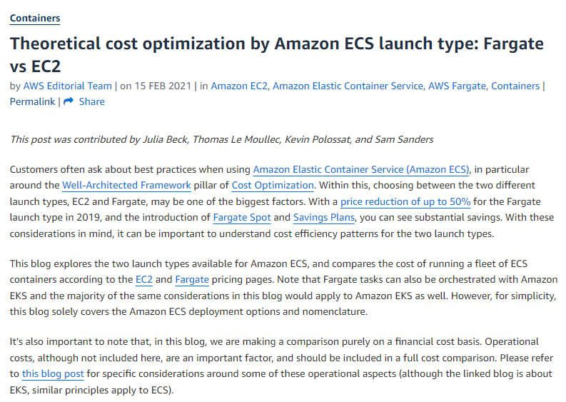

# Serverless Computing

- [Serverless](#serverless)
- [Minimizing cost](#minimizing-cost)

## Serverless 

Serverless computing, introduced in 2014 through AWS Lambda, revolutionized code execution by eliminating the need for server management. Despite the term "serverless," there are servers in the background, but Amazon takes care of server-related tasks, allowing users to concentrate solely on code development.

**Key Points:**
- Serverless popularity led to diverse applications and managed services, covering compute, databases, and application integration.
- Strengths of serverless include cost-effectiveness for fluctuating workloads, rapid scalability, and inherent high availability and fault tolerance.

In traditional environments, constant server upkeep incurs costs even during idle times, whereas serverless charges only for active usage. This cost-effectiveness is particularly beneficial for workloads with varying demands, avoiding the need for continuous server provision.

**Advantages:**
- Rapid scalability: Serverless excels in quickly provisioning additional resources during high-demand spikes.
- High availability and fault tolerance: Serverless architectures benefit from AWS-managed autoscaling, data protection, and service continuity.
- Streamlined updates: Developers can propagate updates without operational complexities, fostering innovation and iteration.

However, serverless has its limitations. Execution time is capped (e.g., AWS Lambda's 15-minute cutoff), requiring special considerations for code execution and state management within this timeframe. Debugging challenges arise as developers lack direct access to underlying infrastructure.

**Limitations:**
- Execution time limits: AWS Lambda imposes a 15-minute cutoff, demanding careful management of code execution and state.
- Debugging challenges: Developers face limitations in accessing and debugging underlying infrastructure directly.

While serverless computing costs may seem higher than traditional servered compute in a 1-to-1 comparison, efficiency depends on resource utilization. Serverless becomes more cost-effective when traditional servers underutilize resources. However, in scenarios of 100% resource utilization, traditional servered options may be more cost-efficient by 20%.

## Minimiing cost

||
|-|

<small>Reference: https://aws.amazon.com/blogs/containers/theoretical-cost-optimization-by-amazon-ecs-launch-type-fargate-vs-ec2/</small>

In this article, Amazon provides valuable data on the cost aspects, particularly focusing on containers in the serverless environment. While the discussion is container-specific, the insights are pertinent to all serverless operations.

**Key Takeaways on Cost:**
- For workloads with extended operations fully utilizing CPU and Memory, a servered deployment is likely the most cost-effective choice.
- If assured resource utilization is uncertain, serverless becomes an attractive option.

When incorporating serverless into your architecture, certain paradigms align well. Notably, event-driven architectures and microservice-based architectures stand out.

**Event-Driven Architectures:**
- Defined by the production, detection, and consumption of events triggered by significant changes.
- AWS services, like S3, come with event handling systems; for instance, uploading a picture to an S3 bucket can trigger an event notification processed by AWS Lambda.
- Events can lead to various serverless functions, enabling complex processes beyond simple tasks like image resizing.

**Microservice-Based Architectures:**
- Essential for creating decoupled components that scale independently.
- Microservices allow breaking down monolithic applications into smaller, independent services.
- While microservices can use traditional compute options, they align well with the serverless paradigm, enhancing scalability.

**Advantages of Serverless Microservices:**
- Serverless nature of compute in microservices provides inherent scalability.
- Enables parallel development and greater ownership by breaking applications into smaller, team-led components.

**Versatility of Serverless Options:**
- With a total of 12 serverless options available, there's almost always a way to create microservices in a serverless manner.

In summary, this article emphasizes the cost considerations, explores event-driven and microservice-based architectures, and underscores the versatility of serverless options, making it a valuable read for architects venturing into the serverless realm.
