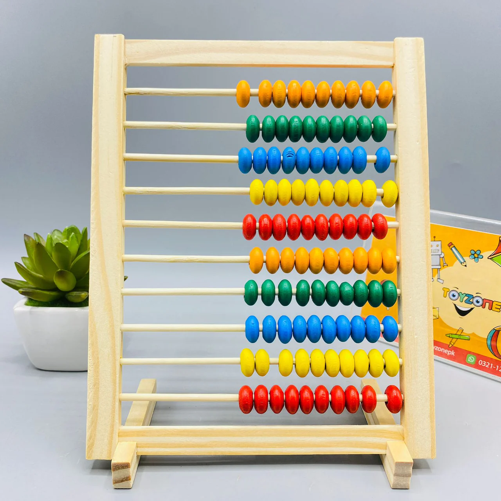
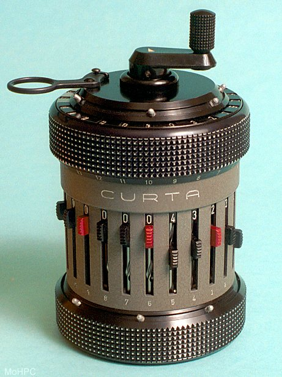
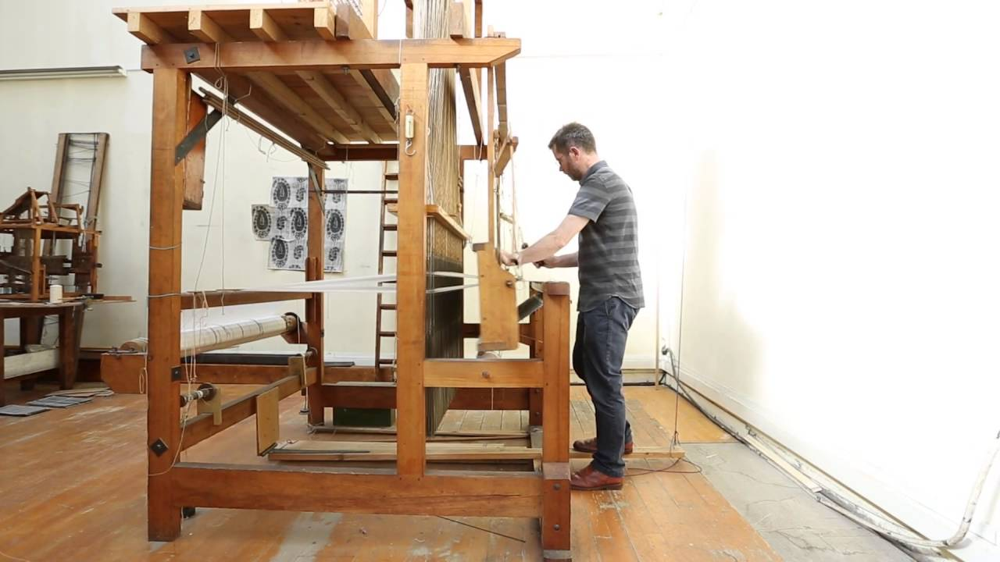
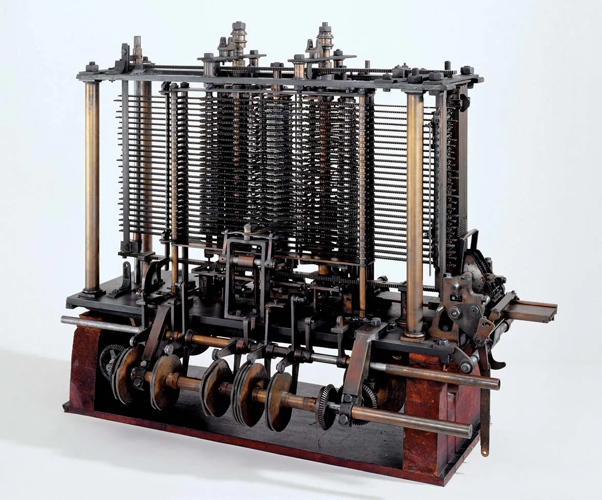

# The History of Computing

- [Computers](#computers)
- [From Abacus to Analytical Engine](#from-abacus-to-analytical-engine)
- [Let's get Mechanical](#lets-get-mechanical)
- [The Looming Innovation](#the-looming-innovation)
- [The Tale of Two Engines](#the-tale-of-two-engines)
- [Algorithms](#algorithms)
- [Next Steps](#next-steps)

## Computers

When we think of computers, we might imagine high-performance desktops or slim laptops. However, these modern devices are not what was originally meant by the term. 

Essentially, a **computer** is a device that performs calculations and stores and processes data. Before computers existed as we know them, the term referred to a person who performed these calculations. Understanding the history of technology is important in comprehending the present and future. 

For instance, have you ever wondered why the keyboard on your computer is laid out the way it is? The most commonly used letters are not found on the home row, where your fingers rest the most. The most widely used keyboard layout is the QWERTY layout, with many stories claiming to explain its development. While not the most efficient layout, it remains in widespread use, though other layouts have been designed in attempts to improve typing efficiency.

## From Abacus to Analytical Engine

In our current mobile-centric world, the use of smartphones may completely change the landscape for keyboards. It's important to have some historical context when delving into the technology industry to better understand the concepts you'll encounter.

Have you ever heard of an **abacus**? Although it may look like a wooden toy that a child would play with, it's actually one of the earliest known computing devices, invented in 500 BC for counting large numbers. Despite the development of more advanced counting tools like calculators, abacuses are still used today, as they require only manual calculations.

## Let's get Mechanical 

The invention of the **mechanical calculator** in the 17th century was a significant leap forward in the history of computing. This device utilized a system of gears and levers to perform basic arithmetic operations automatically. 

Although it was limited to simple calculations involving small numbers, such as addition, subtraction, multiplication, and division, it paved the way for more advanced machines. The principles behind the mechanical calculator were also applied to the textile industry.

## The Looming Innovation 

Imagine a time before the industrial revolution when producing fabric was a laborious and time-consuming task. Creating patterns on the fabric was an even more daunting challenge that required a significant amount of manual labor. But in the 1800s, a French weaver named Joseph Jacquard changed everything with his invention of the programmable loom.

The **Jacquard loom** was the first machine that could weave intricate patterns into fabric automatically. The secret was in a sequence of cards with holes punched into them. These cards controlled the loom's movements, allowing it to weave patterns with incredible precision. When the loom encountered a hole, it would hook the thread underneath it, and if it didn't encounter a hole, the hook wouldn't thread anything. This simple mechanism allowed the loom to create complex designs with relative ease.

While the Jacquard loom revolutionized the textile industry, it also played a significant role in the development of computing. The idea of using punch cards to control machines was later applied to early computers, which used similar cards to store and execute programs. Without Jacquard's invention, the world of computing may have looked very different today.

## The Tale of Two Engines 

Fast forward to early 19th century and meet the engineering visionary named Charles Babbage. This gifted inventor played a pivotal role in shaping the history of computing by creating groundbreaking machines that paved the way to modern-day computers.

Babbage's first breakthrough was the creation of the **difference engine**. This highly complex machine was a significant advancement from the earlier mechanical calculators, as it could perform more intricate mathematical calculations. However, its functionality was still quite limited.

But Babbage didn't stop there. He was inspired by the punch card system used by Jacquard's loom and envisioned a machine that could be programmed using these cards to perform automatic calculations. And thus, the **Analytical Engine** was born.

## Algorithms 

Forward to 1800s and meet Ada Lovelace, a mathematician with a mind-boggling insight into computing. Lovelace was one of the first people to see the potential of the analytical engine, a revolutionary machine developed by Charles Babbage.

While others saw the machine as a calculator, Lovelace realized that it could do much more than perform mathematical operations. She developed the first algorithm for the analytical engine, making it the very first example of computer programming.

An **algorithm** is a series of steps that solve specific problems, and Lovelace's discovery that algorithms could be programmed into the Analytical engine made it the world's first general-purpose computing machine. This groundbreaking achievement by Lovelace is an excellent example that women have always had a profound impact on the technology industry, even dating back to the 1800s.

## Next Steps

Now that we've learned how primitive counting devices like the abacus evolved into huge complex devices like the Analytical engine, jump into the [next page](./023-The-Modern-Computers.md) to learn how these mechanical machines made the leap into modern computing.

