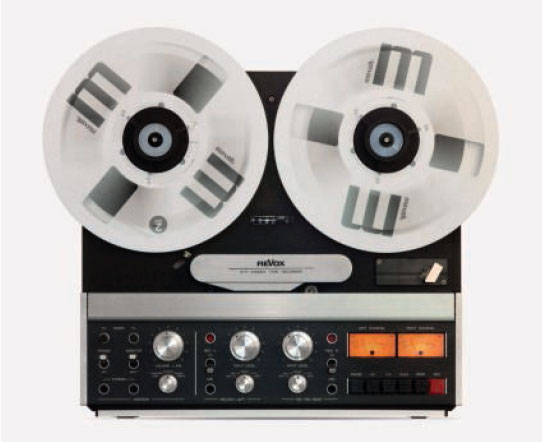
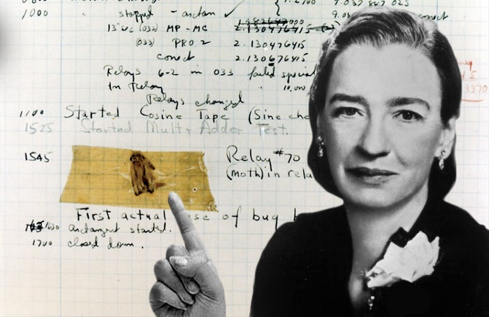
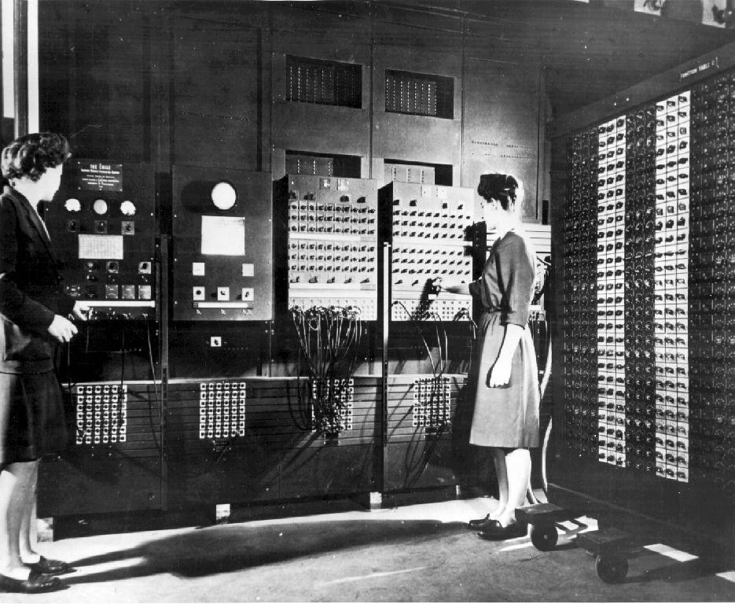
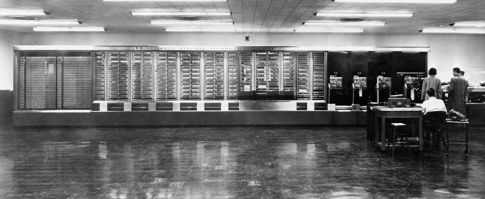
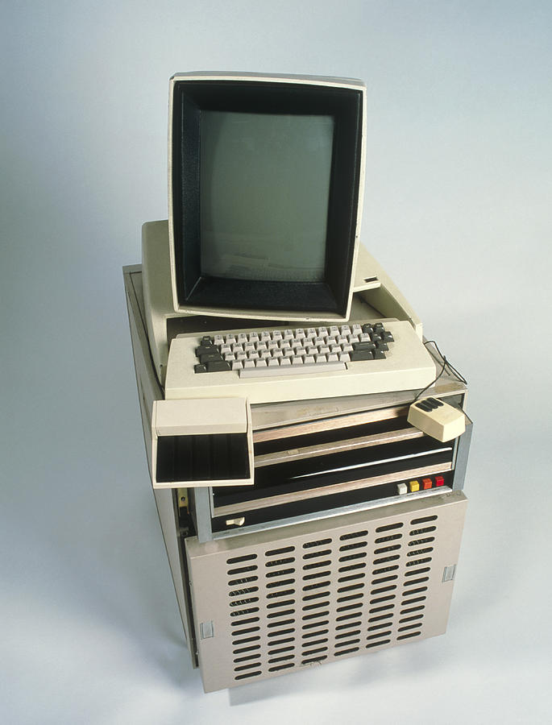
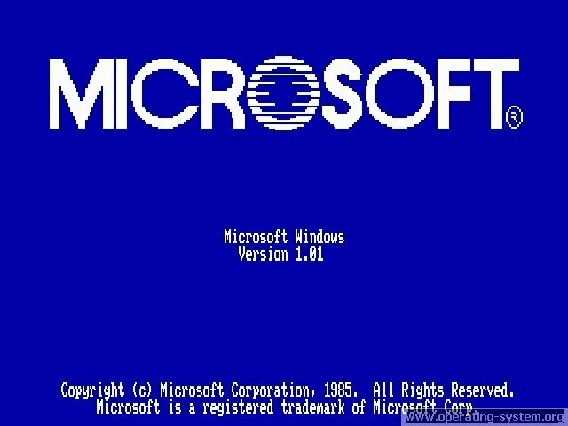
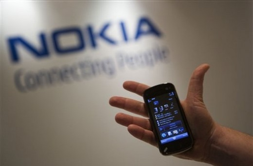

# The Modern Computers

- [Computers of the First Kind](#computers-of-the-first-kind)
    - [Cryptography](#cryptography)
    - [Punch Cards](#punch-cards)
    - [Magnetic Tapes](#magnetic-tapes)
    - [Vaccuum Tubes](#vaccuum-tubes)
    - [So that's where "computer bug" came from](#so-thats-where-computer-bug-came-from)
    - [ENIAC](#eniac)
- [The Start of Electronics](#the-start-of-electronics)
    - [Compilers](#compilers)
    - [Disk Drives](#disk-drives)
    - [Xerox Alto](#xerox-alto)
    - [Apple](#apple)
    - [Microsoft](#microsoft)
- [The Gaming Era](#the-gaming-era)
- [The Unix](#the-unix)
- [The Mobile Movement](#the-mobile-movement)
- [Connecting People](#connecting-people)
- [Next Steps](#next-steps)

## Computers of the First Kind

The progress of computing had been steadily advancing since the invention of the Analytical Engine, but it wasn't until World War II that a major breakthrough was achieved. At that time, computing research was extremely expensive and electronic components were large, requiring a lot of them to compute anything of value. As a result, computers were massive and many research efforts were underfunded and unable to make significant progress.

However, when the war broke out, governments began to invest heavily in computing research in order to develop technologies that would provide them with an edge over other countries. This led to a surge in research efforts and advancements were made in fields such as cryptography.

### Cryptography

During World War II, **cryptography** became an essential tool in processing secret messages from enemies, making computers a valuable resource in this field. Cryptography is still critical to secure communication today, and plays an important role in computer security.

In the post-war era, companies such as IBM and Hewlett Packard rapidly advanced their technologies, expanding their reach from academia to business and government sectors. Throughout the 20th century, significant technological advancements were made in computing, fueled by the interests of governments, scientists, and corporations.

### Punch Cards 

New data storage methods were invented by organizations, leading to a surge in computational power. Punched cards were popular until the 1950s for data storage, where operators had decks of ordered punched cards for data processing. However, a single mistake like dropping the deck could lead to the cards getting out of order and making it nearly impossible to sort them again.

But limitations of punched cards led to new technological innovations such as magnetic tape, which allowed people to store more data on more reliable media.

### Magnetic Tapes 

Magnetic tape revolutionized the way data was stored and retrieved. In the past, punched cards were commonly used to store data, but their limitations were clear. Magnetic tape, on the other hand, used magnetization to record information onto a tape.

The concept of magnetic tape may sound familiar to those who grew up in the 1970s and 80s, as cassette tapes and vinyl records also used this technology to store and play back music. As magnetic tape became more prevalent, it replaced punched cards and allowed for more efficient and reliable storage of data.

### Vaccuum Tubes 

As we have explored, early computers were massive in size and used racks of vacuum tubes to help process data. Vacuum tubes controlled the flow of electricity in all electronics like televisions and radios, but these tubes were problematic and frequently broke down.

IT support in those days might have involved crawling inside massive machines filled with dust and other unsavory things, or replacing vacuum tubes and sorting through stacks of punched cards. Debugging back then might have literally involved identifying and removing creepy crawly creatures from the machine!

Thankfully, modern computing has come a long way since those early days, and the role of an IT specialist has evolved to address the unique challenges of today's technology landscape. 

### So that's where "computer bug" came from 

Admiral Grace Hopper, a renowned computer scientist, often shared a memorable anecdote about a group of engineers who were troubleshooting the Harvard Mark 2 computer. They eventually found out that a moth was causing a relay malfunction, leading to the popular phrase "debugging" to describe the process of fixing computer problems.

### ENIAC 

The ENIAC, one of the earliest general-purpose computers, was a massive collection of electronic components and wires that spanned an entire room. With 17,000 vacuum tubes and requiring 1,800 square feet of floor space, it was a true behemoth of a machine.

## The Start of Electronics 

As time went on, the use of transistors to regulate electricity voltages became prevalent in the industry. Today, this technology serves as a fundamental component in all electronic devices.

Although they perform similar functions to vacuum tubes, transistors are significantly more compact and efficient. It's now possible to fit billions of transistors onto a single small computer chip.

### Compilers 

Over time, there were numerous breakthroughs in the field of computing, including the creation of the first-ever **compiler** by Admiral Grace Hopper. This innovation paved the way for translating human language into programming language and then into machine code, marking a significant milestone in computing history.

Thanks to this development, programming languages are now much more accessible to people around the world, as we no longer have to write machine code in binary form.

### Disk Drives 

Over time, the industry evolved to include the development of the first hard disk drives and microprocessors. Programming languages began to take center stage as the primary means for engineers to create computer software.

With continued advancements in electronic components, computers were becoming smaller and smaller. They no longer took up entire rooms like the ENIAC, and were now small enough to fit on tabletops.

### Xerox Alto 

The Xerox Alto was a groundbreaking computer that resembled modern computers, and was the first to feature a graphical user interface that used icons, a mouse, and windows. While it was previously mainly found in military and university research facilities, the consumer age of computing began when companies like Xerox started building machines that were more affordable and compact.

### Apple

In the 1970s, an engineer named Steve Wozniak created the Apple I, a single-board computer aimed at hobbyists, and founded a company called Apple Computer with his friend Steve Jobs. Their next release, the Apple II, was designed for the average consumer and proved to be a huge success, selling for nearly two decades and making personal computers accessible to a new generation.

This marked a turning point in the industry, as computers became affordable for the middle class and began to infiltrate both homes and offices. In the 1980s, IBM introduced its personal computer, which came with a rudimentary operating system called MS-DOS or Microsoft Disk Operating System. With beautiful icons, words, and images like what we see on our smartphones today, personal computing became more user-friendly and accessible to a wider audience.

### Microsoft 

The evolution of operating systems from their inception to their present state is truly remarkable. Moving back to the IBM PC, it was widely adopted and made more accessible to consumers through a partnership with Microsoft.

Bill Gates, the founder of Microsoft, went on to create the **Windows operating system** which became the preferred operating system in the workplace and dominated the computing industry due to its compatibility with any hardware.

As more computers were introduced into the workplace, the need for IT support increased, leading to a demand for skilled workers who could provide technical assistance. In addition to personal computers entering households for the first time, a new form of computing was emerging - video games.

## The Gaming Era  

In the 1970s and 80s, arcades, which were coin-operated entertainment machines, gained immense popularity. One of the pioneers in this field was Atari, which developed a game called Pong in 1972. Pong became so popular that people queued up for hours at bars and recreational centers just to play it. This marked the beginning of the video game era.

Atari went on to launch the video computer system, which helped to bring video game consoles into people's homes. Video games played a significant role in the evolution of computers by proving that they didn't always have to be used solely for work purposes; they could also serve as a source of entertainment. This was an important milestone for the computing industry, as computers were primarily used in workplaces or research institutions at the time.

## The Unix 

As Apple, Macintosh, and Microsoft Windows dominated the operating system market, Richard Stallman began working on a new project to develop a free Unix-like operating system. **Unix**, which was originally created by Ken Thompson and Dennis Ritchie, was expensive and not widely accessible. Stallman's new operating system was called **GNU** and aimed to provide similar functionality to Unix but be free for anyone to use.

Unlike Windows and Macintosh, which were owned by companies, GNU's code was open source, allowing anyone to modify and share it. Although GNU did not evolve into a complete operating system, it laid the groundwork for the creation of **Linux**, one of the largest open-source operating systems today, which was developed by Linus Torvalds.

## The Mobile Movement 

It is highly probable that you have encountered open-source software if you have worked in IT or used a computer. For instance, you may already be utilizing a web browser like Mozilla Firefox. During the early 90s, computers continued to decrease in size, and a major innovator emerged on the scene.

Personal digital assistants (PDAs) were introduced, enabling computing on-the-go. These mobile devices combined a variety of features, including portable media players, word processors, email clients, web browsers, and more into a convenient handheld device.

## Connecting People 

Nokia's introduction of PDAs with mobile phone functionality in the late 1990s sparked the development of pocketable computers, which we now refer to as smartphones. The progress from room-sized, heavy computers to powerful ones that can fit in our pockets has occurred in just a few decades, which is astonishing. And this is just the beginning.

It is crucial for those entering the IT industry to comprehend how to maintain and service the ever-evolving technology demands. IT support from 50 years ago involved tasks such as replacing vacuum tubes and arranging punch cards, which are no longer applicable in today's IT world. 

## Next Steps 

While computers evolve in both complexity and prevalence, so did knowledge required to support and maintain them. In 10 years IT support could require working through virtual reality lenses. You never know. 

Dive deeper on to how computers work in the [next page.](024-The-Digital-Logic.md) 