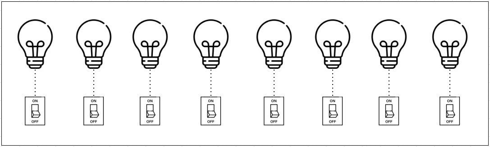
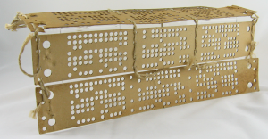
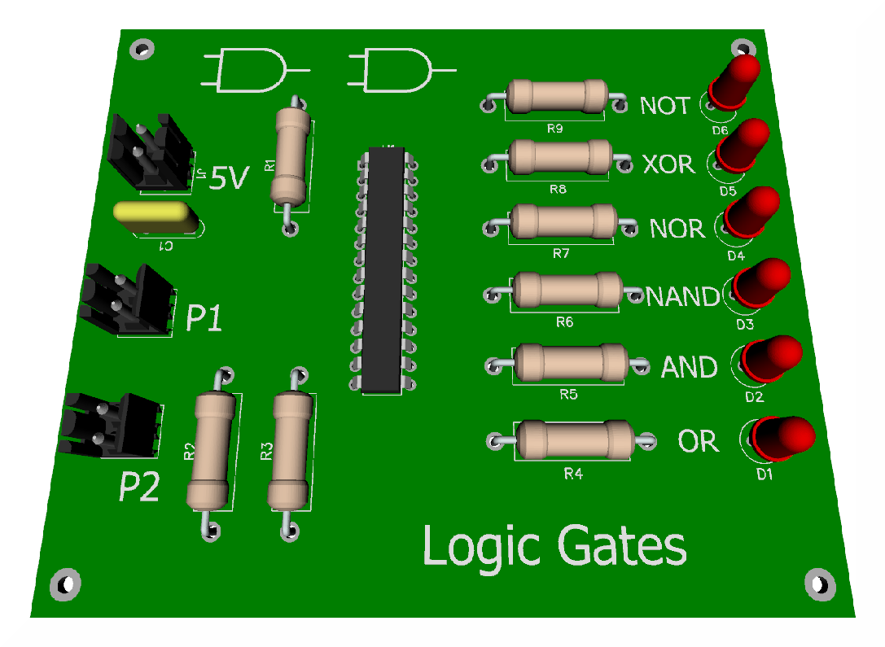
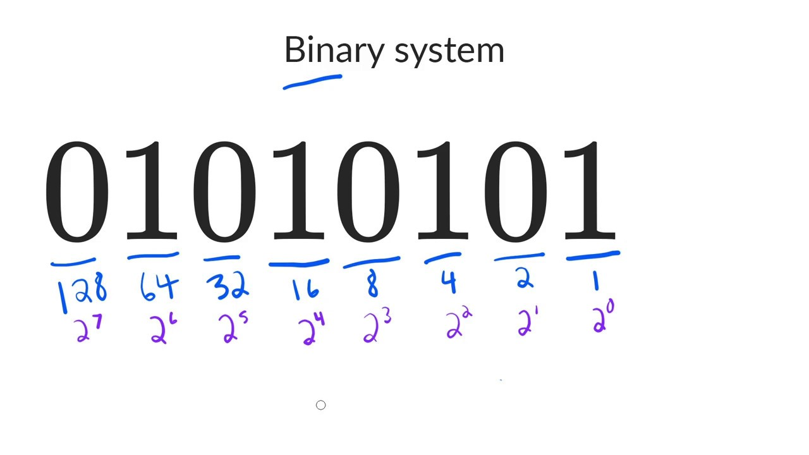

# Binary 

- [On-Off](#on-off)
- [Logic Gates](#logic-gates)
- [Counting in Binary](#counting-in-binary)
- [Next Steps](#next-steps)

----------------------------------------------

Imagine we have a light bulb and a switch that turns the state of the light on or off. If we turn the light on, we can denote that state is one. If the light bulb is off, we can represent the state is zero. 

Now imagine eight light bulbs and switches, that represents eight bits with a state of zero or one. Let's backtrack to the punched cards that were used in Jacquard's loom. 

## On-Off 

From the previous [topic](022-The-History-of-Computing.md), we've learned that the loom used cards with holes in them. When the loom would reach a hole it would hooked to thread underneath, meaning that the loom was on. 

If there wasn't a hole, it would not hook the thread, so it was off. This is a foundational binary concept. 

By utilizing the two states of on or off, Jacquard was able to weave intricate patterns of the fabric with his looms. Then the industry started refining the punch cards a little more. 

Basically:

- If there was a hole, the computer would read one.
- If there wasn't a hole, it would read zero. 

Then, by just translating the combination of zeros and ones, our computer could calculate any possible amount of numbers. 

Binary in today's computer isn't done by reading holes. It uses electricity via transistors allowing electrical signals to pass through. If there's an electric voltage, we would denote it as one. If there isn't, we would denote it by zero. 

## Logic Gates 

But just having transistors isn't enough for our computer to be able to do complex tasks. Imagine if you had two light switches on opposite ends of a room, each controlling a light in the room. 

What if when you went to turn on the light with one switch, the other switch wouldn't turn off? That would be a very poorly designed room. Both switches should either turn the light on or off depending on the state of the light. 

Fortunately, we have something known as logic gates. **Logic gates** allow our transistors to do more complex tasks, like decide where to send electrical signals depending on logical conditions. 

There are lots of different types of logic gates, but we won't discuss them in detail here. If you're curious about the role that transistors and logic gates play in modern circuitry, you can read more about it [here](https://simple.wikipedia.org/wiki/Logic_gate). 

## Counting in Binary 

Binary is the fundamental communication block of computers, but it's used to represent more than just text and images. It's used in many aspects of computing like computer networking. It's important that you understand how computers count in binary. 

There are simple lookup tables available online that you can use like the "ASCII to binary table", but you'll still need to know how binary works. 

The **binary system** is how our computers count using ones and zeros, but humans don't count like that. When you were a child, you may have counted using ten fingers on your hand. That innate counting system is called the decimal form or base-10 system. 

In the **decimal system**, there are 10 possible numbers you can use ranging from zero to nine. When we count binary, which only uses zero and one, we convert it to a system that we can understand, decimal. 330, 250, 2, 40, 4 million, they're all decimal numbers. 

We use the decimal system to help us figure out what bits our computer can use. We can represent any number in existence just by using bits. That's right. And we can represent this number just using ones and zeros. 

**So how does that work?**

Let's consider these numbers: 128, 64, 32, 16, 8, 4, 2, and 1. Hopefully, you'll see that each number is a double of the previous number going right to left. What happens if you add them all up? You get 255. 

The zero is counted as a value, so the maximum decimal number you can have is 255. 

Remember:

- If our computer sees a one, then the value was on. 
- If it sees a zero, then the value is off. 

If you add these numbers up, you'll get a decimal value. 

The 1, 4, 16, and 64 are on, which when added up totals to 85.  

## Next Steps 

Up next, learn the layer of computing that helps us perform the day to day tasks in the [next page.](026-Computer-Architecture.md)