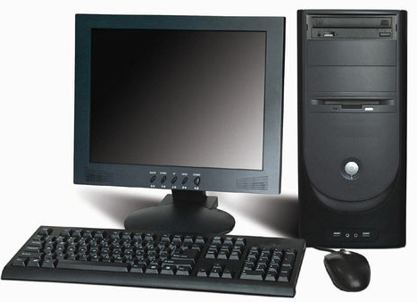
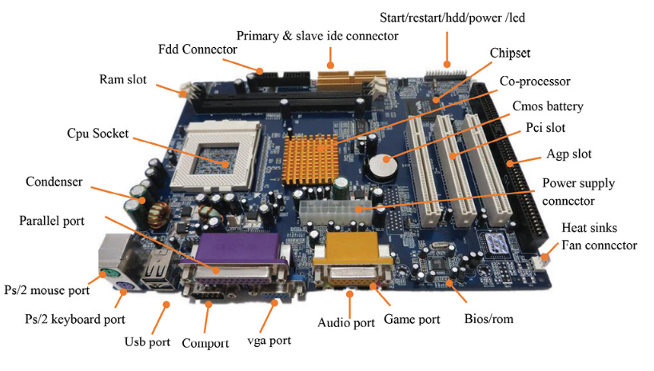
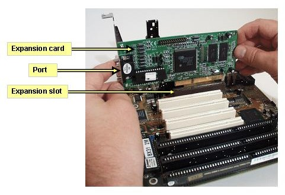
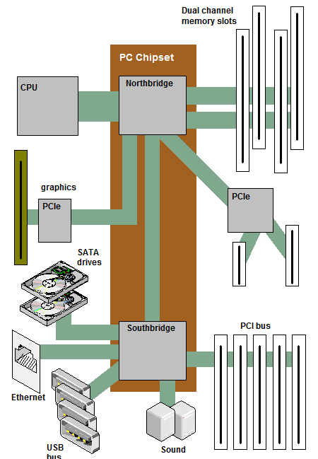
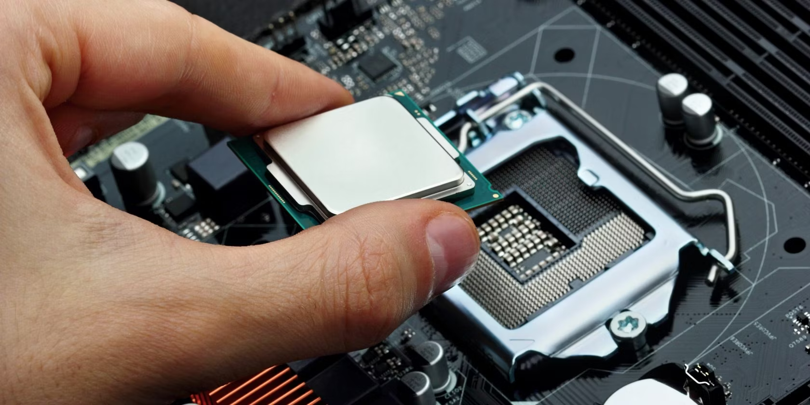
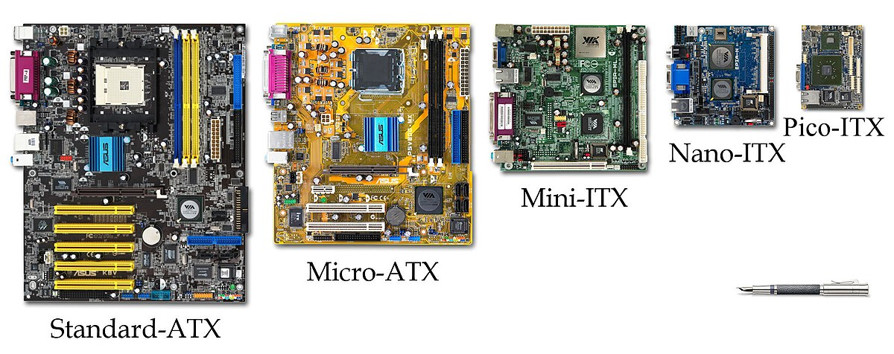
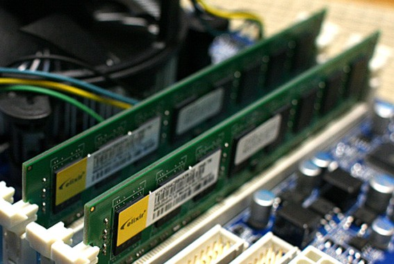
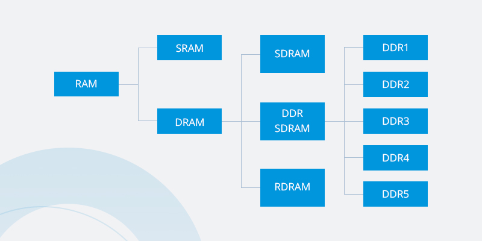
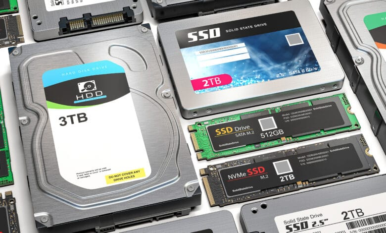

# Computer Hardware

<!-- TOC -->

- [Computer Hardware](#computer-hardware)
- [Desktops](#desktops)
    - [CPU](#cpu)
    - [Instruction Sets](#instruction-sets)
    - [Motherboard](#motherboard)
        - [Expansion Cards](#expansion-cards)
        - [Chipsets](#chipsets)
        - [Expansion Slots](#expansion-slots)
        - [CPU Sockets](#cpu-sockets)
        - [Form Factor](#form-factor)
    - [RAM](#ram)
        - [DRAM](#dram)
        - [DIMM](#dimm)
        - [SDRAM](#sdram)
        - [DDR](#ddr)
    - [Storage](#storage)
        - [HDDs](#hdds)
        - [SSDs](#ssds)
        - [SATA](#sata)
        - [NVMe](#nvme)
        - [Backups](#backups)
    - [Peripherals](#peripherals)
        - [USB](#usb)
        - [Display](#display)
        - [Projectors](#projectors)
        - [Connectors and Cables](#connectors-and-cables)
        - [Device Drivers](#device-drivers)
        - [Lighting](#lighting)
        - [Calibration](#calibration)
    - [Heat Sinks](#heat-sinks)
    - [The Power Supply](#the-power-supply)
        - [Fans](#fans)
        - [Volts - 220v and 110v](#volts---220v-and-110v)
        - [Amps](#amps)
        - [Watts](#watts)
- [Bits and Pieces](#bits-and-pieces)

## Computer Hardware 

Computers are everywhere. You come into contact with them at home, work, the airport, the grocery store, you're using some type of computer to read this page. There's probably one in your pocket right now. While computers are complex and can seem daunting to learn, they ultimately just calculate, process, and store data. Let's check out a typical desktop setup.

## Desktops 

Desktops are just computers that can fit on or under our desks. So here we have a monitor, a keyboard, a mouse, and a desktop.

  

Sometimes you might even add a webcam, speakers, or a printer set up. We'll call these physical components, hardware. 

At the back of the computer, you can see common connectors here, the power outlet here, and the common ports here. Ports are connection points that we can connect devices to that extend the functionality of our computer. 

This is the basically the same setup as in a laptop. There are also physical components inside the laptop case that are hidden for portability. Once you figure out how one computer works, you can figure out how any other computer works. 

### CPU 

You could think of the CPU as the brain of our computer. The CPU does all the calculations and data processing. It uses instruction sets to translate and perform functions on our data. Lastly, the CPU communicates pretty heavily with the RAM or Random Access Memory, which you can see below.

### Instruction Sets

An instruction set is literally just a list of instructions that our CPU is able to run. Functions like adding, subtracting, copying data are all instructions that our CPU can carry out. 

Every single program on your computer, while extremely complex, is broken down into very small and simple instructions found in our instruction set. Instruction sets are hard-coded into our CPU. So different CPU manufacturers may use different instructions sets. But they generally perform the same functions.

### Motherboard 

When you select your CPU, you need to make sure it's compatible with your **motherboard** - the circuit board that connects all your components together. 

The motherboard holds everything in place and lets our components communicate with each other. It's the foundation of our computer. You can think of the motherboard as the body or circulatory system of the computer that connects all the pieces together.

Note that you can't just buy a bunch of parts and expect them to work together. There are different ways CPUs fit on motherboards using different sockets. Your CPU might have lots of tiny pins that either stick out or have contact points that look like dots. 

#### Expansion Cards 

The motherboard lets us expand our computer's functionality by adding expansion cards. It routes power from the power supply and it allows the different parts of the computer to communicate with each other.

#### Chipsets 

Every motherboard has a few key characteristics. First is the chipset, which decides how components talk to each other on our machine. The chipset on motherboards is made up of two chips:

- **Northbridge chip** interconnects stuff like RAM and video cards. 

- **Southbridge chip** which maintains our IO or input/output controllers, like hard drives and USB devices that input and output data. 

In some modern CPUs, the Northbridge has been directly integrated into the CPU so there isn't a separate Northbridge chipset. 

A chipset is a key component of our motherboard that allows us to manage data between our CPU, RAM, and peripherals. Peripherals are the external devices we connect to our computer like: a mouse, keyboard, and a monitor. 

#### Expansion Slots 

In addition to the expansion cards and chipsets, motherboards have another key characteristic which allows the use of expansion slots. Expansion slots also give us the ability to increase the functionality of our computer. 

If you want to upgrade your graphics card, you could purchase one and just install it on your motherboard through the expansion slot. The standard for an expansion slot today is the **PCI Express** or **Peripheral Component Interconnect Express**. 

A PCIe bus looks like a slot on the motherboard and a PCIe base expansion card looks like a smaller circuit board. 

#### CPU Sockets 

Depending on your motherboard, you need to make sure the CPUs fit correctly in the socket. There are currently two major types of CPU sockets:

- Land Grid Array also known as LGA, and 
- Pin Grid Array, also known as PGA. 

In an LGA socket, there are pins that stick out of the motherboard. 

The other type of socket is the PGA socket, where the pins are located on the processor itself.

The socket size may vary. So always make sure you CPU and socket are compatible before hand. When you purchase the CPU or motherboard, they will tell you right on the box what type of socket it has. Make sure your CPU and motherboard socket also both match. If it's not listed on the box, you can go to the manufacturer's website where it usually list what types of CPUs are compatible with the motherboard. 

#### Form Factor 

There are different size of motherboards that are available today. These sizes of form factors determine the amount of stuff we can put in it and the amount of space we'll have. The most common form factor for motherboards is **ATX** which stands for **Advanced Technology eXtended**. ATX actually comes in different sizes too. In desktops, you'll commonly see full sized ATX's. 

If you don't want to use an ATX form factor, you could use an **ITX** or **Information Technology eXtended** form factor. ITXs are much smaller than ATX boards. For example, the Intel NUC uses a variation of the ITX board which comes in three board sizes; mini-ITX, nano-ITX, and pico-ITX. 

When building your computer, you will need to keep in mind what type of form factor you want. Do you want to build something small that can't handle as much workload? Or, do you want a powerhouse workstation that you can add lots of functionality to? 

The form factor will also play a role into what expansion slots you might want to use. Understanding motherboards and their characteristics can be a big plus when fixing hardware issues, since things like the type of RAM module or processor socket are dependent on the kind of motherboard they need to fit into. 

Let's say you're responding to a ticket for a user who is having video problems, you don't want to make it all the way to their desk only to realize the graphics card you brought as a replacement doesn't fit the motherboard their computer uses. 

### RAM 

RAM is our computer's short-term memory. We use this component when we want to store data temporarily. Like let's say, you're typing something into a chat or a piece of text in a word processor. This information is stored in the RAM.

Our computer is comprised of [programs](028-Computer-Programs.md). To run a program, we need to make a copy of it in RAM so our CPU can process it. When you see a new phone or laptop that's says it has 16 gigs of RAM, that means it can run up to 16 gigs of programs, meaning you can run lots of programs at the same time. 

We use RAM to store data that we want to access quickly. This data changes all the time so it isn't permanent. Almost all RAM is volatile, which means that once we power off our machines, the data stored in RAM is cleared.

#### DRAM 

There are lots of types of RAM. A common RAM found in computers is **DRAM** or dynamic random access memory. A one or zero is sent to DRAM, which then stores each bit in a microscopic capacitor. 

This is either the charge or discharge represented by one or zero. These semiconductors are put into chips that are on the RAM and store our data. There are also different types of memory sticks that DRAM chips can be put on. 

#### DIMM 

Modern **DIMM** sticks, which usually stands for Dual Inline Memory Module, have different sizes of pins on them. Note that we don't really buy RAM based on the number of DRAM chips they have. They are labeled by the capacity of RAM on a stake, like an 8 gig stick of RAM. 

#### SDRAM 

After DRAM was created, RAM manufacturers build something called **SDRAM** which stands for Synchronous DRAM. This type of RAM is synchronized to our systems' clock speed allowing quicker processing of data. 

#### DDR 

In today's system, we use another type of RAM, called double data rate SDRAM, or DDR SDRAM for short. Most people refer to this RAM as DDR, even shorter. There were lots of iterations of DDR:

- DDR1
- DDR2
- DDR3 
- DDR4. 

DDR is faster, takes up less power, and has a larger capacity than earlier SDRAM versions. The latest version, DDR4, is the fastest type of short term memory currently available for your computer. 

And faster RAM means that programs can be run faster and that more programs can run at the same time. Keep in mind that any RAM sticks you use need a compatible motherboard with a different number of pins aligned with the motherboard RAM slots. 

### Storage  

As we've learned from previous [pages](024-The-Digital-Logic.md), the smallest unit of a data storage is a **bit**. A bit can store one binary digit, so it can store a one or zero. 

The next largest unit of storage is called a **byte**, which is comprised of 8 bits. A single byte can hold a letter, number or symbol. The next largest unit is refer to as kibibyte, but we typically use the term kilobyte. A kilobyte is made up of 1,024 bytes. 

Let's take a look at the size of an average music file, which is about three megabytes. On a 500 gigabyte machine, that's approximately 165,000 music files. That's a lot of music. We store all of our computer's data on our long-term memory hard drive, which allows us to store our programs, music, pictures, etc. 

#### HDDs 

There are two basic hard drive types used today. **Hard disk drives**, or **HDDs**, use a spinning platter and a mechanical arm to read and write information. The speed that the platter rotate allows you to read and write data faster. This is commonly referred to as **RPM**, or revolution per minute. 

A hard drive with a higher RPM is faster, so if you go out and buy a hard drive today, you might see something like a 500 gigabyte with 5400 RPM. HDDs are prone to a lot more damage because there are a lot of moving parts. This susceptibility to damage went away with a new type of storage called solid state drive, or SSD

#### SSDs 

SSDs have no moving parts. SSDs are created in a similar way as USB sticks. The information is stored on microchips and data travels a lot faster than HDDs. The form factor for SSDs is also slimmer compared to their HDD cousins. 

Sounds great, doesn't it? So why doesn't everyone use SSDs? Well, both have their pros and cons. HDDs are more affordable, but they're more prone to damage. SSDs are less risky when it comes to losing data, but they're also more expensive.

#### SATA 

There are a few interfaces that hard drives use to connect to our system. ATA interfaces are the most common ones. The most popular ATA drive is a **serial ATA**, or **SATA**, which uses one cable for data transfers. 

SATA drives are hot swappable. It means you don't have to turn off your machine to plug in a SATA drive. SATA drives also move data faster and use a more efficient cable than it's predecessors which makes it the de facto interface for HDDs today.

#### NVMe 

People quickly found that using a SATA cable wasn't good enough for some of the blazing fast SSDs that were coming on the market. The interface couldn't keep up with speed of the newest SSDs. So another interface standard was created called **NVM Express**, or **NVMe**.

Instead of using a cable to connect your drive to your machine, the drive was added as an expansion slot, which allows for greater throughput of data and increased efficiency.

#### Backups 

Have you ever had an issue with your computer and lost all the data that was on your hard drive? This actually happens a lot and you'll probably encounter it as an IT support specialist. Make sure you backup your data to be safe. This means you should copy or save your data somewhere else, just in case something goes wrong and your hard drive crashes. That way, you won't lose all your data.

### Peripherals 

As we've learned, we can plug in different objects like a mouse, keyboard, and a monitor on ports and connectors. These devies are known as peripherals. 

A peripheral is basically anything that you connect to your computer externally that adds functionality. 

#### USB 

**USB**, also known as Universal Serial Bus devices are the most popular connections for our gadgets. USB has gone through lots of changes since inception:

- USB 2.0 - transfers speeds of 480 megabytes per second
- USB 3.0 - transfers speeds of five gigabytes per second
- USB 3.1 - transfers speeds of 10 gigabytes per second

Using capital M lowercase b forward slash s instead of using capital M capital B to reference transfer speed. These are actually different units. 

MB is megabyte or unit of data storage, while capital M lower case b forward slash s is a megabit per second, which is a unit of data transfer rate. 

People often mistake speeds of 40 megabit per second to mean that you can transfer 40 megabytes of data per second. Remember, that one byte is 8 bits, so to transfer a one megabyte file in a second you need an 8 megabits per second connection speed. 

So, to transfer 40 megabytes of data in a second, you need a transfer speed of 240 megabits per second. You'll also need comparable USB ports to go with your devices. If you connect a USB 2.0 device into a USB 3.0 port, you won't get 3.0 transfer speeds. But you can still use the port since it's backward compatible, meaning older hardware work with newer hardware. 

The ports are easy to differentiate. In general, USB 2.0 are black and USB 3.0 are blue and 3.1 ports are teal. This may change depending on manufacturers. There are lots of types of USB connectors. The most recent one is the type C connector which is meant to replace many peripheral connections. 

#### Display

In addition to USB peripherals, you should also be aware of display peripherals. There are some common inputs standards to know. 

Most computer monitors will have one or more of these connections, but you might encounter some older standards too. **DVI**. 

DVI cables generally just output video. If you need to hook up a monitor or projector for a slide presentation and you want audio too, you may be out of luck. Instead, you want to look at one of the following cables. 

**HDMI**. This has become a standard in lots of televisions and computers nowadays and outputs both video and audio. Another standard that's become popular among manufacturers is a **displayPort** which also outputs audio and video. 

#### Projectors 

Projectors are display devices for when you need to share information with people in the same location! Most projectors can be used just like any other display on a computer, and with a few differences, can be troubleshot just like any other display device. For example, projectors can have dead or stuck pixels, and can acquire image burn-in, just like other types of displays.

#### Connectors and Cables 

You will connect a computer to a projector using a display cable like VGA, DVI, HDMI, or DisplayPort. When you do this, the computer's operating system will detect that a new display has been added. Depending on what your computer's video adapter supports, this new display can be extended or mirrored just like if you had added a second monitor

- [Windows - How to connect to a projector or PC](https://support.microsoft.com/help/27911/windows-10-connect-to-a-projector-or-pc)

- [MacOS - How to connect a display, TV or projector to Mac](https://support.apple.com/guide/mac-help/mchl5fdd37ce/mac)

- [Ubuntu - How to connect another monitor to your computer](https://help.ubuntu.com/stable/ubuntu-help/display-dual-monitors.html)

A lot of times, display issues with projectors come down to the connectors and the cables that you are using. Because people frequently connect and disconnect from projectors, the cables and connectors can become worn out or damaged. Always consider this early in your troubleshooting if the projection display flickers or disappears.

#### Device Drivers

Just like other display devices, if your computer does not correctly recognize the display resolution of the projector it may default to a very low-resolution VGA mode like 640x480 or 1024x768. If this happens, your computer may need a device driver for your projector. Take a look at the support website for your projector's manufacturer.

#### Lighting
Projectors often rely on expensive, hot, very bright incandescent bulbs, or lamps. If a projector gets too hot for the lamp to safely operate, the projector will shut down. If the lamp burns out, the projector will either not work or will shut itself down. It is increasingly common for projectors to rely on LED lights, rather than incandescent lamps. These LED lights have far fewer issues with overheating, and have much longer lifespans than incandescent lamps.

#### Calibration
Sometimes, like when a projector is first installed, reset, or moved, you will need to calibrate the projector image to account for the distance and angle that the projector is installed at. If the image is skewed or keystoned, you might need to recalibrate the projector geometry. Calibrating the image involves focusing the image, and making adjustments to the image to make it square and aligned with the projection surface. Every projector is a little different, so refer to the vendor documentation to complete this task!

### Heat Sinks 

When we install our CPU, we need to do a few things to it to keep it cool. Since it does a lot of work, it's prone to overheating. We have to make sure to include a heat sink, too, which takes the heat from our CPU and dissipates it through a fan or another medium. 

### The Power Supply 

Finally, the power supply converts electricity from our wall outlet onto a format that our computer can use.  There are two types of electricity:

- **DC**, or direct current, which flows in one direction, and 

- **AC**, or alternating current, which changes directions constantly. 

Our computers use DC voltage, so we have to have a way to convert the AC voltage from our power company to something we can use. That's what our power supply does. 

#### Fans 

Most power supply units have a fan. They also has voltage information just normally listed underneath or on the side, and cables to power your motherboard, 

#### Volts - 220v and 110v

To understand electricity, we must use the example of water pipes. Our sinks have a faucet that's connected to a pressurized water tank. When we turn on the faucet, water comes out. This is sort of like how electricity works. 

When we plug an appliance into a wall outlet and turn it on, a flow of electricity comes out. If we added more pressure to our water tank, would more water come out of it? The higher the pressure, the more water there will be. 

When it comes to electricity, we refer to the pressure as **voltage**. If you plug in a 120 volt appliance into a 220 volt outlet, the power will come busting through and fry your appliance.

If it was the other way around, and a 220 volt appliance was plugged into a 120 volt outlet, the appliance would still be able to get electricity, but slowly. This would be similar to if a water tank whose only half pressurized, it will drew water, but slowly. 

In some cases though, this can deteriorate the performance of the device and cause damage in the long term. As a general rule, be sure to use the proper voltage for your electronics. 

#### Amps 

We refer to the amount of electricity coming out as current or amperage, and it's measured in amps. We can think of amps as pulling electricity, as opposed to voltage, which pushes electricity. Amps will pull as much electricity needed, but voltage will just give you everything. 

Look on the back of the one of your device charges, you might see something like 1 or 2.1a. Charging a device with 2.1 amps will actually charge a device faster because it's able to put current from a 2.1 amp than a 1 amp charger. 

#### Watts 

Finally, the other important part of the electricity that we need to know is the wattage. Wattage is the amount of volts and amps that a device needs. If your power supply has too low of a wattage, you won't be able to power your computer, so make sure you have enough. 

This doesn't mean that if you have a large power supply, you'll overpower your computer. Power supplies just give you the amount that your system needs. It's best to error on the side of large power supplies. 

You can power most basic desktops with a 500 watt power supply, but if you're doing something more demanding on your computer, like playing a high-resolution video game or doing a lot of video production and rendering, you'll likely need a bigger power supply for your computer. 

On the other hand, if all you're doing is just browsing the Web, the power supply that comes with your computer should be fine. All kinds of issues are caused by a bad power supply. Sometimes the computer doesn't even turn on at all. 

Since power supplies can fail for lots of reasons like burnouts, power surges, or even lightning strikes, knowing how to diagnose power issues and replace a failed power supply is a skill every IT support specialist should have in their toolbox. 

## Bits and Pieces  

Before we fully close this page, let's do a high-level view of 32-bits and 64-bits. If you purchase a CPU, you'll see that it has either a 32 bit or 64 bit architecture. What does that mean? 

Well, we know we can process 8 bits in binary. Now, imagine how we can process with 32 or even 64 bits. CPUs that have 32 bit or 64 bit architecture are just specifying how much data it can efficiently handle. You can read more about the differences between 32 bit and 64 bit architecture [here](https://support.microsoft.com/en-us/help/15056/windows-7-32-64-bit-faq).
