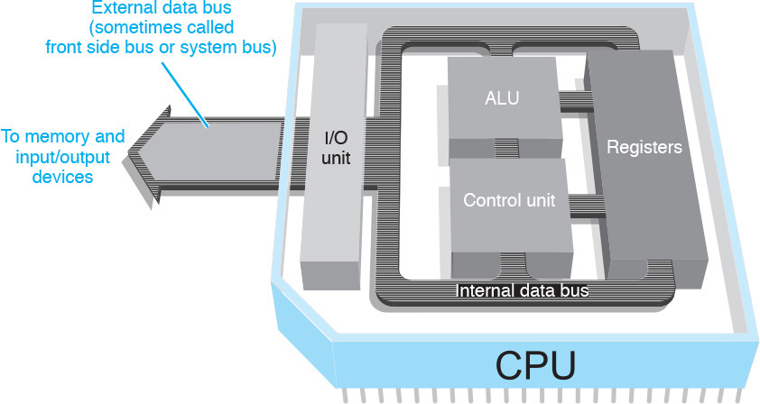
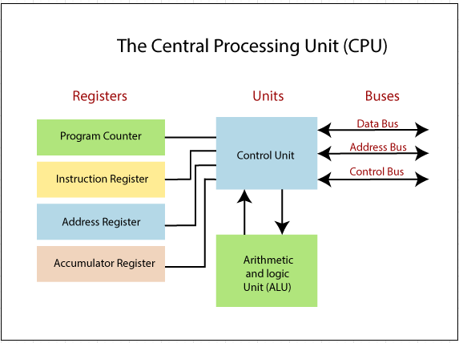
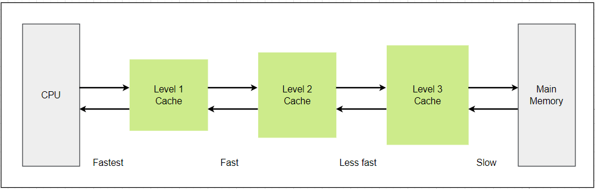

# Computer Programs

- [Programs](#programs)
- [Instructions](#instructions)
- [External Data Bus](#external-data-bus)
- [Registers](#registers)
- [Memory Controller Chip](#memory-controller-chip)
- [Address Bus](#address-bus)
- [Cache](#cache)
- [Clock Wires](#clock-wires)
- [Clock Cycles](#clock-cycles)
- [Clock Speed](#clock-speed)
- [Overclocking](#overclocking)

## Programs 

Recall that our computer can only communicate in [binary](025-Binary.md), using ones and zeroes. Our computers speak in machine language, but we of course speak in human languages, like English, Spanish, Mandarin. 

If we want to communicate with our machines, we have to have some translation dictionary. Just if I wanted to say something in Spanish, I'd look it up in an English-Spanish dictionary. Our computers does the same when it checks its built-in translation book. 

They are referred to as **Programs**. Programs are basic instructions that tell the computer what to do. We typically store programs on durable media like RAM

Remember that RAM is our computer's short-term memory. It stores information in a location our CPU can access faster than it could with our hard drive. Now we can give our chef one or two recipes at a time, instead of reciting the entire cookbook to her. 

## Instructions 

As analogy, let' say we have a chef and we want her to make a peanut butter and jelly sandwich. We can send the steps to her:

1. Get two slices of bread. 
2. Put peanut butter on one slice. 
3. Put jelly on another slice. 
4. Combine the two slices of bread. 

Our chef can only communicate with us in ones and zeroes. So instead of sending something readable, like the recipe for a peanut butter and jelly sandwich, we have to send her something like this. 

> 00110001 00101110 00100000 01000111 01100101 01110100 00100000 01110100 01110111 01101111 00100000 01110011 

In reality, this process is a little more complicated. Our CPU is constantly taking instructions and executing them. These instructions are written in binary but how do they travel around the computer? 

## External Data Bus 

In our computer, we have something called the **External Data Bus** or **EDB**. It's a row of wires that interconnect the parts of our computer, kind of the veins in our body. 

When you send a voltage to one of the wires, we say the state of the wire is on, or represented by a 1. If there's no voltage, then we say that the state is off, represented by a 0. This is how we send around our ones and zeroes. 

Sound familiar? This is the same way transistors help us to send voltages. The EDB comes in different sizes: 8 bit, 16 bit, 32, even 64. 
## Registers

Okay so now, our CPU is receiving a byte and it needs to get to work. Inside the CPU there are components known as **Registers**.

They let us store the data that our CPU works with. If for example, our CPU wanted to add two numbers, one number would be stored in a register a. Another number would be stored in register b. The result of those two numbers would be stored in register c. 

Imagine the register is one of our chef's work tables. Since she has a place to work, she can start to cook. To do so she uses a translation book to translate her binary into tasks that she can perform.

Remember that our programs are copied into RAM for the CPU to read. RAM is memory that is randomly accessed, allowing our CPU to read from any part of RAM as quickly as any other part. We don't actually send data from RAM over the EDB. There would be way to much stuff. RAM can hold millions, even billions, of rows of data. 

## Memory Controller Chip 

Despite our sandwich example, most of our recipes aren't simple at all. There can be thousands of lines long. We want to process them and we don't actually go in any particular order. Since we can only send one line of data through the EDB at the time, we need the help of another component, the Memory Controller Chip or MCC. 

The **MCC** is a bridge between the CPU and the RAM. You can think of it, a nerve in your brain connecting to your memories. The CPU talks to the MCC, and says, 

> "hey, I need the instructions for step number three of this recipe."

The MCC finds the instructions for step number three in RAM, grabs the data, and sends it through the EDB. 

## Address Bus 

And then there's another bus, the **Address Bus** which connects the CPU to the MCC, and sends over the location of the data, but not the data itself. Then the MCC takes the address and looks for the data. And then data is then sent over the EDB.

A more complete picture:

## Cache 

RAM isn't the fastest way we can get more data to our CPU for processing. The CPU also uses something known as Cache.

**Cache** is smaller than RAM, but it let's us store data that we use often, and let's us quickly reference it. Think of RAM like a refrigerator full of food. It's easy to get into, but it takes time to get something out. 

On the flip side of that, Cache is like the stuff we have in our pockets. It's used to store recently or frequently accessed data. There are three different cache levels in a CPU, L1, L2, and L3. L1 is the smallest and fastest cache. 

## Clock Wires

So now we understand how our RAM interacts with our CPU. But how does our CPU know when the set of instruction ends, and a new one begins. Our CPU has an internal clock that keeps its operations in sync. 

It connects to a special wire called **Clock wire**. When you send or receive data, it sends a voltage to that clock wire to let the CPU know it can start doing calculations. 

## Clock Cycles 

Think of our clock wires as the ticking of a clock. For every tick, the CPU does one cycle of operations. When you send a voltage to the clock wire, it's referred to as a **clock cycle**. 

If you have lots of data you need to process in a command. You need to run lots of clock cycles. 

## Clock Speed 

Have you ever seen a CPU in the store and has something labeled 3.4ghz?

This number refers to the **Clock speed** of the CPU, which is a maximum number of clock cycles that it can handle in a set in a certain time period. 

3.40 gigahertz is 3.4 billion cycles per second. That's super fast. But just because it can run at this speed, doesn't mean it does. It just means that it can't exceed this number. Still, that number doesn't stop some people from trying. 

## Overclocking

There's a way you can exceed the number of clock cycles on your CPU on almost any device. It's referred to as **Overclocking** and it increases the rate of your CPU clock cycles in order to perform more tasks. This is commonly used to increase the performance in low-end CPUs. 

Let's say you're a gamer and you want to have better graphics and less lag while playing. You might want to overclock your CPU when you play the game, but there are cons to doing this, like potentially overheating your CPU.

