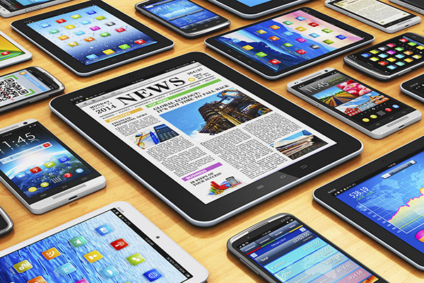

# Latops and Mobile Devices 

- [Laptops](#laptops)
- [Mobile Devices](#mobile-devices)
- [USB](#usb)
- [BYOD](#byod)
- [Batteries](#batteries)
- [Charge Cycles](#charge-cycles)
- [Power Supply Unit Chargers](#power-supply-unit-chargers)
- [Keeping Batteries Safe and Healthy](#keeping-batteries-safe-and-healthy)
- [When to replace batteries](#when-to-replace-batteries)

## Laptops

All of the components mentioned above make up most computers, even a mobile phone. While it might look very different from your laptop, a mobile phone just uses a smaller version of the hardware that we saw in the desktop and laptop today. 

## Mobile Devices 

Mobile devices are computers too. They have CPUs, RAM, Storage, power systems, and peripherals. How are they different from a server, a desktop computer or a laptop? 

They're portable and usually powered by batteries. Some mobile devices are general purpose computing devices like tablets or smartphones, other mobile devices are optimized to perform a specific set of tasks like fitness monitors, e-readers, and smartwatches. 

Mobile devices are usually very integrated. Remember the systems that we showed you earlier, the components can be taken out and held in your hand. Mobile devices build some or all of these components together in a way that you can't take apart. 

The smaller the device, the more integrated the components usually are. The CPU, RAM, and storage, might be soldered directly to the devices motherboard. Very small mobile devices use a system on a chip or SoC. 

A system on a chip packs the CPU, RAM, and sometimes even the storage onto a single chip. Not only our SoC is small, they use less battery power than if those components were separated. Even though they're small, some mobile devices use peripherals. 

Smartphones connect to Bluetooth headphones for example. Mobile devices can also be a peripheral. A fitness tracker is a standalone device, but it can also be a peripheral to your smartphone. That same fitness tracker might use a heart rate monitor as a peripheral. It's peripherals all the way down. 

Mobile devices may use standard or proprietary ports and connectors. You might need to have a specific adapter, or connector for charging a device, or connecting your mobile device to a computer. Sometimes the physical shape or the intended use of the mobile device makes a standard connection like USB a bad choice. 

## USB 

For example, say you have a waterproof fitness tracker. If it had a Micro-USB port, that port would be damaged if exposed to water. So instead, it's designed with a custom charging interface that can be submerged underwater, here's some of the standard power, data, and display connector types you'll find used in mobile devices. This is a **USB-C.** 

Next we have a lightening adapter, then a Mini-USB, and a Micro-USB, a Micro-HDMI, and a Mini-HDMI, and this is a Mini DisplayPort. 

Because mobile devices are generally small and have limited access to power, they run operating systems and applications software that specifically designed to maximize their performance. 

## BYOD 

One super important thing, mobile devices can contain a lot of personal data. Some organizations allow people to use their own personal devices for work. We call this **bring your own device** or BYOD. You should be careful to respect people's privacy when they bring their own devices to you for help. 

To know how to handle these devices is always best to refer to your organization's policy. 

## Batteries 

Mobile technology uses rechargeable batteries to carry power with the device, wherever we take it. Rechargeable devices might have an external charger for a removable batteries, or might have a cradle stand or wireless charger. So rechargeable devices might have an external charger or removable battery, or might have a cradle stand or wireless charger. 

## Charge Cycles 

Rechargeable batteries have a limited lifespan which is measured in charge cycles. Charge cycle is one full charge and discharge of the battery. When a battery is reaching the end of its lifespan, it may take longer to charge and might not hold as much charge as when it was new. 

For some devices, compare the current cycle count of your battery with the rate at cycle count of that battery type to see how much more life to expect out of it. You need an external power source to add power to a battery. 

This could come from a wall outlet, another battery, or even a solar panel. You also need a charging circuit that manages the power transfer from the external power source to the rechargeable battery. This circuit works a lot like a power supply unit or PSU.

## Power Supply Unit (Chargers)

PSUs makes sure the input power is converted to the correct output power. Instead of using a large PSU, rechargeable devices use more portable power adapters, power supplies, or chargers. 

A portable power supply, powers our device while also charging the battery. This might sound obvious, but you need to make sure that you use the right charger for the right device. Mismatching chargers to devices can damage the battery, the device, and the charger. 

A lot of chargers and power supplies use USB connectors, but you'll see a wide variety of charging connectors. 

## Keeping Batteries Safe and Healthy 

Rechargeable batteries can be damaged by very cold or very hot environments. 

Don't charge or discharge rechargeable batteries unless they're within their safe operating temperature range. It's not just that a damaged rechargeable battery might not perform well, it can also be very dangerous. 

Batteries can swell, rupture, and sometimes even catch fire. Before working with a damaged battery, you should know how to safely handle it.  

Safe handling procedures vary based on the battery type, so be sure to read up on proper procedures before you work with a damaged battery. When a battery reaches the end of its life, you'll need to replace it. 

## When to replace batteries 

Some devices will slow themselves down when a battery is getting old, to make the battery lasts longer. If your device is running much slower than usual or shutting down unexpectedly, one thing to check is the battery life. 

Some devices have batteries that are designed to be replaced by the end user, other devices have batteries that are very difficult to replace like small laptops and mobile devices. 

IT support specialist often have to troubleshoot battery life and device charging. The first step is to make sure the charger, the battery, and the device, are all designed to work with each other.  

For iOS and Android, there are also some things that you could do to make the battery lasts as long as possible. It's a good idea for you to be familiar with these things so that you can help educate end users on the best ways to get the most out of their mobile devices. 

Check out these resources to learn more:

- [Inductive Charging](https://en.wikipedia.org/wiki/Inductive_charging)

- [Safe handling of lithium-ion batteries](https://www.osha.gov/sites/default/files/publications/shib011819.pdf)

- [Batteries and charge cycles for Windows](https://docs.microsoft.com/windows-hardware/design/device-experiences/powercfg-command-line-options#option_batteryreport)

- [Batteries and charge cycles for Macs](https://support.apple.com/HT201585)

- [Maximize your batteries for iOS ](https://www.apple.com/batteries/maximizing-performance/)

- [Maximize your batteries for Android](https://support.google.com/android/answer/7664358)