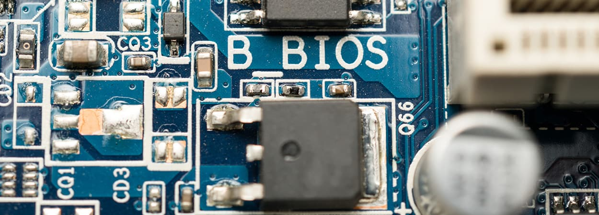
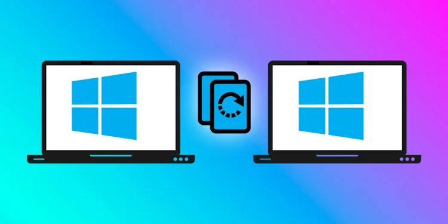

# BIOS

- [Services](#services)
- [BIOS](#bios)
- [ROM](#rom)
- [UEFI](#uefi)
- [POST - Power-On Self Test](#post---power-on-self-test)
- [CMOS/BIOS Settings](#cmosbios-settings)
- [Reimaging Computers](#reimaging-computers)

Now we've seen all the [key components](027-Computer-Hardware.md) to get our computer running. The last thing we'll go over is how our devices talk to each other. 

We know [how programs execute](028-Computer-Programs.md) from our hard drive to our CPU, but how do other things like a mouse click or a keyboard press get sent to our CPU for processing? 

These are fairly basic devices, they don't contain any instructions that our CPU knows how to read. If you just clicked on the key from your keyboard, you'd only be sending a byte to the CPU. The CPU doesn't know what this is, because it doesn't have instructions on how to deal with it. 

## Services

Turns out, our devices also use programs to tell the CPU how to run them. These programs are called **services** or **drivers**. The drivers contain the instructions our CPU needs to understand external devices like keyboards, webcams, printers. 

## BIOS 

Our CPU doesn't know that there is a device that it can talk to, so it has to connect to something called the **BIOS**, or **basic input output services**. The BIOS is software that helps initialize the hardware in our computer and gets our operating system up and running.

Unlike the programs, you're probably used to running a web browser or operating system. The BIOS isn't stored on a hard drive. Our motherboard stores the BIOS in a special type of memory called, the **read-only memory** chip, or **ROM** chip.

## ROM 

Unlike RAM, ROM is non-volatile, meaning it won't erase the data if the computer is turned off. Once the operating system loads, we're able to load drivers from non-essential devices, directly from the hard drive. 

## UEFI 

In today's system, there is another player for BIOS called **UEFI**, which stands for Unified Extensible Firmware Interface. UEFI performs the same function of starting your computer as a traditional BIOS. 

But it's more modern and has better compatibility and support for newer hardware. Most hardware out there today comes with UEFI built in. Eventually, UEFI will become the predominant BIOS. 

## POST - Power-On Self Test 

When you turn on a computer, you might notice a beeping from time to time. How computers run a test to make sure all the hardware is working correctly. This is called a **Power On Self Test** or **POST**. And then BIOS runs it when you boot up your computer.

The POST figures out what hardware is on the computer. So it happens before the BIOS initializes any hardware or loads up essential drivers. If there is an issue with anything at that point, there is no way to display it on the screen, since things like the video driver haven't been loaded. 

Instead, the computer can usually produce a series of beeps, almost like Morse code, which will help identify the problem. Different manufacturers have different beep codes. 

- If your computer successfully boots up, you may hear a single beep.
- If you hear two beeps, it could mean a POST error.

It's best to refer to your motherboard manual to find out what each code means. Also, you should know that not all machines have built-in speakers, so don't worry if your computer boots without a beep.

If it does have a built-in speaker, being able to distinguish what the beep codes mean is an extremely helpful tool when troubleshooting boot issues.

## CMOS/BIOS Settings 

There is a special chip on our motherboard called the CMOS chip. It stores basic data about booting your computer like the date, time and how you wanted to start up. You can change these settings by booting into CMOS or BIOS setting menu. 

It varies in different computers, but usually when you boot the computer, there will be a quick screen that tells you what button to push to get into the settings. From there, you can change the basic BIOS settings of your machine.

BIOS settings control which devices to boot to and in an IT role, you might need to change the settings more often than not. 

## Reimaging Computers 

A frequently performed IT task is the reimaging of a computer. The term refers to a disk image which is a copy of an operating system. So the process of reimaging involves wiping and reinstalling an operating system. 

This procedure is typically performed using a program that's stored on some external device like a USB memory stick, or a CD ROM, or even a server accessible through the network. To access these programs and perform the reimage, you'll need to use the BIOS to tell the computer to boot up from that external device.

For more details, check [How To Reimage A Computer On Windows?](https://www.google.com/url?sa=i&url=https%3A%2F%2Fwww.technewstoday.com%2Freimaging-computer%2F&psig=AOvVaw25CjSwSoB972Z_QQ7w7tz3&ust=1692245035084000&source=images&cd=vfe&opi=89978449&ved=0CBIQjhxqFwoTCMCz9ZOm4IADFQAAAAAdAAAAABAz)