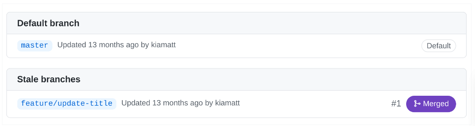
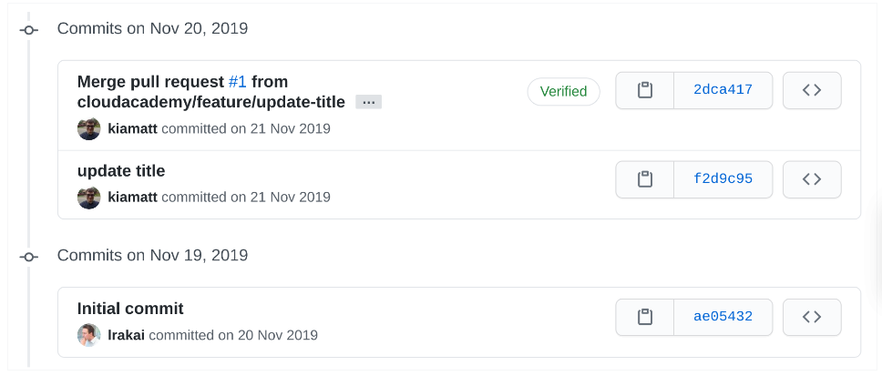

# Git Basics 

## Git 

Git is a version control system for tracking changes in code. Version control systems allow developers to conveniently track changes made to their code. Using commits, which can be thought of as incremental saves to a file or group of files, companies have the ability to track changes, compare different versions of a file, and revert to previous version of files with ease. Companies use Git because it is one of the most popular version control systems available for a variety of reasons, including its ease of use for beginners, clear structure when comparing commits, and integration with some of the world's most popular version control hosting platforms.


## Branches

Navigate to the codebase you will be using for this Lab:

https://github.com/cloudacademy/example-git-repo

Click branches. Notice the list of branches that appear on the Branches view:

  

Branches are a version control used by git to safely make changes to files. Every git repository has a default branch, usually master or main. When changes are made to files in a git branch, those changes aren't reflected in the same files on master until that new branch has been merged.

Notice the branch, feature/update-title. To the far right of the branch name is the status, Merged. A merged branch means that the changes to the files in that branch are now reflected in the default branch.

## Commits 

Click the Code tab and then commits. Notice the commits listed:

  

Commits can be thought of as snapshots of a codebase at different points in time. The benefit of commits in git is that at any point, you can revert your codebase to any commit you've made. This is particularly handy when bugs are accidentally introduced to a codebase.

## Cloning

To clone the repository from Github, enter the following command and press Enter:

```bash
git clone https://github.com/cloudacademy/example-git-repo.git 
```

## Git Status 

One of the advantages of working with Git is the ability to track changes to your files and roll back to any change needed at any point. Git does this by using tools called commits, which are snapshots of a code repository at a single point in time. When you make a commit to a git repository, you're creating another snapshot of that repository, which can be referred to or even rolled back to in the future. Rolling back simply means reverting the contents of a code repository to a specific commit, regardless of any changes that have been made since that commit was created. This allows for a large level of safety in a codebase.

```bash
git status 
```

The git status command will show you any differences there are in files between the last commit (or snapshot) and now. Since you only recently checked out the repository and haven't made any changes, there are no differences to show. If there were changes to any files they would be displayed here. How they're displayed and handled, however, depends on whether the file is tracked.

Files in Git can be two types: tracked or untracked. Tracked files are those that were present in the last snapshot, or commit, made to the repository. Tracked files can be unmodified, modified or staged. If a tracked file is unmodified, then it hasn't been edited since the last commit. If it's been edited, it'll be a modified file. Modified files won't be included in a commit until they become staged files, which happens with a git command you will use later in the Lab Step. Staged files are modified files that have been added to the staging area. A staging area is a group of files that will be included in the next commit. Files in Git can be modified but not staged, meaning you have a lot of flexibility in what you want to include in any commit.

Untracked files are all other files in the directory. They're files that weren't present in the last commit or have been designated as ignored files, which you will learn about later in this Lab Step.

From that, you can deduce that all files in your repository are tracked, unmodified files. Since you just cloned the repository and haven't added any new files, there aren't any untracked filed. Similarly, since you haven't edited any filed, no files are modified or staged. Next, you'll take a file through the pipeline from untracked to staged and committed.

## Git Add 

```bash
git add about.html
```

The git add command adds a file to the staging area. To reiterate, any files in the staging area will be included in the next commit made, meaning the next time you make a commit it will include (and therefore start tracking) the about.html file. Before you can make a commit, however, you'll need to tell Git who you are, so it knows to whom the file changes should be attributed.

## Git Config 

```bash
git config user.name "Cloud Academy Student"
git config user.email "student@cloudacademy.com" 
```

This will set the name and email fields of Git's configuration. Commits made in this repository moving forward will be attributed to the name and email you set.

## Git Commit 

```bash
git commit -m "Add an about file" 
```

Also, notice the phrase Your branch is ahead of 'origin/master by 1 commit". This means that the "origin" remote (in this case, the Github repository you cloned this codebase from) doesn't know about this commit yet. You can let the "origin" remote know about this by using a git push command, which is beyond the scope of this Lab but is covered in another Git Lab.

You just created an untracked file and added it to Git. Next, you will work with a tracked file.

```bash
echo "This is my about page" > about.html
git status 
```

Notice that now, instead of an Untracked files section, you have a Changes not staged for commit section, with one modified file in it. Because about.html was present in the last commit, it's a tracked file now. Any changes to the contents of the file will switch the file from unmodified to modified.

## Git log

```bash
git log 
```

The git log command displays all commits made, with the newest commits on top. As expected, the two commits you made are the first and second commits in the output.