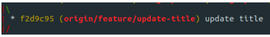
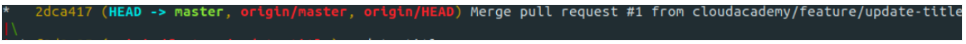

# Branching 

Git allows you to store different versions of code in multiple repositories. One of the main benefits of using git is the ability to store your code and its different versions in a distributed workflow, meaning one or more hosts can hold the entirety of a git repo and its git history, to be shared and collaborated on by other developers. Many companies offer hosting for git-based software like this. GitHub is among the most widely-used websites where companies store version-controlled software using git.

## git branch 

Branches are widely considered one of the most useful things about Git because they allow you to safely edit files and only have them affect the codebase once you want them to. In this Lab Step, you'll learn about branches in Git and how to use them to safely work with a codebase.


```bash
git branch 
```

The git branch command will output a list of branches. Notice that right now, because you haven't created any other branches, there is only one branch in the output of your command. The default branch for any Git repository is usually master, though you can change which branch is the default if needed.

Note the * next to master. An asterisk in a git branch command tells you which branch you're currently checked out under. Think of the idea of checking out a branch as declaring which branch you'd like your code changes to take effect on. You're currently checked out to the master branch, so any changes you make will take effect on that branch until you check out another.

## git log 

```bash
git log --oneline 
```

The git log command shows you a few different useful things and the --oneline flag will display the output in a summarized, easy-to-read format. Start by noticing that there are several commits listed in the output. A Git log shows you a list of commits made to the repository. Also, notice that next to some commits is a parenthesized list containing one or more branches, such as master, origin/master, and origin/feature/update-title. That shows you the latest commit that any particular branch is associated with. This is one of the most important things about Git to learn: Branches can be considered moveable pointers to a commit.

Finally, to the right of any branch names is a commit message, which is a message you can pass when making a commit for others to see later.

```bash
git log --oneline --graph 
```

The --graph flag will show you a more detailed version of the git log command that includes a graphical representation of the course of your branches. Notice the origin/feature/update-title branch next to one of the commits:

  

Note how the commit that branch points to is split from the main branch on the far left (the master branch). This is where a commit was made that differentiated the origin/feature/update-title branch from the master branch. At this point, any changes made to this branch have not taken effect on the master branch.

Notice that in the next commit, the origin/feature/update-title branch rejoins the master branch. The description in that commit says Merge pull request #1 from cloudacademy/feature/update-title:

  

From this you can tell that the origin/feature/update-title branch was merged back into the master branch, meaning that the changes made in the origin/feature/update-title branch were incorporated into the master branch.

## git checkout 

```bash
git checkout -b add-about-page
```
```bash
* add-about-page
  master 
```

Note how both the add-about-page and the master branches point to the same commit still. That's because you haven't made any commits yet.

## git merge 

To merge your branch into the master branch, execute the following commands:

```bash
git merge add-about-page
```
```bash
Updating 2dca417..cc021b0
Fast-forward
 about.html | 0
 1 file changed, 0 insertions(+), 0 deletions(-)
 create mode 100644 about.html
ca-labs:~/example-git-repo$ git log --oneline
cc021b0 (HEAD -> master, add-about-page) add an about page
2dca417 (origin/master, origin/HEAD) Merge pull request #1 from cloudacademy/feature/update-title
f2d9c95 (origin/feature/update-title) update title 
```

Notice that you ran the git merge command from inside the master branch. The branch you run a merge command from is the branch that will accept the changes from another branch.

# git push

```bash
git push origin master 
```

Notice that after the git push command are the names of both your remote and a branch. Those two flags tell the git push command which remote to push to, as well as the contents of which branch to push. When you execute this command, it'll push any commits that the master branch of the designated remote doesn't currently have, making the remote's master branch resemble your local master branch.

## git remote

The git remote command shows a current list of your remotes, which are other repositories hosting the same codebase. You're able to push and pull code to and from any repository that allows access, which is the distributed nature of Git When you initially clone a repository, the repository's location becomes your first remote and is always named origin.

```python
additional_remote_url=git://ec2-35-92-160-141.us-west-2.compute.amazonaws.com/lab.git
git remote add second_remote $additional_remote_url
git remote 
```

These commands will grab and parse the Git URL of the second repository configured for this Lab and use it to add a new remote named second_remote. The git remote command will confirm that the new remote has been added.

## git restore 

Assuming you don't have the ability to undo your changes in a file editor, you still have the option in Git. Notice the message, use "git restore -- <file>..." to discard changes in working directory, in the output of the git status command. You'll try using this command to undo your changes in the next step.

```bash
git restore -- index.html 
```

## git reset
 
```bash
git reset --soft HEAD~1
```

Notice that the commit labeled "add new pages" has been removed from your log. 

The reset command you ran did a couple of things. HEAD~1 flag told the command to reset your current branch to 1 commit before its current one, effectively removing the last 1 commit.

The --soft flag told Git to perform a soft reset, meaning any file changes made between HEAD~1 and now are preserved. That's why you see your newly-created files still in a staging area. Alternatively, you can pass a --hard flag, which would discard all changes made between commits rather than keep them. In this case, this would delete the two new files. Keep in mind that hard resets are one of the few things in Git that you can't easily undo, so you should use it only with caution.