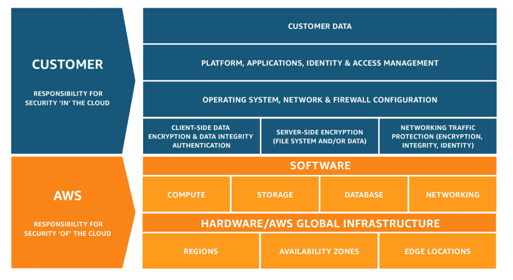
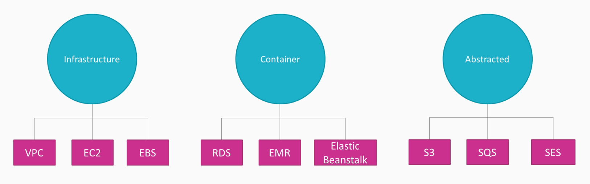
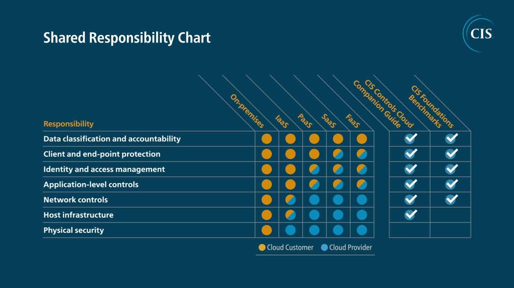

# AWS Security - Quick Starts

- [First Steps on Securing your AWS account](#first-steps-on-securing-your-aws-account)
- [AWS Own Security Practices](#aws-own-security-practices)
- [AWS Shared Responsibility Model](#aws-shared-responsibility-model)
- [AWS Config](#aws-config)
- [AWS CloudTrail](#aws-cloudtrail)
- [Data Control](#data-control)

## First Steps on Securing your AWS account

- Enable multi-factor authentication (MFA)
- Enable Cloudtrail for auditing 
- Use IAM for every future action 

 ## AWS Own Security Practices 

Resources:

- [AWS Cloud Security Portal](https://aws.amazon.com/security/)
- [AWS Cloud Compliance Portal](https://aws.amazon.com/compliance/)

    - PCi 
    - DSS Compliant
    - ISO 27001
    - HIPAA

## AWS Shared Responsibility Model 

Security and compliance is a shared responsibility between AWS and the customer.

- AWS is responsible for the security "of" the cloud 
- customer is responsible for the security "in" the cloud

**Security of the Cloud**

- Protection of infrastructure that run all the offered services 
- Hardware, software, networking, and facilities 
- Software services provided by AWS (Managed services)

**Security in the Cloud**

- Responsibility and management of:
    - guest OS of EC2 compute instances
    - other application software
    - configuration of the AWS provided security group firewall 

AWS categorized the services into three:

Shared responsibility chart:

## AWS Config 

Records and evaluate configurations of your AWS resources.

- assess, audiit, and evaluate configurations 
- continuously monitors and records your AWS resource configurations 
- allows to automate evaluation of recorded configurations against their desired configurations

## AWS CloudTrail 

Track user activity and API usage.

- enables governance, compliance, operational auditing, adn risk auditing og your AWS account
- log, continuously monitor, and retain account activity related to actions across your AWS infrastructure
- provides event history of your AWS account activity

## Data Control 

How data is being encrypted.

- **AWS KMS**
    - Multi-tenant
    - Shared service 

- **AWS CloudHSM**
    - Dedicated cluster where you can store encrytion keys
    - Isolation up to the physical layer
    - Strong compliance requirement

## Next Steps 

- [AWS IAM](../004-AWS/104_aws_iam.md) 
- [AWS Organizations](../004-AWS/104_aws_iam.md) 
- [Amazon Cognito](../004-AWS/104_aws_iam.md) 
- [Directory Services](../004-AWS/104_aws_iam.md) 
- [Identity Federation](../004-AWS/104_aws_iam.md) 
- [AWS Systems Manager (SSM)](../004-AWS/102_infra_security.md)
- [NACLs and Security Groups](../004-AWS/102_infra_security.md)
- [Amazon CloudWatch](../004-AWS/103_logging_and_monitoring.md)
- [Amazon CloudTrail](../004-AWS/103_logging_and_monitoring.md)
- [AWS Config](../004-AWS/103_logging_and_monitoring.md)
- [AWS Inspector](../004-AWS/103_logging_and_monitoring.md)
- [AWS GuardDuty](../004-AWS/103_logging_and_monitoring.md)
- [AWS Trusted Advisor](../004-AWS/103_logging_and_monitoring.md)
- [Key Management Service](../004-AWS/105_aws_data_protection.md)
- [AWS Secrets Manager](../004-AWS/105_aws_data_protection.md)
- [AWS Systems Manager Parameter Store](../004-AWS/105_aws_data_protection.md)
- [AWS Macie](../004-AWS/105_aws_data_protection.md)
- [AWS Artifact](../004-AWS/106_Managing_incident_response.md)
- [AWS Certificate Manager](../004-AWS/105_aws_data_protection.md)
- [AWS WAF](../004-AWS/106_Managing_incident_response.md)
- [AWS Shield](../004-AWS/106_Managing_incident_response.md)
- [AWS Shield Advanced](../004-AWS/106_Managing_incident_response.md)