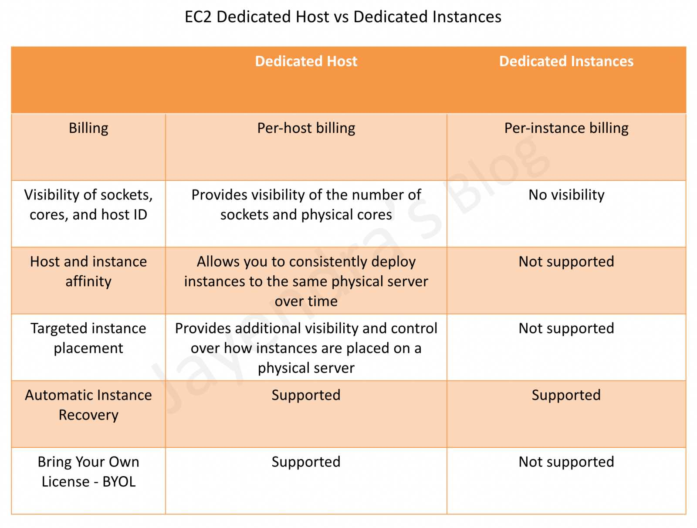
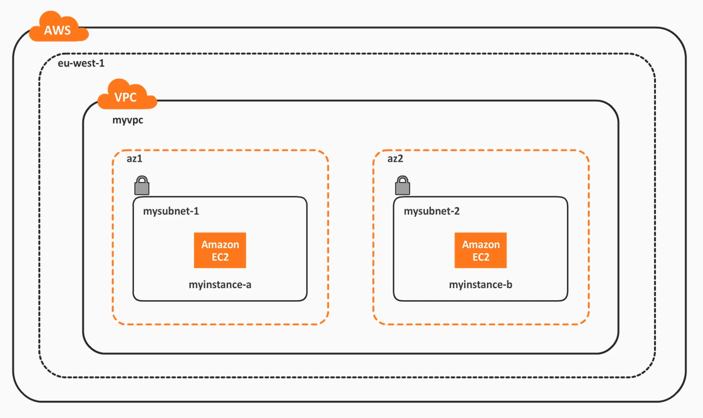
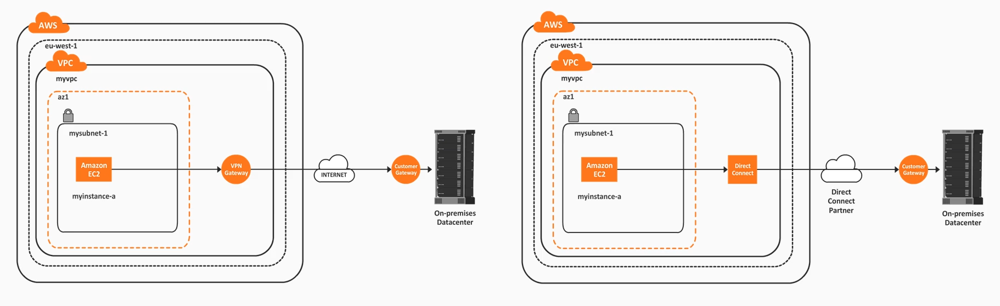

# Infrastructure Security 

- [EC2 Keypairs](#ec2-keypairs)
- [Hypervisors, Isolation, and Dedicated Instances](#hypervisors-isolation-and-dedicated-instances)
    - [Hypervisors](#hypervisors)
    - [Isolations](#isolations)
    - [Dedicated Hosts vs. Dedicated Instances](#dedicated-hosts-vs-dedicated-instances)
- [AWS Secrets Manager](#aws-secrets-manager)
- [AWS Systems Manager - SSM](#aws-systems-manager-ssm)
    - [AWS Systems Manager: Parameter Store](#aws-systems-manager-parameter-store)
    - [AWS Systems Manager: Run Command](#aws-systems-manager-run-command)
- [AWS VPC](#aws-vpc)
    - [NACLs vs. Security Groups](#nacls-vs-security-groups)
    - [VPC Connecitivity Options](#vpc-connecitivity-options)
- [AWS Marketplace Security Products](#aws-marketplace-security-products)


## EC2 Keypairs 

Keypairs are used to interact with EC2 instances without entering any username or passwords. 

- [Amazon EC2 key pairs and Linux instances](https://docs.aws.amazon.com/AWSEC2/latest/UserGuide/ec2-key-pairs.html)
- [Create key pairs](https://docs.aws.amazon.com/AWSEC2/latest/UserGuide/create-key-pairs.html)

To connect to the EC2 instance using the generated/downloaded keypair:

```bash
ssh -i keyfile.pem ec2-user@10.1.2.3 
```

**Change permissions**
When you first generate a keypair in the AWS console and download it locally, the default permissions of the keypair is **777**. When you use it to connect to the EC2 instance for the first time, you'll get prompted with an error:

```bash
WARNING: UNPROTECTED KEY FILE! 
```
To change the permissions, use the command below. **400** permissions means only the owner can use it. 

```bash
sudo chmod 400 keyfile.pem 
```

**Generating keypair locally**
We can also generate a keypair from any Linux machine using the command below.

```bash
ssh-keygen -t rsa -n 4096 
```

This will generate a key pair:

- private key (only you should have it)
- public key (can be shared with anyone)

We can then import the public key onto the EC2 menu. To learn more, see:

- [Import the public key to Amazon EC2](https://docs.aws.amazon.com/AWSEC2/latest/UserGuide/create-key-pairs.html#how-to-generate-your-own-key-and-import-it-to-aws)
- [man ssh-keygen.](https://man7.org/linux/man-pages/man1/ssh-keygen.1.html)

**Invalidate the key**
When you delete the keypair in the EC2 menu, it will only prevent any future usage of that key. However if you have existing instances that use that keypair, the keypair can still be used to connect to those instance.

To fully revoke the keypair, login to any machines that are using the keypair and delete the key from the machine:

```bash
sudo vi ~/.ssh/authorized_keys  
```

## Hypervisors, Isolation, and Dedicated Instances

### Hypervisors

This is the engine that sits on top of physical machines which allows us to run virtual machines on top of the machines.

- Xen is the hypervisor used by most instance types
- newest types uses KVM
- guest OS run as either of the two:
    - Paravirtualization (PV)
    - Hardware Virtual Machine (HVM) - recommended

### Isolations 

The hypervsor can only be accessed by AWS administrators when there is a valid business case.

- access is heavily scrutinized, logged, audited, and revoked afterwards
- in this setup, there is full control over virtual machines 
- AWS does not have access to the virtual machines
- when VM is terminated, guest memory is scrubbed 

### Dedicated Hosts vs. Dedicated Instances 

A dedicated instance may or may not share the physical host with shared instances, from the same AWS account. 

- gives you dedicated hardware, but shared instances can still run in same host
- shared instances can still be deployed in the same underlying hardware 
- billing is per instance

A dedicated host gives you control about instance placement in that physical host.

- gives you dedicated hardware 
- visibility over CPU cores, sockers, etc.
- billing is per host



## AWS Secrets Manager

AWS Secrets Manager allows you to store, encrypt, and rotate credentials and other types of secrets.

- automatic secret rotation
- built-in integration with AWS RDS
- secret rotation for non-AWS services using Lambda functions

Usage:

- Your application can fetch secrets from AWS Secrets Manager via API call 
- Secrets are encrypted in-transit and at-rest using KMS
- if automatic rotation is enabled, secret rotates immediately
- if secret is deleted, it will remain for 7 days before it is fully removed 

**AWS Secrets Manager vs. AWS Systems Manager Parameter Store**

AWS Secrets Manager:

- Database credentials, API keys, and passwords
- Encryption is enforced on all secrets
- Integration with AWS RDS 
- Automatic secret rotation for RDS
- Automatoc secret rotation for non-AWS services via Lambda 

AWS SSM Parameter Store

- Any parameter can be stored 
- Encryption is not mandatory 
- Integrated with AWS Systems Manager 

## AWS Systems Manager (SSM)

This allows you to centralize operational data from multiple AWS services and automate tasks across your AWS resources.

- Insights 
- Compliance
- Inventory
- Automation 

### AWS Systems Manager: Parameter Store 

We can use Parameter Store to store and retrieve any parameter, such as usernames, passwords, and API keys.

- can be in plain text or encrypted (SecureString)
- maximum size per parameter is 4KB (standard)
- maximum size for advanced is 8KB 
- no additional cost since integrated with AWS SSM
- built-in integration with different services

### AWS Systems Manager: Run Command 

This automation tool allows us to run a command in a given group of systems (manual or tag-based selection).

- SSM agent needs to be installed in the EC2 Instances
- can be used with on-premise servers
- commands can be issued through: 
    - AWS console
    - AWS CLI 
    - AWS SDKs
 
## AWS VPC 

Amazon Virtual Private Cloud (Amazon VPC) enables you to launch AWS resources into a virtual network that you've defined. This virtual network closely resembles a traditional network that you'd operate in your own data center, with the benefits of using the scalable infrastructure of AWS.

- a VPC can only be associated with one single AWS region 
- this means its is a regional-scope resource 
- you can have more than 1 VPC per region 
- can have one or more subnets (either public or private)
- a subnet is availability zone-scope within the same VPC region




### NACLs vs. Security Groups 

Network ACLs (NACLs) is applied into the entire subnet which serves as some sort of a firewall for the subnet.

- define incoming and outgoing connectivity

Security groups are applied on the specific instance.

- allowing connections via ports

### VPC Connectivity Options 

To enable internet connectivity:

- NAT Instance or NAT Gateway (connections within VPC)
- VPN or Direct Connect (connections to on-premise DC)

**A few notes on NAT Instances:**

- disable instance source/destination checks before using 
- must be in a public subnet
- requires a route from private subnet to the NAT instance
- amount of traffic depends on the instance type

See [Comparison of NAT Gateway and NAT Instances.](https://docs.aws.amazon.com/vpc/latest/userguide/vpc-nat-comparison.html)

**VPN vs. Direct Connect** 

VPN Gateway:

- Connectivity is established via VPN tunnel, on top of the internet 
- Use multiple parallel VPN tunnels for fault tolerance and HA
- Cheaper than Direct Connect 

Direct Connect 

- Dedicated connectivity is established via a partner
- Use-case: consistent network performance and increased BW throughput 
- More expensive than VPN Gateway

See [AWS Direct Connect + VPN.](https://docs.aws.amazon.com/whitepapers/latest/aws-vpc-connectivity-options/aws-direct-connect-vpn.html)



## AWS Marketplace Security Products

There are some capabilities that AWS does not offer as a feature, but is available through third-party vendors. These capabilities include:

- IDS/Network Packet Inspection 
- Penetration Testing

AWS does not provide network packet inspection, but we can utilize:

- VPC Flow Logs
- WAF Shield 
- EC3 with IPTables

Recommended wat is to use third-party solution such as:

- Trend Micro
- Alertlogic 

For penetration testing, this is allowed **for some AWS services without prior approval.** See [AWS Penetration Testing.](https://aws.amazon.com/security/penetration-testing/)