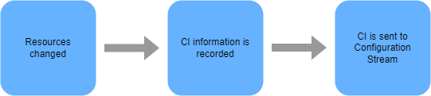
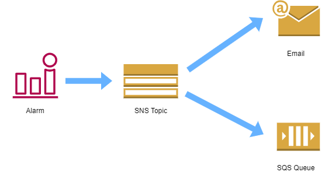
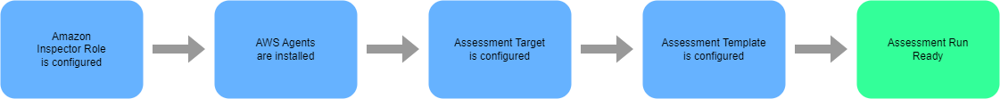

# Logging and Monitoring 


- [Logging options in AWS](#logging-options-in-aws)
- [Amazon CloudWatch](#amazon-cloudwatch)
    - [Main components:](#main-components)
    - [Getting started with CloudWatch](#getting-started-with-cloudwatch)
- [AWS CloudTrail](#aws-cloudtrail)
    - [Who did what and when](#who-did-what-and-when)
    - [Log File Integrity](#log-file-integrity)
    - [CloudTrail Process Flow](#cloudtrail-process-flow)
    - [Lifecycle of an API call in CloudTrail](#lifecycle-of-an-api-call-in-cloudtrail)
    - [CloudTrail Permissions](#cloudtrail-permissions)
    - [CloudTrail Logs](#cloudtrail-logs)
    - [CloudTrail Trails](#cloudtrail-trails)
    - [CloudTrail Log Files](#cloudtrail-log-files)
    - [Log Aggregation to a Single Account](#log-aggregation-to-a-single-account)
    - [Accessing Cross-Account Log Files](#accessing-cross-account-log-files)
    - [Monitoring](#monitoring)
    - [Similarities with other AWS services](#similarities-with-other-aws-services)
- [AWS Config](#aws-config)
    - [Use Cases](#use-cases)
    - [Key Components](#key-components)
        - [AWS resources](#aws-resources)
        - [Configuration Items](#configuration-items)
        - [Configuration Streams](#configuration-streams)
        - [Configuration History](#configuration-history)
        - [Configuration Snapshots](#configuration-snapshots)
        - [Configuration Recorder](#configuration-recorder)
        - [Config Rules](#config-rules)
        - [Resource Relationships](#resource-relationships)
        - [SNS Topics](#sns-topics)
        - [S3 Bucket](#s3-bucket)
        - [AWS Config Permissions](#aws-config-permissions)
- [Athena](#athena)
- [AWS Inspector](#aws-inspector)
- [AWS GuardDuty](#aws-guardduty)
- [Trusted Advisor](#trusted-advisor)


## Logging options in AWS 

- **AWS CloudTrail** - user activity and API calls 
- **AWS Config** - Records configuration 
- **AWS VPC Flow Logs** - Network traffic in VPCs 
- **AWS CloudWatch** - Application logging and metrics

----------------------------------------------

## Amazon CloudWatch 

CloudWatch provides centralized logging and metrics for resources and applications.

- enables actions triggered by events
- stored permanently without using AWS S3, but can be exported
- CloudWatch agent can be installed and used for your application logging
- IAM policies can be used to restrict user actions in CloudWatch

### Main components:

- **CloudWatch**
    Dashboards, alarms, emtrics (both pre-defined and custom), and Notifications

- **CloudWatch Logs**
    Logs from certain AWS services and your own applications 

- **CloudWatch Events**
    Trigger actions based on rules created from system event data like API calls, AWS resources state, and Scheduled

- **CloudWatch Insights**
    Insight can be leveraged to search and analyze log data

### Getting started with CloudWatch

- Install CloudWatch agent in EC2
- Create a Log group in CloudWatch logs 
- Configure the CloudWatch agent to send logs into that log group

----------------------------------------------

## AWS CloudTrail 

CloudTrail automatically records user activity and deliver those logs for you. 

- Enable auditing, incident investigation, intrusion detection, and compliance
- almost all AWS services are supported, except AWS Sumerian
- can be enabled for the entire account 
- aggregation is possible across regions and accounts 
- usual S3 functionalities are possible
    - Notifications
    - Server Side Encryption (SSE) 
    - Bucket Policies 
    - Lifecycle 

### Who did what and when

- records metadata around API calls 
- identifying the caller (user and source IP)
- date and time of events
- request/response data 

### Log File Integrity

We can verify that log files have remain unchanged since CloudTrail delivered them to the S3 bucket. 

- log file validation can be configured during the Trail creation. 
- a hash value is created for each log file
- log files can be shipped with a digest file 
- digest files contain details of all logs delivered within the last hour
- digest files can be used to validate the integrity of log file 
- digest fiels are stored in the same bucket as log files 
- these digests are signed by private key of a public and private keypair

Note that verification of the log file integrity can only be achieved via programmatic access and not through the console. This can be done through AWS CLI:

```bash
aws cloudtrail validate-logs --trail-arn <trailARN> --START-TIME <start-time> 
```

We can also add additional parameters:

```bash
aws cloudtrail validate-logs --trail-arn <trailARN> --START-TIME <start-time> \
--end-time <end-time> \
--s3-bucket <bucket-name> \
--s3-prefix <prefix> \
--verbose 
```

Digest file folder structure in the S3 bucket:

```bash
S3-bucket-name/AWSLogs/accounID/CloudTrail-Digest/Region/digest-end-year/digest-end-month/digest-end-date/ 
```

### CloudTrail Process Flow 

1. Create a Trail.
2. Specify an S3 bucket for log storage.
3. Optional - Encrypt log files with KMS.
4. Optional - Notifications of new log files via SNS. 
5. Optional - Enable log file validation.
6. Once trail is created, we can add configuration change.
7. Optional - Deliver CloudTrail logs to CloudWatch for monitoring.
8. Optional - Configure Event Selector for Management/Data
9. Optional - Add any required tags.
10. Configuration is complete. 

Once data is captured, we can find particular events quickly through the use of **API Activity Filters.**

### Lifecycle of an API call in CloudTrail 

1. IAM user or service calls an API.
2. CloudTrails checks if the API call matches any configured trail.
3. If a match is found, API call is recorded as an event on the log file.
4. Event on log file can be delivered to an S3 bucket or CloudWatch Logs.
5. In the 3 bucket, log files are sotred and encrypted by default by SS3 unless KMS is configured.
6. If lifecycle rules are configured, log files may be stored on a different storage class or AWS Glacier.

### CloudTrail Permissions 

Currently there are two AWS Managed policies for CloudTrail:

- AWS CloudTrailFullAccess 
- AWSCloudTrailReadOnlyAccess

Custom permissions can be created by creating a new IAM policy and applying some of the permissions instead fo providing full access to CloudTrail.

KMS adds another layer of ecnryption to Log files, in addition to the default encryption that uses SS3-S3 encryption. If the logs in the S3 bucket have been encrypted using KMS, specific permissions are needed to decrypt the logs: 

- Decrypt permissions must be given to the CMK policy 
- S3 read permissions 

Note that the KMS key and bucket needs to be in the same region.

### CloudTrail Logs 

- Logs all API Calls as "event" 
- Logs can be delivered to an S3 bucket 
- Requests can be initiated from:
    - Software Development Kits (SDKs)
    - AWS CLI 
    - AWS Management Console 
    - Another AWS service
- New log files are created every 5 mins
- Log files can be stored for as long as required
- Log files can also be delivered to CloudWatch Logs for metric monitoring and alerting via SNS

### CloudTrail Trails 

Without a Trail, AWS CloudTrail is unable to capture API calls.

- trails hold the config information for capturing API calls
- can be created through the AWS Management console

### CloudTrail Log Files 

Log Files are written in JSON format and new log files are created every 5 mins.

- everytime a new event is captured, it is recorded to the log file
- a new event is written for each API call 
- logs are delivered approximately after API was initiated
- log files are held in CloudTrail for processing and then delivered to the S3 bucket

Log file naming convention:

```bash
AccountID_CloudTrail_RegionName_YYYYMMDDTHHmmZ_UniqueString.FilenameFormat 
```

- Note that the "THHmmZ" is the time and the "Z" means the time is in UTC.
- the "UniqueString" is a random 16-digit alphanumeric character as identifier 
- default format is json.gz 

As for the S3 bucket where the log files are stored, it also follows an S3 Bucket structure:

```bash
BucketName/prefix/AWSLogs/AccountID/CloudTrail/RegionName/YYYY/MM/DD 
```

### Log Aggregation to a Single Account 

Logs from multiple accounts can be aggregated to a single S3 bucket in one of the accounts. 

1. Configure a new Trail in your primary AWS account.
2. Apply permissions to S3 bucket allowing cross-account access.
3. Edit the resource attribute of bucket policy and add the accounts that need access to the bucket.

    ```bash
    "Resource": {
        "arn:aws:s3:::bucket-name/[optional]logFilePrefix/AWSLogs/111111111111",
        "arn:aws:s3:::bucket-name/[optional]logFilePrefix/AWSLogs/222222222222",
        "arn:aws:s3:::bucket-name/[optional]logFilePrefix/AWSLogs/333333333333"
    }
    ```

4. Create a new trail in the secondary AWS account and use a bucket from a different account.

5. Once trail is created, logs will now be delivered to the same S3 bucket in your primary account.


### Accessing Cross-Account Log Files  

For users/administrators in the secondary accounts to access the log files that are aggregated to the S3 bucket in the primary account, we need to configure a few elements in IAM:

1. In the primary account. create IAM roles for each of the AWS account.
2. Assign access policy to each Role that allows only a specific Account access.
3. Users in the requesting account will need to assume one of these Roles for their corresponding AWS account log files.

### Monitoring 

Common monitoring use-cases:

- starting, stopping, rebooting, and terminating EC2 instances 
- changes to security policies within IAM and S3 
- failed login attempts to the Management Console 
- API calls that result in failed authorization 

CloudTrail + CloudWatch Process:

1. Log file sent to S3 and CloudWatch log group (if configured)
2. CloudTrail assumes Role with permission to run two CloudWatch APIs:
    
    - CreateLogStream 
    - PutLogEvents 

Default IAM role created by cloudtrail:

```bash
CloudTrail_CloudWatchLogs_Rule 
```

CloudWatch Configuration:

- CloudWatch Log Events have a size limitation of 256KB
- Metric Filters can be added to allow search of the logs 
- Each metric filter requires customizable Filter pattern
- Filter patters determines what data is monitored by CloudWatch 


### Similarities with other AWS services

- CloudTrail, Config, and VPC flow logs are AWS managed services
- all can be delivered to an S3 bucket 
- their differences:
    - **AWS CloudTrail** - User activity and API calls 
    - **AWS Config** - Configuration of your environment 
    - **AWS VPC Flow Logs** - Network traffic in VPCs 


----------------------------------------------

## AWS Config

Common resource management questions:

- What resources do we have?
- Which devices are performing functions?
- Do we have resources that are no longer needed and can we switch them off? 
- What are the status of the current configurations?
- Are there any security vulnerabilities? 
- How are the resources linked within the environment?
- Do we have a history of the changes in the resources? 
- Is the infrastructure compliant with specific governance controls? 
- Do we have accurate auditing information?

AWS Config is designed to record and capture resource changes within your environment, allowing you to perform a number of actions against the data that helps to find answers to the questions that we highlighted previously. Main features include:

- Capture resource changes 
- Act as a resource inventory 
- Store configuration history 
- Provide a snapshot in time of configurations 
- Notifications about changes
- Provide AWS ClousTrail integration 
- Rules to check compliancy 
- Perform security analysis 
- Identify relationship between resources

**AWS Config is region-specific**, which means that if you have resources in multiple regions, you will have to configure AWS Config for each region you want to record resource changes for. When doing so, you are able to specify different options for each region.

For services that are not region-specific such as IAM, there is also an option to record global-scoped resources.

### Use Cases 

**Security Compliance**. AWS Config can be a great tool, when enforcing strict compliance against specific security controls.

- Be notified of noncompliant resources to protect internal and external customer data. 
- Services are continually monitor and checked to remain compliant throughout its life cycle.

**Discovery of Resources**. When you first activate AWS Config, or run the configuration recorder, AWS Config will discover all supported resources types, allowing you to view them from within the AWS Config dashboard. 

- A configuration item will be recorded for each
- Resources could also be found in the configuration history file on S3
- Allows you to perform some essential housekeeping within your network and VPC

**Audit Compliance**. As well as using AWS Config for being compliant for internal security standards, there are also many external audit and governance controls, where the service can also enforce specific controls on resources to maintain compliance. 

- Health Insurance Portability and Accountability Act, known as HiPAA 
- Payment Card Industry Data Security Standard, known as PCI DSS. 

These programs require strict controls in many different areas. Being able to set custom and manage configurals in place help adhere to these external governance controls. In addition to this, you could show the auditors all of your configuration history files, which will allow them to go back to any point in time to check the configuration of any of your supported resources.

**Resource Change Management.** When planning changes within your infrastructure, it's often required that you have an understanding of what affect the change will have on other resources. 
- Resource relationshipd is not always known
- We are able to use the dashboard to list all related resources of a particular resource, 
- Allows us to plan our changes more effectively
- Prevent outages and configurational mistakes being made by having an overall better visual awareness of the environment.

**Troubleshooting and Problem Management.** AWS Config is a great tool to help you troubleshoot issues, that may arise within your environment. 

- See a timeline of events allowing you to go back to any point in time 
- Understand what changes happened on your supported resources. 
- See the changes made to the resource and make any amendments to resolve the issue
- Through AWS CloudTrail, we can see who or what triggered the change, via which API call

### Key Components
The following identifies the main components to the AWS Config service:

- AWS resources
- Configuration Items
- Configuration Streams
- Configuration History
- Configuration Snapshots
- Configuration Recorder
- Config Rules
- Resource Relationships
- SNS Topics
- S3 Bucket 
- AWS Config Permissions

#### AWS resources

These are objects that can be created, updated, and deleted from within the Management console or programmatically through the AWS CLI or SDKs.

#### Configuration Items

A configuration item or CI is comprised of a JSON file that holds the configuration information, relationship information, and other metadata as a point-in-time snapshot view of a supported resource. 

- All the information that AWS Config can record for a resource is captured within the CI.
- Created every time a supported resource has a change made to its configuration in any way.
- Record CIs for directly related resources to ensure change doesn't affect those resources too.
- CI is then sent to configuration stream

<p align=center>

</p>

Sections of a Configuration Item:

- Metadata - Version ID, Configuration ID, Time of capture, MD5 hash
- Attributes - Unique Resource ID, Key-value tags, Resource type, ARN
- Relationships - relationship of the recorded resource to the other resources
- Current Configuration - information for the resource
- Related Events - related AWS CloudTrail event ID


#### Configuration Streams

When new CIs are created, they are sent to a Configuration Stream which is in a form of an SNS topic. This stream is used on events like:

- When configuraiton history files are delivered
- When configuration snapshots are started
- When state of compliance changes for a resource  
- When evaluations for rules are started  
- When AWS Config fails to dleiver notifications

The SNS topic can have different notification endpoints;

- Email notification
- SQS 


#### Configuration History

The configuration history uses configuration items to collate and produce a history of changes to a particular resource. This allows you to see the complete set of changes made to a resource over a set period of time.

The information can be accessed  AWS CLI using the following command:

```bash
aws configservice get-resource-config-history 
```

This could also be accessed via the AWS Management Console. A configuration history file for each resource type is sent to a S3 bucket that is selected during the set up of AWS Config. 
- Typically delivered every six hours
- Contains all CI changes for all resources of a particular type.  
 
#### Configuration Snapshots 

The configuration snapshot takes a point-in-time snapshot of all supported resources configured for that region. It will then generate CIs for each resource in your AWS account for a specific region, and this configuration snapshot can then be sent to an S3 bucket. Alternatively, this information can be viewed via the AWS Management Console.


#### Configuration Recorder

This can be seen as the engine of the service as it is responsible for recording all of the changes to the supported resources and generating the configuration items. 

- Automatically enabled by default and started when you first configure AWS Config. 
- Can be stopped and then restarted again at a later point. 
- When stopped, AWS Config will no longer track and record changes to your supported resources.


#### Config Rules

AWS config rules enforce specific compliance checks and controls across your resources, and allows you to adopt an ideal deployment specification for each of your resource types. 

- Each rule is a lambda function that evaluates resources and carries out some simple logic to determine the compliance result with the rule. 
- Each time a change is made to one of your supported resources, AWS Config will check the compliance against any config rules that you have in place. 
- If there was a violation against these rules, then AWS Config will send a message to the configuration stream via SNS and the resource will be marked as non-compliant. 

It's important to note that marking a resource as non-compliant does not mean the resource will be taken out of service or it will stop working. It will continue to operate exactly as it is with its new configuration.

AWS Config simply alerts you that there is a violation, and it's up to you to take the appropriate action. 

- Rules can be custom defined, or selected from a predefined list of AWS managed rules 
- Custom-defined rules allows you to adopt internal best practices
- Predefined rules can also be modified to make subtle parameter changes as needed
- 50 config rules per region, but can raise a request to AWS to increase limit 

Examples of predefined rules that AWS have created:

- **Rds-storage-encrypted**
This checks whether storage encryption is activated by your RDS database instances. 

- **Encrypted-volumes**
This checks to see if any EBS volumes that have an attached state are encrypted. Optionally you can specify the ID of a KMS key to use to encrypt the volume. 

- **Root-account-mfa-enabled**
This checks whether your root account of your AWS account requires multifactor authentication for console sign in. 

- **IAM-user-no-policy-check**
This checks that none of your IAM users have policies attached. Best practice dictates that permissions should be provided via roles or groups.

When creating or modifying rules:

- Identify the compliance and standards that we need to adhere to 
- Define requirements from all parties 
- Create/modify the rules

#### Resource Relationships

AWS Config identifies relationships with other resources from a specific resource. As an example, it might be the EC2 instance that the volume is attached to. 

- Builds a logical mapping of resources and how they connect. 
- Allows you to see linked resources to view their configuration history and CI data. 
- Useful if you're trying to troubleshoot an issue and pinpoint where the source

#### SNS Topics

An SNS topic is used as a configuration stream for notifications of various events triggered by AWS Config. You can have various endpoints associated to the SNS stream. Best practice indicates that you should use SQS and then programmatically analyze the results via SQS. 


<p align=center>

</p>


#### S3 Bucket 

The S3 bucket that was selected at the time of configuration is used to store all the configuration history files that are generated for each resource type, which happens every six hours. Also, any configuration snapshots that are taken are also stored within the same S3 bucket. 

The configuration details used for both SNS and S3 are classed as the AWS Config delivery channel by which data can be sent to other services.

#### AWS Config Permissions

When setting up AWS Config, you're required to select an IAM role. This role is required to allow AWS Config to obtain the correct permissions to carry out and perform a number of functions. 

For example, AWS Config will need read-only access to all the supported resources within your account so it can retrieve data for the configuration items. Also, we now know that AWS Config uses SNS and S3 both for streams and storage of the configuration history files and snapshots. So AWS Config requires the relevant permission to allow it to send data to these services.

---------------------------------------------

## AWS Inspector

It is an automated security assessment service that can help you improve the security and compliance of applications deployed in AWS.

- automatically discovers vulnerabilities and deviations from best practices
- assessment templates can be created based on rule packages
- these rules tell Inspector what it needs to test your resources against
- assessement report can be downloaded in either HTML or PDF format

Assessments are based on best practices and known security weaknesses covering:

- Common vulnerabilities and Exposures (CVEs)
- Center for Internet Security (CIS) Benchmarks 
- Security Best Practices 
- Runtime Behavior Analysis 

### Agent Based

Amazon Inspector requires software agents to be installed on any EC2 instance that you want to assess. This makes it an easy service to be configured and added at any point to existing resources already running within your AWS infrastructure. This helps Amazon Inspector to become a seamless integration with any of your existing security processes and procedures as another level of security.

### Types of assessments

- Network assessments - check for ports reachable from outside the VPC
- Host assessments - check for vulnerabilities in software (CVE)
- Security best practices for configuration

### Assessment report sample


### How to get started

- Install the AWS Inspector agent in your EC2 instances
- Create an assessment target using tags (which to inspect?)
- Create an assessment template (What rules to run?)
- Execute the assessment run 
- Review all findings

### Key Components 

Amazon Inspector has the following components and elements: 

- Amazon Inspector Role
- Assessment Targets
- AWS Agents
- Assessment Templates
- Rule Packages
- Assessment Runs
- Telemetry
- Assessment Reports
- Findings

#### Amazon Inspector Role

When you first start using Amazon Inspector, you are required to create or select a role to allow Amazon Inspector to have read-only access to all of your EC2 instances. Without this role, the service would not have the relevant permissions to be able to gather the telemetry data of the instance during any assessment runs.

If you allow Amazon Inspector to create a role, then it will have a policy attached as detailed below:

```json 
{
    "Version": "2012-10-17",
    "Statement": [
        {
            "Effect": "Allow",
            "Action": [
                "ec2:DescribeInstances"
            ],
            "Resource": [
                "*"
            ]
        }
    ]
} 
```

This allows the role to have read-only access to all EC2 instances within your AWS account. For more information on IAM and IAM roles, please see our existing course here. Assessment Targets.

#### Assessment Targets

An Assessment Target is a grouping of AWS EC2 instances that you want to run an assessment against. This grouping of EC2 instances are managed and defined by the tags that are associated to your EC2 instance. **Tagging** is simply a way of adding metadata to your instances to help with management and organization, consisting of a key value pair.

When creating an assessment target, you are asked to select which keys from your tags that you would like to include within your Assessment Target. You can also refine your selection even further by providing the values for each of those keys, too. 

The EC2 instances are not required to contain both keys to be included within this Assessment Target. Only a match of one key is necessary. AWS Agents.

#### AWS Agents

AWS Agents are software agents that must be installed on EC2 instances that you with to monitor and run the assessments on. Without this agent, Amazon Inspector would not be able to perform the analysis that it needs to. 

Once installed, the agent will be able to track and monitor data across the network file system, and any process activity of the instance. This data is then recorded as telemetry data, and is fed back to the Amazon Inspector service via the public endpoint of the service over a  TLS-protected channel (Transport Layer Security).

A regular heartbeat is sent from the agent to Inspector, which the Inspector service will respond to with instructions, such as to perform an assessment at a particular time. 

As the Agent is software-based, it is necessary from time to time to update the agent with the latest version. These new updates are managed and automatically installed by AWS, and so you don't need to worry about the latest Agent software version.

#### Assessment Templates

An assessment template defines a specific configuration as to how an assessment is run on your EC2 instances. These configurable items within the template include the following.

- Rules packages to be used during the assessment
- Duration of the assessment run, which can be:
    - 15 minutes
    - 1 hour (recommended)
    - 8 hours
    - 12 hours
    - 24 hours
- Specific SNS topics notifications
    - when assessment starts
    - when it finishes
    - when it changes state
    - when findings are reported.

- Attributes that can be assigned to findings generated by the assessment. 

Once your assessment template is created, you are not able to modify it again to make changes. You can, however, tag your assessment templates to help with the organization and management of your assessment runs. 

#### Rules Packages

When Amazon Inspector gathers telemetry during an assessment run, it will then compare this data against specific security rules to ascertain its compliance. And these rules are grouped together in what is known as a rules package. A rules package contains a number of individual rules that are each checked against the telemetry data back from the EC2 instance.

Each rule will also have an associated severity which will be one of the following:

- **High** - Highest severity level, should be looked at immediately and rectified

- **Medium** - Should be attended to in a timely manner

- **Low** - Need to be rectified, but the urgency is not as severe as medium or high.

- **Informational** - Describes a particular security configuration within your assessment target

The rule packages themselves are split across four different categories, these being: 

- Common Vulnerabilities and Exposures
- Center for Internet SecurityBenchmarks
- Security Best Practices
- Runtime Behavior Analysis

**Common Vulnerabilities and Exposures** 
The CVE is a publicly-known reference list of security threats that are well-documented. The rules used within this package will check the Assessment Target for exposure to any known security holes that would compromise the integrity, confidentiality, and availability of your EC2 instance.

Should any findings from an assessment be found against a CVE, it's recommended you visit this site and search for specific vulnerability ID to gather additional detailed information to help you resolve and mitigate the issue. To check which CVEs the rules within the rules package are performing an assessment against, you can visit the following link.

```bash
https://cve.mitre.org/ 
```

As new CVEs are found, they are added to this list by AWS, and the corresponding rules added to the rules package, preventing the need for you to stay up-to-date with the latest known security issues. 

**Center for Internet Security Benchmarks**
These benchmarks are continuously refined and used as global standards for best practices for protecting data and IT resources. AWS is a CIS Benchmarks member company, and Amazon Inspector's associated certifications can be found here:

```bash
https://www.cisecurity.org/partner/amazon-web-services/ 
```

The rules within this rule package help to assess security for the various operating systems. If any findings are made against this rules package, then similarly to the CVE list, you can visit the provided link to download the detailed description, explanation, and advice on how to mitigate the security issue found.

**Security Best Practices** 
This rules package looks for weaknesses in common security best practices. However, this only applies to Assessment Targets that are running the Linux operating system. At this stage, it's not possible to run this rules package on any target that has the marks of Windows OS. The following security checks are covered within this rules package.

- **Disable root login over SSH.** Checks if the SSH daemon is configured to allow login into your instances root. 
    
- **Support SSH version two only.** Checks if the instance is configured to run SSH protocol version one. 

- **Disable password authentication over SSH.** Checks if password authentication over SSH is configured.

- **Configure password maximum age.** Checks if a maximum age for a password has been configured on the instance. 

- **Configure password minimum length.** Checks if a minimum password length has been configured on the instance.

- **Configure password complexity.** Checks if the instance is using a password complexity mechanism for passwords.

- **Enable ASLR.** Checks if address space layout randomization is enabled.

- **Enable DEP.** Checks if data execution prevention is enabled on the instance.

- **Configuration permissions for systems directories**. Ensures that only the root user has right access to system directories. 


#### Assessment Run

As assessment run can happen once you have configured your Amazon Inspector role, installed the agents and configured your Assessment Target and Assessment Templates. Once these components are in place, you are then able to run the configured assessment on your assessment targets. This process is known as the **assessment run.**

<p align=center>

</p>

During this time, telemetry data will be sent back to Amazon Inspector and S3 to assess the data against the specified rules packages defined within the assessment template

- Multiple assessment runs can be run at the same time, but only if the assessment targets do not have any duplicated EC2 instances within them.

- It is possible to view the progress of the run in addition to stopping, starting, and deleting the run. 


#### Telemetry

Telemetry is a data that is collected from an instance, detailing its configuration, behavior and processes during an assessment run.

Once collected, the data is then sent back to Amazon Inspector in near-real-time over TLS where it is then stored and encrypted on S3 via an ephemeral KMS key. Amazon Inspector then accesses the S3 Bucket, decrypts the data in memory, and analyzes it against any rules packages used for that assessment to generate the findings.

After 30 days, this telemetry data is then deleted using a lifecycle policy attached to the dedicated Amazon Inspector S3 Bucket. 


#### Assessment Reports

On completion of an assessment run, it is possible to generate an assessment report which provides details on what was assessed, and the results of that assessment.

As this feature was only released at the end of April 2017, It's only possible to generate these reports for any assessment runs that were completed on or after the 25th of April, 2017. There are two different types of reports that you can generate: 

- Findings report - Contains only a subset of the full report.

    - summary of the assessment that took place
    - list of the EC2 instances that were within the assessment targets
    - rules packages that were used from within the assessment template
    - detailed report on any findings that occurred. 

- Full report - Contains all of the information from the findings report, in addition to a list of rules that were passed successfully for all the instances within the assessment target.

#### Findings

Findings are generated from the results of an assessment run. A finding is a potential security issue or risk against one of your EC2 instances within the assessment target. For each finding, an explanation of the issue is given, along with guidance on how to remediate the problem. 


### Service Limitatins 

These are the service limitations per account. Note that you can raise a request to AWS to increase the limits .

- 500 Agents per assessments
- 50,000 Assessment Runs
- 500 Assessment Templates 
- 50 Assessment Targets 

----------------------------------------------

## Athena

Athena is a serverless interactive query service which makes it easy to search and analyze data in AWS S3 using SQL.

- integrated with AWS Glue (data catalog)
- pay per query and per TB of data scanned 
- built on top of PrestoDB
- can query data stored in AWS S3
    - CloudTrail Logs
    - Application Logs
    - Business data 
- supported data format
    - CSV
    - JSON
    - ORC
    - Avro
    - Parquet 
- Typical use cases:
    - enable data-driven decision making
    - generate reports
    - analuze data without operatino overheads (serverless)

**How to get started**

- Create an S3 bucket with data in a supported format
- Create an Athena database  
- Create an Athen external table pointing to the S3 bucket
- Search data in Athena using normal SQL (Select)


----------------------------------------------

## AWS GuardDuty 

It is an intelligent threat detection service that uses AI/Machine Learning to monitor one or more AWS accounts for malicious behavior.

- leverages third-party feeds from cybersecurity partners
- automate response and alerting using CloudWatch and Lamdba
- monitors different sources of data:
    - CloudTrail
    - DNS 
    - VPC Flow logs 

    

**Use-cases**

- Reconnaissance
    - unusual API activity
    - unusual patterns of failed login requests

- Instance compromise
    - backdoor command and control (C&C) activity 
    - Outbound instance communication with known malicious IP

- Account compromise 
    - Attempts on disabling AWS CloudTrail logging
    - unusual instances/infrastructure launches 

**How to get started**    

- Easy activation via console
- If threat is detected, it will appear in GuardDuty dashboard and CloudWatch events 
- takes 7-14 days to set a baseline
- prices varies according to volume of data

----------------------------------------------

## Trusted Advisor

This AWS service provides guidance on how to provision resources following AWS best practices.

- help to reduce cost, increase performance, and improve security 
- seven core checks and recommendations by default 
- full set of checks only for business and enterprise support plans

**Use-cases**

- Provides best recommendations in five categories:
    - Cost optimization
    - Performance
    - Security 
    - Fault tolerance
    - Service limits

    