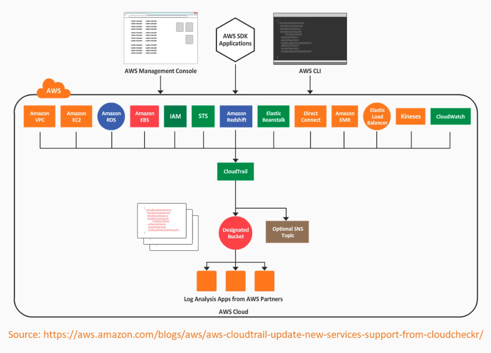
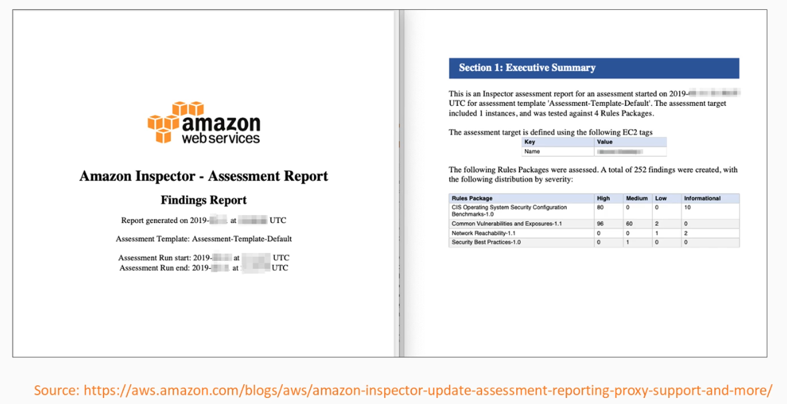
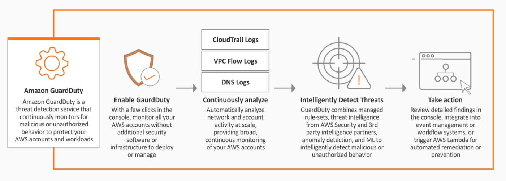
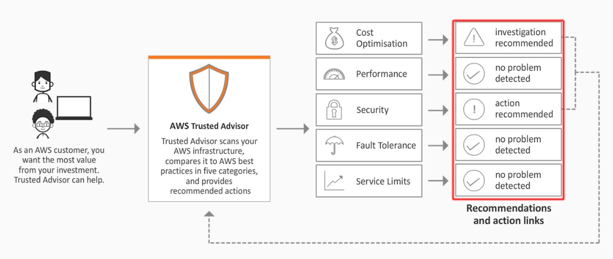

# Logging and Monitoring 

- [Logging options in AWS](#logging-options-in-aws)
- [CloudWatch](#cloudwatch)
- [CloudTrail](#cloudtrail)
- [Athena](#athena)
- [AWS Inspector](#aws-inspector)
- [AWS GuardDuty](#aws-guardduty)
- [Trusted Advisor](#trusted-advisor)

## Logging options in AWS 

- **AWS CloudTrail** - user activity and API calls 
- **AWS Config** - Records configuration 
- **AWS VPC Flow Logs** - Network traffic in VPCs 
- **AWS CloudWatch** - Application logging and metrics

## CloudWatch 

CloudWatch provides centralized logging and metrics for resources and applications.

- enables actions triggered by events
- stored permanently without using AWS S3, but can be exported
- CloudWatch agent can be installed and used for your application logging
- IAM policies can be used to restrict user actions in CloudWatch

**Main components:**

- **CloudWatch**: Dashboards, alarms, emtrics (both pre-defined and custom), and Notifications

- **CloudWatch Log**s: Logs from certain AWS services and your own applications 

- **CloudWatch Events** - Trigger actions based on rules created from system event data like API calls, AWS resources state, and Scheduled

- **CloudWatch Insights** - Insight can be leveraged to search and analyze log data

**Getting started with CloudWatch**

- Install CloudWatch agent in EC2
- Create a Log group in CloudWatch logs 
- Configure the CloudWatch agent to send logs into that log group

 ## CloudTrail 

CloudTrail automatically records user activity and deliver those logs for you.

- Logs all API Calls and can be delivered to an S3 bucket every 5 mins
- Enable auditing, incident investigation, intrusion detection, and compliance
- almost all AWS services are supported, except AWS Sumerian
- can be enabled for the entire account 
- usual S3 functionalities are possible
    - Notifications
    - Server Side Encryption (SSE) 
    - Bucket Policies 
    - Lifecycle 
- aggregation is possible across regions and accounts 

**Who did that and when**

- records metadata around API calls 
- identifying the caller (user and source IP)
- date and time of events
- request/response data 

**How to verify that logs are not tampered**

- log files can be shipped with a digest file 
- digest file can be used to validate the integrity of log file 

**Similarities with other AWS services** 

- CloudTrail, Config, and VPC flow logs are AWS managed services
- all can be delivered to an S3 bucket 
- their differences:
    - **AWS CloudTrail** - User activity and API calls 
    - **AWS Config** - Configuration of your environment 
    - **AWS VPC Flow Logs** - Network traffic in VPCs 

## Athena

Athena is a serverless interactive query service which makes it easy to search and analyze data in AWS S3 using SQL.

- integrated with AWS Glue (data catalog)
- pay per query and per TB of data scanned 
- built on top of PrestoDB
- can query data stored in AWS S3
    - CloudTrail Logs
    - Application Logs
    - Business data 
- supported data format
    - CSV
    - JSON
    - ORC
    - Avro
    - Parquet 
- Typical use cases:
    - enable data-driven decision making
    - generate reports
    - analuze data without operatino overheads (serverless)

**How to get started**

- Create an S3 bucket with data in a supported format
- Create an Athena database  
- Create an Athen external table pointing to the S3 bucket
- Search data in Athena using normal SQL (Select)
     
## AWS Inspector

It is an automated security assessment service that can help you improve the security and compliance of applications deployed in AWS.

- automatically discovers vulnerabilities and deviations from best practices
- assessment templates can be created based on rule packages
- these rules tell Inspector what it needs to test your resources against
- assessement report can be downloaded in either HTML or PDF format

**Types of assessments**

- Network assessments - check for ports reachable from outside the VPC
- Host assessments - check for vulnerabilities in software (CVE)
- Security best practices for configuration

**Assessment report sample**

**How to get started**

- Install the AWS Inspector agent in your EC2 instances
- Create an assessment target using tags (which to inspect?)
- Create an assessment template (What rules to run?)
- Execute the assessment run 
- Review all findings

## AWS GuardDuty 

It is an intelligent threat detection service that uses AI/Machine Learning to monitor one or more AWS accounts for malicious behavior.

- leverages third-party feeds from cybersecurity partners
- automate response and alerting using CloudWatch and Lamdba
- monitors different sources of data:
    - CloudTrail
    - DNS 
    - VPC Flow logs 

    

**Use-cases**

- Reconnaissance
    - unusual API activity
    - unusual patterns of failed login requests

- Instance compromise
    - backdoor command and control (C&C) activity 
    - Outbound instance communication with known malicious IP

- Account compromise 
    - Attempts on disabling AWS CloudTrail logging
    - unusual instances/infrastructure launches 

**How to get started**    

- Easy activation via console
- If threat is detected, it will appear in GuardDuty dashboard and CloudWatch events 
- takes 7-14 days to set a baseline
- prices varies according to volume of data

## Trusted Advisor

This AWS service provides guidance on how to provision resources following AWS best practices.

- help to reduce cost, increase performance, and improve security 
- seven core checks and recommendations by default 
- full set of checks only for business and enterprise support plans

**Use-cases**

- Provides best recommendations in five categories:
    - Cost optimization
    - Performance
    - Security 
    - Fault tolerance
    - Service limits

    