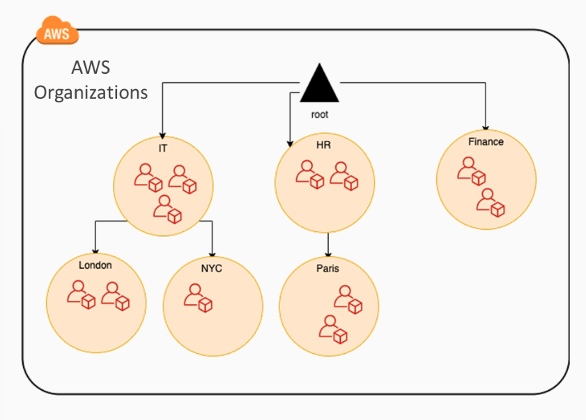
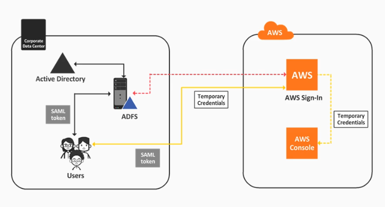

# AWS Identity and Access Management 

- [IAM for User and Group Management](#iam-for-user-and-group-management)
- [IAM Roles](#iam-roles)
    - [Service Roles](#service-roles)
    - [Service-linked Roles](#service-linked-roles)
- [IAM Policies](#iam-policies)
- [AWS Organizations](#aws-organizations)
- [Service Control Policies](#service-control-policies)
- [Policy Evaluation Logic](#policy-evaluation-logic)
- [Active Directory Federation within AWS](#active-directory-federation-within-aws)
- [AWS Cognito and Web Identity Federation](#aws-cognito-and-web-identity-federation)

## IAM for User and Group Management 

IAM is used to manage access to AWS services and resources securely through users, groups, and permissions to allow and deny access to AWS resources. Important concepts to know:

- Users 
- Groups 
- Roles
- Policies

Best practices:

- IAM users are not equal to Root users 
- Be extra cautious with root users 
- Avoid using the root account in your day to day activities 
- Always enable Multi-Factor Authentication (MFA)
- Never use access keys, and secret access keys  with the root account
- Enable identity federation (i.e. Active Directory, Google, etc.)
- Utilize granular permissions for IAM users 
- For temporary access, use AWS STS

## IAM Roles 

Roles are created and assigned to AWS resources. These roles grant resources some permissions to access other AWS resources.

### Service Roles

Allows you to apply your own customer-managed or AWS Managed policies.

- Allows AWS resources to assume a role and access other AWS resources
- can be attached to EC2 instances during creation or when it's running 

### Service-linked Roles 

Pre-configured with a specific set of read-only AWS-managed policies that can only be used by that particular service.

- perform functions requiring specific permissions
- roles are created during the first time you use the service
- comes with pre-built trust, permissions, and managed policies which cannot be modified

Examples of service-linked roles:

- **AWS ServiceRoleForAmaazonSSM** - used by AWS Systems Manager to manage resources on your behalf
- **AWS ServiceRoleForCloduTrail** - used by CloudTrail for managing your organizations' trail feature
- **AWS ServiceRoleForCloudWatchEvents** -used by CloudWatch to perform EC2 alarm actions

## IAM Policies 

An IAM Policy is a document that defines one or more permissions.

- **Identity-based Policies**

    - Can be attached to IAM Users, User Group, or Roles 
    - Types:
        - **Inline Policies**
            - Attached directly with one principal entity
            - not saved or stored in the policy library
            - Cannot be reused 
            - Cannot be attached and detached
        - **Managed Policies**
            - can be attached and detached from principal identities
            - these policies exist in all AWS accounts
            - types:
                - **AWS-Managed Policies**
                    - Standalone policy created and managed by AWS 
                    - Hard to follow the least privilege principle
                    - Cannot be modified by customer 
                - **Customer Managed Policies**
                    - Standalone policies created and managed by customer
                    - enables least privilege because its customizable
                    - requires customer effort to create and maintain them

- **Resource-based Policies**
    - similar to inline policies but are not attached to IAM users but instead a resource
    - policies defined at the resource-level, example:
        - S3 Bucket Policy
        - Trust Relationship Policy

- **Permission Boundaries**

    - Associated with user or role but they don't grant permission themselves
    - Instead, they define the maximum level of permissions that can be granted to an identity
    - policy configured for the boundary can be:
        - AWS-managed policy, or
        - customer-managed policy
    - permission boundaries always supersede identity-based policies

- **Organization Service Control Policies (SCPs)**

    - used by AWS Organizations
    - similar to permission boundaries, they don't grant permissions
    - they defined boundary of maximum permissions

## AWS Organizations

AWS Organizations is a managed services that allows you to centrally govern you environment as you grow and scale your workloads on AWS.

- Centrally manage billing through consolidated billing 
- Control access, compliance, and security
- Resources can be shared across AWS accounts
- Organize multiple AWS accounts into groups (OUs)
- Attach and detach policy-based controls (Service Control Policies)
- Govern maximum permissions granted to accounts or Organization Units (OU)
- SCPs can be viewed in the IAM menu but can only be modified through the AWS Organizations menu

## Service Control Policies 

These policies enable customers to centralize how they are using AWS services across multiple accounts.

- Can be used to create permission boundaries
- Applies to OU and accounts below the specified OU 
- Restrict access to AWS services 
- Restrict what IAM (or even root) users have access to 
- SCPs can only deny and not allow

## Policy Evaluation Logic 

Process:

1. User sending the request has to be authenticated as a valid user.
2. AWS checks the context of the request (e.g. what service, what actions).
3. AWS performs polcy evaluation to determine the level of access.
4. AWS provides a result based on the evaluated policies, whether allowed or denied. 

Policy Evaluation:

1. All access are DENIED by default.
2. Principal is checked if it has ALLOW access.
3. If a DENY access for the resources is defined, it will override ALLOW access on the resource.

Evaluation order of Policies:

1. Organizational SCPs 
2. Resource-based Policies 
3. IAM Permission Boundaries 
4. Identity-based Policies

For more details, check out [Policy evaluation logic](https://docs.aws.amazon.com/IAM/latest/UserGuide/reference_policies_evaluation-logic.html).

## Active Directory Federation within AWS 

AWS allows federation with your existing Active Directory by enabling your corporate credentials as your AWS sign-in.

- Minimal operational overhead by using existing accounts, groups, and policies 
- Single sign-on 
- Managing users can be done on the AD-level
- Seamless sign-in from the user's perspective
- Users can assume roles based on their AD group membership

**ADFS**
Active Directory Federation Service or ADFS provides the SSO and identity broker in Active Directory.

**SAML 2.0**
Open standard that enables the exchange of identity information between providers and applications. This also enables the SSO in AWS accounts.

**Two-way trust**
- For the integration to work, it needs a two-way trust 
- ADFS needs to be a trusted ID provider in AWS
- AWS is a trusted relying party in AWS 

**How it works:**
- User authenticates with ADFS/AD and receives a SAML token
- The token is exchanged for an AWS temporary credentials in the AWS sign-in endpoint
- This exchange is done via STSAssumeRoleWithSAML service 
- User is redirected to the AWS console 
- User will only be able to access resources that their role allow 
- Accounts are not replicated in AWS, they only reside in Active Directory 

## AWS Cognito and Web Identity Federation 

Amazon Cognito lets you add user sign-up, sign-in, and access control to your web and mobile apps quickly and easily. 

- scales to millions of users
-   supports sign-in with social identity providers, such as Facebook, Google, and Amazon, and enterprise identity providers via SAML 2.0 

**Cognito User Pool**
Manages user sign-in and sign-out directly or via web identity providers (same as identity broker)

**Cognito Identity Pool**
Enables identity creation for users and authentication with providers

**How it works:**

- Users sign-in directly to a user pool or indirectly via an identity broker (e.g. Amazon or Facebook)
- If authentication is successful, it will generate a JWT (JSON Web Token)
- The JWT can be used to get temporary AWS credentials with permissions to AWS resources
