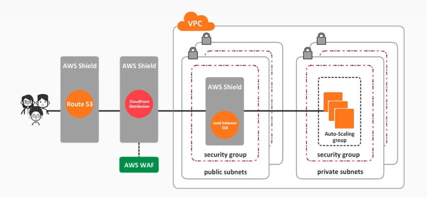
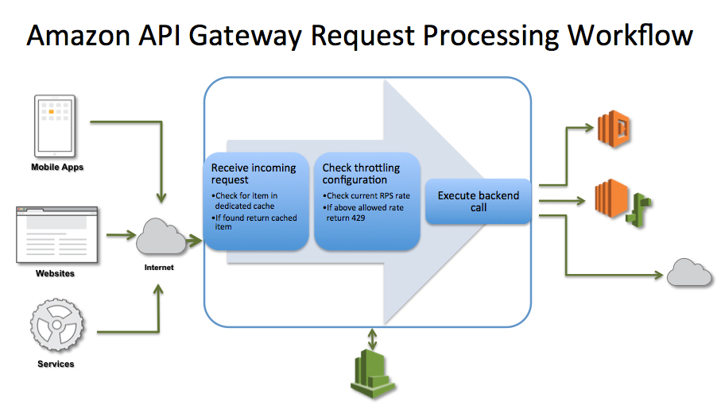

# Managing Incident Response 


- [Distributed Denial of Service DDoS Attack](#distributed-denial-of-service-ddos-attack)
- [AWS WAF, Shield, and Shield Advanced](#aws-waf-shield-and-shield-advanced)
    - [AWS WAF](#aws-waf)
    - [AWS Shield and Shield Advanced](#aws-shield-and-shield-advanced)
- [Throttling and Caching in API Gateway](#throttling-and-caching-in-api-gateway)
    - [Throttling](#throttling)
    - [Caching](#caching)
- [Compliance Requirements using AWS Artifact and Macie](#compliance-requirements-using-aws-artifact-and-macie)
    - [AWS Macie](#aws-macie)
    - [AWS Artifact](#aws-artifact)


## Distributed Denial of Service (DDoS) Attack 

The goal of this attack is to make your application unavailable to your users by flooding your application with requests to make the service unusable and drain your resources. Different techniques can be used:

- large botnets
- reflection 
- amplification 

**How are DDoS Attacks Mitigated**

- Decrease attack surface area:

    - Minimize the exposure 
    - Does the entry point need to be public 
    - Use VPC or other methods for private access 

- Enable scaling to absorb impact of an attack: 

    - Doesn't fix the attack but helps to tolerate attacks
    - Cost of scaling versus the revenue loss due to unavailability 

- Understand what normal behavior is and be prepared for attack:

    - Can you spot when something is happening?
    - Who do you contact?
    - How do you react?

**AWS Technologies that can help to mitigate DDoS attack**

- AWS WAF, Shield, and Shield Advanced 
- Route53 
- CloudFront 
- Elastic Loadbalancer 
- Autoscaling
- CloudWatch 

## AWS WAF, Shield, and Shield Advanced 

### AWS WAF 

AWS WAF is a web application firewall that helps to protect your web applications from common web exploits that could affect application availability, compromise security, or consume excessive resources.

- Can specify web security rules on which traffic to allow or block  
- Can create custom rules to block common attack patterns

### AWS Shield and Shield Advanced
 
Shield is a managed service that is enabled by default and works in conjunction with WAF which provides basic DDoS protection at no additional cost for AWS customers.

Shield Advanced is a paid version:

- 3000USD per month plus additional data transfer fees
- Cost protection and advanced capabilities 
- Advanced DDoS protection 
- 24/7 DDoS response team 
- More visibility and reporting

**How does it work**

- WAF integrates with application loadbalancers at a regional level 
- It also works with CloudFront at a global level
- WAF also allows geofencing to allow access from certain countries
- Can be configured in multiple ways:

    - **Allow all** - withe exceptions 
    - **Block all** - with exceptions 
    - **Count** the ones that match certain properties




## Throttling and Caching in API Gateway

As a recap, API Gateway is a fully managed service that makes it easy for developers to create, publich, maintain, monitor, and secure APIs at any scale.

- Creat REST and WebSocket APIs 
- Acts as front door for applications to access data, business logic, or functionality from your backend services

### Throttling 

The API Gateway Throttling feature prevents your API from being overwhelmed with too many requests.

- When exceeded, it returns a

    ```bash
    HTTP 429  TOO MANY REQUESTS 
    ```
- Allows you to configure how many requests your API can handle

    - request per second 
    - burst of requests 



### Caching 

This feature allows caching the endpoint response. 

- If a lot users request for the same object, API Gateway can cache the response which reduces the processing 
- Reduces latency 
- When enabled, TTL can be from 300 to 3600 seconds

## Compliance Requirements using AWS Artifact and Macie

### AWS Macie

AWS Macie is a security service that uses machine learning to automatically discover, classify, and protect sensitive data in AWS.

- recognize personally identifiable information (PII) or intellectual property 
- provides dashboards and alerts for more visibility into how data can be accessed or moved 
- monitors data access activity for anomalies, and generates detailed  alerts 
- available to protect data stored in S3 

### AWS Artifact

It is a go-to central resource for compliance-related information such as compliance reports and online agreements such as PCI-DSS, ISO 27001, and so on.