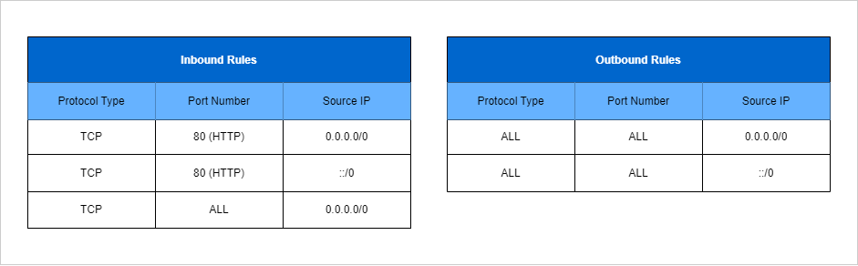
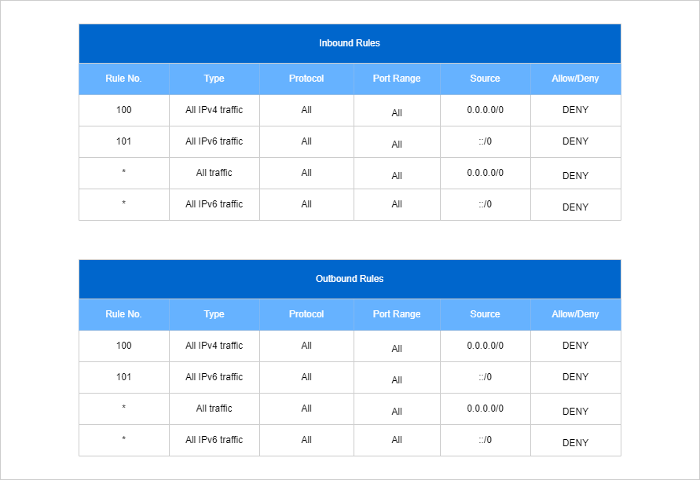
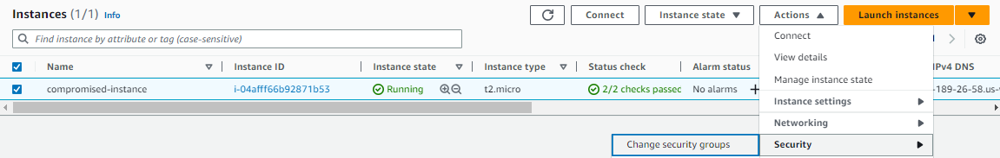
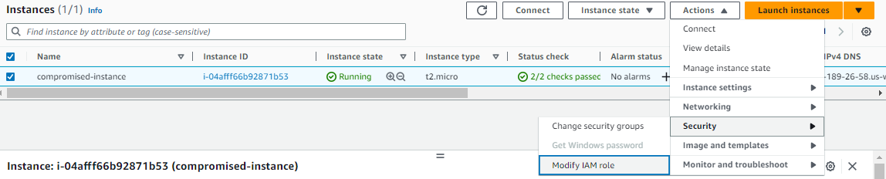
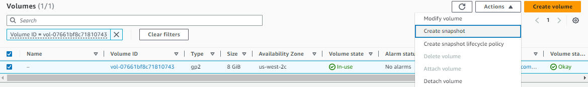
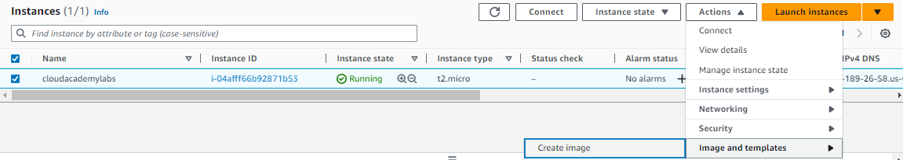

# Managing Incident Response 


- [Distributed Denial of Service DDoS Attack](#distributed-denial-of-service-ddos-attack)
- [AWS WAF, Shield, and Shield Advanced](#aws-waf-shield-and-shield-advanced)
    - [AWS WAF](#aws-waf)
    - [AWS Shield and Shield Advanced](#aws-shield-and-shield-advanced)
- [Throttling and Caching in API Gateway](#throttling-and-caching-in-api-gateway)
    - [Throttling](#throttling)
    - [Caching](#caching)
- [Compliance Requirements using AWS Artifact and Macie](#compliance-requirements-using-aws-artifact-and-macie)
    - [AWS Macie](#aws-macie)
    - [AWS Artifact](#aws-artifact)
- [Managing Incident Responses](#managing-incident-responses)
    - [Detection Mechanisms](#detection-mechanisms)
    - [Isolation](#isolation)
        - [Security Group Isolation](#security-group-isolation)
            - [Tracked vs. Untracked Connections](#tracked-vs-untracked-connections)
        - [NACL Isolation](#nacl-isolation)
        - [Route Table Isolation](#route-table-isolation)
        - [Internet Gateway Isolation](#internet-gateway-isolation)
    - [Compromised Instance Incident Run Book](#compromised-instance-incident-run-book)
    - [Incident Response Resources](#incident-response-resources)


## Distributed Denial of Service (DDoS) Attack 

The goal of this attack is to make your application unavailable to your users by flooding your application with requests to make the service unusable and drain your resources. Different techniques can be used:

- large botnets
- reflection 
- amplification 

**How are DDoS Attacks Mitigated**

- Decrease attack surface area:

    - Minimize the exposure 
    - Does the entry point need to be public 
    - Use VPC or other methods for private access 

- Enable scaling to absorb impact of an attack: 

    - Doesn't fix the attack but helps to tolerate attacks
    - Cost of scaling versus the revenue loss due to unavailability 

- Understand what normal behavior is and be prepared for attack:

    - Can you spot when something is happening?
    - Who do you contact?
    - How do you react?

**AWS Technologies that can help to mitigate DDoS attack**

- AWS WAF, Shield, and Shield Advanced 
- Route53 
- CloudFront 
- Elastic Loadbalancer 
- Autoscaling
- CloudWatch 

## AWS WAF, Shield, and Shield Advanced 

### AWS WAF 

AWS WAF is a web application firewall that helps to protect your web applications from common web exploits that could affect application availability, compromise security, or consume excessive resources.

- Can specify web security rules on which traffic to allow or block  
- Can create custom rules to block common attack patterns

### AWS Shield and Shield Advanced
 
Shield is a managed service that is enabled by default and works in conjunction with WAF which provides basic DDoS protection at no additional cost for AWS customers.

Shield Advanced is a paid version:

- 3000USD per month plus additional data transfer fees
- Cost protection and advanced capabilities 
- Advanced DDoS protection 
- 24/7 DDoS response team 
- More visibility and reporting

**How does it work**

- WAF integrates with application loadbalancers at a regional level 
- It also works with CloudFront at a global level
- WAF also allows geofencing to allow access from certain countries
- Can be configured in multiple ways:

    - **Allow all** - withe exceptions 
    - **Block all** - with exceptions 
    - **Count** the ones that match certain properties


## Throttling and Caching in API Gateway

As a recap, API Gateway is a fully managed service that makes it easy for developers to create, publich, maintain, monitor, and secure APIs at any scale.

- Creat REST and WebSocket APIs 
- Acts as front door for applications to access data, business logic, or functionality from your backend services

### Throttling 

The API Gateway Throttling feature prevents your API from being overwhelmed with too many requests.

- When exceeded, it returns a

    ```bash
    HTTP 429  TOO MANY REQUESTS 
    ```
- Allows you to configure how many requests your API can handle

    - request per second 
    - burst of requests 


### Caching 

This feature allows caching the endpoint response. 

- If a lot users request for the same object, API Gateway can cache the response which reduces the processing 
- Reduces latency 
- When enabled, TTL can be from 300 to 3600 seconds

## Compliance Requirements using AWS Artifact and Macie

### AWS Macie

AWS Macie is a security service that uses machine learning to automatically discover, classify, and protect sensitive data in AWS.

- recognize personally identifiable information (PII) or intellectual property 
- provides dashboards and alerts for more visibility into how data can be accessed or moved 
- monitors data access activity for anomalies, and generates detailed  alerts 
- available to protect data stored in S3 

### AWS Artifact

It is a go-to central resource for compliance-related information such as compliance reports and online agreements such as PCI-DSS, ISO 27001, and so on.

## Managing Incident Responses

As part of the incident response strategy, we should be able to appropriately contain compromised resources and perform the following:

- conduct forensic investigations
- remove harmful elements from the architectures
- recovery of any important data 

It is recommended to have an incident response playbook that provides a step-by-step guide of what to do when an incident occurs. 

**Isolation** is the concept of limiting the visibility and scope of an element so that its actions only affect itself. In case of EC2 instances, this means the instance will not be able to see other instances or nodes on the network, as well as not having the ability to reach out to the internet. 

### Detection Mechanisms 

To isolate EC2 instances, we can start with using detection mechanisms (**Amazon GuardDuty** and **Amazon Inspector**) to determine what is wrong.

**Amazon GuardDuty**

- Amazon GuradDuty is a threat detection service that continually monitors and protects your AWS accounts, workloads, and data.
- It monirots and analyzes your metadata streams that come from AWS CloudTrail Events and VPC flow logs and then use Machine Learning to watch for anomalies within your architectures
- If GuardDuty detects any threat such as compromised EC2 instances that have been set up to serve malware to your users, or to mine for bitcoin, it can send alerts which can be integrated with event management systems.

**Amazon Inspector**

- Amazon Inspector is an automated security service that can assess accessibility of the instance, as well as the security state of the applications running in the instances.
- We can automate security testing against our fleets to make sure they are all running according to plan.
- If it finds any issues, Inspector can notify you directly by email, or it can message any service that accepts SNS notifications.


### Isolation  

Once we found out what's wrong, we have a couple of ways to perform the actual isolation.

- Security Group Isolation
- NACL Isolation
- Internet Gateway Isolation
- Route Table Isolation

#### Security Group Isolation

If an instance has multiple active security groups that overlap, AWS will apply the most permissive rule. 

1. Leverage stateful feature, which means outbound traffic is automatically allowed, regardless of any inbound or outbound rules
2. Note that we can never shut off traffic to an EC2 instance by adding a security group, but we can dictate which specific traffic to allow. 
3. As correct measure, remove any existing security group from the instance or delete all rules of the security groups attached to the instance.
3. Once we removed the rules, attach a new blank security group to the instance to ensure no traffic is coming in or out of the instance.

##### Tracked vs. Untracked Connections

Since security groups are stateful, they keep track of certain connections to allow traffic back into the network. Having said, we need to understand the difference between tracked and untracked connections.

**Untracked connections** are from traffic that come from a 0.0.0.0/0 (all traffic) rule AND a 0.0.0.0/0 (all traffic) from (0-65535) ports in the other direction. And this includes both inbound and outbound ways this rule can be written. Any traffic that fits this category will be immediately interrupted when a rule from a security group changes that would normally stop the flow of traffic.

- removing a rule
- updating a rule
- deleting a security group

<p align=center>

</p>

**Tracked connections** apply to any traffic that has a specific IP or CIDR rule within the security group. This would be something like allowing 203.0.113.1/32 for example. This is a specific IP address that has been allowed on the security. This type of traffic will NOT be immediately interrupted if a rule that has previously allowed its traffic to flow is removed.

To removed tracked connections:

1. Create a dedicated "isolation" security group.
2. Create a single rule of 0.0.0.0/0 for all traffic in both inbound and outbound rules.
3. Remove any existing security groups attached to the instance.
4. Associate isolation security group to the instance. 
5. Finally, delete both inbound and outbound rules created for the isolation security group. 


#### NACL Isolation

Network ACLs or NACLs helps in directing traffic into and out of the network at the subnet level. NACLs work by explicitly allowing or denying access to a subnet based on rules that we establish. 

- NACLs are **stateless**, which means that there must be an explicit rule that allows response traffic back into the network or out of the network (unlike Security groups) which are stateful and do this for you.

- All NACL rules are based on external IP addresses or CIDR blocks, and are not relative to any internal destinations.

- NACL and its associated rules can only be added to one subnet at a time

Unlike security groups, NACLs cannot be used in a **targeted** manner because when you change a NACL, it will impact all instances that are inside the subnet which basically isolates all of those instances instead of isolating just the compromised one.

To isolation using NACL, simply add a DENY rule for ALL traffic in the inbound and outbound rule. Another option is to create a dedicated NACL with all the DENY rules and replace the existing NACL with this new dedicated NACLs.

<p align=center>

</p>

#### Route Table Isolation

A route table is connected to a subnet, just like the Network ACL. The route table helps the subnet direct traffic around your VPC. You will have one route table per VPC, and if you do not create one yourself, a default one will be applied. 

To isolate using route tables,  we simply need to remove all routes within a route table ( these could be internet gateway, Direct connections, or VPN connections).

Another option is to create a custom route table and associate this to the subnet. Note that the instances inside the same subnet will still be able to communicate with each other. We would have to first remove each and every dependency from the network (shut down every instance) in order to actually remove the internet gateway.

#### Internet Gateway Isolation

This is the top of the chain. AWS doesn't allow us to simply remove an itnernet gateway from the VPC if there are any EC2 dependencies within the VPC that require the internet gateway. This isolation can also be done by simply performing the route table isolation since enforcing a strict route table or blank route table also isolates at the gateway level.


### Compromised Instance Incident Run Book

> *This is a sample runbook for dealing with a suspected compromised Amazon EC2 instance.* 
> *Note that the Console UI gets updates and may change.*

Tag any resources you create with the key **IncidentStatus** and the value **Isolated**.

1. Detach the instance from its auto scaling group and tag it.

    ```bash
    EC2 > Auto Scaling groups > Select the ASG > Instance Management
    Select the instance > Actions > Detach
    ```

2. Create a new security group that disallows both inbound and outbound traffic (if one doesn't already exist)
3. Remove the instance's current security group and replace it with the group that blocks inbound and outbound traffic.

     

4. Remove the IAM role from the instance (ensure no role is associated)

    

5. Snapshot the instance's root volume for later analysis.

    

6. Create an AMI of the instance for later analysis.

    


### Incident Response Resources 

- [Introduction: Incident Response overview](https://www.ncsc.gov.uk/collection/incident-management/incident-response)
- [Incident Response vs. Incident Handling](https://isc.sans.edu/diary/Incident+Response+vs+Incident+Handling/6205)
- [Cloud Incident Response](https://www.paloaltonetworks.com/cyberpedia/unit-42-cloud-incident-response)
- [IR Playbook Designer](https://www.incidentresponse.org/playbooks/?fbclid=IwAR3n1j0O6Z4bK4GRY696H6XjrcHSR4Cy73ITF-I0cHG2EmoGTRIRM301C_0)