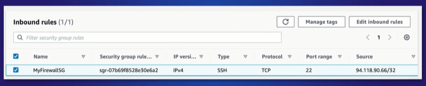

# Authentication, Authorization, and Access Control


- [Authentication, Authorization, and Access Control in AWS](#authentication-authorization-and-access-control-in-aws)
    - [Authentication](#authentication)
    - [Authorization](#authorization)
    - [Access Control](#access-control)
- [Authentication Mechanisms in AWS](#authentication-mechanisms-in-aws)
    - [Username-Password Authentications + MFA](#username-password-authentications--mfa)
    - [Programmatic Authentication](#programmatic-authentication)
    - [IAM Roles](#iam-roles)
    - [Keypairs](#keypairs)
    - [Identity Federation](#identity-federation)
        - [Identity Federation Standards](#identity-federation-standards)
        - [AWS Services that support Identity Federation](#aws-services-that-support-identity-federation)
- [Authorization Controls in AWS](#authorization-controls-in-aws)
    - [AWS IAM](#aws-iam)
    - [Amazon S3](#amazon-s3)
    - [Network Access Control lists NACLs](#network-access-control-lists-nacls)
        - [NACLs are Stateless](#nacls-are-stateless)
        - [NACL Rules](#nacl-rules)
    - [Security Groups](#security-groups)
        - [Security Groups are Stateful](#security-groups-are-stateful)
        - [Security Group Rules](#security-group-rules)


## Authentication, Authorization, and Access Control in AWS 

### Authentication 

Authentication **define and verify an identity**. The authentication process is comprised of two parts of information:

- **who you are**, effectively presenting your identity. 

    - Example is your login username to your AWS account
    - unique value within your AWS account that you are trying to authenticate to,
    - AWS would not allow two identical usernames to be created in the same AWS account.

- **verify that you are who you say you are**, through additional information.

    - Example is passwords
    - This private information does not have to be a unique value within your AWS account. - As an example, AWS doesn't know if two accounts have the same passwords 

Authentication is not just for verifying human access to systems or areas. It is also used between:

- IT Services 
- Applications accessing other systems

### Authorization

Authorization **determines the access level or type**. Authorization only takes place once an identity has been authenticated, so there is a clear order as to which these two operate. Basically, these are:

- access privileges
- permissions

### Access Control 

Access control defines the method and process of granting access. Specifically, these are **logical access control**. Some examples of access control:

- **Username and password** 
- **Multi-Factor Authentication (MFA)**, which is considered an enhanced level of access control
- **IAM roles**, where roles are used to grant permissions to perform specific functions
- **Federation**, where access is granted to external users through temporary credentials
- **Network access control lists (NACLs)**, network-level restriction of data dependent on specific network parameters
- **Security groups**, instance-level restriction based on IP address and port numbers


## Authentication Mechanisms in AWS 

The following are the available authentication mechanisms in AWS.

- Username-Password Authentications + MFA
- Programmatic Authentication
- IAM Roles
- Key Pairs 
- Federation 


### Username-Password Authentications + MFA
This is the most basic authentication. \

- Usernames must be unique and can't be duplicated within the same account
- Passwords can be duplicated between different users
- IAM verifies if authentication is successful 
- If successful, user will be authorized based on the specified permissions 
- Considered insecure, thus MFA is recommended as additional security


### Programmatic Authentication
Instead of granting access to the AWS Management Console, users can also eb granted access from a programmatic perspective. This can be granted for users who are using the following:

- AWS CLI 
- AWS API tools 
- Windows Powershell 
- Software Development Kits

Identity is not prompted to log into the console. Instead, it uses access keys which are composed of two parts: 
        
- **Access Key ID**
Made up of 20 random uppercase alphanumeric characters

- **Secret Access Key**
Made up of 40 random upper and lowercase alphanumeric and non-alphanumeric characters

Note that it's not possible to retrieve lost access keys as AWS does not retain copies of these for security reasons to prevent them from being compromised. Once you have the access keys and AWS CLI installed in your terminal, you can then configure your AWS CLI with the keys:

```bash
$ sudo vi ~/.aws/credentials 

[any-name-for-profile]
aws_access_key_id = AKIAxxxxxxxxxxxx
aws_secret_access_key = xxxxxxxxxxxxxxxxxxxxxxxxxx
```

To use the AWS profile, simply export it.

```bash
export AWS_PROFILE=any-name-for-profile 
```

**Lifecycle of Access Keys**

Access Keys should be rotated to decrease the likelihood of our environment being compromised.

- Create second access key and download it  
- Associate the new access key to your AWS CLi or application
- Test that the new access key works allows programmatic access 
- Mark old access key as Inactive 
- Delete old access keys

### IAM Roles 

IAM roles are objects created within IAM and have a defined set of permissions associated to them, much like a normal user or user group would have. 

- however, they do not represent an identity like users do, they are simply an object with a list of authorized permissions associated
- IAM roles provide an efficient and secure solution in authenticating and authorizing access
- they are considered a best practice when associated with applications running on EC2 instances that require access to other resources instead of embedding credentials into the application itself
- By having a role associated to the EC2 instance, there's no need to apply access key IDs
- Can also be assumed by a user, allowing them to switch from their current set of permissions to take the permissions given by the role

To learn more, check out [AWS Identity and Access Management.](104_aws_iam.md)


### Keypairs

The process of authenticating to newly created EC2 instances is slightly different for Linux and Windows Operating Systems but the underlying method is fundamentally the same through the use of key pairs.

- A key pair as the name implies is made up of two components:
    - public key
    - private key
- These keys can either be:
    - ED25519 RSA keys (not supported for Windows instances)
    - 2048-bit SSH-2 RSA keys

**Private Keys and Public Keys**

The public key uses public key cryptography to encrypt data such as the username and password. For Windows instances, the private key is used to decrypt the administrative password allowing you to gain access to the login credentials including the password using RDP.

For Linux instances, the private key is used to SSH onto the instance, and the public key is held and kept by AWS.

The private key is our responsibility to keep and to ensure that it is not lost. 

To learn more, check out [EC2 Keypairs.](102_infra_security.md)

### Identity Federation 

AWS allows you to access and manage AWS resources even if you don't have a user account within IAM through the use of identity federation. Identity federation allows users from identity providers, IDPs, which are external to AWS to access AWS resources securely without having to supply AWS user credentials from a valid IAM user account.

There are two parties in a federation process:

- Identity Provider (IdP) - authenticates the user
- Service Provider (SP) - controls access to their service or resources based on IdPs authentication

When the identity provider has been selected, and the user is authenticated by that provider, an assertion is sent back to the service provider. This **assertion** is a message that contains metadata and attributes about the user such as their username.  It allows the service provider to authorize access to their services.

AWS supports two types of identity providers:

- **Web identity federation**
Allows authentication between AWS resources and any public OpenID Connect Provider, such as Facebook, Google, or Amazon. 
    - The identity provider exchanges an authentication token for temporary authentication credentials
    - These credentials are associated to an IAM Role with pre-configured permissions allowing authorized access to the resource as defined by that role.

- **SAML 2.0 based federation**
Allow syour existing Active Directory use

    - SAML stands for Security Assertion Markup Language
    - Allows for the exchange of security data, including authentication authorization tokens to take place between an identity provider and a service provider 


#### Identity Federation Standards

- **“OAuth** is an open standard for access delegation, commonly used as a way for Internet users to grant websites or applications access to their information on other websites but without giving them the passwords” - Wikipedia

- “**OpenID Connect** is a simple identity layer on top of the OAuth 2.0 protocol, which allows computing clients to verify the identity of an end-user based on the authentication performed by an authorization server, as well as to obtain basic profile information about the end-user.” - Wikipedia

- “**Security Assertion Markup Language 2.0 (SAML 2.0)** is a standard for exchanging authentication and authorization identities between security domains. SAML 2.0 is an XML-based protocol that uses security tokens containing assertions to pass information about a principal (usually an end user) between a SAML authority, named an Identity Provider, and a SAML consumer, named a Service Provider.” - Wikipedia

#### AWS Services that support Identity Federation

- **AWS Single Sign-On, known as SSO**
AWS SSO enables you to create different groups while leveraging the power of IAM roles and permissions allowing you to control what access users or groups have in specific AWS Accounts within your organization

- **AWS Identity & Access Management (IAM)**
Whereas AWS SSO allows you to create a single sign-on approach to multiple accounts in your AWS organization using the in-built user directory or MS-AD, AWS IAM allows you to configure federated access to your AWS accounts and resources using different identity providers for each AWS account

- **Amazon Cognito**
Amazon Cognito has been built purely to enable the simplification of enabling secure authentication and access control for new and existing users accessing your web or mobile applications, rather than your AWS account.  It not only integrates well with SAML 2.0 but also web identity federation as well.  One of the biggest features of Amazon Cognito is that it has the capability to scale to millions of new users which is great when working with mobile applications. There are 2 main components of Amazon Cognito:

    - **User Pools** 
    These are essentially a scalable user directory that allows new users to sign up, or existing users to log in to your mobile application using their native credentials from the user pool, or they can alternatively federate their access via a web or enterprise IdP. 

    - **Identity Pools**
    These are different to user pools in that they actually provide you with the ability of accessing AWS resources called upon by your web or mobile app by using temporary credentials and the Security token service. 

## Authorization Controls in AWS  

### AWS IAM 

AWS Identity and Access Management os the main service responsible for managing and maintaining what an AWS identity is authorized to access. When an identity is authenticated to AWS, the way in which permissions are given to the identity varies depending on the identities own user permissions and its association with other IAM groups and roles. 

Important concepts:

- IAM Users 
- IAM Groups 
- IAM Roles 
- IAM Policies

To lean more, check out: [AWS Identity and Access Management](104_aws_iam.md) 


### Amazon S3 

There are multiple ways identities can be authorized to access an object within S3, some of which overlap with the IAM mechanisms. These methods are:

- **S3 Bucket Policies**
Bucket policies allow access to resources via a JSON script.
    - only applied to buckets within S3 and act as resource-based policies
    - permissions assigned apply to all objects within that bucket
    - since its a resource-based policy, it uses *principals* 
    - principals can be IAM users, federated users, AWS accounts, or AWS services
    - allow you to set conditions within the policy, for finer-grain permission

- **S3 Access Control Lists (ACLs)**
ACLs allow you to control access to buckets, in addition to specific objects within a bucket by groupings  and AWS accounts.
    - Different permissions can be set per object 
    - ACLs do not follow the same JSON format as IAM policies and bucket policies
    - It is not possible to implicitly deny access using ACLs 
    - It is not possible to implement conditional elements
    - ACLs can both be:
        - bucket-level 
        - object-level 
    - Permissions are based on the Grantee;
        - **Bucket Owner** - your own AWS account and will have full control over all objects and the bucket itself
        - **Everyone (public access)** - permissions set against this grantee would mean anyone can access the content using the permissions applied, providing the object had been made public
        - **Authenticated Users** - allow IAM users from any AWS account to access the object, via signed requests (authenticated)
        - **S3 Log delivery group** - This group is used to deliver log files when server access logs has been configured and the bucket is used to store and WRITE log files to


### Network Access Control lists (NACLs)

Network Access Control Lists or NACLs are a way of authorizing network packets to enter and leave different parts of your VPC.  

- Operates at the Network layer
- rule-based feature for permitting ingress/egress traffic at the protocol and subnet level.
- monitor and filter traffic moving in and out of your subnet
- either allowing or denying access dependent on rule permissions
- can be attached to one or more subnets within your VPC

If you haven't created a custom NACL, then your subnets will automatically be associated with your VPC's default NACL, and in this instance, the default allows all traffic to flow in and out of the network, as opposed to denying it.

#### NACLs are Stateless 

NACLs are stateless, which means when create your rules, you'll need to apply an outbound reply rule to permit responses to inbound requests. 

#### NACL Rules

The rule set itself is very simple, and has both an inbound and outbound list of rules, and these rules are comprised of the following:

- **Rule Number**
ACL rules are read in ascending order, and as soon as a network packet is received, it reads each rule in ascending order until a match is found. For this reason, you'll want to carefully sequence your rules with an organized numbering system. Its recommended to leave a gap of at least 50 between each of your rules to allow you to easily add new rules in sequence later if it becomes necessary. 

- **Type**
This dropdown list allows you to select from a list of common protocol types, including SSH, RDP, HTTP, and POP3. You can alternatively specify custom protocols, such as varieties of ICMP. 

- **Protocol**
Based on your choice of ‘Type’, the protocol option might be grayed out. For custom rules like TCP and UDP, however, you should provide a value. 

- **Port Range**
If you create a custom rule, you'll need to specify the port range for the protocol to use. 
Source: this can be a net or a subnet range, a specific IP address, or even left open to traffic from anywhere. 

- **Allow/Deny**
Each rule must include an action specifying whether to Allow or Deny the traffic that meets the parameters of the rule.

### Security Groups 

AWS security groups are associated with EC2 instances, and provide security at the protocol and port access level.

- Contains a set of rules that filter traffic coming into/out of an EC2 instance
- Authorizing which communication can occur between instances
- Unlike NACLs, there is no DENY action for rules
- Instead, if there isn't a rule that explicitly permits a particular packet, it will simply be dropped
- The rule set is made up of two rule sets:
    - inbound 
    - outbound

#### Security Groups are Stateful 

Security groups are stateful, meaning you do not need the same rules for both inbound and outbound traffic for response traffic, unlike, NACLs, which are stateless. Therefore, any rule that authorizes traffic into an EC2 instance will allow any response to be returned without an explicit rule in the outbound ruleset.

#### Security Group Rules 

Each rule set is composed of the following fields:

- **Name**
As expected this allows you to add a name for the rule up to 255 characters in length

- **Security Group Rule ID**
This is automatically created and set a unique identifier for the security group rule

- **IP Version**
Here you can select which IP version that the security group apples to, V4 or V6

- **Type** 
This dropdown list allows you to select common protocols like SSH, RDP, HTTP. You can also choose custom protocols. 

- **Protocol**
This is typically grayed out, as it's covered by most type choices. However, if you create a custom rule, you can specify your protocol here

- **Port range**
This value will also usually be pre-filled, reflecting the default port range for your chosen protocol. However, there might be times when you prefer to use custom ports. 

- **Source**
This can be a net or subnet range, a specific IP address, or another AWS security group. You can also leave access open to the entire internet using the Anywhere value. 

- **Description**
This simply allows you to add a description for the rule itself

 

<small><center>Photo courtesy of CloudAcademy course, [Authorization Controls in AWS](https://cloudacademy.com/course/authorization-controls-aws-2723/security-groups/) </center></small>


