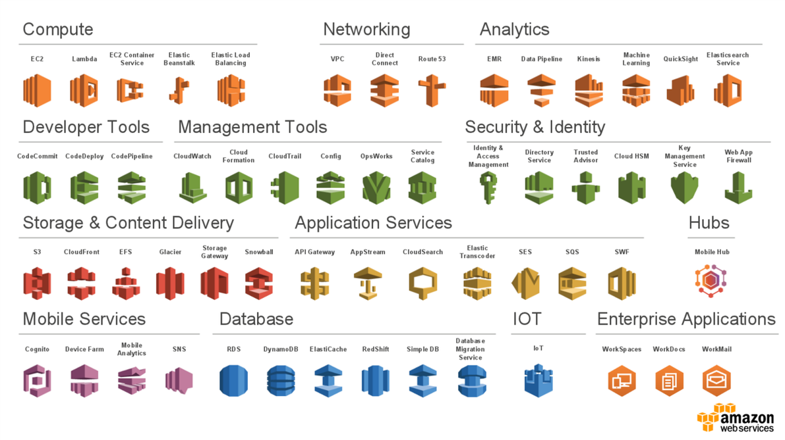

# Amazon Web Services - Overview 

- [Overview](#overview)
- [AWS Global Infrastructure](#aws-global-infrastructure)
    - [Regions](#regions)
    - [Availability Zone](#availability-zone)
    - [Edge Locations](#edge-locations)
- [Services](#services)
- [Pricing](#pricing)
- [AWS Support](#aws-support)
- [AWS Partner Network APN](#aws-partner-network-apn)
- [AWS Marketplace](#aws-marketplace)
- [Resources](#resources)

## Overview 

Amazon Web Services is a reliable, scalable, and inexpensive on-demand cloud computing platforms, services and APIs to individuals, companies, and governments, on a metered pay-as-you-go basis.

||
|-|

## AWS Global Infrastructure

The [AWS Global Infrastructure](https://infrastructure.aws/) is designed and built to deliver a flexible, reliable, scalable, and secure cloud computing environment with high-quality global network performance.

AWS Infrastructure Features:

- Elasticity and scalability - dynamically adapts to capacity and growth needs
- Fault-tolerance - Continues operating properly in the presence of a failure due to built-in redundancy of components
- High availability - High operational performance with minimized downtime and no human intervention

### Regions

An AWS Region is a geographical area.

- Data replication across Regions is controlled by you.
- Communication between Regions uses AWS backbone network infrastructure.
- Each Region provides full redundancy and connectivity to the network.
- A Region typically consists of two or more Availability Zones

When selecting a region consider the following:

- Laws - Data governance and legal requirements
- Proximity - Select regions close to your customers for reduced latency
- Availability - Some services are region locked
- Cost - Cost varies by region

### Availability Zone

Each Availability Zone is a fully isolated partition of the AWS infrastructure. There are currently 69 Availability Zones worldwide.

- Availability Zones consist of discrete data centers
- They are interconnected with other Availability Zones by using high-speed private networking
- They are designed for fault isolation
- You choose your Availability Zones but AWS recommends replicating data and resources across Availability Zones for resiliency.

### Edge Locations

Edge Locations run Amazon CloudFront to help get content to your customers quicker and more reliably anywhere in the world
- Caching data in locations that are close to customers is the primary idea behind **Content Delivery Networks (CDN)**
- **Amazon CloudFront** is Amazon's CDN
  - Helps deliver data, video, applications, and APIs to customers with low latency and high transfer speeds
  - Utilizes **Edge Locations** from around the world to help accelerate communication with users all around the globe
  - Edge Locations are separate from Regions, so you can push content from a Region into a collection of Edge Locations around the world in order to accelerate communication and content delivery
- **Amazon Route 53**
  - A **Domain Name Service (DNS)** that directs customers to the direct web locations with reliable, low latency
- **AWS Outposts**
  - When a company wants to install and use an AWS on it's premises, AWS will come install the services right inside your own data center
  - Still owned and operated by AWS, but with functionality strict to your premises
  - Not a solution most customers would need

## Services

AWS offers a broad set of global cloud-based products, including compute, storage, databases, analytics, networking, mobile, developer tools, management tools, Internet of Things (IoT), security, and enterprise applications.

Details can be found at: https://aws.amazon.com/products/.

## Pricing 

### Paying for AWS

- Pay for what you use
- Reserve and save up to 75% versus On-Demand
  - All Upfront Reserved Instance (AURI) -> Large Discount
  - Partial Upfront Reserved Instance (PURI) -> Lower Discount
  - No Upfront Payments Reserved Instance (NURI) -> Smallest Discount
- Scale and save as usage increases
  - Tiered pricing for services like S3, EBS, EFS
- Save as AWS grows
- Custom Pricing
  - Meet varying needs through custom pricing.
  - Available for high-volume projects with unique requirements.

The services below are free but there might be charges associated with other AWS services that are used alongside these services.

- Amazon VPC
- Elastic Beanstalk
- Auto Scaling
- AWS CloudFormation
- AWS Identity and Access Management

### Total Cost of Ownership

**Total Cost of Ownership (TCO):** The financial estimate to help identify direct and indirect costs of a system

- Compare the costs of running an entire infrastructure environment or specific workload on-premises versus on AWS
- Budget and build the business case for moving to the cloud

**TCO Considerations**

1. Server Costs
   - Hardware: Server, rack chassis power distribution units (PDUs), top-of-rack (TOR) switches, and maintenance
   - Software: Operating system (OS), virtualization licenses, and maintenance
   - Facilities: Space, power, and cooling
2. Storage Costs
   - Hardware: Storage disks, storage area network (SAN) or Fibre Channel (FC) switches
   - Storage administration costs
   - Facilities: Space, power, and cooling
3. Network Costs
   - Network Hardware: Local area network (LAN) switches, load balancer bandwidth costs
   - Network administration costs
   - Facilities: Space, power, and cooling
4. IT Labor Costs
   - Server administration costs

## AWS Support

AWS Support offers a range of plans that provide access to tools and expertise that support the success and operational health of your AWS solutions. All support plans provide 24/7 access to customer service, AWS documentation, whitepapers, and support forums.

- Proactive Guidance: Technical Account Manager (TAM)
- Best Practices: AWS Trusted Advisor
- Account Assistance: AWS Support Concierge

**Support Plans**

- **Basic Support:** Resource Center access, Service Health Dashboard, product FAQs, discussion forums, and support for health checks
- **Developer Support:** Support for early development on AWS
- **Business Support:** Customers that run production workloads
- **Enterprise Support:** Customers that run business and mission-critical workloads

Support response times vary based on plan and case severity. Basic offers no case support, all other support ranges from 24 hours to 15 minutes or less.

## AWS Partner Network (APN)

APN Partners are focused on your success, and they help customers take full advantage of all the business benefits that AWS has to offer.

More details about accessing the AWS Partner Network--or becoming an AWS Partner--can be found at: https://aws.amazon.com/partners/.

## AWS Marketplace
The AWS Marketplace is a digital catalog with thousands of software listings from independent software vendors, where you can find, test, buy, and deploy software to run on AWS.

These offerings can range from simple web server applications to security, networking business intelligence, databases, DevOps, and media. Many of these applications offer pay-as-you-go or Bring Your Own License (BYOL) models.

Details on the AWS Marketplace can be found at: https://aws.amazon.com/marketplace.

## Resources 

- [AWSFundementals](https://github.com/kdiri/AWSFundementals/tree/main)