# AWS Compute 

> <small>This is not an exhaustive documentation of all the existing AWS Services. These are summarized notes for the AWS Certifications. To see the complete documentation, please go to: [AWS documentation](https://docs.aws.amazon.com/)</small>

- [Compute](#compute)
- [Amazon Machine Images (AMIs)](#amazon-machine-images-amis)
- [Default Limits](#default-limits)
- [Placement Groups](#placement-groups)
- [Status Checks](#status-checks)
- [VM Import/Export](#vm-importexport)
- [User Data and Metadata](#user-data-and-metadata)
    - [Instance Metadata](#instance-metadata)
    - [User Data](#user-data)
- [EC2 Instance Types](#ec2-instance-types)
    - [Instance Type Naming Convention](#instance-type-naming-convention)
    - [Instance Types based on pricing](#instance-types-based-on-pricing)
    - [Instance Types based on purpose](#instance-types-based-on-purpose)
    - [Reserved Instance Types](#reserved-instance-types)
    - [Dedicated Instances](#dedicated-instances)
- [EC2 Networking](#ec2-networking)
    - [IP Addresses](#ip-addresses)
    - [Enhanced Networking](#enhanced-networking)
    - [Elastic Network Interface (ENI)](#elastic-network-interface-eni)
    - [Elastic Network Adapter (ENA)](#elastic-network-adapter-ena)
    - [Elastic Fabric Adapter (EFA)](#elastic-fabric-adapter-efa)
    - [ENI vs ENA vs EFA](#eni-vs-ena-vs-efa)
- [EC2 Storage](#ec2-storage)
    - [Instance Store](#instance-store)
    - [Amazon Elastic Block Storage (EBS)](#amazon-elastic-block-storage-ebs)
    - [Amazon Elastic Filesystem (EFS)](#amazon-elastic-filesystem-efs)
- [Auto Scaling Group](#auto-scaling-group)
    - [Launch Configuration](#launch-configuration)
    - [Scaling Policies](#scaling-policies)
    - [Scaling Cooldown](#scaling-cooldown)
    - [Scaling Plans](#scaling-plans)
    - [Lifecycle Hooks](#lifecycle-hooks)
    - [Auto Scaling Alarms](#auto-scaling-alarms)
- [Elastic Load Balancer](#elastic-load-balancer)
    - [How Elastic Load Balancing works](#how-elastic-load-balancing-works)
    - [Types](#types)
    - [Health Checks](#health-checks)
    - [Listeners](#listeners)
    - [Rule conditions](#rule-conditions)
    - [Stickiness](#stickiness)
    - [Cross-Zone Loadbalancing](#cross-zone-loadbalancing)
    - [SSL Certificates](#ssl-certificates)
    - [Server Name Indication SNI](#server-name-indication-sni)
    - [Connection Draining](#connection-draining)
    - [Server Order Preference](#server-order-preference)

## Compute 

Compute resources can be considered the brains and processing power required by applications and systems to carry out computational tasks via a series of instructions. They are closely related to common server components such as CPUs and RAMs. 

A physical server within a data center would be considered a Compute resource, as it may have multiple CPUs and many gigs of RAM to process instructions given by the operating system and applications

Commonly used compute services:

- EC2 (Elastic Compute Cloud)
- ECS (Elastic Container Service)
- ECR (Elastic Container Registry)
- EKS (Elastic Container Service for Kubernetes)
- AWS Elastic Beanstalk
- AWS Lambda
- AWS Batch
- Amazon Lightsail

To learn more, check out the following links:

- [Compute for any workload](https://aws.amazon.com/products/compute/)

- [Choosing Compute Options](https://aws.amazon.com/startups/start-building/how-to-choose-compute-option/)

- [AWS Compute Services](https://docs.aws.amazon.com/whitepapers/latest/aws-overview/compute-services.html)

## Amazon Machine Images (AMIs)

An AMI provides the information required to launch an instance. These are basically "disk images" which is used to spin up the instances.

Main categories:

- Community AMIs
- AWS Marketplace AMIs
- Custom AMIs

## Default Limits 

Below are some limitations for EC2. Note that these may change. For more information, see [Amazon EC2 service quotas.](https://docs.aws.amazon.com/AWSEC2/latest/UserGuide/ec2-resource-limits.html)

Resource | Limits |
---------|----------|
Instance | 20 instances per region |
Snapshots | 10000 snapshots per region |
EC2 Auto Scaling Groups | 200 per region |
Scaling policies per Auto Scaling group | 50 |
Scheduled actions per Auto Scaling group | 125 |
Lifecycle hooks per Auto Scaling group | 50 |
SNS topics per Auto Scaling group | 10 
Classic Load Balancers per Auto Scaling group | 50 |
Target groups per Auto Scaling group | 50 |

## Placement Groups 

Placement groups are a logical grouping of instances in one of the following configurations:

**Cluster Placement Group (single-az+single-rack)**

- A cluster placement group is a logical grouping of instances within a single Availability Zone. 

- Recommended for applications that benefit from low
network latency, high network throughput, or both, and if the majority of the network
traffic is between the instances in the group.

**Partition Placement Group (multi-az+separate racks)**

- Spread on logical partition 

**Spread Placement Group (multi-az+separate rack+1 instance per rack)**

- A spread placement group is a group of instances that are each placed on distinct underlying hardware  
- Recommended for applications that have a small number of critical instances that should be kept separate from each other

Table:

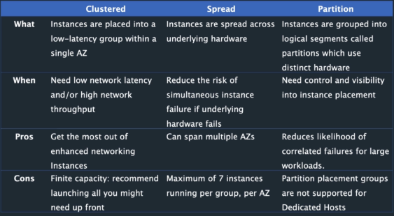

## Status Checks 

**System Status Checks**
- Problem with your instance that may require AWS involvement repair.
- AWS needs to t-shoot

**Instance Status Checks**
- Problems that may involve the OS
- USER needs to t-shoot

## VM Import/Export 

Easily import virtual machine images from your existing environment to Amazon EC2 instances and export them back to your on-premises environment.

To learn more, please see [VM Import/Export.](https://aws.amazon.com/ec2/vm-import/)

## User Data and Metadata 

### Instance Metadata 

These are the data about your instance that you can use to configure or manage the running instance. 

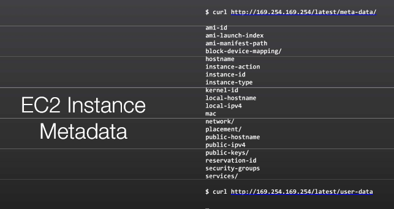

### User Data

EC2 User data is supplied by the user at instance launch in the form of a script.

- Limited to 16KB 
- Can be used to bootstrap the instance.

Bootstrapping runs the provided script, so anything you can accomplish in a script you can accomplish during bootstrapping:

- Install the most current security updates.
- Install the current version of the application.
- Configure Operating System (OS) services.

## EC2 Instance Types 

### Instance Type Naming Convention

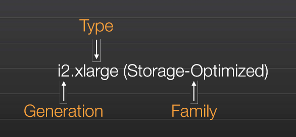

### Instance Types based on pricing
<small>Reference: [On-Demand vs Reserved vs Spot AWS EC2](https://blog.boltops.com/2018/07/13/on-demand-vs-reserved-vs-spot-aws-ec2-pricing-comparison/)</small>

- **On-Demand Instances**
    There’s no commitment from you. You pay the most with this option.

- **Reserved Instances**
    1-year or 3-year commitment from you. You save money from that commitment.

- **Spot Instances**
    Spare instances that you can bid on. The Spot price fluctuates in real-time based on supply and demand.

### Instance Types based on purpose
<small>Reference: [Amazon EC2 Instance Types](https://blog.boltops.com/2018/07/13/on-demand-vs-reserved-vs-spot-aws-ec2-pricing-comparison/)</small>

- **General Purpose**
    Ideal for applications that use these resources in equal proportions such as web servers and code repositories. 
    
- **Compute Optimized**
    Ideal for compute bound applications that benefit from high performance processors. 

- **Memory Optimized**
    Designed to deliver fast performance for workloads that process large data sets in memory.
    
- **Accelerated Computing**
    These instances use hardware accelerators, or co-processors, to perform functions, such as floating point number calculations, graphics processing, or data pattern matching, more efficiently than is possible in software running on CPUs.

- **Storage Optimized**
    Designed for workloads that require high, sequential read and write access to very large data sets on local storage. They are optimized to deliver tens of thousands of low-latency, random I/O operations per second (IOPS) to applications.

- **HPC Optimized**
    HPC instances are ideal for applications that benefit from high-performance processors such as large, complex simulations and deep learning workloads.

### Reserved Instance Types 

**Standard RIs**
- These provide the most significant discount (up to 75% off On-Demand) and are best suited for steady-state usage.

**Convertible RIs**
- These provide a discount (up to 54% off On-Demand) and the capability to change the attributes of the RI as long as the exchange results in the creation of Reserved Instances of equal or greater value. Like Standard RIs, Convertible RIs are best suited for steady-state usage

**Scheduled RIs**
- These are available to launch within the time windows you reserve. This
option allows you to match your capacity reservation to a predictable recurring schedule
that only requires a fraction of a day, a week, or a month

### Dedicated Instances 

By default, EC2 instances run on shared tenancy hardware. 

**Dedicated Instances** are EC2 instances that run on hardware that's dedicated to a single customer. Dedicated Instances that belong to different AWS accounts are physically isolated at a hardware level, even if those accounts are linked to a single payer account. However, Dedicated Instances might share hardware with other instances from the same AWS account that are not Dedicated Instances.

A **Dedicated Host** is also a physical server that's dedicated for your use. With a Dedicated Host, you have visibility and control over how instances are placed on the server. For more information, see [Dedicated Hosts](https://docs.aws.amazon.com/AWSEC2/latest/UserGuide/dedicated-hosts-overview.html).

Features:

- Reserved Instances
- Automatic scaling
- Automatic recovery
- Dedicated Spot Instances
- Burstable performance instances 

To learn more, please see [Dedicated Instances](https://docs.aws.amazon.com/AWSEC2/latest/UserGuide/dedicated-instance.html)

## EC2 Networking 

### IP Addresses 

EC2 instances are not aware of their public IP address. It only knows it's private IP address. On the other hand, the Internet Gateway is the only component that knows all of the public IP addresses of instances.

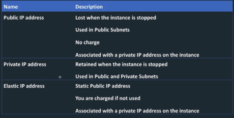

### Enhanced Networking 

Uses single root I/O virtualization (SR-IOV) to provide high-performance networking capabilities on supported instance types.

Features:

- More Packets per Second >> PPS
- Lower Latency
- BGP Routing

### Elastic Network Interface (ENI) 

ENIs are logical networking components in a VPC that represents a virtual network card.

- Can include attributes such as 
    - IP addresses
    - security groups
    - MAC address 
    - source/destination check flag
    - description 
- You can create and configure network interfaces in your account and attach them to instances in your VPC
- eth0 is the primary network interface and cannot be moved or detached 
- an ENI is bound to an AZ and you can specify which subnet/AZ you want the ENI to be added in. 

### Elastic Network Adapter (ENA)

Used for enhanced networking.

- Provides higher bandwidth, higher packet-per-second (PPS) performance and lower latency 
- Must launch an HVM AMI 
- Available for certain instance types within a VPC 

### Elastic Fabric Adapter (EFA)

An EFA is similar to ENA but with added capabilities.

- EFA enables customers to run applications requiring higher levels of inter-node communications at scale on AWS 
- High Performance Computing (HPC) applications using the Message Passing Interface (MPI) and Machine Learning (ML) applications using NVIDIA Collective Communications Library (NCCL) can scale to thousands of CPUs or GPUs.

### ENI vs ENA vs EFA 

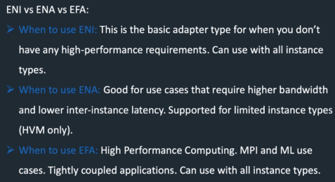

## EC2 Storage

### Instance Store 

Instance store provides temporary block-level storage for your instance. This storage is located on disks that are physically attached to the host computer.

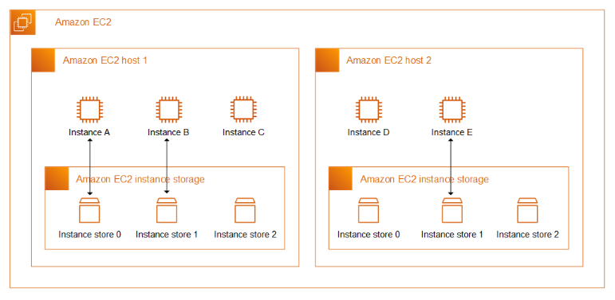

Operation | Description |
---------|----------|
 Reboot | Rebooting an instance does not shut down the instance; if an instance reboots (intentionally or unintentionally), data on the instance store persists. | C1
 Stop/Terminate | The data in an instance store persists only during the lifetime of its associated instance. If an instance is stopped or terminated, then the instance store does not persist | 

To learn more, please see [Amazon EC2 instance store](https://docs.aws.amazon.com/AWSEC2/latest/UserGuide/InstanceStorage.html).

### Amazon Elastic Block Storage (EBS)

Persistent block storage volumes. You can attach multiiple Ebs volumes to a single instance.

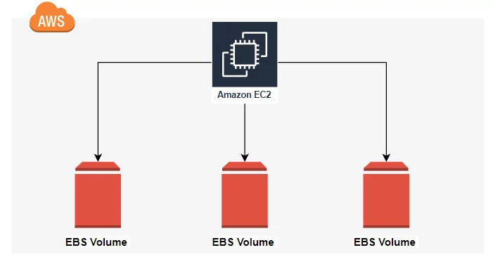

**EBS Types**

- Magnetic 
- General Purpose (SSD)
- Provisioned IOPS (SSD)

**EBS Encryption** 

- Use AWS KMS master keys or use a customer master key (CMK)
- Creating your own CMK gives you more control on the key.

**EBS Snapshots**
Point-in-time backup copy of an EBS volume that is stored in Amazon S3.
- Incremental, which means only the blocks that have changed after your most recent snapshot is saved.
- When snapshot is deleted, only data exclusive to that snapshot is deleted.
- Can be shared across AWS accounts or copied across regions

To learn more, please see [Amazon EBS volumes](https://docs.aws.amazon.com/AWSEC2/latest/UserGuide/ebs-volumes.html).

**EBS Migration**
EBS volumes are locked to a specific availability zone. To migrate an EBS volume to a different AZ or region:

- Snapshot the volume 
- Copy the volume to a different region (optional)
- Create a volume from the snapshot.

### Amazon Elastic Filesystem (EFS) 

Amazon EFS provides scalable file storage for use with Amazon EC2. You can use an EFS file system as a common data source for workloads and applications running on multiple instances. 

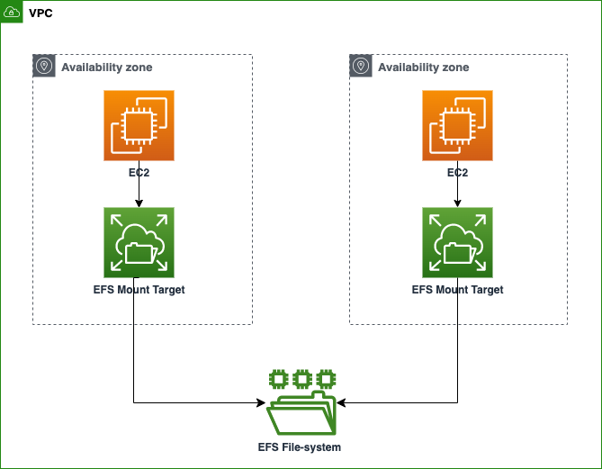

To learn more, please see [Amazon EFS](https://docs.aws.amazon.com/AWSEC2/latest/UserGuide/AmazonEFS.html).

## Auto Scaling Group 

An Auto Scaling group contains a collection of EC2 instances that are treated as a logical grouping for the purposes of automatic scaling and management.

- Size of an Auto Scaling group depends on the number of instances that you set as the desired capacity.
- Responds to changing conditions by adding or terminating EC2 Instances
- Launches instances from a specified Amazon Machine Image (AMI)
- Enforces a minimum number of running Amazon EC2 instances.

**Auto Scaling Group in AWS**

|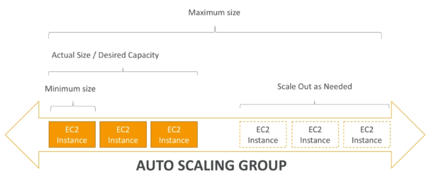|
|-|

**Auto Scaling Group in AWS with LoadBalancer**

|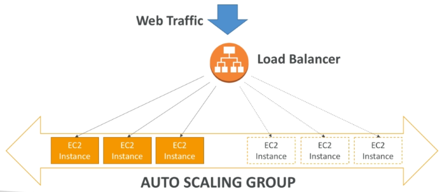|
|-|

### Launch Configuration

The launch configuration is referenced by the Auto Scaling group instead of being part of the Auto Scaling group because:

- It allows you to change the EC2 instance type and AMI without disrupting the Auto Scaling group.
- It facilitates rolling out a patch to an existing set of instances managed by an ASG.
- It allows you to change security groups associated with the instances launched without having to make changes to the ASG

### Scaling Policies

Scaling policies determine when, if, and how the ASG scales and shrinks.

- Simple/Step Scaling 
- Scheduled Actions 
- Dynamic 
- Target Traking 

### Scaling Cooldown 

After your Auto Scaling group launches or terminates instances, it waits for a cooldown period to end before any further scaling activities initiated by simple scaling policies can start. 

|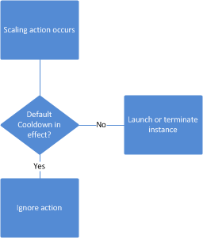|
|-|

The intention of the cooldown period is to prevent your Auto Scaling group from launching or terminating additional instances before the effects of previous activities are visible.

- It is recommended not to use simple scaling policies and scaling cooldowns.
- Target tracking scaling policy or a step scaling policy is better for scaling performance
- After the cooldown period ends, any scaling activities initiated by simple scaling policies can resume

### Scaling Plans

Scaling Plans define the triggers and when instances should be provisioned/deprovisioned

### Lifecycle Hooks 

Amazon EC2 Auto Scaling offers the ability to add lifecycle hooks to your Auto Scaling groups. 

- Lets you create solutions that are aware of events in the Auto Scaling instance lifecycle, and then perform a custom action on instances when the corresponding lifecycle event occurs. 

- Provides a specified amount of time (one hour by default) to wait for the action to complete before the instance transitions to the next state.

A popular use of lifecycle hooks is to control when instances are registered with Elastic Load Balancing. 

|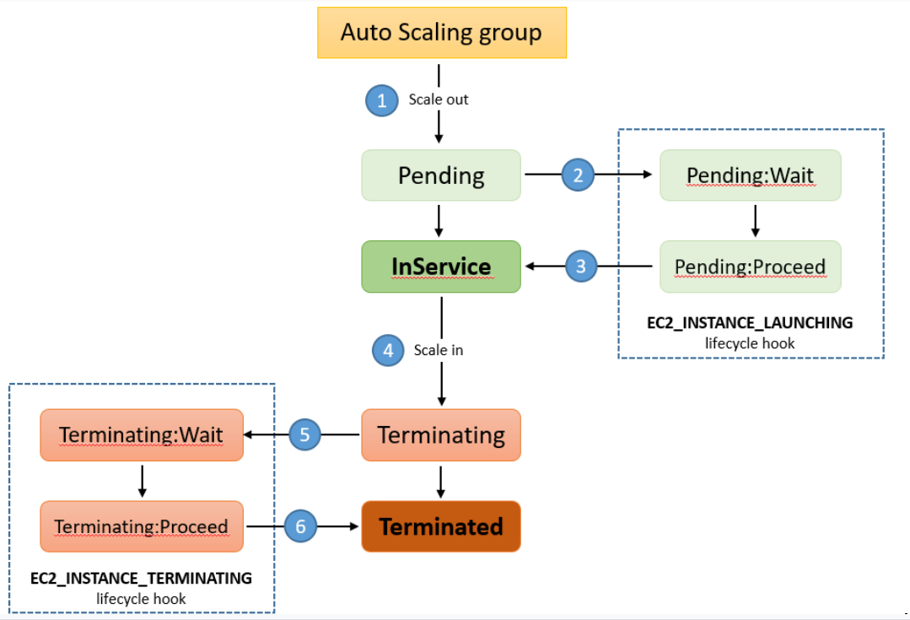|
|-|

By adding a launch lifecycle hook to your Auto Scaling group, you can ensure that your bootstrap scripts have completed successfully and the applications on the instances are ready to accept traffic before they are registered to the load balancer at the end of the lifecycle hook.

### Auto Scaling Alarms 

It is possible to scale an ASG based on CloudWatch alarms which monitors a set metric, such as average CPU. Note that metrics are computed for overall ASG instances. 

|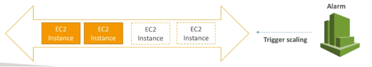|
|-|

## Elastic Load Balancer

Elastic Load Balancers(ELB) automatically distribute incoming application traffic across multiple targets and virtual appliances in one or more Availability Zones (AZs).

### How Elastic Load Balancing works
Please see [How Elastic Load Balancing works](https://docs.aws.amazon.com/elasticloadbalancing/latest/userguide/how-elastic-load-balancing-works.html).

### Types

- [Application Load Balancer](https://aws.amazon.com/elasticloadbalancing/application-load-balancer/?nc=sn&loc=2&dn=2)
- [Network Load Balancer](https://aws.amazon.com/elasticloadbalancing/network-load-balancer/?nc=sn&loc=2&dn=3)
- [Gateway Load Balancer](https://aws.amazon.com/elasticloadbalancing/gateway-load-balancer/#Features)

### Health Checks

- Ping 
- Connection attempt 
- Page request 

### Listeners
A listener is a process that checks for connection requests, using the protocol and port that you configure. The rules that you define for a listener determine how the load balancer routes requests to the targets in one or more target groups

### Rule conditions
There are two types of rule conditions.Each rule can have up to one host condition and up to one path condition
- host 
- path

### Stickiness 

Stickiness ensures that the same client is always redirected to the same instance behind the loadbalancer. 
- The cookie used for stickiness has an expiration date which you can control 
- Useful if you want your user to not lose session data 

### Cross-Zone Loadbalancing 

Load is distribtued evenly across all registered instances in all availability zone. 

|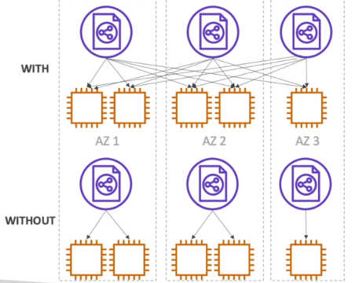|
|-|

### SSL Certificates 

SSL certificates can be used to encrypt the traffic between clients and the loadbalancer. 

||
|-|

The loadbalancer uses an X.509 certificate and can eb managed using AWS Certificate Manager (ACM).

- Need to specify an HTTPS listener.
- Specify a default certificate 
- Clients can then use SNI to specify the hostname they are trying to reach.  

### Server Name Indication (SNI)

SNI solves the problem of lading multiple SSL certificates onto one web server. By using SNI, clients can indicate the hostname to connect to. It supports multiple secure websites using a single secure listener.

|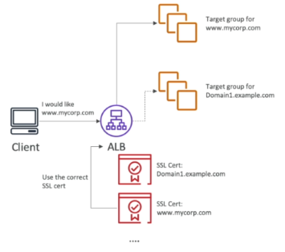|
|-|

### Connection Draining 

Refers to the time to complete "in-flight requests" while the instance is de-registering or unhealthy. 

|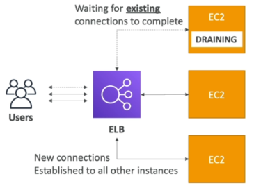|
|-|

When enabled, new requests will  not being sent to the intance being de-registered.

- Can be disabled by setting value to 0.
- default is 300 seconds 

### Server Order Preference

Ensures that load balancer determines which cipher to use for SSL connection. Elastic Load Balancing supports the Server Order Preference option for negotiating connections between a client and a load balancer.

- During the SSL connection negotiation process, the client and the load balancer present a list of ciphers and protocols that they each support, in order of preference.

- By default, the first cipher on the client’s list that matches any one of the load balancer’s ciphers is selected for the SSL connection. 

- If the load balancer is configured to support Server Order Preference, then the load balancer selects the first cipher in its list that is in the client’s list of ciphers.

- This ensures that the load balancer determines which cipher is used for SSL connection. 

- If you do not enable Server Order Preference, the order of ciphers presented by the client is used to negotiate connections between the client and the load balancer.