# AWS Storage 

> <small>This is not an exhaustive documentation of all the existing AWS Services. This is just my summarized study notes for the AWS Certifications.</small>
> <small>To see the complete documentation, please go to: [AWS documentation](https://docs.aws.amazon.com/)</small>

- [Storage Comparison](#storage-comparison)
- [Amazon S3](#amazon-s3)
    - [S3 Bucket Naming Convention](#s3-bucket-naming-convention)
    - [S3 Objects](#s3-objects)
    - [S3 Versioning](#s3-versioning)
    - [S3 Static Hosting](#s3-static-hosting)
    - [S3 Cross Origin Resource Sharing CORS](#s3-cross-origin-resource-sharing-cors)
    - [S3 Consistency Model](#s3-consistency-model)
    - [S3 HTTP Codes](#s3-http-codes)
    - [S3 Access Logs](#s3-access-logs)
    - [S3 Replication](#s3-replication)
    - [S3 Pre-signed URLs](#s3-pre-signed-urls)
    - [S3 Lifecycle Policies](#s3-lifecycle-policies)
    - [S3 Lock Policies](#s3-lock-policies)
    - [S3 Event Notifications](#s3-event-notifications)
    - [S3 Security](#s3-security)
        - [Bucket Policies](#bucket-policies)
        - [Bucket Settings for Block Public Access](#bucket-settings-for-block-public-access)
        - [Other Security Features](#other-security-features)
    - [S3 Object Encryption](#s3-object-encryption)
        - [Encryption at rest](#encryption-at-rest)
        - [Encryption in transit](#encryption-in-transit)
    - [S3 Storage Classes](#s3-storage-classes)
        - [S3 Standard - General Purpose](#s3-standard---general-purpose)
        - [S3 Standard - Infrequent Access](#s3-standard---infrequent-access)
        - [S3 One Zone - Infrequent Access](#s3-one-zone---infrequent-access)
        - [S3 One Zone - Intelligent Tiering](#s3-one-zone---intelligent-tiering)
        - [S3 Glacier](#s3-glacier)
        - [S3 Glacier Deep Archive](#s3-glacier-deep-archive)
    - [S3 Performance Optimization](#s3-performance-optimization)
    - [S3 Select and Glacier Select](#s3-select-and-glacier-select)
    - [AWS Athena](#aws-athena)
- [AWS Snowball Family](#aws-snowball-family)
    - [Snowball](#snowball)
    - [Snowball Edge](#snowball-edge)
    - [Snowmobile](#snowmobile)
- [AWS Storage Gateway](#aws-storage-gateway)
    - [Hybrid Cloud for Storage](#hybrid-cloud-for-storage)
    - [Storage Gateway](#storage-gateway)
        - [File Gateway](#file-gateway)
        - [Volume Gateway](#volume-gateway)
        - [Tape Gateway](#tape-gateway)
        - [File Gateway Hardware Appliance](#file-gateway-hardware-appliance)
- [Amazon FSx](#amazon-fsx)
    - [Amazon FSx for Windows](#amazon-fsx-for-windows)
    - [Amazon FSx for Lustre](#amazon-fsx-for-lustre)
- [AWS DataSync](#aws-datasync)


## Storage Comparison 

AWS Storage | Description | 
---------|----------|
| S3 | Object Storage |
| Glacier | Object Archival |
| EFS | Network File System for Linux instances, POSIX filesystem |
| FSx for Windows | Network File System for Windows servers |
| FSx for Lustre | High Performance Computing for Linux systems |
| EBS volumes | Network storage for one EC2 instance at a time |
| Instance Storage | Physical storage for EC2 instance (high IOPS) |
| Storage Gateway | Hyrbid cloud storage | 
| Snowball / Snowmobile | move large data to the cloud, physical |


## Amazon S3 

Amazon Simple Storage Service (Amazon S3) is an object storage service built to store and retrieve any amount of data from anywhere. 

- Data is stored as objects within “buckets”
- Buckets are defined at the region level
- Buckets must have a globally unique name
- Buckets are private by default
- Only the bucket owner has initial access

In reality, there is no concept of "directories" within buckets because S3 follows a flat structure. However the UI will actually show that you can have directories within directories. 

|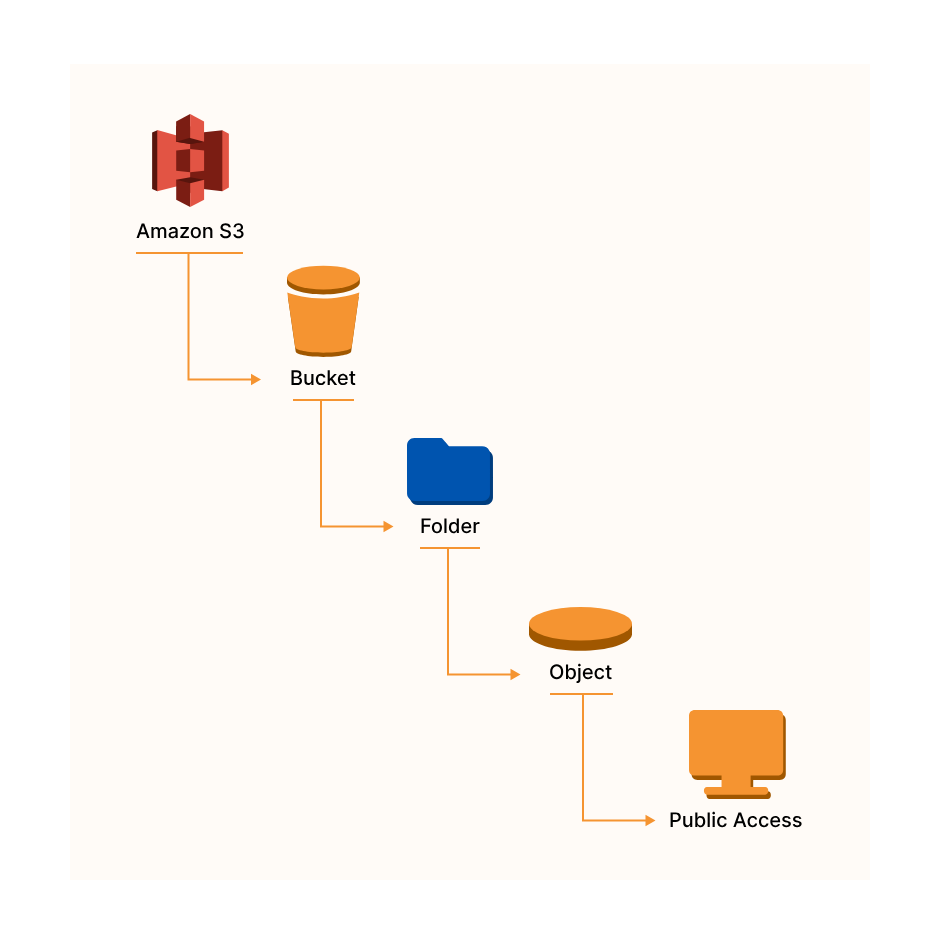|
|-|

### S3 Bucket Naming Convention 

- No uppercase
- No underscore
- 3-63 character long names
- Name must no be an IP
- Must start with a lowercase letter or number

### S3 Objects 

Data is stored as objects within resources called “buckets”

- An object can be up to 5 terabytes in size.
- Objects do have a key as an identifier, which is basically the full path of the file:

    ```bash
    s3://my-bucket/my_file.txt
    s3://my-bucket/my_folder/another_folder/my_file.txt      
    ```

- The key is composed of the prefix + object name

    ```bash
    s3://my-bucket/my_folder/another_folder/my_file.txt    
    ```  
- Object values are the content of the body:
    - Max object size in S3 is 5TB
    - In case of a upload bigger than 5GB, we must use multi-part upload

- Each object can have metadata: list of text key/value pairs - system or user added
- Each object can have tags: unicode key/value par, useful for security, lifecycle. A bucket can have up to 10 tags
- If versioning is enabled each object has a version ID      

### S3 Versioning

When versionining is enabled (at the bucket level),files can have multiple versions.

- If a files is uploaded with the same key (same filename) the version of the file will be changed, the existing file wont be overridden, we will have both files available with different versions

- It is best practice to version the files, because:

    - The files will be protected against unintended deletes

    - The files can be rolled back to previous versions

- Notes:

    - Any file that is not versioned prior to enabling versioning will have the version "null"

    - Suspending versioning does not delete the previous versions of the file

**Without Versioning**

- Each object is identified solely by the object key, it's name.
- If you modify an object, the original of that object is replaced.
- The attribute, ID of object, is set to null.

**Deleting versioned files**

- When deleting a versioned file adds a delete marker to the file, but the file wont be deleted
- The file can be restored by deleting the delete marker
- Deleting the delete marker and the file together is a permanent delete, meaning the file wont be able to be restored

**MFA Delete**

- To use MFA-Delete we have to enable versioning on the selected bucket
- MFA-Delete can be enabled/disabled only by the owner of the bucket (root account)!
- MFA-Delete currently can only be enabled using the CLI
- MFA will be required when:
    - We want to permanently delete an object version
    - We want to suspend the versioning on the bucket
- MFA won't be required when:
    - We want to enable versioning
    - We want to list deleted versions
    - We want to add a delete marker to an object

### S3 Static Hosting

S3 can host static websites and have them accessible from the internet

- The website URL will be something like this:

    ```bash
    <bucket-name>.s3-website-<AWS-region>.amazonaws.com
    <bucket-name>.s3-website.<AWS-region>.amazonaws.com  
    ```

- In case of `403` errors we have to make sure that the bucket policy allows public reads

**Use cases**

- Storing web content
- Storing backups for Relational DB
- Storing logs for analytics


### S3 Cross Origin Resource Sharing (CORS)

CORS is a web browser based mechanism to allow requests to other origins while visiting the main one

- An origin is a scheme (protocol), host (domain) or port
- Same origin example: 

    ```bash
    http://example.com/app1 
    http://example.com/app2  
    ```

- Different origins: 

    ```bash
    http://example.com   
    http://otherexample.com
    ```
- The request wont be fulfilled unless the other origin allows for the request, using CORS headers (example: Access-Control-Allow-Origin, Access-Control-Allow-Method)


|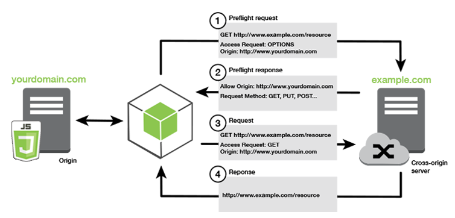|
|-|

- If a client does a cross-origin request on an S3 bucket, the correct CORS headers need to be enabled in order for the request to succeed
- Request can be allowed for a specified origin (by specifying the URL of the origin) or for all origins (by using *)

### S3 Consistency Model

Amazon S3 follows two consistency models: 

- **Read-after-write consistency** for PUTs to new objects (new key)

- **Eventual consistency** for GETs and DELETEs of existing objects (existing key).

### S3 HTTP Codes

HTTP Code | Description
---------|----------
 200 | Successful upload
 300 | Redirection
 400 | Client error
 500 | Server error

### S3 Access Logs

- For audit purposes we would want to log all access to S3 buckets
- Any request made to S3, from any account, authorized or denied, will be logged into another S3 bucket
- The data can be analyzed by some data analysis tools or Amazon Athena 
- We should never set our logging bucket to be the monitored bucket! This may create a logging loop causing the bucket to grow exponentially

### S3 Replication

To enable replication:

- Enable versioning on the source and destination buckets
- Only the new objects are replicated after the replication is activated (no retroactive replication)
- Buckets can be in separate accounts
- Copying between replica buckets happens asynchronously (it is very quick)
- In order to be ably to copy between replicas, an IAM permission has to be assigned to the source bucket

For DELETE operations:

- For deletion without version ID, a delete marker is added to he object. Deletion is not replicated
- For deletion with version ID, the object is deleted in the source bucket. Deletion is not replicated

There is no chaining of replication:

- If bucket-A has replication into bucket-B, and bucket-B has replication into bucket-C 
- Then objects created in bucket-A are not replicated to bucket-C

There are 2 types of replication:
    
- **Cross Region Replication (CRR)**

    - Buckets are in different regions
    - Used for: compliance, lower latency access, replication across accounts

- **Same Region Replication (SRR)**

    - Buckets are in the same region
    - Used for: log aggregation, live replication between production and test accounts

### S3 Pre-signed URLs

<small>Reference: [Sharing objects with presigned URLs](https://docs.aws.amazon.com/AmazonS3/latest/userguide/ShareObjectPreSignedURL.html)</small>

By default, all Amazon S3 objects are private, only the object owner has permission to access them. However, the object owner may share objects with others by creating a presigned URL. A presigned URL uses security credentials to grant time-limited permission to download objects. 

- The URL can be entered in a browser or used by a program to download the object. 
- The credentials used by the presigned URL are those of the AWS user who generated the URL.
- Users given a pre-signed URL will inherit the permissions of the person who generated the URL 
- We can generate pre-signed URLs using the SDK and the CLI
- Pre-signed URLs have a default wait time of 3600 seconds. This can be changed with `--expires-in` argument

For downloads, we can configure through CLI:
	
```bash
aws s3 presign help
Aaws configure set default.s3.signature_version s3v4
aws s3 presign s3://myfavoritefilm/Lionking.jpg --expires-in 120 --region ap-southeast-1  
```    

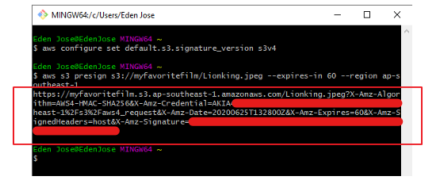


### S3 Lifecycle Policies

We can transition objects between storage classes in order to save money

- Infrequently access documents should be moved to STANDARD_ID
- Objects that don't need real-time access should be moved to GLACIER or DEEP_ARCHIVE
- Moving objects can be done manually or can be done via a lifecycle configuration
- Rules can be applied for a certain prefix
- Rules can be created for certain object tags    

**Transaction Actions**
Transaction actions define when should objects be transitioned from one storage to another

- Move objects to Standard IA class 60 days after creation
- Moveto Glacier for archiving after 6 months

**Expiration actions**
Expiration actions deletes objects after a given time.
- Can be used to delete old versions of files if versioning is enabled on the bucket
- Can be used to clean-up incomplete multi-part uploads

### S3 Lock Policies

**S3 Object Lock**
Implements WORM (Write Once Read Many Model) model, meaning that it guarantees that a file is only written once and it can not be deleted until the lock is removed

**Glacier Vault Lock**
Same WORM model is implemented, locket file can not be changed as long as the lock is active. Helpful for compliance and data retention

### S3 Event Notifications 

Amazon S3 Event Notifications can be used to receive notifications when certain events happen in your S3 bucket. 

- To enable notifications, add a notification configuration that identifies the events that you want Amazon S3 to publish. 

- Make sure that it also identifies the destinations where you want Amazon S3 to send the notifications. 

- Store this configuration in the notification subresource that's associated with a bucket. 

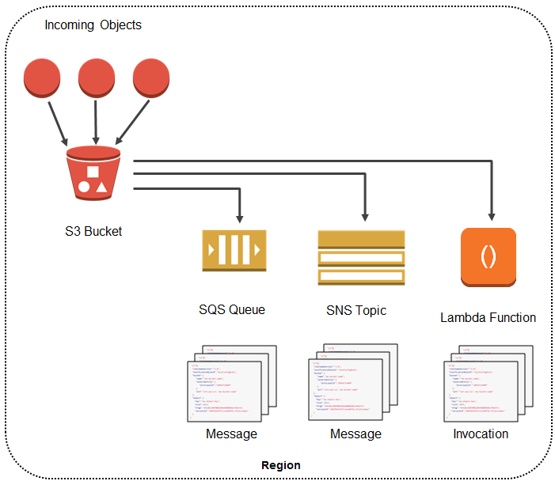

Currently, Amazon S3 can publish notifications for the following events:

- New object created events
- Object removal events
- Restore object events
- Reduced Redundancy Storage (RRS) object lost events
- Replication events
- S3 Lifecycle expiration events
- S3 Lifecycle transition events
- S3 Intelligent-Tiering automatic archival events
- Object tagging events
- Object ACL PUT events

Amazon S3 can send event notification messages to the following destinations. 

- Amazon Simple Notification Service (Amazon SNS) topics
- Amazon Simple Queue Service (Amazon SQS) queues
- AWS Lambda function
- Amazon EventBridge


### S3 Security 

**User based security**
- Use IAM policies to specify which calls are allowed for a specified user from IAM console

**Resource based security**

- Use bucket policies which are bucket wide rules from the S3 console. 
- These rules may allow cross account access to the bucket
- We also have Object Access Control Lists (ACL) and Bucket Access Control Lists which allow finer grain control over the bucket

- An IAM principal can access an S3 object if:
    - The user IAM permission allows it or the resource policy allows it
    - The is no explicit deny

#### Bucket Policies

- Bucket policies are JSON based documents
- They can be applied to both buckets and objects in buckets
- The effect of a statement in the bucket policy can be either allow or deny
- The principle in the policy represents the account or the user for which the policy applies to
- Common use cases for S3 bucket policies:
    - Grant public access to the bucket
    - Force objects to be encrypted at the upload
    - Grant access to another account (cross account access)

#### Bucket Settings for Block Public Access

- Relatively new settings that was created to block public access to buckets and objects if the account has some restrictions:
- S3 provides 4 different kind of block public access settings:
    - new access control lists
    - any access control lists
    - new public bucket or access point policies
    - block public and cross-account access to buckets and objects through any public bucket or access point policies
- These settings were created to prevent company data leaks

#### Other Security Features

**Networking**

- S3 supports VPC Endpoints (for instances in VPC without internet access)

**Logging and Audit**

- S3 Access Logs can be stored in other S3 buckets
- API calls can be logged in AWS CloudTrail

**User Security**

- MFA Delete can be required in versioned buckets in order to protect for accidental deletions
- Pre-Signed URLs: ULRs that are valid only for a limited time


### S3 Object Encryption

#### Encryption at rest

For protecting data at rest in Amazon S3, you have the following options:

**SSE-S3**

- Encrypts S3 objects using keys handled and managed by AWS
- Keys used for encryption is managed by Amazon S3
- Objects are encrypted in the server side
- It uses AES-256 encryption
- In order to have SSE-S3 encryption clients must set a header, which is x-amz-server-side-encryption": "AES256"

**SSE-KMS**

- Encryption keys are handled and managed by KMS
- KMS allows the manage which keys will be used for the encryption, - Uses audit trails in to see who was using the KMS key
- Objects are encrypted in the server-side
- In order to have SSE-S3 encryption clients must set a header, which is x-amz-server-side-encryption": "aws:kms"

**SSE-C**

- Server side encryption using data keys provided by the user from the outside of AWS
- Amazon S3 does not store the encryption key provided by the user
- Data should be transmitted through HTTPS, because a key is sent the AWS
- Encryption key must be provided in the header of the request for every request
- When retrieving the object, the same encryption key must be provided in the header

**Client Side Encryption**

- Data must be encrypted before sending it to S3
- This is usually accomplished by using a third party encryption library, like Amazon S3 Encryption Client
- The user is solely responsible for encryption-decryption
- The keys and the encryption cycle is managed by the user

#### Encryption in transit

- Amazon S3 exposes:
    - HTTP endpoint for non-encrypted data
    - HTTPS endpoint for encryption in flight which relies on SSL/TLS
- Most clients for S3 will use HTTPS by default
- In case of SSE-C encryption HTTPS in mandatory

### S3 Storage Classes

- Amazon S3 Standard-General Purpose
- Amazon S3 Standard-Infrequent Access (IA)
- Amazon S3 One Zone-Infrequent Access
- Amazon S3 Intelligent Tiering
- Amazon Glacier
- Amazon Glacier Deep Archive
- AmazonS3 Reduced Redundancy Storage (deprecated)

#### S3 Standard - General Purpose

- High durability (13 nines SLA) of objects across multiple AZ
- SLA: if we store 10 million objects in S3, we can expect to loose on average a single file per 10K years
- 99.99% availability per year
- It can sustain 2 concurrent facility failures

#### S3 Standard - Infrequent Access

- Suitable for data that is less frequently accessed, but it should be retrieved quickly when it is needed
- Same durability as General Purpose, 99.9% availability
- Lower cost than General Purpose

#### S3 One Zone - Infrequent Access

- Same as Standard IA, but data is stored in a single AZ
- Same durability as Standard IA. Data can be lost if an AZ goes down
- 99.5% availability per year
- Lower cost than IA

#### S3 One Zone - Intelligent Tiering

- Automatically moves objects between two access tiers based on access patterns
- Has a small monthly monitoring fee
- Same durability as General Purpose, having availability of 99.9%

#### S3 Glacier

- Low cost object storage for archiving/backup data
- Data is retained for longer terms (10s of years)
- Alternative to on-premise magnetic tape
- Same durability as General Purpose
- Cost per storage per month is really low, but we pay for data retrieval as well
- Each item in Glacier is called an **archive**, archives are stored in **Vaults**
- Provides 3 retrieval options:
    - Expedited (1 to 5 minutes): costs $10
    - Standard (3 to 5 hours)
    - Bulk (5 to 12 hours)
- Minimum storage duration for Glacier is 90 days

#### S3 Glacier Deep Archive

- For very long term storage - cheaper than S3 Glacier
- Retrieval options:
    - Standard (12 hours)
    - Bulk (48 hours)
- Minimum storage duration is 180 days

### S3 Performance Optimization

**Baseline Performance**
Amazon S3 automatically scales to high request rates, having latency of 100-200ms to get the first byte out of S3

- 3500 PUT/COPY/POST/DELETE requests per second per prefix in a bucket
- 5500 GET/HEAD requests per second per prefix in a bucket

Prefix explained:
- Example of a file in a bucket: `my-bucket/folder/subfolder/file`
- Prefix in this case is: `/folder/subfolder/`
- Request performance will apply to each prefix separately

**Single PUT Upload**

- Objects uploaded to S3 are sent as a single stream by default.
- If the stream fails, the upload fails and requires a restart of the transfer.
- Single PUT upload up to 5GB

**Multipart Upload**

- Data is broken up into smaller parts and uploaded in parallel.
- Recommended to be used for files bigger than 100MB
- Mandatory for files bigger than 5GB
- Upload can be split into maximum of 10,000 parts.
    - Each part can range between 5MB and 5GB.
    - Last leftover part can be smaller than 5MB as needed.
- Parts can fail in isolation and restart in isolation.
- The risk of uploading large amounts of data is reduced.
- Improves transfer rate to be the speed of all parts.

|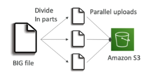|
|-|

**S3 Accelerated Transfer**

- Off by default.
- Uses tAWS edge locations to speed up transfer.
- Compatible with multi-part upload.
- Bucket name cannot contain periods.
- Name must be DNS compatible.
- Benefits improve the larger the location and distance.
    - The worse the start, the better the performance benefits.

|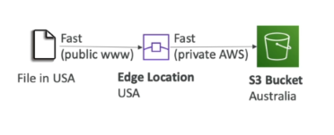|
|-|

**S3 Byte-Range Fetches**    

- Can be used to speed up downloads by parallelizing GET requests. 
- Can be used to retrieve only a part of the file

|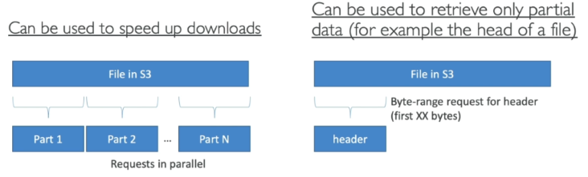|
|-|

**KMS Limitation**

- S3 Performance can be affected by KMS limits
- If encryption is enabled using SSE-KMS, we get additional requests to KMS which will apply to our KMS quota
- KMS could throttle performance, as of today we can not request a quota increase for it

### S3 Select and Glacier Select

This provides a ways to retrieve parts of objects and not the entire object.

- If you retrieve a 5TB object, it takes time and consumes 5TB of data. Filtering at the client side doesn't reduce this cost.

- S3 and Glacier select lets you use SQL-like statements to select part of the object which is returned in a filtered way. 

- The filtering happens at the S3 service itself saving time and data.

- We can filter by rows and columns. SQL statements should be simple, we can not have joins

- The purpose of S3 Select is to use less network traffic

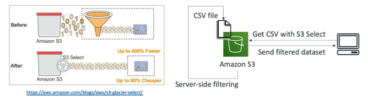


### AWS Athena

The source data is stored on S3 and Athena can read from this data. In Athena you are defining a way to get the original data and defining how it should show up for what you want to see.

- Serverless service to perform analytics directly against S3 files
- Uses schema-on-read, the original data is never changed and remains in its original form.
- The schema which you define in advance, modifies data in flight when its read.
- It provides a JDBC/ODBC driver

**How Athena works**

- Tables are defined in advance in a data catalog and data is projected when read. 

- It allows SQL-like queries on data without transforming the data itself.

- This can be saved in the console or fed to other visualization tools.

- Original data setis optimized which reduces the amount of space used for the data and the costs for querying that data.

**Pricing**

- We are charged per query amount of data scanned, we are billed for what are we using

**Supported file formats**

- csv, json, orc, Avro, Parquet. 
- In the back-end it uses Presto query engine

**Uses cases** 

- Business intelligence
- Analytics
- Reporting
- Log analysis

## AWS Snowball Family

Designed to move large amounts of data IN and OUT of AWS. Physical storage the size of a suitcase or truck. Ordered from AWS, use, then return.


|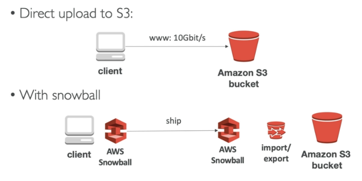|
|-|


### Snowball

- Any data on Snowball uses KMS at rest encryption.
- 1 Gbps or 10 Gbps connection
    - 50TB or 80TB Capacity.
    - 10TB to 10PB of data is economical range.
- Good for multiple locations
- No compute

### Snowball Edge

- Includes both storage and compute
- Larger capacity vs snowball.
- Faster networking over Snowball
    - 10 Gbps or up to 100 Gbps

**Types of Snowball Edge**

- **Storage optimized**
    - 80TB storage, 24 vCPU, 32 GiB RAM
    - (with EC2) includes 1TB SSD

- **Compute optimized**
    - 100TB storage, 7.68 GB NVME (fast PCI bus storage),52 vCPU, 208 GiB RAM

- **Compute with GPU**
    - Same as compute, but with GPU

### Snowmobile

Portable data center within a shipping container on a truck. This is a special order and is not available in high volume. Ideal for single location where 10 PB+ is required. Max is 100 PB per snowmobile.

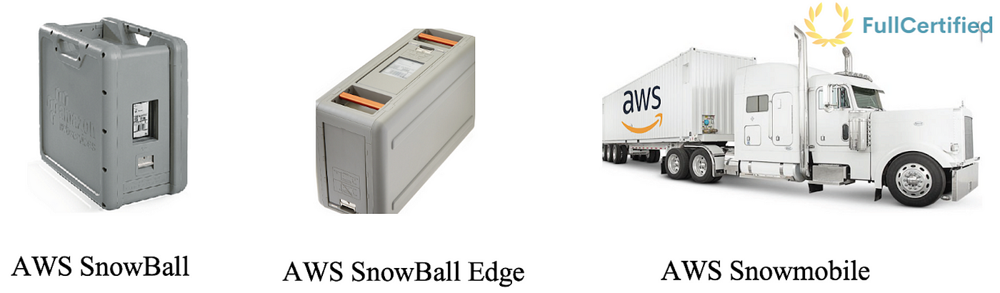

## AWS Storage Gateway

### Hybrid Cloud for Storage

- Hybrid cloud:
    - Part of a company's infrastructure is in the public cloud (like AWS)
    - Part of a company's infrastructure is on-premise
- S3 is a proprietary storage technology (unlike EFS/NFS), it can be exposed to on-premise servers through a storage gateway

||
|-|

### Storage Gateway

Bridge between on-premise data and cloud data in S3
- Uses cases for storage gateway with S3: disaster recovery, backup and restore, tiered storage
- AWS provides 3 types of storage gateways:
    - File Gateway
    - Volume Gateway
    - Tape Gateway

|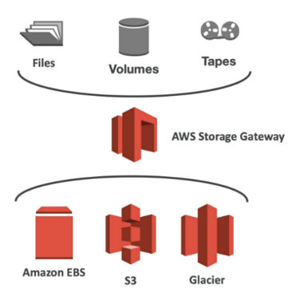|
|-|

#### File Gateway

- Configured S3 buckets are accessible using NFS and SMB protocols
- Supports S3 Standard, S3 IA, One Zone IA
- Each buckets will have its own IAM roles in order to be accessed by the file gateway
- Most recently used data is cached in the file gateway
- File Gateway can be mounted on many servers (because of the NFS protocol)

|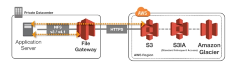|
|-|

#### Volume Gateway

- Block storage using iSCSI protocol backed by S3
- EBS snapshots are created time to time which are stored in S3, these will help use to restore un-premise volumes
- Cached volumes: low latency access to the most recently used data
- Stored volumes: entire dataset is on premise, scheduled buckets are stored in S3
- Volumes are usually mounter using iSCSI protocol, for on-premise it will look like a local volume

|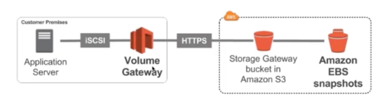|
|-|

#### Tape Gateway

- Some companies have backup processes using physical tapes
- With tape gateway these companies can use the same process, but the data will backed into the cloud
- Virtual Tape Library (VTL) backed by Amazon S3 and Glacier
- Backup processes using iSCSI interface will work as well with tape gateway

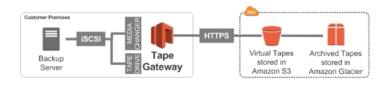

#### File Gateway Hardware Appliance

- Using file gateway means we need virtualization, otherwise we can use a **File Gateway Hardware Appliance**
- It is an actual hardware which can be bought from amazon.com
- Helpful for daily NFS backup in small data centers

## Amazon FSx

### Amazon FSx for Windows

- EFS is a shared POSIX file system for Linux, meaning it can not be used with Windows
- FSx for Windows is a fully managed Windows file system share drive
- Supports SMB protocol and Windows NTFS
- It has Active Directory integration, ACLs and user quotas
- It is built on top of SSD, it can scale up to 10s of GB/s, millions of IOPS and 100s PB of data
- It can accessed from on-premise infrastructure
- It can be configured to be Multi-AZ (high availability)
- Data is backed-up daily to S3

### Amazon FSx for Lustre

- Lustre is a type of parallel distributed file system for large-scale computing
- Lustre is derived from "Linux" and "cluster"
- FSx for Lustre is used with machine learning and **High Performance Computing (HPC)**, example: video processing, financial modelling, electronic design automation
- Scales up to 100s GB/s, millions of IOPS, sub-ms latencies
- It has seamless integration with S3
    - Can "read" S3 as a file system
    - Can write the output of the computations back to S3
- It can be used with on-premise servers

## AWS DataSync

- Data transfer service TO and FROM AWS.
- This is used for migrations or for large amounts of data processing transfers.
- Designed to work at huge scales. Each agent can handle 10 Gbps and each job - can handle 50 million files.
- Transfers metadata and timestamps
- Each agent is about 100 TB per day.
- Can use bandwidth limiters to avoid customer impact
- Supports incremental and scheduled transfer options
- Compression and encryption in transit is also supported
- Has built in data validation and automatic recovery from transit errors.
- AWS service integration with S3, EFS, FSx for Windows servers.
- Pay as you use product.

**AWS DataSync Components**

Task
- job within datasync
- defines what is being synced how quickly
- defines two locations involved in the job

Agent
- software to read and write to on prem such as NFS or SMB
- used to pull data off that store and move into AWS or vice versa

Location
- every task has two locations FROM and TO
- example locations:
    - network file systems (NFS), common in Linux or Unix
    - server message block (SMB), common in Windows environments
    - AWS storage services (EFS, FSx, and S3)