# AWS Serverless 

> <small>This is not an exhaustive documentation of all the existing AWS Services. This is just my summarized study notes for the AWS Certifications.</small>
> <small>To see the complete documentation, please go to: [AWS documentation](https://docs.aws.amazon.com/)</small>


- [What is Serverless](#what-is-serverless)
- [Serverless in AWS](#serverless-in-aws)
- [AWS Lambda](#aws-lambda)
    - [Benefits](#benefits)
    - [Supported Languages](#supported-languages)
    - [AWS Lambda Integrations](#aws-lambda-integrations)
    - [AWS Lambda Pricing](#aws-lambda-pricing)
    - [AWS Lambda Limits - per region](#aws-lambda-limits---per-region)
    - [AWS Lambda Configuration](#aws-lambda-configuration)
    - [Concurrency](#concurrency)
    - [Throttling](#throttling)
    - [Retries and Dead Letter Queue DLQ](#retries-and-dead-letter-queue-dlq)
    - [Monitoring and Tracing](#monitoring-and-tracing)
    - [Best Practices](#best-practices)
- [AWS Lambda@Edge](#aws-lambdaedge)
- [Amazon DynamoDB](#amazon-dynamodb)
    - [How DynamoDB works](#how-dynamodb-works)
    - [Supported data types](#supported-data-types)
    - [Provisioned Throughput](#provisioned-throughput)
    - [DynamoDB DAX - DynamoDB Accelerator](#dynamodb-dax---dynamodb-accelerator)
    - [DynamoDB Streams](#dynamodb-streams)
    - [Concurrency](#concurrency)
    - [Throttling](#throttling)
    - [Basic APIs](#basic-apis)
    - [Consistency Model](#consistency-model)
    - [Primary Keys](#primary-keys)
    - [New Features](#new-features)
    - [Other Features](#other-features)
- [Amazon API Gateway](#amazon-api-gateway)
    - [Integrations](#integrations)
    - [Mapping Templates](#mapping-templates)
    - [Deployment Stages](#deployment-stages)
        - [Stage variables](#stage-variables)
        - [Canary Deployment](#canary-deployment)
    - [Caching API Responses](#caching-api-responses)
    - [Endpoint Types](#endpoint-types)
    - [Logging, Monitoring, Tracing](#logging-monitoring-tracing)
    - [API Gateway - Cross-Origin Resource Sharing](#api-gateway---cross-origin-resource-sharing)
    - [Limit customer usage](#limit-customer-usage)
        - [Usage Plans](#usage-plans)
        - [API Keys](#api-keys)
    - [Security](#security)
        - [IAM](#iam)
        - [Lambda Authorizer Custom Authorizer](#lambda-authorizer-custom-authorizer)
        - [Cognito User Pools](#cognito-user-pools)
- [AWS Cognito](#aws-cognito)
    - [AWS Cognito User Pools](#aws-cognito-user-pools)
    - [AWS Cognito Federated Identity Pools](#aws-cognito-federated-identity-pools)
    - [AWS Cognito Sync - Deprecated](#aws-cognito-sync---deprecated)
- [AWS SAM - Serverless Application Model](#aws-sam---serverless-application-model)
- [Serverless Architectures](#serverless-architecture)
    - [Mobile App: MyTodoList](#mobile-app-mytodolist)
    - [Mobile App: REST API Layer](#mobile-app-rest-api-layer)
    - [Mobile App: Giving users access to S3](#mobile-app-giving-users-access-to-s3)
    - [Mobile App: High-read Throughput, Static data](#mobile-app-high-read-throughput-static-data)
    - [Mobile App: Caching at the API Gateway](#mobile-app-caching-at-the-api-gateway)
    - [Website: MyBlog.com](#website-myblogcom)


## What is Serverless 

A serverless architecture is a way to build and run applications and services without having to manage infrastructure. Your application still runs on servers, but all the server management is done by the cloud provider.

- Initially Serverless = FaaS (Function as a Service), but now it can mean a lot more
- Serverless was pioneered by AWS Lambda but now the concept also includes anything that is not managed: databases, messaging, storage, etc.

## Serverless in AWS

- AWS Lambda
- DynamoDB
- AWS Cognito
- AWS API Gateway
- Amazon S3
- AWS SNS and SQS
- AWS Kinesis Data Firehose
- Aurora Serverless
- Step Functions
- Fargate

## AWS Lambda

AWS Lambda is a serverless, event-driven compute service that lets you run code for virtually any type of application or backend service without provisioning or managing servers. 

- AWS Lambda Functions are virtual functions, which means there are no servers to manage
- There are limited to time - they require short execution times
- They run on-demand - we are only billed when the function is running
- Scaling is automated

### Benefits 

- Lambda is integrated with the AWS suite of services
- It supports a lot of programming languages
- Easy monitoring through AWS CloudWatch
- Easy to get more resources per functions (up to 3GB or RAM)
- Increasing the RAm will also increase the CPU and network
- Easy pricing
    - Pay per request and compute time
    - Generous free tier: 1 million AWS requests for free and 400K GBs compute time

### Supported Languages

- NodeJS (JavaScript)
- Python
- Java
- C# (.NET Core and PowerShell)
- Golang
- Ruby
- Custom Runtime API (community supported, example Rust)    

### AWS Lambda Integrations

Main ones:

- API Gateway
- Kinesis
- DynamoDB
- S3
- CloudFront
- CloudWatch Events and EventBridge
- CloudWatch Logs
- SNS and SQS
- AWS Cognito

### AWS Lambda Pricing

<small>Reference: https://aws.amazon.com/lambda/pricing/</small>

- Pay per call:
    - First 1 million requests are free
    - $0.20 per 1 million requests

- Pay per duration:
    - 400K GB-seconds of compute time for free which means 400K seconds of running time if the function has 1GB of RAM, 3.2 million of seconds if the function requires 128 MB of RAM
    - After that $1 for 600K GB-seconds

### AWS Lambda Limits - per region

**Execution**

- Memory allocation: 128 MB - 3008 MB (64 MB increments)
- Maximum execution time: 900 seconds (15 minutes)
- Environment variables: 4 KB
- Disk capacity in the function container (`/tmp`): 512 MB
- Concurrent executions: 1000 per account (can be increased after a request)

**Deployment**

- Lambda function deployment size (compressed.zip): 50 MB
- Uncrompressed deployment size: 250 MB
- We can use `/tmp` directory to load other files at the startup    

### AWS Lambda Configuration 


Configuration | Description
---------|----------
 Timeout | default 3s, max of 300s |
 Environment variables | variables that can be used by the function | 
 Allocated Memory | 128MB, up to 3GB |
 VPC | Lambda function can be attached to a VPC + security groups |
 IAM Execution Role | IAM Role used by the function |

### Concurrency  

- Concurrency up to 1000 executions
- Limit can be increased by raising a AWS Support ticket
- Each invocation over the concurrency limit will trigger a throttle

### Throttling 

- If synchronous invocation - will return **ThrottleError 429**
- If asynchronous invocation - will retry automatically and then go to DLQ

### Retries and Dead Letter Queue (DLQ)

- If a Lambda function asynchronous invocation fails, it will be retried twice 
- After all retries, unprocessed events go to DLQ 
- DLQ can be an SNS Topic or a SQS Queue 
- The original event payload is sent to DLQ 
- This makes it easy to debug what's wrong with the function

### Monitoring and Tracing 

**CloudWatch**

- AWS Lambda execution logs are stored in AWS CloudWatch Logs 
- AWS Lambda metrics are displayed in AWS CloudWatch Metrics 

**X-ray**

- Lambda code can be traced using X-Ray 
- Use AWS SDK in the code 
- Ensure Lambda function has correct IAM execution role

### Best Practices 

- Perform heavy-duty work outside of your function handler 
- Use environment variables 
- Minimize your deployment package size to it runtime necessities 
- Avoid using recursive code 
- Don't attach a Lambda function to a VPC unless you have to


## AWS Lambda@Edge

Used for running global Lambda functions alongside edge locations (for CDN for example)

**Changing CLoudFront requests and responses**

- After CloudFront receives a request from a  viewer (viewer request)
- Before CloudFront receives the request from the origin (origin request)
- After CloudFront receives the response from the origin (origin response)
- Before CloudFront forwards the response to the viewer (viewer response)
- Customize the CDN content

**Use cases**

- Website security and privacy
- Dynamic Web Application at the Edge
- Search Engine Optimization (SEO)
- Intelligent Route across origins and data centers
- Bot mitigation at the Edge
- Real-time image transformation
- A/B testing
- User authentication and authorization
- User prioritization
- User tracking and analytics

## Amazon DynamoDB

Amazon DynamoDB is a fully managed NoSQL database service that provides fast and predictable performance with seamless scalability.

- Highly available with replication across 3 AZs
- NoSQL database - not a relational database
- Scales to massive workloads, distributed database
- Fast and consistent regarding performance 
- Low latency retrieval of data
- Integrated with IAM for security, authorization and administration
- It enables event driven programming with DynamoDB Streams
- It provides auto scaling capabilities at low cost

### How DynamoDB works

- DynamoDB is made of tables
- Each table has a primary key (must be decided at creation time)
- Each table can have an infinite number of items (rows)
- Each item has attributes which can be added over time (can be null)
- Maximum size of an item is 400KB


### Supported data types 

- Scalar types: 
    - string
    - number
    - binary
    - null
- Document types: 
    - list
    - map
- Set types: 
    - string set
    - number set
    - binary set

### Provisioned Throughput

- Table must have a provisioned read and write capacity units
- **Read Capacity Unit (RCU)**: throughput for reads ($0.00013 per RCU)
    - 1 RCU = 1 strongly consistent read of 4 KB per second
    - 1 RCU = 2 eventually consistent read of 4 KB per second
- **Write Capacity Unit (WCU)**: throughput for writes ($0.00065 per WCU)
    - 1 WCU =  1 write of 1 KB per second
- Option to setup auto-scaling of throughput to meet demand
- Throughput can be exceeded temporarily using burst credits
- If there are no more burst credits, we may get a "_ProvisionedThroughputExceptions_" in which case it is advised to do exponential back-off retry

### DynamoDB DAX - DynamoDB Accelerator

- Seamless cache for DynamoDB, no application re-write
- Write go through DAX to DynamoDB
- Micro second latency for cached reads and queries 
- Solves the Hot Key problem (too many reads on one value)
- Each cache entry has a 5 minute TTL by default
- We can get up 10 nodes per cluster for cache
- Multi AZ (3 nodes minimum recommended for production)
- It is secure (Encryption at rest with KMC, VPC, IAM, CloudTrail)

|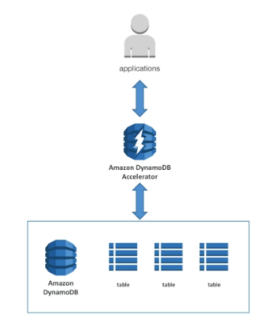|
|-|

### DynamoDB Streams

- Changes (Create, Update, Delete) can end up in a DynamoDB stream
- This stream can be read by AWS Lambda, we can do some integrations:
    - React to changes in real time (example: welcome email to new users)
    - Analytics
    - Create derivative tables/views
    - Insert into ElasticSearch
- We can implement cross region replication using Stream
- Streams has 24 hours of data retention


### Concurrency 

- DynamoDB has a feature called "Conditional Update/Delete" 
- This means you can ensure an item has not changed before altering it 
- This makes DynamoDB optimistic locking/concurrency database 

|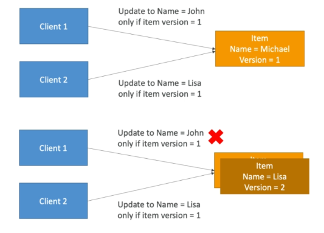|
|-|

### Throttling 

- If we exceed our RCU/WCU, we get "_ProvisionedThroughputException_"

- Reasons: 
    - Hot keys - one partition key is being read too many times
    - Very large items - RCU and WCU depend on size of items 
    - Hot partitions 

- Solutions:
    - Exponential backoff when exception is encountered (already in SDK)
    - Distribute partition keys as much as possible
    - If RCU issue, use DynamoDB DAX

### Basic APIs 

**DeleteItem**

- Delete an invidual row 
- Can perform conditional delete 

**DeleteTable**

- Delete whole table and all its items 
- Much quicker deletion than calling DeleteItem on all items 

**BatchWriteItem**

- Operations are done in parallel for better efficiency
- It's possible for part of batch to fail
- Up to 25 PutItem and/or DeleteItem in one call 
- Up to 16 MB of data written
- Up to 400 KB of data per item 

**GetItem**

- Read based on primary key
- Primary key = HASH or HASH-RANGE 
- Eventually consistent by default  
- Can use strongly consistent read, but will use more RCU, also takes longer 

**BatchGetItem**

- Up to 100 items 
- Up to 16 MB of data 
- Items are retrieved in parallel to minimize latency 

**Query**

- Returns item based on:
    - partition key value 
    - sort key value 
- Up to 1 MB of data 
- Able to do pagination 
- Can query table, a local secondary index, or a global secondary index 

**Scan**

- Scans the entire table and then filter out data - inefficient 
- Returns up to 1 MB of data 
- Use pagination to keep on reading 
- Consumes a lot of RCU 
- For faster performance, use parallel scans 


### Consistency Model 

**Eventually Consistent Read**

- If we read just after a write, it's possible we'll get unexpected response because of replication 
- Used by DynamoDb by default but the following API provide a ConsistentRead parameter which you can set to True 
    - GetItem
    - Query 
    - Scan

|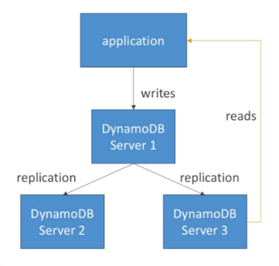|
|-|


### Primary Keys 

**Option 1: Partition key only (HASH)**

- Partition key must be unique for each iterm 
- Partition key must be diverse so that data is distributed 
- Example: user_id for a users table 

|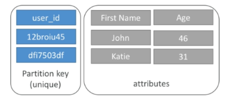|
|-|


**Option 2: Partition key + Sort key**

- Combination must be unique 
- Data is grouped by partition key 
- Sort key = range key 
- Example: users-game table 
    - user_id for partition key 
    - game_id for sort key

|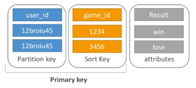|
|-|

### New Features

**Transactions**

- All or nothing type of operations
- We can coordinate insert, update and delete operations across multiple tables
- Include up to 10 unique items or up to 4MB of data per transaction

**On-demand**

- No capacity planning needed (WCU/RCU) - scales automatically
- It is 2.5x more expensive than provisioned capacity
- Helpful for spikes and unpredictable loads or if the application has a very low throughput

### Other Features

**Security**

- We get VPC endpoints to access DynamoDB without internet
- IAM policies
- Encryption at rest using AWS KMS
- Encryption at transit is handled by SSL/TLS

**Backup and restore**

- DynamoDB provides point in time restores  (just like any RDS)
- Backup does not have any performance impact on the tables

**Global tables**
- Multi region, fully replicated, high performance
    
**Replication**    
- Dynamo provides active-active replication
- To replicate data, DynamoDB Streams should be enabled
- Useful for low latency, DR purposes

**Migration**

- DMS can be used to migrate data to DynamoDB (from Mongo, Oracle, MySQL, st3, etc.)

## Amazon API Gateway

Amazon API Gateway is an AWS service for creating, publishing, maintaining, monitoring, and securing REST, HTTP, and WebSocket APIs at any scale. 

- Allows us to create REST APIs which are accessible by the clients
- AWS Lambda + API Gateway: No infrastructure to manage
- API Gateway provides support for WebSocket Protocol
- It handles API versioning (v1, v2, etc.)
- It handles different environment (dev, tets, prod)
- It handles security (authentication and authorization)
- Create API keys, handles request throttling
- Supports common standards: Swagger / Open API
- Transform and validate requests and responses
- Generate SDK and API specifications
- Cache API responses

### Integrations

|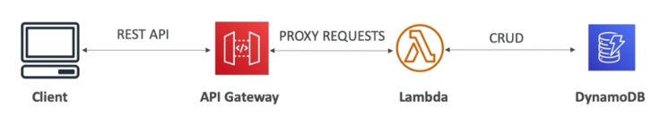|
|-|

**Outside of VPC**

- Lambda Functions
    - It can invoke Lambda functions
    - Easy way to expose REST API backed by AWS Lambda
- HTTP
    - Exposes HTTP endpoints in the back-end. 
    - Example: internal HTTP API on premise, Application Load Balancer, etc. 
    - Add features like rate limiting, user authentication, API keys to existing back-ends
- AWS Service
    - Expose any AWS API through API Gateway
    - Examples: API for starting a Step Function workflow, API for posting a message to SQS

**Inside of VPC**    

- AWS Lambda in your VPC 
- EC2 endpoints in yoru VPC 

### Mapping Templates 

- Can be used to modify requests/responses 
- Rename parameters 
- Modify body content 
- Add headers 
- Map JSON to XML for sending to backend 

### Deployment Stages 

- Changes are deployed in "Stages"
- Each stage has its own configuration parameters 
- Stages can be rolled back as a history of deployments is kept 

#### Stage variables

- Similar to environment variables 
- Use them to change often-changing configuration values 
- Passed to the "context" object in AWS Lambda 
- They can be used in:
    - Lambda function ARN
    - HTTP Endpoint 
    - Parameter mapping templates 
- Can also be used to indicate corresponding Lambda alias 

|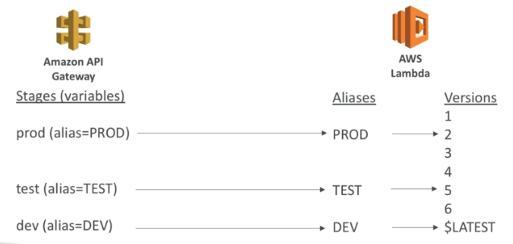|
|-|

#### Canary Deployment

- Can be enabled for any stage (usually prod)
- Choose the percent of traffic the canary channel receives 
- metrics and logs are separate for better monitoring 
- stage variables can be overridden 


<p>
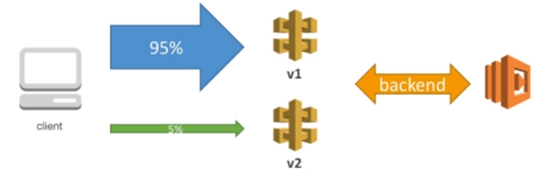
</p>


### Caching API Responses 

- Caching reduces the number of calls made to the backend 
- Defatul TTL is 330s, max 3600s 
- Caches are defined per stage 
- Cache capacity between 0.5 GB to 237 gb 
- Cache settings for specific methods can be overriden 
- Entire cache can be flused or invalidated immediately 
- Clients can invalidate the cache using the header **Cache-Control: max-age=0**

|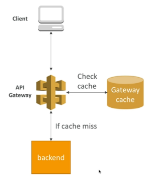|
|-|

### Endpoint Types

**Edge-Optimized (default)**

- For global clients
- Requests are routed through the CloudFormation Edge locations
- The API Gateway still lives in only one region

**Regional**
- For clients within the same region
- Could manually be combined with CloudFront having more control over caching strategies and distributions

**Private**
- Can only be accessed from a VPC using an ENI
- We can use resource policies to define access

### Logging, Monitoring, Tracing 

**CloudWatch Logs**

- Enable CloudWatch logging at the stage level (with log level)
- Can override settings on a per API basis 
- Log contains information about request/resposne body 

**CloudWatch Metrics**

- Metrics are by stage
- Detailed metrics can be enabled 

**X-ray**

- Enable tracing to get extra information about requests 
- X-Ray + API Gateway + AWS Lambda gives you the full picture 

### API Gateway - Cross-Origin Resource Sharing 

- CORS must be enabled when you receive API calls from another domain 
- Can be enabled through the console 
- OPTIONS pre-flight requests must contain the following headers:
    - Access-Control-Allow-Methods 
    - Access-Control-Allow-Headers 
    - Access-Control-Allow-Origin

### Limit customer usage 

#### Usage Plans 

- Set overall capacity and burst capacity (Throttle)
- Set number of requests that can be made per day/week/month (Quotas)
- Associate with desired API stages 

#### API Keys 

- Generate one per customer 
- Associate with usage plans 
- Track usage for API keys

### Security

#### IAM 

- Great for user/roles already within an AWS account
- Handles authentication + authorization
- Leverages Sig v4
- Give access to an API by creating an IAM policy authorization and attach it to an User/Role
- API Gateway verifies IAM permissions passed by the calling application
- Good practice to provide access within own infrastructure
- It leverages Sig v4 signatures by adding the signature to a header 

|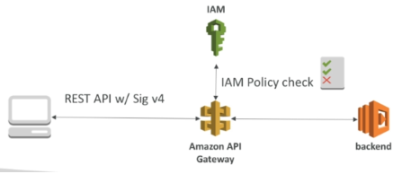|
|-|

#### Lambda Authorizer (Custom Authorizer)

- Great for 3rd party tokens
- Very flexible in terms of what IAM policy is returned
- Handles authentication + authorization
- Helps to use OAuth/SAML/3rd party type of authentication
- Uses AWS Lambda to validate the token from a header
- Optionally the result of the authentication can be cached
- The lambda must return an IAM policy for the user
- We pay per lambda invocation

|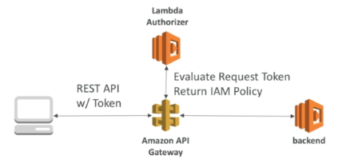|
|-|

#### Cognito User Pools

- Cognito will manage the full user lifecycle
- API gateway verifies identity automatically from AWS Cognito
- There is no need to write custom code
- Cognito only helps with authentication, not authorization
- Authorization in the backend must be implemented

|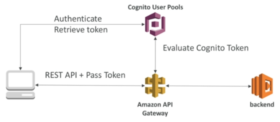|
|-|


## AWS Cognito 

Cognito is used for giving users an identity to be able to communicate with a system.

**Cognito User Pools:**

- Sign in functionality for the app users
- Integrates with API Gateway

**Cognito Identity Pool (Federated Identity):**

- Provides AWS credentials to users which want to access AWS resources directly
- Integrates with Cognito User Pools as an identity provider

**Cognito Sync:**

- Used for synchronize data from a device to Cognito
- Deprecated, replaced by AppSync

### AWS Cognito User Pools

- Serverless database for users of an application
- Simple login provider: username (or email) / password combination
- Possibility to verify emails/phone numbers and add MFA
- Can enable Federated Identities (Facebook, Google, SAML, etc.). **This is not the same CIP (AWS Federated Identity)!**
- Sends back a JSON Web Token (JWT)
- Can be integrated with API Gateway for authentication

|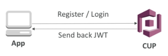|
|-|


### AWS Cognito Federated Identity Pools

- Provide direct access to AWS resources from the client side
- Log in to a federated identity provider - or remain anonymous
- Get temporary AWS credentials from the Federated Identity Pool
- These credentials come with pre-defined IAM policies stating their permissions
- Examples:
    - Provide temporary access to write to a S3 bucket using Facebook login

|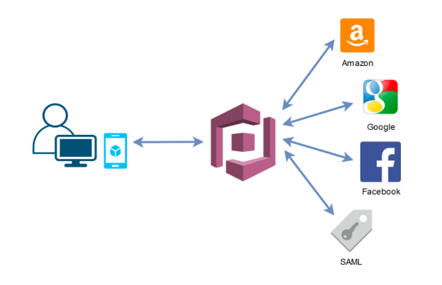|
|-|    

### AWS Cognito Sync - Deprecated

- Deprecated - use AWS AppSync
- Can be used for cross device synchronization from any platform: iOS, Android, etc.
- It provides some offline capabilities, synchronization will happen when the device will come online
- **Requires Federated Identity Pool in Cognito (not User Pool!)**
- Data is stored in datasets, each dataset can have up to 1MB of data. We can have up to 20 datasets to synchronize


## AWS SAM - Serverless Application Model

It is framework for developing and deploying serverless applications in AWS.

- All the configuration for SAM is stored in YAML code. 
- The configurations can contain settings for:
    - Lambda Functions
    - DynamoDB tables
    - API Gateway
    - Cognito User Pools
- Deploy the services above automatically (similar to CloudFormation)
- Help to run Lambda, API Gateway and DynamoDB locally
- SAM can used CodeDeploy for quick deployments and pipelines

Here’s an example of a basic serverless application. This application processes requests to get all items from a database through an HTTP request. 

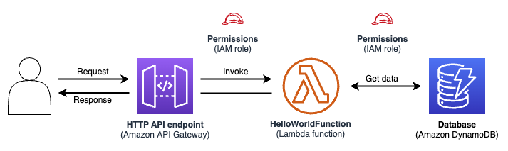

It consists of the following parts:

- A function that contains the logic to process the request.

- An HTTP API to serve as communication between the client (requestor) and the application.

- A database to store items.

- Permissions for the application to run securely.

This application's infrastructure code can be defined in the following AWS SAM template:

```bash
AWSTemplateFormatVersion: 2010-09-09
Transform: AWS::Serverless-2016-10-31
Resources:
  getAllItemsFunction:
    Type: AWS::Serverless::Function
    Properties:
      Handler: src/get-all-items.getAllItemsHandler
      Runtime: nodejs12.x
      Events:
        Api:
          Type: HttpApi
          Properties:
            Path: /
            Method: GET
    Connectors:
      MyConn:
        Properties:
        Destination:
          Id: SampleTable
          Permissions:
            - Read
  SampleTable:
    Type: AWS::Serverless::SimpleTable  
```

To learn more, please see [What is the AWS Serverless Application Model (AWS SAM)?](https://docs.aws.amazon.com/serverless-application-model/latest/developerguide/what-is-sam.html)


## Serverless Architecture 

### Mobile App: MyTodoList 

||
|-|

### Mobile App: REST API Layer

|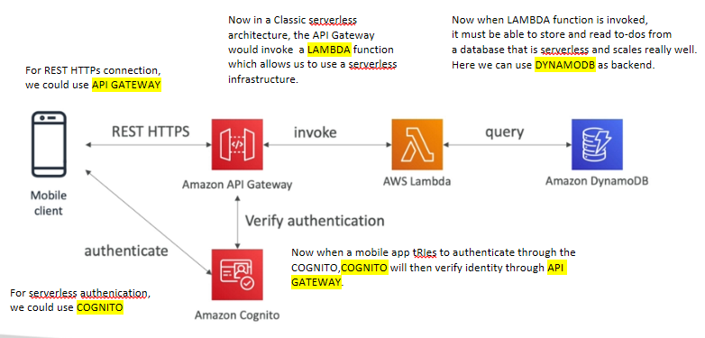|
|-|

### Mobile App: Giving users access to S3 

|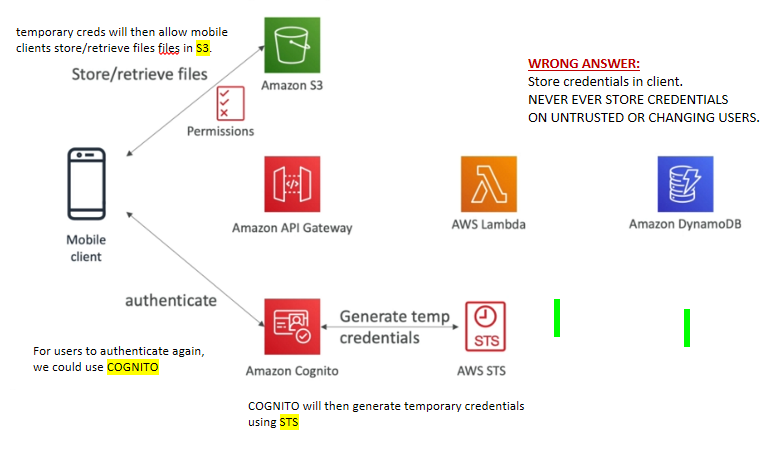|
|-|

### Mobile App: High-read Throughput, Static data 

|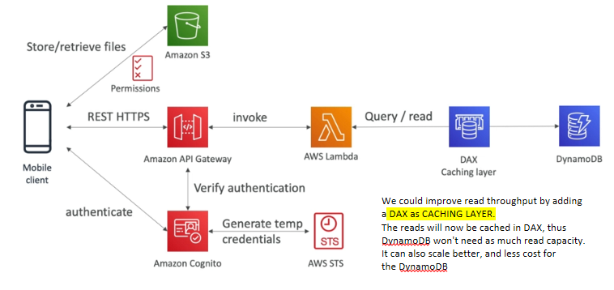|
|-|

### Mobile App: Caching at the API Gateway 

|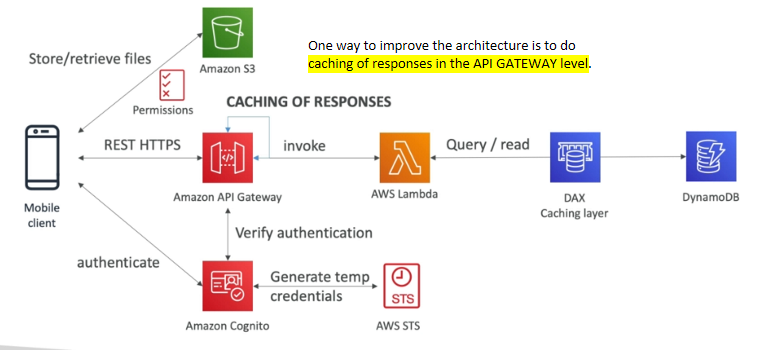|
|-|

### Website: MyBlog.com 

||
|-|
