# AWS Automation 

> <small>This is not an exhaustive documentation of all the existing AWS Services. This is just my quick summarized study notes for the AWS Certifications.</small>
> <small>To see the complete documentation, please go to: [AWS documentation](https://docs.aws.amazon.com/)</small>


- [AWS CLI: Command Line Interface](#aws-cli-command-line-interface)
- [SDK: Software Development Kit](#sdk-software-development-kit)
    - [Key points](#key-points)
    - [SDK Credentials Security](#sdk-credentials-security)
    - [Exponential Backoff](#exponential-backoff)
- [AWS Elastic Beanstalk](#aws-elastic-beanstalk)
    - [Elastic Beanstalk Under the Hood](#elastic-beanstalk-under-the-hood)
    - [Deployment Modes](#deployment-modes)
    - [Deployment Updates](#deployment-updates)
    - [Elastic Beanstalk CLI](#elastic-beanstalk-cli)
    - [Elastic Beanstalk Lifecycle Policy](#elastic-beanstalk-lifecycle-policy)
    - [Elastic Beanstalk Extensions](#elastic-beanstalk-extensions)
    - [Elastic Beanstalk Cloning and Migrations](#elastic-beanstalk-cloning-and-migrations)
    - [Elastic Beanstalk and Docker](#elastic-beanstalk-and-docker)
    - [Elastic Beanstalk and HTTPS](#elastic-beanstalk-and-https)
- [AWS CloudFormation](#aws-cloudformation)
    - [Benefits of CloudFormation](#benefits-of-cloudformation)
    - [How CloudFormation works](#how-cloudformation-works)
    - [Deploying CloudFormation templates](#deploying-cloudformation-templates)
    - [CloudFormation Stacks and StackSets](#cloudformation-stacks-and-stacksets)
    - [CloudFormation Building Blocks](#cloudformation-building-blocks)
    - [CloudFormation Resources](#cloudformation-resources)
    - [CloudFormation Parameters](#cloudformation-parameters)
    - [CloudFormation Mappings](#cloudformation-mappings)
    - [When would you use Mapping vs. Parameters?](#when-would-you-use-mapping-vs-parameters)
    - [CloudFormation Outputs](#cloudformation-outputs)
    - [Cross Stack Reference](#cross-stack-reference)
    - [CloudFormation Conditions](#cloudformation-conditions)
    - [CloudFormation Transforms](#cloudformation-transforms)
    - [CloudFormation Intrinsic Functions](#cloudformation-intrinsic-functions)
    - [CloudFormation Rollbacks](#cloudformation-rollbacks)
- [Continuous Integration / Continuous Delivery](#continuous-integration--continuous-delivery---basics)
    - [Why use CICD?](#why-use-cicd)
    - [AWS Services for CICD](#aws-services-for-cicd)
- [AWS CodeCommit](#aws-codecommit)
    - [Github vs. CodeCommit](#github-vs-codecommit)
    - [AWS CodeCommit Security](#aws-codecommit-security)
    - [AWS CodeCommit Notifications](#aws-codecommit-notifications)
- [AWS CodeBuild](#aws-codebuild)
    - [CodeBuild Supported Environments](#codebuild-supported-environments)
    - [How does CodeBuild work?](#how-does-codebuild-work)
    - [CodeBuild BuildSpec](#codebuild-buildspec)
    - [CodeBuild Local Build](#codebuild-local-build)
- [AWS CodeDeploy](#aws-codedeploy)
    - [CodeDeploy - How it works](#codedeploy---how-it-works)
    - [CodeDeploy - Additional information](#codedeploy---additional-information)
    - [CodeDeploy - Primary Components](#codedeploy---primary-components)
    - [CodeDeploy AppSpec](#codedeploy-appspec)
    - [CodeDeploy Deployment Config](#codedeploy-deployment-config)
    - [Deployment types](#deployment-types)
    - [CodeDeploy to EC2](#codedeploy-to-ec2)
    - [CodeDeploy to ASG](#codedeploy-to-asg)
    - [CodeDeploy Rollbacks](#codedeploy-rollbacks)
- [AWS CodePipeline](#aws-codepipeline)
    - [CodePipeline Artifacts](#codepipeline-artifacts)
    - [CodePipeline Troubleshooting](#codepipeline-troubleshooting)


## AWS CLI: Command Line Interface

Add user credentials locally using this command:

```bash
aws configure  
```

If you are using multiple AWS accounts, you can add custom profiles with seperate credentials using this command:

```bash
aws configure --profile {my-other-aws-account}  
```

If you you'd like to execute commands on a specific profile, example: 

```bash
aws s3 ls --profile {my-other-aws-account}
```
``

If you don't specify the aws profile, the commands will be executed to your **default** profile

**AWS CLI on EC2**

* IAM roles can be attached to EC2 instances
* IAM roles can come with a policy authorizing exactly what the EC2 instance should be able to do. This is the best practice.
* EC2 Instances can then use these profiles automatically without any additional configurations

**CLI STS Decode Errors**

- When you run API calls and they fail, you can get a long, encoded error message code 
- This error can be decoded using STS 
- run the command: 

    ```bash
    aws sts decode-authorization-message --encoded-message {encoded_message_code}  
    ```
- your IAM user must have the correct permissions to use this command by adding the `STS` service to your policy


## SDK: Software Development Kit

If you want to perform actions on AWS directly from your application's code without using a CLI, you can use an SDK.

Official SDKs:
- Java
- .NET
- Node.js
- PHP
- Python
- Ruby
- C++

### Key points 

- AWS SDK are required when coding against AWS Services such as DynamoDB
- Fact: AWS CLI uses the Python SDK (boto3)
- The exam expects you to know when you should use an SDK
- If you don’t specify or configure a default region, then us-east-1 will be chosen by default

### SDK Credentials Security

- It’s recommend to use the default credential provider chain
- The default credential provider chain works seamlessly with:
  - AWS credentials at ~/.aws/credentials (only on our computers or on premise)
  - Instance Profile Credentials using IAM Roles (for EC2 machines, etc...)
- Environment variables (AWS_ACCESS_KEY_ID, AWS_SECRET_ACCESS_KEY)
- Overall, NEVER EVER STORE AWS CREDENTIALS IN YOUR CODE.
- Use IAM Roles if working from within AWS Services to inherit credentials

### Exponential Backoff

- Any API that fails because of too many calls needs to be retried with Exponential Backoff
- These apply to rate limited API
- Retry mechanism is included in SDK API calls

|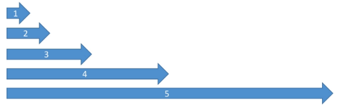|
|-|


## AWS Elastic Beanstalk

AWS Elastic Beanstalk is a developer centric view of deploying application on AWS.

- A managed service
- Instance configuration
- OS is handled by Beanstalk
- Deployment strategy is configurable but performed by Beanstalk
- Application code configurable
- It will leverage all the AWS components that we have gone over thus far:
  - EC2
  - ASG
  - ELB
  - RDS
  - Etc..
- Elastic Beanstalk is free but you pay for the underlying instances
- You deploy application versions to environments and can promote application versions to the next environment
- Rollback feature to previous application versions
- Full control over the lifecycle of environments

**Three architecture models**
- Single instance deployment: good for developers
- LB + ASG: great for production or staging web applications
- ASG only: great for non-web apps in production

**Three different components**
- Application
- Application Version (Each deployment gets assigned a version)
- Environment name (dev, staging, prod): free naming

**Support for many platforms**
- Go
- Java
- Python
- Node.js
- Ruby
- Single Container Docker
- Multi Container Docker
- Pre-configure Docker
- Write your own custom platforms (If the any of the above is not supported)

### Elastic Beanstalk Under the Hood

- Elastic Beanstalk uses CloudFormation under the hood
- We can take advantage of this by provisioning other resources from beanstalk
- We can place config files in the .ebextensions to provision basically anything we want

### Deployment Modes

**Single Instance deployment**
- Good for development, we get 1 ec2 instance in 1 ASG and 1 Elastic IP. 
- DNS names maps straight ot the Elastic IP

**High Availability with Load Balancer**
- Great for production, we have an ASG across multiple AZs

|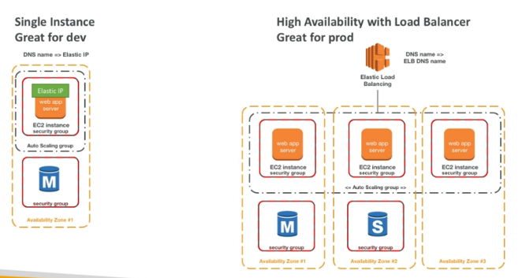|
|-|

### Deployment Updates

**All at once**
- We deploy all our applications in on go. Fastest, but instances have a downtime. 
- No additional cost is applied while deploying

<p align=center>
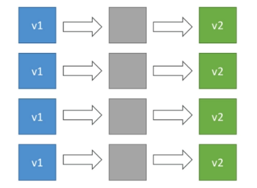
</p>


**Rolling**
- Update e few instances at a time, move onto next set of instances (bucket) if the first set was healthy. 
- The application will run bellow capacity for a given period (bucket size). 
- At some point the application will run both versions. 
- No additional cost is encountered during deployment

<p align=center>
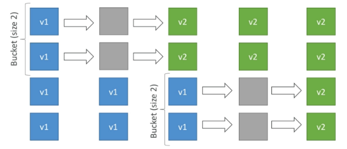
</p>


**Rolling with additional batches**
- Similar deployment procedure as the **rolling** approach with the difference of having an additional batch started at the beginning of deployment with the newer version of the application. 
- Afterwards, the older instanced are gradually moved to newer version. 
- While deploying, both application version will be running at the same time. 
- Minor additional cost may be encountered since the additional batch will be present until the deployment is finished.

<p align=center>
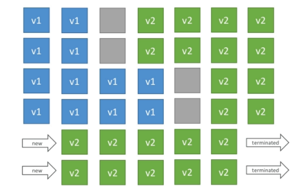
</p>


**Immutable**
- New version of the application is deployed to an entirely new ASG. 
- If the new version passes the initial validation, the old ASG is terminated. 
- Deployment will cause 0 downtime. 
- The additional cost encountered while deploying is the highest compared to other deployment types.

<p align=center>
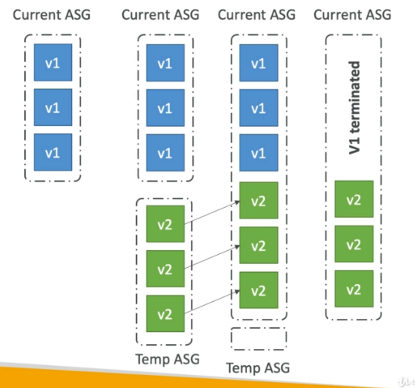
</p>


**Blue / Green Deployment**
- This is not a direct feature of Elastic Beanstalk
- Zero downtime and release facility
- Create a new staging environment and deploy your newest version there
- The new environment (green) can be validated independently and roll back if there's issues
- Route 53 can be setup using weighted policies to redirect a little bit of traffic to the staging environment
- Using the elastic beanstalk console, you can "swap URLs" when with the testing environment
- This is a manual feature, it's not directly embedded in EB

<p align=center>

</p>


### Elastic Beanstalk CLI

- We can install an additional CLI called the “EB cli” which makes working with Beanstalk from the CLI easier
- Basic commands are:
  - eb create
  - eb status
  - eb health
  - eb events
  - eb logs
  - eb open
  - eb deploy
  - eb config
  - eb terminate
- It’s helpful for your automated deployment pipelines!

### Elastic Beanstalk Lifecycle Policy

- Elastic Beanstalk can store at most 1000 application versions
- When this limit is reached, we wont be able to deploy a new version
- In order to be able to deploy again, we have to remove older versions
- To phase out old versions, we can use a lifecycle policy
- This policy can be based on:
  - Time (remove versions which are older than...)
  - Space (remove older versions if we have more versions than...)
- Currently used versions are not deleted
- There is an option to not delete source bundles from S3, only from beanstalk interface

### Elastic Beanstalk Extensions

- A zip file containing our code must be deployed to Elastic Beanstalk
- All the parameters set in the UI can be configured with code using files
- Requirements:
  - in the .ebextensions/ directory in the root of source code
  - YAML / JSON format
  - .config extensions (example: logging.config)
  - Able to modify some default settings using: option_settings
  - Ability to add resources such as RDS, ElastiCache, DynamoDB, etc...
- Resources managed by .ebextensions get deleted if the environment goes away
- The .ebextensions folder goes to the root of your project

### Elastic Beanstalk Cloning and Migrations

- We can clone an environment with the exact same configurations
- Can be useful for deploying "test" versions for our applications
- All resources and configurations are preserved after cloning
- Settings can be changed for the new EB stack after cloning

**Migrate Load Balancer**
- The LB type can not be changed after the EB environment was created
- In order to be able to change the type of an LB, we need to do a migration:
    1. Create a new environment with the same configurations as the original except LB => **this means we can not do cloning !!!**
    2. Deploy our application into the new environment
    3. Shift the traffic from the old environment to the new one (this can be done with a CNAME swap or DNS update)

**Decouple RDS from the EB stack**
- RDS database can be added to the EB stack, although it is not recommended for production, because the DB lifecycle is tied to the EB lifecycle
- Steps to decouple RDS:
    1. Create a snapshot form the DB for safety
    2. Protect the RDS DB from deletion
    3. Create a new EB environment without RDS and point the application to the existing RDS instance
    4. Perform a CNAME swap
    5. Terminate the old EB stack (RDS wont be deleted because of the protection)
    6. Delete CloudFormation stack (it will be in DELETE_FAILED state)

### Elastic Beanstalk and Docker

- We can run docker container if we provide:
  - Dockerfile: EB will build an run the Docker container
  - Dockerrun.aws.json (v1): describe where the Docker image should be downloaded from (DockerHub, ECR, etc.)
- EB in single container mode wont use ECS!

**Multi Docker Container**

  - Will run multiple containers per EC2 instance
  - Will create:
    - ECS Cluster
    - EC2 instances in an ECS cluster
    - Load Balancer (high availability mode)
    - Task definition and execution
  - Requires a config of Dockerrun.aws.json (V2) in the root of the source code
    - Dockerrun.aws.json is used to generate the ECS task definition
    - Docker images should be pre-build and stored in ECR, DockerHub, etc.

### Elastic Beanstalk and HTTPS

- SSL certificate can be loaded from the console (EB console, load balancer configuration) or from the config .ebextensions/securelistener-alb.config
- SSL certificates can be provisioned using  ACM (AWS Certificate Manager) or CLI
- Must configure SG with allowing port 443

**Redirect HTTP to HTTPS**
- Instances can be configured to redirect traffic
- Or ALB can be configured with a rule as well
- Health checks should ne be redirected from the ALB


## AWS CloudFormation

CloudFormation is a declarative way of outlining your AWS Infrastructure, for any resources (most of them are supported).

For example, within a CloudFormation template, you want to:
- I want a security group
- I want two EC2 machines using this security group
- I want two Elastic IPs for these EC2 machines
- I want an S3 bucket
- I want a load balancer (ELB) in front of these machines
- Then CloudFormation creates those for you, in the right order, with the exact configuration that you specify

### Benefits of CloudFormation

- Infrastructure as code
    - No resources are manually created, which is excellent for control
    - The code can be version controlled for example using git
    - Changes to the infrastructure are reviewed through code
- Cost
    - Each resources within the stack is staged with an identifier so you can easily see how much a stack costs you
    - We can estimate the costs of your resources using the CloudFormation template
    - Savings strategy: In Dev, you could automation deletion of templates at 5 PM and recreated at 8 AM, safely
- Productivity
    - Ability to destroy and re-create an infrastructure on the cloud on the fly
    - Automated generation of Diagram for your templates!
    - Declarative programming (no need to figure out ordering and orchestration)
- Separation of concern: create many stacks for many apps, and many layers. Ex:
    - PC stacks
    - Network stacks
    - App stacks
- Don't re-invent the wheel
    - Leverage existing templates on the web!
    - Leverage the documentation

### How CloudFormation works

- Templates have to be uploaded in S3 and then referenced in CloudFormation
- To update a template, we can't edit previous ones. We have to re-upload a new version of the template to AWS
- Stacks are identified by a name
- Deleting a stack deletes every single artifact that was created by CloudFormation

### Deploying CloudFormation templates

**Manual way**
- Editing templates in the CloudFormation Designer
- Using the console to input parameters, etc

**Automated way**
- Editing templates in a YAML file
- Using the AWS CLI (Command Line Interface) to deploy the templates
- Recommended way when you fully want to automate your flow

### CloudFormation Stacks and StackSets

- A stack is a collection of AWS resources that we can manage as a single unit
- All the resources in a stack are defined by the stack's AWS CloudFormation template
- A stack, for instance, can include all the resources required to run a web application, such as a web server, a database, and networking rules
- If we no longer require that web application, we can simply delete the stack, and all of its related resources are deleted
- CloudFormation StackSets allow us to roll out our application into multiple regions and accounts. It is commonly used together with AWS Organizations

### CloudFormation Building Blocks

- Templates components (one course section for each):
    1. Resources: your AWS resources declared in the template (MANDATORY)
    2. Parameters: the dynamic inputs for your template
    3. Mappings: the static variables for your template
    4. Outputs: References to what has been created
    5. Conditionals: List of conditions to perform resource creation
    6. Metadata
- Templates helpers:
    1. References
    2. Functions

### CloudFormation Resources

- Resources are the core of your CloudFormation template (MANDATORY)
- They represent the different AWS Components that will be created and configured
- Resources are declared and can reference each other
- AWS figures out creation, updates and deletes of resources for us
- There are over 224 types of resources (!)
- Resource types identifiers are of the form:
    - `AWS::aws-product-name::data-type-name`
- Resource documentation:
    - All the resources can be found here: http://docs.aws.amazon.com/AWSCloudFormation/latest/UserGuide/aws-template-resource-type-ref.html
    - Example here (for an EC2 instance): http://docs.aws.amazon.com/AWSCloudFormation/latest/UserGuide/aws-properties-ec2-instance.html

**Analysis of CloudFormation Templates**

- Relevant documentation can be found here:
    - http://docs.aws.amazon.com/AWSCloudFormation/latest/UserGuide/aws-properties-ec2-instance.html
    - http://docs.aws.amazon.com/AWSCloudFormation/latest/UserGuide/aws-properties-ec2-security-group.html
    - http://docs.aws.amazon.com/AWSCloudFormation/latest/UserGuide/aws-properties-ec2-eip.html
    
**FAQ for resources**

- Can I create a dynamic amount of resources?
    - No, you can't. Everything in the CloudFormation template has to be declared. You can't perform code generation there
- Is every AWS Service supported?
    - Almost. Only a select few niches are not there yet
    - You can work around that using AWS Lambda Custom Resources

### CloudFormation Parameters

- Parameters are a way to provide inputs to your AWS CloudFormation template
- They're important to know about if:
    - You want to reuse your templates across the company
    - Some inputs can not be determined ahead of time
- Parameters are extremely powerful, controlled, and can prevent errors from happening in your templates thanks to types.
- AWS offers us pseudo parameters in any CloudFormation template.
- These can be used at any time and are enabled by default

**How to reference a parameter**

- The `Fn::Ref` function can be leveraged to reference parameters
- Parameters can be used anywhere in a template.
- The shorthand for this in YAML is `!Ref`
- The function can also reference other elements within the template

### CloudFormation Mappings

- Mappings are fixed variables within your CloudFormation Template.
- They're very handy to differentiate between different environments (dev vs prod), regions (AWS regions), AMI types, etc
- All the values are hardcoded within the template
- We use `Fn::FindInMap` to return a named value from a specific key

### When would you use Mapping vs. Parameters?

- Mappings are great when you know in advance all the values that can be taken and that they can be deduced from variables such as
    - Region
    - Availability Zone
    - AWS Account
    - Environment (dev vs prod)
    - Etc...
- They allow safer control over the template.
- Use parameters when the values are really user specific

### CloudFormation Outputs

- The Outputs section declares optional outputs values that we can import into other stacks (if you export them first)!
- You can also view the outputs in the AWS Console or in using the AWS CLI
- They're very useful for example if you define a network CloudFormation, and output the variables such as VPC ID and your Subnet IDs
- It's the best way to perform some collaboration cross stack, as you let expert handle their own part of the stack
- You can't delete a CloudFormation Stack if its outputs are being referenced by another CloudFormation stack
- Outputs examples:
    - Creating a SSH Security Group as part of one template
    - Create an output that references that security group

### Cross Stack Reference

- We then create a second template that leverages that security group
    - Use the `Fn::ImportValue` function
- We can't delete the underlying stack until all the references are deleted too.

### CloudFormation Conditions

- Conditions are used to control the creation of resources or outputs based on a condition.
- Conditions can be whatever you want them to be, but common ones are:
    - Environment (dev / test / prod)
    - AWS Region
    - Any parameter value
- Each condition can reference another condition, parameter value or mapping

**Defining Conditions**

- The logical ID is for you to choose. It's how you name condition
- The intrinsic function (logical) can be any of the following:
    - `Fn::And`
    - `Fn::Equals`
    - `Fn::If`
    - `Fn::Not`
    - `Fn::Or`
- Conditions can be applied to resources / outputs / etc

### CloudFormation Transforms

- Transforms can specify one or more macros that CloudFormation can use to process our template
- Macros are executed in the order they are specified
- CloudFormation supports some macros predefined by AWS

### CloudFormation Intrinsic Functions

- Refs
    - The `Fn::Ref` function can be leveraged to reference
        - Parameters => returns the value of the parameter
        - Resources => returns the physical ID of the underlying resource (ex: EC2 ID)
    - The shorthand for this in YAML is `!Ref`
- `Fn::GetAtt`
    - Attributes are attached to any resources you create
    - To know the attributes of your resources, the best place to look at is the documentation.
    - For example: the AZ of an EC2 machine
- `Fn::FindInMap`
    - We use `Fn::FindInMap `to return a named value from a specific key
    - `!FindInMap [ MapName, TopLevelKey, SecondLevelKey ]`
- `Fn::ImportValue`
    - Import values that are exported in other templates
        - Use the `Fn::ImportValue` function
- `Fn::Join`
    - Join values with a delimiter
- `Fn::Sub`
    - `Fn::Sub`, or `!Sub` as a shorthand, is used to substitute variables from a text. It's a very handy function that will allow you to fully customize your templates.
    - For example, you can combine `Fn::Sub` with References or AWS Pseudo variables
    - String must contain ${VariableName} and will substitute them
- Condition Functions (`Fn::If`, `Fn::Not`, `Fn::Equals`, etc...)
    - The logical ID is for you to choose. It's how you name condition
    - The intrinsic function (logical) can be any of the following:
        - `Fn::And`
        - `Fn::Equals`
        - `Fn::If`
        - `Fn::Not`
        - `Fn::Or`

### CloudFormation Rollbacks

**Stack Creation Fail**
- Default: everything rolls back (gets deleted).We can look at the log
- Option to disable rollback and troubleshoot what happened

**Stack Update Fails**
- The stack automatically rolls back to the previous known working state
- Ability to see in the log what happened and error messages


## Continuous Integration / Continuous Delivery - Basics

**Continuous Integration**

- Developers push code to a repository (CodeCommit)
- A testing/build server checks the code as soon as it is pushed (CodeBuild)
- Developers get feedback about the build status and tests
- CI helps:
    - Find bugs early and fix them
    - Deliver faster as the code is tested
    - Deploy often

**Continuous Delivery**

- Ensure that software can be released reliably whenever needed
- Ensures deployment happens ofter and quickly
- We can shift away from "one release every 3 months" mindset to "5 releases a day" (lol)
- This happens with automated deployments (CodeDeploy)

## Why use CICD?

- Ideally, we would want to set up a CICD to help you automate multiple steps to automate builds, push code to a repository and then deploy to your updated code to AWS.
- This is a faster, efficient way that also helps minimize potential mistakes as opposed to running multiple manual steps
- Automate deployement to different stages (dev, staging, and production)
- May add manual approvals when needed
- To be a proper AWS developer, you'd need to learn CICD

## AWS Services for CICD 

- AWS CodeCommit: storing our code (similar to Github)
- AWS CodePipeline: automating our pipeline from code to ElasticBeanstalk
- AWS CodeBuild: To build and test code
- AWS CodeDeploy: deploying code to EC2 fleets (not Beanstalk)


## AWS CodeCommit

AWS CodeCommit is a secure, highly scalable, fully managed source control service that hosts private Git repositories.

- private git repositories
- No size limits on the repositories (scale seamlessly)
- Fully managed and highly available
- The code is only in your AWS cloud account
- Increased security and compliance
- Secure (encrypted access control, etc)

**Version Control**
This is the ability to understand changes that happened to the code over time (and possibly roll back)
- This is enabled by using a version control system such as Git
- A git repository can live on your machine or on a central online repository
- Benefits:
    - Collaborate with a team of developers
    - Make sure the code is backed-up somewhere
    - Makes sure it's fully viewable and auditable

### Github vs. CodeCommit

**Similarities**
- Github and CodeCommit can be integrated with AWS CodeBuild
- Both support HTTPS and SSH authentication

**Differences**
- Security
    - Github: Github Users
    - CodeCommit: AWS IAM users & roles
- Hosted
    - Github: hosted by Github
    - CodeCommit: managed & hosted by AWS
- UI
    - Github UI is fully featured
    - CodeCommit is minimal

### AWS CodeCommit Security

**Authentication with Git**
- SSH Keys: AWS Users can configure SSH keys in their IAM Console
- HTTPS: Done through AWS CLI Authentication helper or generate HTTPS credentials
- MFA: Multi Factor Authentication

**Authorization with Git**
- IAM Policies manage user / roles rights to the repositories

**Encryption**
- Repositories are automatically encrypted at rest using KMS
- Encrypted in transit (can only user HTTPS or SSH  both secure)

**Cross Account access**
- Do not share your SSH keys
- Do not share your AWS credentials
- Use IAM Role in your AWS account and use AWS STS (with AssumeRole API)  

### AWS CodeCommit Notifications

You can trigger notifications in CodeCommit using AWS SNS(Simple Notification Service) or AWS Lambda or AWS CloudWatch Event Rules

**Use cases for notifications SNS / AWS Lambda notifications**
- Deletion of branches
- Trigger for pushes that happens in master branch
- Notify external Build System
- Trigger AWS Lambda function to perform codebase analysis (maybe credentials got committed in the code?)

**Use cases for CloudWatch Event Rules**
- Trigger for pull request updates (created / updated / deleted / commented)
- Commit comment events
- CloudWatch Event Rules goes into an SNS topic


## AWS CodeBuild

AWS CodeBuild is a fully managed continuous integration service that compiles source code, runs tests, and produces ready-to-deploy software packages.

- Alternative to other build tools such as Jenkins
- Continuous scaling (no servers to manage or provision – no build queue)
- Pay for usage: the time it takes to complete the builds
- Leverages Docker under the hood for reproducible builds
- Possibility to extend capabilities leveraging our own base Docker images
- Secure: Integration with KMS for encryption of build artifacts, IAM for build permissions, and VPC for network security, CloudTrail for API calls logging

**Overview**

- Source Code from GitHub / CodeCommit / CodePipeline / S3...
- Build instructions can be defined in code
    - buildspec.yml file
- Output logs to Amazon S3 & AWS CloudWatch Logs
- Metrics to monitor CodeBuild statistics
- Use CloudWatch Events to detect failed builds and trigger notifications 
- Use CloudWatch Alarms to notify if you need “thresholds” for failures
- CloudWatch Events / AWS Lambda as a Glue
- SNS notifications
- Ability to reproduce CodeBuild locally to troubleshoot in case of errors
- Pipelines can be defined within CodePipeline or CodeBuild itself

### CodeBuild Supported Environments

- Java
- Ruby
- Python
- Go
- Node.js
- Android
- .NET Core
- PHP
- Docker: extend any environment we like

### How does CodeBuild work?

|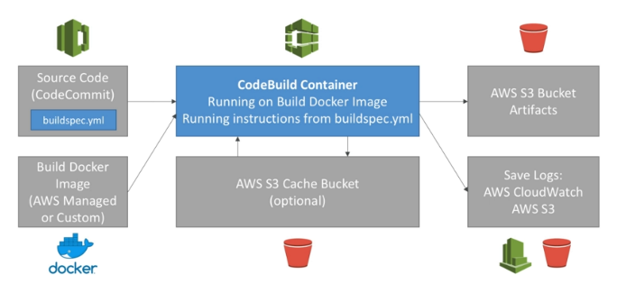|
|-|

- Two ways to run CodeBuild
    - Source Code
        - buildspec.yml
    - By building a Docker image
        - AWS Managed or Custom
- A CodeBuild Container is created
- We can add an optional S3 Cache bucket
    - Cache while We do multiple builds 
        - dependencies
        - artifacts
- Output to an S3 bucket
- Save logs using CloudWatch or S3

### CodeBuild BuildSpec

- buildspec.yml file must be at the root of your code
- Define environment variables:
    - Plaintext variables
    - Secure secrets: use SSM Parameter store
- Phases (specify commands to run):
    - Install: install dependencies we may need for your build
    - Pre build: final commands to execute before build
    - Build: actual build commands
    - Post build: finishing touches (zip output for example)
- Artifacts: What to upload to S3 (encrypted with KMS)
- Cache: Files to cache (usually dependencies) to S3 for future build speedup

### CodeBuild Local Build

- In case of need of deep troubleshooting beyond logs...
- You can run CodeBuild locally on your desktop (after installing Docker) - For this, leverage the CodeBuild Agent
- https://docs.aws.amazon.com/codebuild/latest/userguide/use-codebuild-agent.html


## AWS CodeDeploy

AWS CodeDeploy is a fully managed deployment service that automates software deployments to various compute services, such as Amazon Elastic Compute Cloud (EC2), Amazon Elastic Container Service (ECS), AWS Lambda, and your on-premises servers. Use CodeDeploy to automate software deployments, eliminating the need for error-prone manual operations.

- Deploy our application automatically to multiple EC2 instances
- These instances are not managed by Elastic Beanstalk
- There are several ways to handle deployments using open source tools (Ansible, Terraform, Chef, Puppet, etc...)
- CodeDeploy is the alternative to these tools

|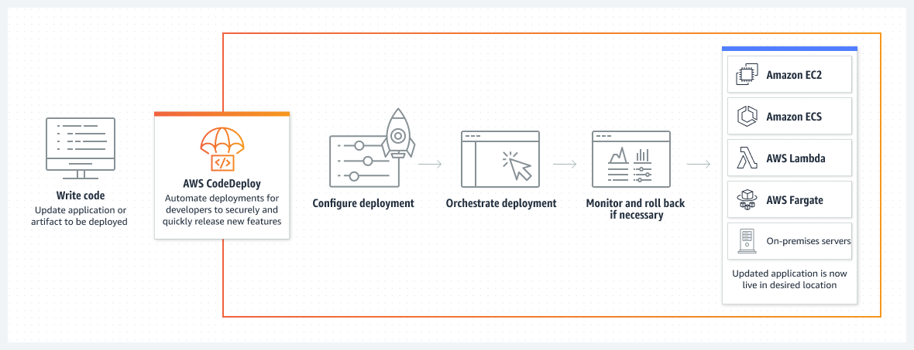|
|-|

### CodeDeploy - How it works

- Each EC2 Machine (or On Premise machine) must be running the CodeDeploy Agent
- The agent is continuously polling AWS CodeDeploy for work to do
- CodeDeploy sends appspec.yml file.
- Application is pulled from GitHub or S3
- EC2 will run the deployment instructions
- CodeDeploy Agent will report of success / failure of deployment on the instance

### CodeDeploy - Additional information

- EC2 instances are grouped by deployment group (dev / test / prod)
- Lots of flexibility to define any kind of deployments
- CodeDeploy can be chained into CodePipeline and use artifacts from there
- CodeDeploy can re-use existing setup tools, works with any application, auto scaling integration
- Note: Blue / Green only works with EC2 instances (not on premise)
- Support for AWS Lambda deployments (we’ll see this later)
- CodeDeploy does not provision resources

### CodeDeploy - Primary Components

- Application: unique name
- Compute platform: EC2/On-Premise or Lambda
- Deployment configuration: Deployment rules for success / failures
    - EC2/On-Premise: we can specify the minimum number of healthy instances for the deployment.
    - AWS Lambda: specify how traffic is routed to our updated Lambda function versions.
- Deployment group: group of tagged instances (allows to deploy gradually)
- Deployment type: In-place deployment or Blue/green deployment:
- IAM instance profile: need to give EC2 the permissions to pull from S3 / GitHub
- Application Revision: application code + appspec.yml file
- Service role: Role for CodeDeploy to perform what it needs
- Target revision: Target deployment application version

### CodeDeploy AppSpec

- *File section*: how to source and copy from S3 / GitHub to filesystem
- *Hooks*: set of instructions to do to deploy the new version (hooks can have timeouts).The order is:
    - ApplicationStop
    - DownloadBundle
    - BeforeInstall
    - Install
    - AfterInstall
    - ApplicationStart
    - **ValidateService: really important**
    - BeforeAllowTraffic
    - AllowTraffic
    - AfterAllowTraffic

### CodeDeploy Deployment Config

*Configs*
- One a time: one instance at a time, one instance fails => deployment stops
- Half at a time: 50%
- All at once: quick but no healthy host, downtime. Good for dev
- Custom: min healthy host = 75%

*Failures*
- Instances stay in “failed state”
- New deployments will first be deployed to “failed state” instances
- To rollback: redeploy old deployment or enable automated rollback for failures

*Deployment Targets*
- Set of EC2 instances with tags
- Directly to an ASG
- Mix of ASG / Tags so we can build deployment segments
- Customization in scripts with DEPLOYMENT_GROUP_NAME environment variables

### Deployment types

**In place deployment**

|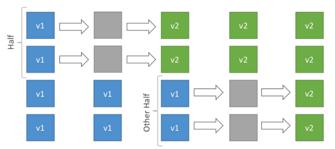|
|-|

**Blue / Green Deployment**
- Attached to one auto scaling group of instances
- new auto scaling group of instances created (green)
- if it passes the health checks, version 1 (original asg) is deleted (blue)

|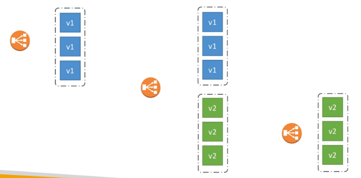|
|-|

### CodeDeploy to EC2

- We define how to deploy the application using appspec.yml + deployment strategy
- CodeDeploy will do in-place updates to EC2 our fleet of instances
- We can use hooks to verify the deployment after each deployment phase

### CodeDeploy to ASG


**In place updates**
- CodeDeploy updates the current EC2 instances
- Instances newly created by ASG will also get automated deployments

**Blue / green deployment**
- A new auto-scaling group is created  (settings are copied from the existing one)
- We can choose for how long we keep the old instances
- Blue/Green deployment in order to work we must be using an ELB

### CodeDeploy Rollbacks

- In some situation we have to roll back our deployment to a previous working version
- We can specify automated rollback options
    - We may want to rollback when deployment fails
    - We may want to rollback when a CloudWatch alarm threshold is met
    - We can disable rollbacks entirely
- If a rollback happens, CodeDeploy will redeploy the last known good revision as a **new deployment** => new version number


## AWS CodePipeline

AWS CodePipeline is a fully managed continuous delivery service that helps you automate your release pipelines for fast and reliable application and infrastructure updates.

- Continuous delivery
- Visual workflow
- Source: GitHub, CodeCommit, Amazon S3
- Build: CodeBuild, Jenkins, etc...
- Load Testing: 3rd par ty tools
- Deploy: AWS CodeDeploy, Beanstalk, CloudFormation, ECS...
- Made of stages:
    - Each stage can have sequential actions and / or parallel actions
    - Stages examples: Build, Test, Deploy, Load Test, etc...
    - Manual approval can be defined at any stage

### CodePipeline Artifacts

- Each pipeline stage can create ”artifacts”
- **Artifacts** are Amazon S3 buckets that CodePipeline uses to store artifacts used by pipelines. 

When you first use the CodePipeline console in a region to create a pipeline, CodePipeline automatically generates this S3 bucket in the AWS region

|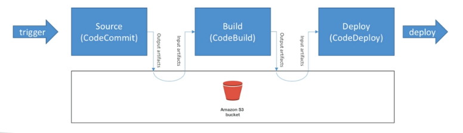|
|-|

### CodePipeline Troubleshooting

- CodePipeline state changes happen in **AWS CloudWatch Events**, which can in return create SNS notifications.
- Ex: we can create events for failed pipelines • Ex: you can create events for cancelled stages
- If CodePipeline fails a stage, your pipeline stops and you can get information in the console
- AWS CloudTrail can be used to audit AWS API calls
- If Pipeline can't perform an action, make sure the “IAM Service Role”
attached does have enough permissions (IAM Policy)