# AWS Integration and Messaging 

> <small>This is not an exhaustive documentation of all the existing AWS Services. This is just my summarized study notes for the AWS Certifications.</small>
> <small>To see the complete documentation, please go to: [AWS documentation](https://docs.aws.amazon.com/)</small>

- [Integration and Messaging](#integration-and-messaging)
- [SQS - Simple Queue Service](#sqs---simple-queue-service)
    - [SQS - Standard Queue](#sqs---standard-queue)
    - [SQS - Delay Queue](#sqs---delay-queue)
    - [SQS - FIFO Queue](#sqs---fifo-queue)
    - [Producing Messages](#producing-messages)
    - [Consuming messages](#consuming-messages)
    - [Message Visibility Timeout](#message-visibility-timeout)
    - [Dead Letter Queues](#dead-letter-queues)
    - [Long Polling](#long-polling)
    - [Message Consumption Flow](#message-consumption-flow)
    - [SQS With Auto Scaling Group](#sqs-with-auto-scaling-group)
    - [SQS Extended Client](#sqs-extended-client)
    - [Decouple application tiers](#decouple-application-tiers)
    - [Data Ordering in SQS](#data-ordering-in-sqs)
    - [Security](#security)
- [SNS - Simple Notification Service](#sns---simple-notification-service)
    - [AWS SNS](#aws-sns)
    - [Integrations](#integrations)
    - [Publishing events](#publishing-events)
    - [SNS + SQS Fan Out](#sns--sqs-fan-out)
- [AWS Kinesis](#aws-kinesis)
    - [Kinesis Streams](#kinesis-streams)
    - [Kinesis Data Firehose](#kinesis-data-firehose)
    - [Kinesis Data Analytics](#kinesis-data-analytics)
    - [AWS Kinesis API](#aws-kinesis-api)
        - [Put Records](#put-records)
        - [Exceptions](#exceptions)
        - [Consumers](#consumers)
    - [AWS Kinesis CLI](#aws-kinesis-cli)
    - [Security](#security)
    - [Ordering data into Kinesis](#ordering-data-into-kinesis)
    - [Ordering data into SQS](#ordering-data-into-sqs)
- [Summary - SQS vs SNS vs Kinesis](#summary---sqs-vs-sns-vs-kinesis)
- [Amazon MQ](#amazon-mq)


## Integration and Messaging

When we start deploying multiple applications, they will inevitable result in the necessity to communicate with one another 

|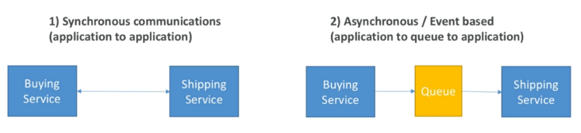|
|-|

- There are 2 types of integration communication patterns:

    - Synchronous communication
    - Asynchronous communication

- Synchronous communication between applications can eb problematic if there are sudden spikes of traffic 
- As a solution, decouple your applications 
- Application decoupling models:
    - SQS: queue model
    - SNS: pub/sub model
    - Kinesis: real-time streaming model

## SQS - Simple Queue Service

|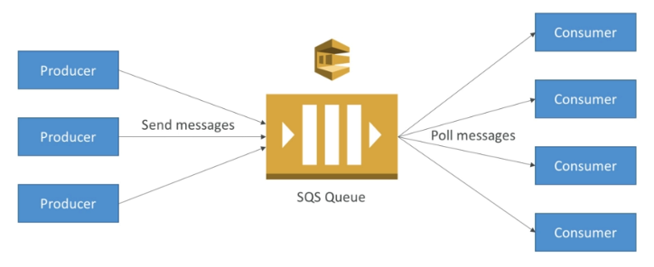|
|-|

### SQS - Standard Queue

- Oldest offering on AWS (over 10 years old)
- Fully managed service, used to decouple applications
- Can have duplicate messages (at least once delivery)
- Can have out of order messages (best effort ordering)
- Attributes:
    - Unlimited throughput
    - Unlimited number of messages in the queue
    - Each message is short leaved: 
        - default retention period is 4 days
        - maximum is 14 days
    - Low latency: 
        - <10 ms on publish and receive
    - Limitation for message size: 
        - maximum size of a message is 256KB

### SQS - Delay Queue

- Delaying a message means the consumers wont be able to see the message for a period of time after it was sent. Delay time can be up to 15 minutes
- Delay can be set at a queue level or tt also can be set to message level using the **DelaySeconds** parameter

### SQS - FIFO Queue

- FIFO - First In First Out
- The messages will be ordered in the queue, meaning that the messages will be consumed in the same order as they were sent
- FIFO queues have limited throughput: 300 msg/s without batching, 3000 msg/s with batching
- Exactly-once send capability (by activating content-based deduplication)
- The name of the FIFO queue must end with the `.fifo`

||
|-|

### Producing Messages

- Producers send messages to the queue using the SDK (SendMessage API)
- The message is persisted on the queue until a consumer deletes it
- Message retention: default 4 days, up to 14 days
- SQS standard has unlimited throughput

|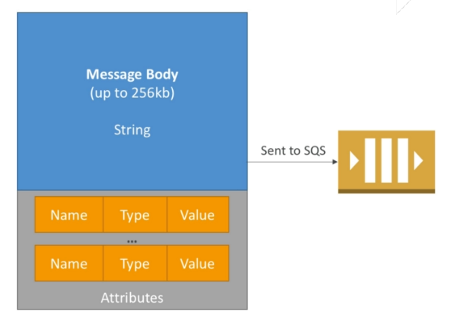|
|-|

### Consuming messages

- Consumers are applications (running on EC2 instances, other servers or AWS Lambda)
- Consumers poll the queue for messages (they can receive up to 10 messages at a time)
- After the messages are processed the consumers delete the messages from the queue using DeleteMessage API
- Multiple consumers:
    - Consumers receive the messages in parallel
    - Each consumer consumes a fraction of the number of the messages sent
    - We can scale the number of the consumers based on the throughput of processing
- SQS with Auto Scaling Group:
    - We can scale based on the **ApproximateNumberOfMessages** metric by creating a CloudWatch alarm

|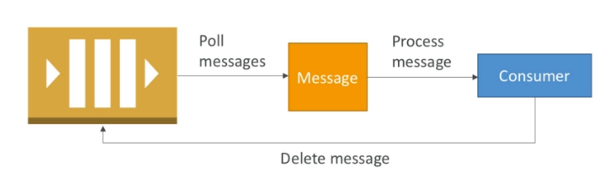|
|-|


### Message Visibility Timeout

- After a message is polled by a consumer, it becomes invisible to other consumers
- Default message visibility timeout is 30 seconds, which means the consumer has 30 seconds to process the message
- After the message visibility timeout is over, the message becomes visible to other consumers
- If the processing is not finished during the visibility timeout, there is a chance the message will be processed twice
- If a consumer knows that the processing wont finish in time, it can use the **ChangeVisibility** API to request more time
- If the message visibility timeout is high and the processing fails, it may take a long time for the message to be processed again
- If the visibility timeout it too short, we may end up processing the same message twice
- Best practice: the visibility timeout should be set to something appropriate. The consumer must be implemented in a way to use the ChangeVisibility API

### Dead Letter Queues

- If a consumer fails to process a message within the visibility timeout, the messages goes back to the queue. This can happen multiple times.
- We can set a **MaximumReceives** threshold, which denotes how many time a message should be able to go back to the queue
- If the MaximumReceives threshold is exceeded, the message is sent to a dead letter queue
- DLQs are useful for debugging
- We have to make sure the messages are processed in DLQ before expiring. It is not a good idea to set a short expiration time for the DLQ

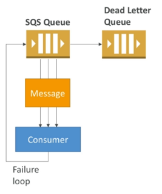


### Long Polling 

- When a consumer requests messages from the queue, it can optionally wait for messages to arrive if there are none in the queue 
- Long polling decreases the number of API calls made to SQS while increasing efficiency
- Wait time can be between 1 sec to 20 sec 
- Long polling is preferable than short polling 

|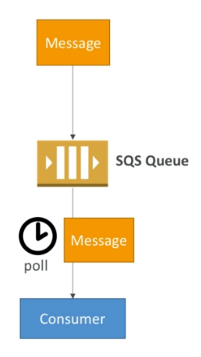|
|-|

### Message Consumption Flow

|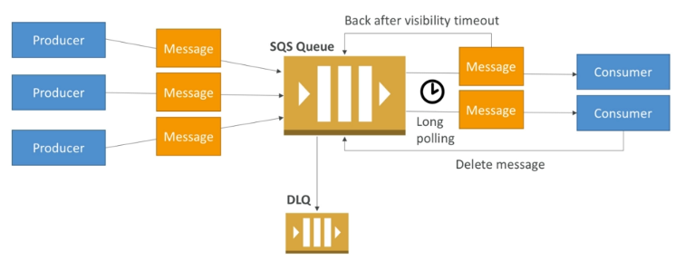|
|-|


### SQS With Auto Scaling Group

|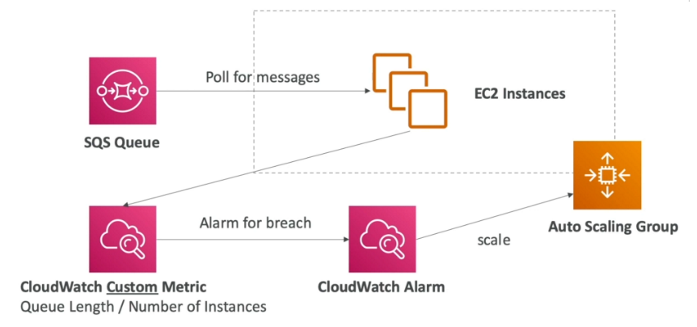|
|-|

Allows scaling the number of EC2 instances based on the available messages in the queue
- In order to accomplish auto scaling we have to create a CloudWatch custom metric representing the number of available messages on the queue divided by the number of EC2 instances. - This metric is pushed from an EC2 instance

If the variable goes above the threshold value, this may mean:
	
- there are many  messages, or
- there are nt enough instances to process those messages.

When we set the threshold value, we can set maybe set TWO ALARMS

- when variable is below threshold value
- when variable is above threshold value 

When the variable goes above the threshold value, then alarms are breached and it will do the following:

- Cloudwatch alarm can be assigned with a scaling policy on your ASG. 
- It can scale your ASG accordingly.

### SQS Extended Client 

- Message size limit is 256KB, how to send large messages?
- For this, use SQS Extended CLient (Java library)

|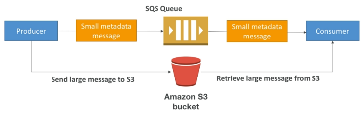|
|-|


### Decouple application tiers 

|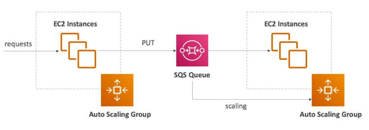|
|-|

### Data Ordering in SQS

- For standard SQS queues there is no data ordering
- For SQS FIFO, if we don't use a Group ID, messages are consumed in the order they are sent, with **only one consumer**
- Messages can be group by specifying a Group ID for the message
- For each group we can have different consumers, which will read messages in order


### Security

**Encryption**

- In-flight encryption using HTTPS
- At-rest encryption using KMS
- Client-side encryption if the client wants to perform encryption/decryption itself

**Access Control**

- IAM policies to regulate access to the SQS API

**SQS Access Policies**

- Useful for cross-account access to SQS queues
- Useful for allowing other services (SNS, S3) to write to an SQS queue


## SNS - Simple Notification Service

|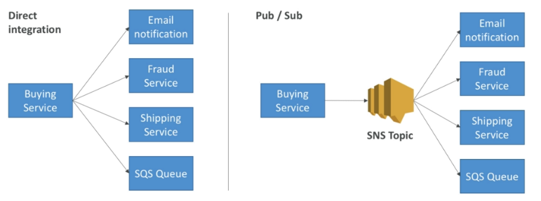|
|-|

### AWS SNS 

- Pub/Sub model
- The event produces only sends messages to one SNS topic
- Each subscriber to the topic will get all the messages be default (we can filter them, if we want)
- We can have up to 10 million subscribers per topic
- We cave up to 100K topics
- Subscribers to the topic can be:
    - SQS
    - HTTP/HTTPS
    - Lambda
    - Emails
    - SMS messages
    - Mobile Notifications

### Integrations 

- CloudWatch (for alarms)
- Auto Scaling Groups notifications
- S3 (bucket events)
- CloudFormation (state changes)

### Publishing events 

**How to publish?**

- In order to publish we must create a topic using the SDK
- We may create one or many subscriptions
- We publish data to the topic

**Direct Publish (for mobile apps SDK)**

- Create a platform application
- Create a platform endpoint
- Publish to the platform endpoint
- Works with Google GCM, Apple APNS, Amazon ADM

### SNS + SQS Fan Out

|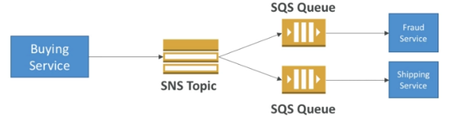|
|-|

- Send a message to multiple SQS queues using SNS
- Push one in SNS, receive in all SQS queues which are subscribers
- Fully decouples, no data loss
- SQS allows for data persistance, delayed processing and retries of work
- Ability to add more SQS subscribers over time
- SQS queues must have an allow access policy for SNS to be able to write to the queues
- **SNS cannot send messages to SQS FIFO queues (AWS limitation)!**

**Use case**

- Send S3 events to multiple queues
- For the same combination of even type and prefix we can only have one S3 Event rule
- In case we want to send the same S3 event to many SQS queues, we must use SNS fan-out


## AWS Kinesis

|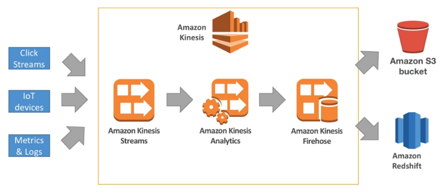|
|-|

It is a big data stream tool, which allows to stream application logs, metrics, IoT data, click streams, etc.

- Kinesis is a managed alternative to Apache Kafka
- Compatible with many streaming frameworks (Spark, NiFi, etc.)
- Data is automatically replicated to 3 AZ
- Kineses offers 3 types of products:
    - **Kinesis Streams**: low latency streaming ingest at scale
    - **Kinesis Analytics**: perform real-time analytics on streams using SQL
    - **Kinesis Firehose**: load streams into S3, Redshift, ElasticSearch

### Kinesis Streams

- Streams are divided in ordered Shards/Partitions
- For higher throughput we can increase the size of the shards
- Data retention is 1 day by default, can go up to 365 days
- Kinesis Streams provides the ability to reprocess/replay the data
- Multiple applications can consume the same stream, this enables real-time processing with scale of throughput
- Kinesis is not a database, once the data is inserted, it can not be deleted

**Kinesis Stream Shards**

|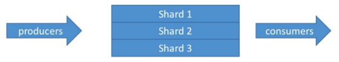|
|-|

- One stream is made of many different shards
- 1MB/s or 1000 messages at write PER SHARD
- 2MB/s read PER SHARD
- Billing is done per shard provisioned, we can have as many shards as we want as long as we accept the cost
- Ability to batch the messages per calls
- The number of shards can evolve over time (reshard/merge)
- **Records are ordered per shard!**

### Kinesis Data Firehose

- Fully managed service, no administration required, provides automatic scaling, it is basically serverless
- Used for load data into Redshift, S3, ElasticSearch and Splunk
- It is **Near Real Time**: 60 seconds latency minimum for non full batches or minimum 32 MB of data at a time
- Supports many data formats, conversions, transformation and compression
- Pay for the amount of data going through Firehose

**Kinesis Data Streams vs, Firehose**

- Streams:
    - Requires to write custom code (producer/consumer)
    - Real time (~200 ms)
    - Must manage scaling (shard splitting / merging)
    - Can store data into stream, data can be stored from 1 to 7 days
    - Data can be read by multiple consumers
- Firehose:
    - Fully managed, sends data to S3, Redshift, Splunk, ElasticSearch
    - Serverless, data transformation can be done with Lambda
    - Near real time
    - Scales automatically
    - It provides no data storage

### Kinesis Data Analytics

- Can take data from Kinesis Data Streams and Kinesis Firehose and perform some queries on it
- It can perform real-time analytics using SQL
- Kinesis Data Analytics properties:
    - Automatically scales
    - Managed: no servers to provision
    - Continuous: analytics are done in real time
- Pricing: pay per consumption rate
- It can create streams out of real-time queries

### AWS Kinesis API

#### Put Records

- Data must be sent form the PutRecords API to a partition key
- Data with the same key goes to the same partition (helps with ordering for a specific key)
- Messages sent get a sequence number
- Partition key must be highly distributed in order to avoid hot partitions
- In order to reduce costs, we can use batching with PutRecords API
- It the limits are reached, we get a *ProvisionedThroughputException*

|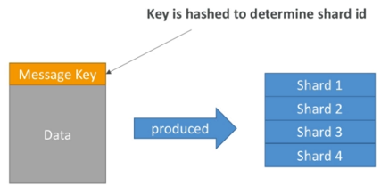|
|-|

#### Exceptions

- ProvisionedThroughputException Exceptions:
    - Happens when the data value exceeds the limit exposed by the shard
    - In order to avoid the, we have to make sure we don't have hot partitions
- Solutions:
    - Retry with back-off
    - Increase shards (scaling)
    - Ensure the partition key is good

#### Consumers

- Consumers can use CLI or SDK, or the Kinesis Client Library (in Java, Node, Python, Ruby, .Net)
- Kinesis Client Library (KCL) uses DynamoDB to checkpoint offsets
- KCL uses DynamoDB to track other workers and share work amongst shards

|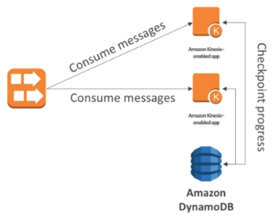|
|-|

### AWS Kinesis CLI 

Sending data:

```bash
aws kinesis help
aws kinesis list-streams help
aws kinesis list-streams
aws kinesis describe-streams help
aws kinesis describe-streams --stream-name <name>  

## example
aws kinesis put-record --stream-name eden-stream-1 --data "Hello world. Please sign up." --partition-key user_123
aws kinesis put-record --stream-name eden-stream-1 --data "User has sign up." --partition-key user_123
aws kinesis put-record --stream-name eden-stream-1 --data "Registration complete." --partition-key user_123
```

Retrieving records:

```bash
aws kinesis help
aws kinesis get-shard-iterator help  
```

|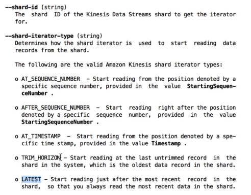|
|-|

```bash
aws kinesis get-shard-iterator --stream-name <name> --shard-id <shard id> --shard-iterator-type TRIM_HORIZON 
```

|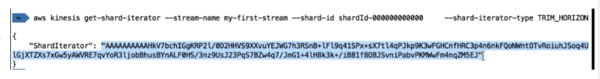|
|-|

```bash
aws kinesis get-records help 
```

|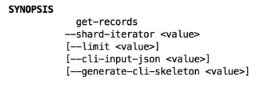|
|-|


### Security

- Control access / authorization using IAM policies
- Encryption in flight using HTTPS endpoints
- Encryption at rest using KMS
- Possibility to encrypt/decrypt data client side
- VPC Endpoints available for Kinesis to be access within VPCs


### Ordering data into Kinesis

- Data with the same partition key goes to the same shard
- Data is ordered per shard

### Ordering data into SQS 

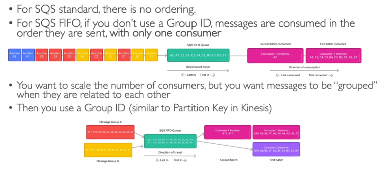

## Summary - SQS vs SNS vs Kinesis

**SQS**

- Consumers pull data
- Data is deleted after being consumed
- Can have many consumers as we want
- No need to provision throughput
- No ordering guarantee in case of standard queues
- Capability to delay individual messages

**SNS**

- Pub/Sub: publish data to many subscribers
- We can have up to 10 million subscribers per topic
- Data is not persisted (it is lost if not delivered)
- Up to 10k topics per account
- No need to provision throughput
- Integrates with SQS for fan-out architecture

**Kinesis Data Streams**

- Consumers "pull data"
- We can have as many consumers as we want
- Possibility to replay data
- Recommended for real-time big data analytics and ETL
- Ordering happens at the shard level
- Data expires after X days
- Must provision throughput

## Amazon MQ 

- SQS and SNS are cloud-native, they are using proprietary protocols from AWS
- Traditional application running on on-premise may use queues with open protocols such as: MQTT, AMQP, STOMP, Openwire, WSS
- When migrating to cloud instead of re-engineering the application to SQS or SNS, we can use Amazon MQ
- Amazon MQ is basically managed Apache ActiveMQ
- Amazon MQ does not scale as much as SQS/SNS
- It runs on a dedicated machine, can urn in HA with failover
- It has both queue anf topic features

