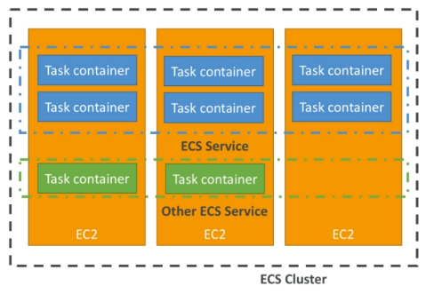
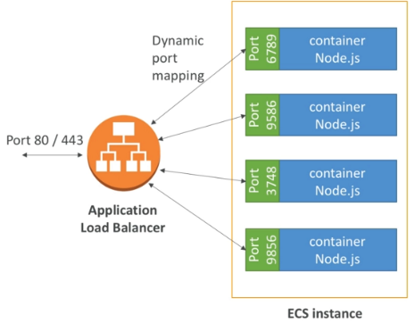
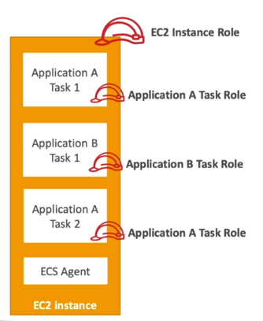
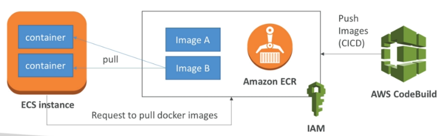

# AWS Container Services 

> <small>This is not an exhaustive documentation of all the existing AWS Services. These are summarized notes for the AWS Certifications. To see the complete documentation, please go to: [AWS documentation](https://docs.aws.amazon.com/)</small>

- [Amazon Elastic Container service ECS](#amazon-elastic-container-service-ecs)
- [Amazon Elastic Container Registry ECR](#amazon-elastic-container-registry-ecr)
- [Amazon Elastic Kubernetes Service EKS](#amazon-elastic-kubernetes-service-eks)

## Amazon Elastic Container service (ECS)

ECS is container orchestration service
- ECS helps to run Docker containers and EC2 machines
- ECS is made of:
    - ECS EC2: running ECS tasks an user-provisioned EC2 instances
    - Fargate: running ECS tasks on AWS provisioned compute instances (serverless)
    - EKS: running ECS on AWS powered Kubernetes
    - ECR: Docker Container Registry hosted on AWS
- ECS and Docker are very popular for micro-services
- IAM security and roles are at the task level

**Use cases**

- Run microservices 
- Run batch processing
- Migrate applications to the Cloud

### Key Points

- ECS cluster: set of EC2 instances
- ECS service: application definitions running on ECS cluster
- ECS tasks + definition: containers running to create the application
- ECS IAM roles: roles assigned to ECS tasks

### ECS Setup and Config file

- Run an EC2 instance, install the ECS agent with ECS config file or use ECS-ready Linux AMI (still need to modify the config file)
- ECS Config file is at `/etc/ecs/ecs.config`
- Config settings:
    - `ECS_CLUSTER`: to which cluster belongs the EC2 instance
    - `ECS_ENGINE_AUTH_DATA`: authenticate to private registries
    - `ECS_AVAILABLE_LOGGING_DRIVERS`: used for enabling CloudWatch logging
    - `ECS_ENABLE_TASK_IAM_ROLE`: enable IAM roles for an ECS tasks

### ECS-ALB integration

- Application Load Balancer has a direct integration feature with ECS called port mapping
- This allows us to run multiple instances of the same application on the same EC2 machine
- Use cases:
    - Increase resiliency even if the application is running on one EC2
    - Maximize utilization of CPU cores
    - Ability to perform rolling updates without impacting application uptime

    

### ECS-IAM Task Roles

- The EC2 instance running the containers should have an IAM role allowing it to access the ECS service for the ECS agent
- Each task inherits EC2 permissions
- ECS IAM task role: role dedicated to each task separately
- Define a tas role: we can use the `taskRoleArn` parameter in the task definition

### Fargate

- When launching an ECS cluster, we have to create our EC2 instances, which means basically we are managing the underlying infrastructure
- With Fargate, this is eliminated since this AWS service is serverless
- We have to provide task definitions and AWS will run the container for us
- To scale we just have to increase the task number

## Amazon Elastic Container Registry (ECR)

Amazon Elastic Container Registry (ECR) is a fully managed Docker container registry that makes it easy to store, share, and deploy container images.

- Fully integrated with IAM and ECS
- Data is sent over HTTPS and encrypted at rest

||
|-|

## Amazon Elastic Kubernetes Service (EKS)

Amazon Elastic Kubernetes Service (EKS) is a managed service and certified Kubernetes conformant to run Kubernetes on AWS and on-premises.

- It is a way to launch managed Kubernetes clusters on AWS
- Kubernetes is an open-source system for automatic deployment, scaling and management of containerized applications
- It is an alternative to ECS having a different API
- EKS supports EC2 if we want to deploy worker nodes or Fargate to deploy serverless containers
