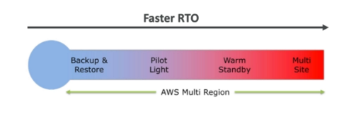
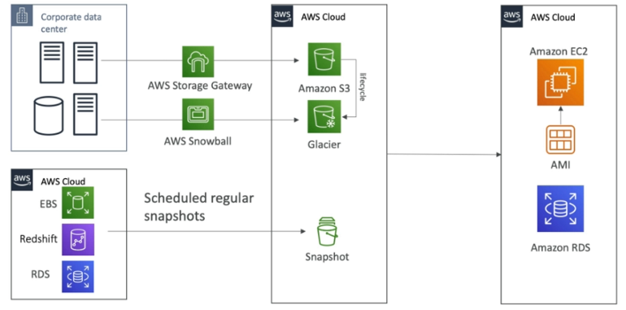
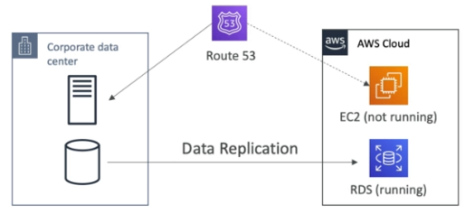
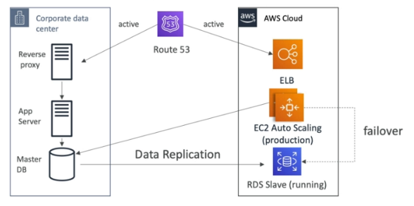
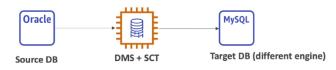

# AWS Disaster Recovery

> <small>This is not an exhaustive documentation of all the existing AWS Services. These are summarized notes for the AWS Certifications.</small>
> <small>To see the complete documentation, please go to: [AWS documentation](https://docs.aws.amazon.com/)</small>

- [Disaster](#disaster)
- [RPO and RTO](#rpo-and-rto)
- [Disaster Recovery Strategies](#disaster-recovery-strategies)
- [Disaster Recovery Tips](#disaster-recovery-tips)
- [On-Premise Strategy with AWS](#on-premise-strategy-with-aws)
- [DMS - Database Migration Service](#dms---database-migration-service)
- [AWS Schema Conversion Tool SCT](#aws-schema-conversion-tool-sct)

## Disaster 

- Disaster: any event that has a negative impact on a company's business continuity or finances
- Disaster Recovery (DR) is about preparing for and recovering from a disaster
- Disaster recovery solutions:
    - On-premise to on-premise: traditional DR, expensive
    - On-premise to cloud: hybrid recovery
    - AWS Cloud Region A to AWS Cloud Region B

## RPO and RTO

- RPO - Recovery Point Objective: How often we create backups. Time between the RPO and the disaster is the data loss
- RTO - Recovery Time Objective: The point in time when the recovery finishes. The time between the disaster and the RTO is downtime

## Disaster Recovery Strategies

||
|-|

All strategies are available for Multi-region. 

**Backup and Restore**
- High RPO, cheap, easy to manage and accomplish

||
|-|

**Pilot Light**
- A small version of the app is always running in the cloud
- Useful for critical core (pilot light)
- Similar to backup and restore strategy
- Faster than backup and restore as critical system are already running

||
|-|

**Warm Standby**
- Full system is up and running but at a minimal size
- Upon disaster we can scale to production load

||
|-|

**Hot Site / Multi Site Approach**
- Very low RTO - very expensive
- Full production scale is running on the cloud

||
|-|

## Disaster Recovery Tips

**Backups**
- EBS Snapshots, RDS, automated backups, snapshots, etc.
- Regular pushes to S3/S3 IA/Glacier, Lifecycle Policy, Cross region replication
- From on-premise: Snowball or Storage Gateway

**High Availability**
- Use Route53 to migrate DNS over from region to region
- RDS Multi-AZ, ElastiCache Multi-AZ, EFS, S3
- Site to site VPN as recovery from Direct Connect

**Replication**
- RDS Replication (Cross Region), AWS Aurora + Global Databases
- Database replication from on-premise to RDS
- Storage Gateway

**Automation**
- CloudFormation/Elastic Beanstalk to recreate a whole new environment
- Recover/Reboot EC2 instances with CloudWatch if alarm is in fail state (ALARM)
- AWS Lambda for customized automation

**Chaos**
- Netflix has a "simian-army" randomly terminating EC2 instances

## On-Premise Strategy with AWS

**Download Amazon Linux 2 AMI as a VIM**
- iso format
- VMWare, KVM, VirtualBox, Microsoft Hyper-V 

**VM Import/Export**
- Ability to migrate existing applications into EC2
- Ability to create a DR repository for on-premise VMs
- Ability to export back the VMs form EC2 to on-premise

**AWS Application Discovery Service**
- Gather information about on-premise servers to plan a migration
- Provides information about server utilization and dependency mappings
- Track all migrations with AWS Migration Hub

**AWS Database Migration Service (DMS)**
- Replicate on-premise 
- Works with various DB technologies 

**AWS Server Migration Service (SMS)**
- Incremental replication of on-premise live servers to AWS

## DMS - Database Migration Service

- Quickly and securely migrate databases to AWS
- It is resilient and self healing
- The source database remains available during migration
- Supports:
    - Homogeneous migrations, example Oracle to Oracle
    - Heterogeneous migrations, example: Microsoft SQL Server to Aurora
- Supports continuous data replication using CDC
- We must create an EC2 instance to perform the replication tasks

### DMS Sources and Targets

||
|-|

**Sources**
- On-premise and EC2 instance databases: Oracle, MS SQL Server, MySQL, MariaDB, PostgreSQL, MongoDB, SAP, DB2
- Azure SQL Database
- Amazon RDS: all including Aurora
- Amazon S3

**Targets**
- On-premise and EC2 instance databases: Oracle, MS SQL Server, MySQL, MariaDB, PostgreSQL, AP
- Amazon RDS
- Redshift
- DynamoDB
- S3
- ElasticSearch
- Kinesis Data Streams
- DocumentDB

## AWS Schema Conversion Tool (SCT)

- Converts a database schema form one engine to another. Example: OLTP (SQL Server, Oracle) to MySQL, PostgreSQL, Aurora; OLAP (Teradata or Oracle) to Redshift
- We do not need to use SCT if we are migration from the same DB engine to the same DB engine