# Microsoft Azure Overview

- [Overview](#overview)
- [Comparison of AWS and Azure Services](#comparison-of-aws-and-azure-services)
- [Subscriptions and Billing](#subscriptions-and-billing)
    - [Subscription](#subscription)
    - [Billing Account](#billing-account)
    - [Subscription Types](#subscription-types)
    - [Purchasing Options](#purchasing-options)
    - [Purchasing Third-Party Solutions](#purchasing-third-party-solutions)
- [TCO Calculator](#tco-calculator)
    - [Using the TCO Calculator](#using-the-tco-calculator)
    - [Sample Scenario](#sample-scenario)
- [Pricing Calculator](#pricing-calculator)
- [Resource Group](#resource-group)
- [Azure Architecture](#azure-architecture)
    - [Region](#region)
    - [Availability Zone](#availability-zone)
    - [Management Groups](#management-groups)
    - [Update Domain](#update-domain)
    - [Fault Domain](#fault-domain)
- [Azure Portal](#azure-portal)
- [Reducing Costs](#reducing-costs)
- [Azure Cost Management](#azure-cost-management)
    - [Cost Analysis](#cost-analysis)
    - [Budgets and Alerts](#budgets-and-alerts)
    - [Hierarchical Cost Tracking](#hierarchical-cost-tracking)
    - [Tagging](#tagging)
    - [Azure Advisor Recommendations](#azure-advisor-recommendations)
    - [Regular Monitoring](#regular-monitoring)
- [Resources](#resources)

## Overview 

Microsoft Azure is a collection of online services for application development and hosting. 

- Eliminates the need for personal data centers; operates in Microsoft's global data centers.
- Pay-as-you-go model based on actual usage.
- Flexible resource scaling up and down as needed.

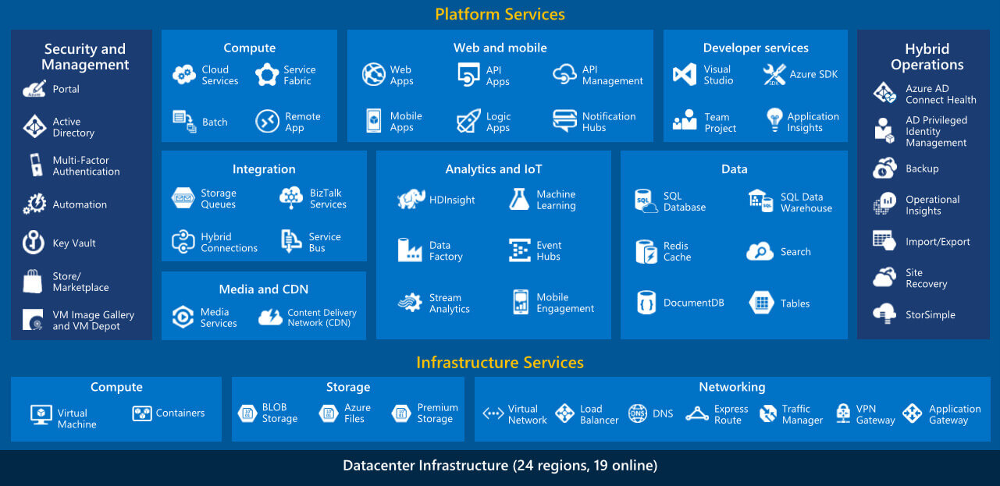

**Compute Options:**
- Virtual Machines (VMs) for traditional IT infrastructure.
- Azure App Service for web and mobile applications.
- Azure Functions for serverless execution of individual functions.
- Azure Container Instances for simplified container deployment.
- Azure Kubernetes Service for managing multi-container applications.

**Storage Solutions:**
- Blob Storage for unstructured data with hot, cool, and archive access tiers.
- Azure File Storage for hierarchical file storage.
- Azure Data Lake Storage Gen2 for Hadoop-compatible storage in data analytics.

**Database Services:**
- Azure SQL Database for relational databases.
- Azure Database for MySQL, MariaDB, and PostgreSQL for open-source databases.
- Cosmos DB for globally scalable NoSQL databases.
- Azure Cache for Redis for caching frequently requested data.

**Network Services:**
- Virtual Networks (VNets) for VMs with IP addresses, subnets, and route definitions.
- VNet peering for communication between VMs in different VNets.
- VPN or Azure ExpressRoute for secure connections to on-premises networks.

**Additional Services:**
- Beyond core compute, storage, and networking, Azure offers services in areas like artificial intelligence and DevOps.

<small>[Back to the top](#microsoft-azure-overview)</small>

## Comparison of AWS and Azure Services

| TOPIC      | AWS                                      | AZURE                          | FUNCTIONALITY                                                                                                                                                                                                                                         |
| ---------- | ---------------------------------------- | ------------------------------ | ----------------------------------------------------------------------------------------------------------------------------------------------------------------------------------------------------------------------------------------------------- |
| Compute    | Amazon EC2                               | Azure Virtual Machines         | Manage your own virtual machines, IaaS, this is the services you are looking at.                                                                                                                                                                      |
|            | AWS Lambda                               | Azure Function                 | Need to execute a bit of code, but you don’t need a dedicated virtual machine for that. You can go server-less and use Azure functions or Lambda.                                                                                                     |
|            | AWS Elastic Beanstalk                    | Azure App Services             | Running applications in the cloud, without having to worry too much about the servers they are running. They will have dedicated virtual machines under the hood.                                                                                     |
| Containers | AWS Fargate                              |                                | Serverless container orchestration.                                                                                                                                                                                                                   |
|            | AWS ECS Elastic container service        | Azure Container Instances      | PaaS fully managed container orchestration service. You will still have the virtual machine cluster.                                                                                                                                                  |
|            | Amazon EKS (Elastic Kubernetes Service)  | AKS (Azure Kubernetes Service) | Kubernetes as a service, with the dedicated virtual machine cluster.                                                                                                                                                                                  |
| Storage    | Amazon S3 (Simple storage service)       | Azure Blob Storage             | To store files. This service is region-less in AWS and region-specific in Azure.                                                                                                                                                                      |
|            | Amazon Elastic Filesystem (EFS)          | Azure File Storage (SMB)       | EFS is a filesystem while Azure Files is a SMB-storage-as-a-service.
| Security   | IAM Roles                                | Azure AD                       | For access-control, in Azure, you would have Service Principals registered in Azure Active Directory, in AWS you will have roles configured in IAM. Both support a similar permissions model.                                                         |
|            | AWS Cognito                              | Azure AD B2C                   | For when you want to implement Single sign-on from external providers like Twitter, Facebook or Active Directory.                                                                                                                                     |
|            | AWS KMS (Key Management System)          | Key vault                      | Add the secret and only permit the specific people. secrets managements                                                                                                                                                                               |
|            | AWS Trust Advisor                        | Azure Advisor                  | Provide recommendations for reducing costs and managing security.
| Logs       | AWS CloudTrail                           | Azure Activity log             | Stores the logs of what actions have been done against resources, for example when a new virtual machine is started.                                                                                                                                  |
| Databases  | Amazon RDS (Relational databases server) | Azure SQL Database             | PaaS relational database servers                                                                                                                                                                                                                      |
|            | Amazon Dynamo DB                         | Azure Cosmos DB                | NoSql fully managed instances by both cloud providers, both work as key-value or document stores.                                                                                                                                                     |
|            | Amazon ElastiCache                       | Azure Cache for Redis          | When your application could use a distributed caching layer with low latency. This is PaaS, so you don’t need to worry about maintaining the cache cluster.                                                                                           |
|            | Amazon Redshift                          | Azure Synapse Analytics        | Used for data warehousing
| Networking | Amazon VPC (Virtual private cloud)       | Virtual Networks (VNet)        | Azure you have the concept of VNets, the major difference is that in AWS most services can be easily added into a VNet.                                                                                                                               |
|            | AWS Site-to-Site VPN                     | Azure VPN                      | Connection between your VPC/VNet and your own on-premises network. 
|            | AWS Direct Connect                       | Azure ExpressRoute             | Supports connectivity between VPC/Vnet and an on-premises network
|            | Amazon Route 53                          | Azure Traffic manager          | Service for setting routes at DNS level.                                                                                                                                                                                                              |
|            | Amazon API Gateway                       | API Management                 | Concept of API gateways, rather than having one client having to know about many backend services, you can add an API Gateway layer                                                                                                                   |
|            | Amazon CloudFront                        | Azure CDN                      | Content delivery networks are important when performance is key for your web applications. Rather than leaving your static files in your application virtual machines, we can use a dedicated resource for handling content distribution and caching. |
| Integration| AWS SQS                                  | Azure Service Bus              | When you have a simple queue, one publisher and one consumer.                                                                                                                                                                                         |
|            | AWS SNS                                  | Azure Event Grid               | SNS works in the publisher/subscriber pattern, so you could argue that is also equivalent to Azure Service Bus, because you could have multiple subscribers with their own SQS queue.                                                                 |
|            | AWS Step Functions                       | Azure Logic Apps               | Serverless orchestration tool to build and manage cloud-based multistep application workflows using a visual interface for business-critical processes
|            | AWS Kinesis                              | Azure Event hub                | You are dealing with a high throughput queue.                                                                                                                                                                                                         |
| Devops     | AWS DevOps                               | Azure DevOps                   | Host your code with GIT or TFS. AWS has CodeCommit for this.                                                                                                                                                                                          |
|            | AWS CloudFormation                       | ARM Templates/blueprints       | Creating your resources in the cloud for test purposes is fine                                                                                                                                                                                        |
|            | AWS Cloud 9                              | Azure console                  | In Azure you have the option to have a bash/Powershell for writing commands, I found that AWS Cloud 9 provides you with a full own mini IDE environment                                                                                               |
| Monitoring | Cloud Watch                              | Azure Monitor                  | Services need to report metrics, for example, the CPU percentage of the running virtual machines                                                                                                                                                      |
|            | X-Ray                                    | App Insights                   | what is going on your application, being able to see called requests, response times, success rates and dependency calls.  |

<small>[Back to the top](#microsoft-azure-overview)</small>

## Subscriptions and Billing 

When you sign up for Azure, Microsoft creates a billing account and a subscription. These are easily confused, as both are related to billing. 

### Subscription

- A subscription is a collection of Azure resources and are charged in the same monthly bill.
-  It serves as the basis for billing, allowing Microsoft to charge for the resources used in Azure
- Each resource created in Azure is linked to a subscription, and it's possible to have multiple subscriptions
- However, each resource can only belong to one subscription.

### Billing Account

- To facilitate billing, a billing account is needed, containing payment details like credit card information. 
- Each subscription must be linked to one billing account, but multiple subscriptions can be linked to a single billing account, making it easier to manage costs.

Reasons for having both:

- Multiple subscriptions within a billing account for departmental invoicing.
- Isolation of resources in different subscriptions for security or compliance.

### Subscription Types

**1. Free Trial Subscription**

- Offers limited free usage of certain Azure services each month.
- Provides a $200 credit for other Azure services.
- The credit is valid for 30 days, and after that, an upgrade to pay-as-you-go is required.
- Only one free trial per customer is allowed.
- After 12 months, the monthly allotment of free services ends.

**2. Pay-As-You-Go Subscription**

- Allows payment for Azure resources as they are used.
- No long-term commitment or contract is required.
- Offers flexibility with consumption-based-billing.

**3. Member Offers Subscription**

- Provides reduced rates for Azure services for certain groups (e.g., MSDN Platform subscribers).
- Offers discounts and benefits for eligible members.

<small>[Back to the top](#microsoft-azure-overview)</small>

### Purchasing Options

**1. Web Direct**

- Directly purchase Azure subscriptions through the Azure website.

**2. Enterprise Agreement (EA)**

- Suitable for organizations purchasing a significant amount of Microsoft products and services.
- Involves a negotiated agreement with substantial discounts.
- Requires a long-term commitment (minimum three years) to use Microsoft products and services.

**3. Cloud Solution Provider (CSP)**

- An option for running custom third-party solutions on Azure.
- Purchased through Microsoft partners known as Cloud Solution Providers.
- Partners bill for both Azure services and their own solutions, providing technical support.

### Purchasing Third-Party Solutions

- For custom third-party solutions: Consider purchasing through a Cloud Solution Provider.
- For off-the-shelf third-party solutions: Access the Azure Marketplace after obtaining an Azure subscription.
- Azure Marketplace offers virtual machine images from various vendors that can be quickly deployed.

<small>[Back to the top](#microsoft-azure-overview)</small>

## TCO Calculator

Moving IT workloads from an on-premises data center to Azure requires a thorough cost comparison between the two environments. Microsoft provides a valuable tool called the **Total Cost of Ownership (TCO) Calculator** to facilitate this process.

This tool utilizes industry averages for both on-premises and Azure costs, helping organizations make informed decisions based on financial considerations.

### Using the TCO Calculator 

**1. Define Workloads**

- Provide details for each workload, such as the number of servers, type of database, storage capacity, and networking requirements.
- Categorize workloads into four main types: 
    - servers
    - databases
    - storage
    - networking.

**2. Adjust Assumptions**

- Fine-tune assumptions used by the TCO Calculator to align with specific organizational parameters.
- Consider factors like Microsoft Software Assurance coverage for Windows and SQL Server licenses.
- Modify assumptions such as:
    - electricity costs
    - IT labor costs
    - currency

**3. View the Report**

- Generate a detailed cost comparison report for a selected timeframe (one to five years).
- Analyze potential cost savings by moving workloads to Azure.
- Review breakdowns of on-premises and Azure costs.

### Sample Scenario 

Let's consider a scenario where an organization wants to migrate the following workloads to Azure:

- 20 Windows-based web servers running on Hyper-V.
- Two physical SQL Servers.
- One terabyte of storage.

**Using the TCO Calculator**

**1. Define Workloads (Servers)**

- Workload Name: "Web servers"
- Workload Type: Windows/Linux Server (Change to Virtual Machines)
- Operating System: Windows
- Number of Virtual Machines: 20
- Virtualization: Hyper-V
- Cores per Virtual Machine: 8
- RAM per Virtual Machine: 16 GB

    |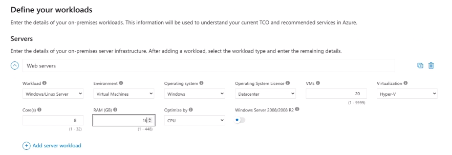|
    |-|

**2. Define Workloads (Databases)**

- Workload Name: "SQL Servers"
- Number of Servers: 2
- Processors per Server: 2
- Cores per Processor: 4
- RAM per Server: 8 GB
- Azure Service: SQL Database Managed Instance
- Backup Storage: 1,000 GB

    |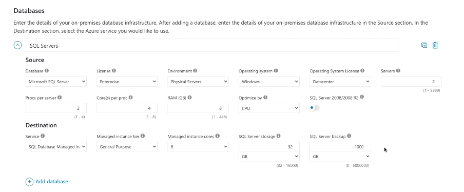|
    |-|

**3. Define Workloads (Storage)**

- Capacity: 1 TB
- Backup Storage: 5 TB
- Archive Storage: 10 TB 

    |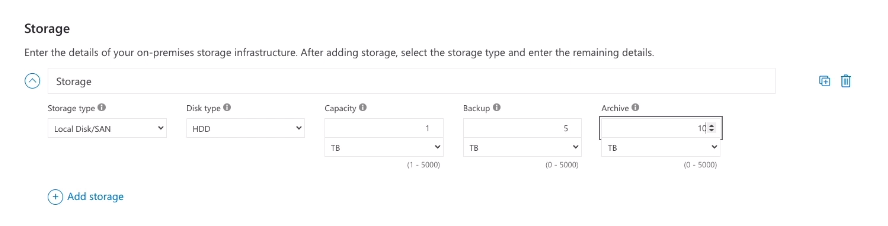|
    |-|

**4. Define Workloads (Networking)**

- Outbound Bandwidth: 10 TB 

    |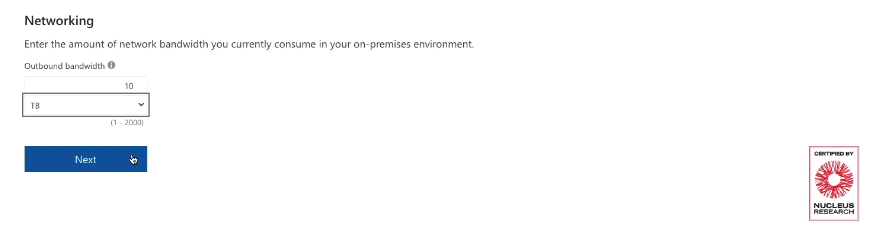|
    |-|

**5. Adjust Assumptions**

- Modify currency, electricity costs, and IT labor costs if necessary.
- Indicate Microsoft Software Assurance coverage for Windows and SQL Server licenses.

    |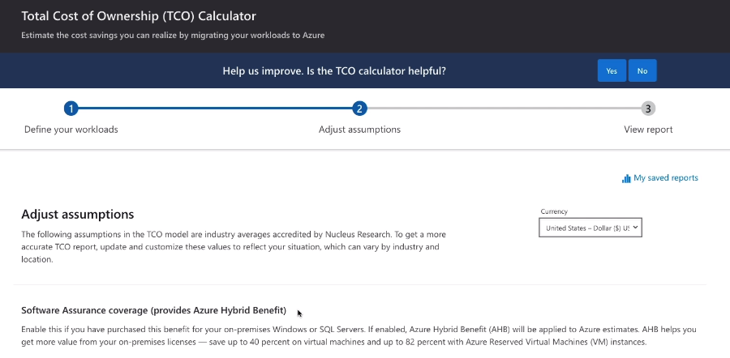|
    |-|
    |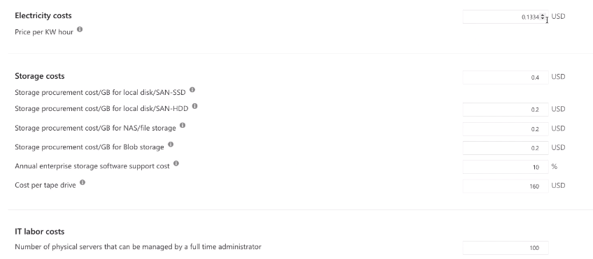|
    |-|

**6. View the Report**

- Examine potential cost savings over the selected timeframe.
- Review detailed breakdowns of on-premises and Azure costs.
- By following these steps, organizations can gain valuable insights into the financial aspects of migrating their workloads to Azure and make well-informed decisions based on the generated TCO report.

    |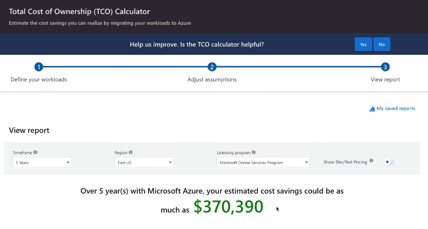|
    |-|

<small>[Back to the top](#microsoft-azure-overview)</small>

## Pricing Calculator 

The Azure Pricing Calculator is a valuable tool for estimating costs associated with various Azure services. 

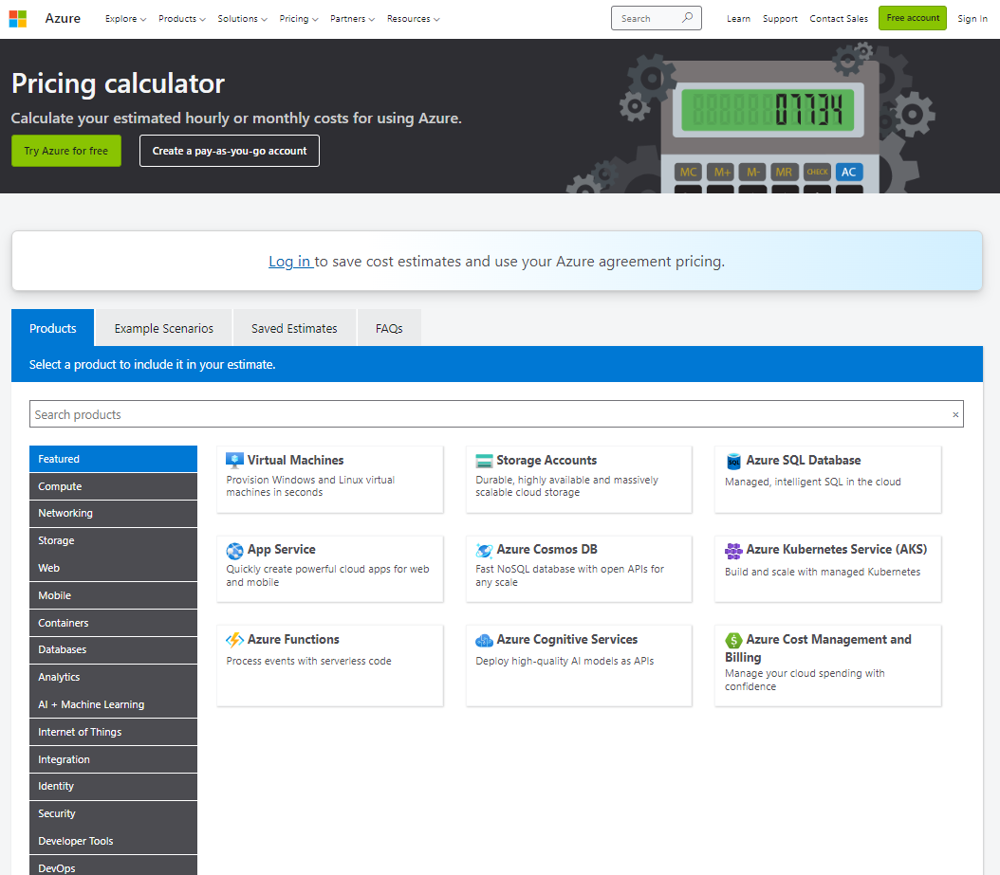

Unlike the Total Cost of Ownership (TCO) Calculator, which focuses on migration-related savings, the Pricing Calculator provides estimates for running specific Azure services.

**Estimating Costs**

**1. Choose the Service**
- Access the Pricing Calculator and select the Azure service you want to estimate costs for (e.g., App Service).
- Alternatively, start typing the product name for quicker selection.

**2. Set Service-Specific Options**
- Depending on the service (e.g., App Service), set options such as:
    - **Region**: Choose the region where the service will be deployed.
    - **Operating System**: Select the preferred operating system.
    - **Tier**: Choose the service tier (e.g., Basic, Standard, Premium).

**3. Additional Service Configuration**
- Depending on the selected service, configure additional options such as instance type, number of instances, and hours of usage.
- Some services may have specific configuration options (e.g., SSL connections for App Service).

**4. Review and Adjust**
- The Pricing Calculator provides an estimated monthly cost based on the chosen configurations.
- Review the estimate and adjust options as needed. For example, set the number of hours to "1 month" for simplicity.

**5. Optional Configuration Changes**
- Explore additional configuration options like support plans and licensing programs, which may impact the overall cost.

**6. Add Other Services**
- If estimating costs for multiple services, add them to the calculation.
- The total monthly cost will reflect the combined cost of all selected services.

**7. Export, Save, or Share**
- Once satisfied with the configurations, options, and estimates, you can export, save, or share the estimate for future reference.
- Note: The estimated monthly cost is an approximation, and actual costs may vary. The Pricing Calculator provides a helpful tool for planning and budgeting your Azure expenses.

For more information: [Pricing Calculator](https://azure.microsoft.com/en-in/pricing/calculator/?service=dns) 

<small>[Back to the top](#microsoft-azure-overview)</small>

## Resource Group

Similar to a subscription, a resource group serves as a container for resources. However, a subscription can contain multiple resource groups, allowing for further organization within a subscription.

- You can’t put a resource in more than one resource group.

- You can move a resource from one resource group to another. You can even move a resource from one subscription to another.

- Resources don’t need to be in the same region as the resource group they’re in.

- Tags are simply labels that you can apply to resources for management purposes.

- You can apply tags to a resource group, but bear in mind that those tags do not get inherited by the resources in that resource group

- If you want to apply a tag to all of the resources in a resource group, you’ll have to apply it to them individually.

- When you delete a resource group, all of the resources in it get deleted, too. This is a very useful way of making sure you delete all of the resources related to a particular application or project.

Best practices for resource grouping include:

- Grouping related resources together, like a VM and its associated storage account.
- Creating and deleting resources in a group simultaneously, especially when components work together to provide a solution.

<small>[Back to the top](#microsoft-azure-overview)</small>

## Azure Architecture

### Region 

A region is a geographical area on the planet containing at least one, but potentially multiple datacenters that are nearby and networked together with a low-latency network. Azure intelligently assigns and controls the resources within each region to ensure workloads are appropriately balanced.

>Some services or virtual machine features are only available in certain regions, such as specific virtual machine sizes or storage types. 
> There are also some global Azure services that do not require you to select a particular region, such as Microsoft Azure Active Directory, Microsoft Azure Traffic Manager, and Azure DNS.

Azure divides the world into geographies that are defined by geopolitical boundaries or country borders. An Azure geography is a discrete market typically containing two or more regions that preserve data residency and compliance boundaries.

**Data residency** 
Refers to the physical or geographic location of an organization's data or information. It defines the legal or regulatory requirements imposed on data based on the country or region in which it resides and is an important consideration when planning out your application data storage.

### Availability Zone

Availability Zones are physically separate datacenters within an Azure region.

Each Availability Zone is made up of one or more datacenters equipped with independent power, cooling, and networking. It is set up to be an isolation boundary. If one zone goes down, the other continues working. Availability Zones are connected through high-speed, private fiber-optic networks.

### Management Groups

Management groups provide a governance scope above subscriptions. You organize subscriptions into management groups; the governance conditions you apply cascade by inheritance to all associated subscriptions.

- Gives you enterprise-grade management at scale, no matter what type of subscriptions you might have. 
- All subscriptions within a single management group must trust the same Azure Active Directory (Azure AD) tenant.
- You can apply policies to a management group that limits the regions available for virtual machine (VM) creation. 
- This policy would be applied to all nested management groups, subscriptions, and resources and allow VM creation only in authorized regions.

The following diagram shows an example of creating a hierarchy for governance using management groups.

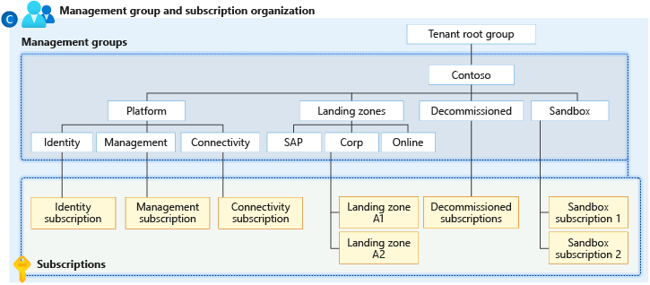

### Update Domain 

An update domain is a group of virtual machines and underlying physical hardware that can be rebooted at the same time. 

- When planned maintenance is performed, only one update domain is rebooted at a time. 
- This ensures that all VMs and associated hardware are not taken down at the same time.

### Fault Domain 

A fault domain is a group of virtual machines that shares a common power source and a common network switch. 

- When virtual machines are added to an availability set, they are distributed across up to:

    - three different fault domains in resource manager deployments, 
    - or across two fault domains in classic deployments.

## Azure Portal 

The Microsoft Azure portal is a browser-based graphical user interface (GUI) to help you manage resources in Azure. Although there are other ways to manage resources in Azure, such as the application programming interface (API) and command line interface (CLI), the portal is the simplest place to start.

|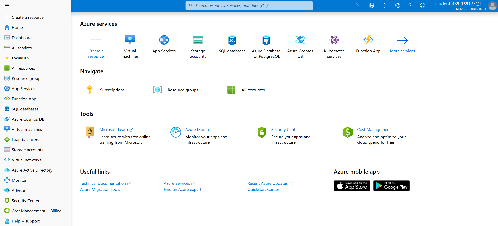|
|-|

To login: [Azure Portal](https://go.microsoft.com/fwlink/p?linkid=2165195&clcid=0x409)

<small>[Back to the top](#microsoft-azure-overview)</small>

## Reducing Costs 

Understanding the key factors that influence Azure costs is crucial for effective budgeting and cost management. Additionally, adopting cost-saving strategies can optimize expenses. Here are some significant factors and strategies related to Azure costs:

**1. Region Selection**
- The region where Azure resources are hosted impacts costs.
- Some regions may have higher costs than others for the same services.
- Consider cost differences when choosing a region, especially if data residency or latency is not a primary concern.

    

    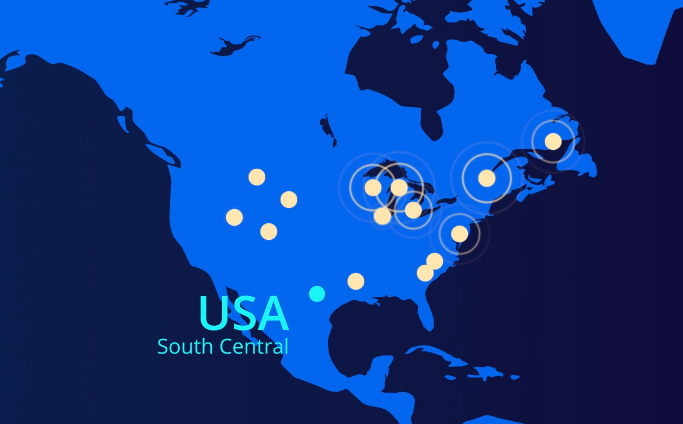
    

    
**2. Data Transfer Costs**
- Data transfer into Azure resources (ingress) is typically free.
- Data transfer out of Azure resources (egress) may incur costs, especially if transferred across regions or outside the Azure network.
- Minimize egress costs by keeping resources within the same region unless specific reasons justify cross-region deployment.

    

    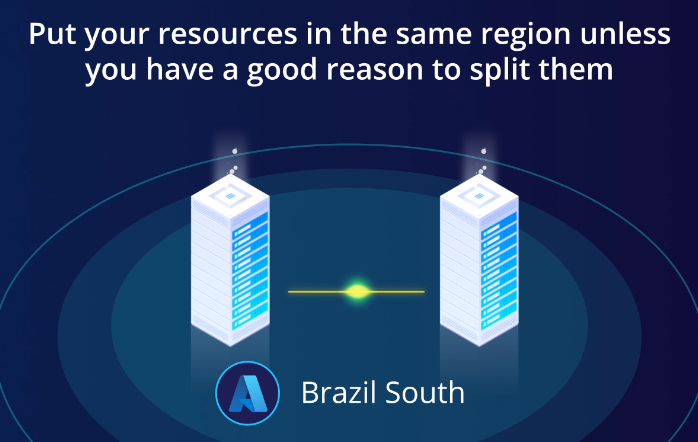
    

**3. Resource Groups and Regions**
- Resource group location is irrelevant for costs; the contained resources incur charges.
- Placing resources in different regions within a resource group does not cause additional charges.

    

    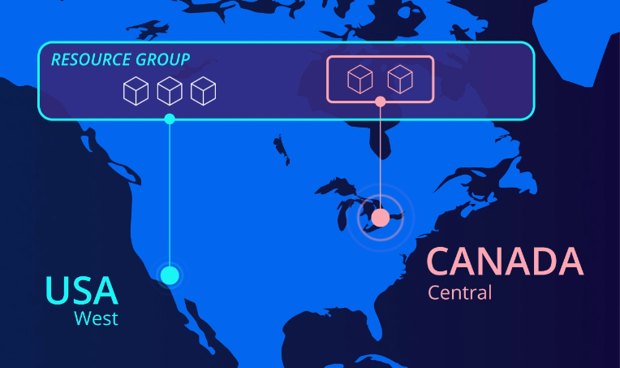
    

    
 
**4. Reserved Capacity**
- Reserved Instances involve committing to a long-term contract (1 or 3 years) for specific Azure services.
- Offers potential cost savings (up to 72%) compared to pay-as-you-go pricing.
- Available for select services, and the VM region is chosen during reservation.
- Exchanging reservations is possible, but a new reservation must be made.

    

    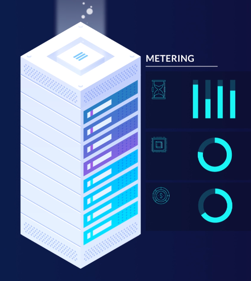
    

    

**5. Azure Hybrid Benefit**
- Utilize existing Windows Server or SQL Server licenses covered by Microsoft Software Assurance on Azure.
- Applicable to Azure VMs, Azure SQL Database, or Azure SQL Managed Instance.
- Helps reduce costs by leveraging existing licenses.

    

    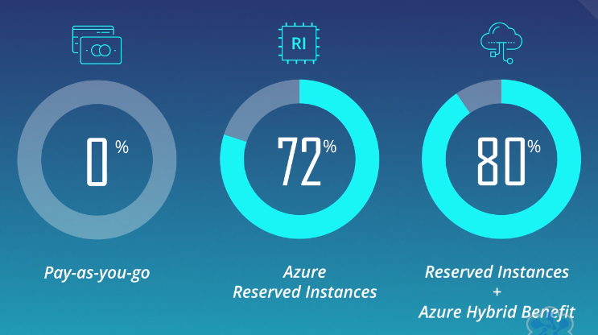
    

    
**6. Azure Spot Virtual Machines**
- Spot VMs offer significant cost savings (up to 90%) but may be preempted with short notice (30 seconds).
- Suitable for non-critical workloads like batch processing, testing, or rendering.

    

    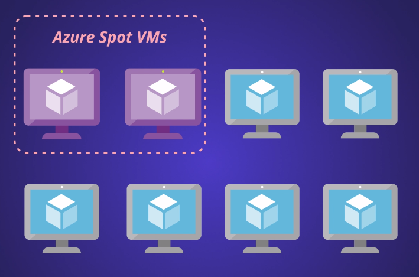
    

**7. Right-Sizing Virtual Machines**
- Resize underutilized VMs to a more cost-effective option.
- Azure Advisor provides insights into underutilized VMs and potential cost savings.
- Consider downsizing or shutting down VMs based on usage patterns.

    

    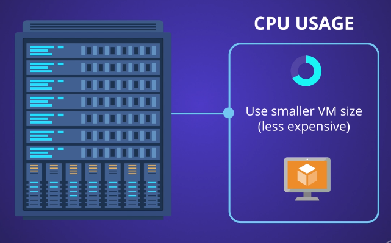
    

**8. VM Deallocation and Resource Cleanup**
- Stopped (deallocated) VMs may still incur charges for associated resources like data disks and static public IP addresses.
- Deleting a VM might not remove all associated resources; clean up data disks and public IP addresses separately.
- Azure Advisor assists in identifying unused resources, including public IP addresses.

    

    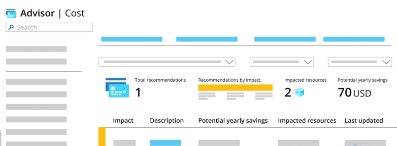
    

By considering these factors and implementing cost-saving measures, organizations can effectively manage their Azure expenses and optimize resource utilization. Regularly monitoring usage patterns and leveraging Azure tools for cost analysis contribute to efficient cost management strategies.

<small>[Back to the top](#microsoft-azure-overview)</small>

## Azure Cost Management 

Azure Cost Management provides essential features for managing and controlling costs within the Azure environment. Here are key components and strategies for effective cost control:

- Cost Analysis
- Budgets and Alerts
- Hierarchical Cost Tracking
- Tagging
- Azure Advisor Recommendations
- Regular Monitoring

### Cost Analysis

- **Functionality:** Allows detailed analysis of costs, breaking down spending by service, region, and subscription.
- **Usage:** View cost changes on a daily or monthly basis through charts and tables.
- **Forecasting:** Provides a forecast of future spending based on current resource usage.

### Budgets and Alerts

- **Budget Setup:** Establish monthly spending expectations by setting budgets.
- **Alerts:** Configure alerts to notify when costs approach or exceed specified thresholds.
- **Granularity:** Multiple alerts at different levels, e.g., 75%, 90%, and 100% of the budgeted amount.
- **Forecast Alerts:** Receive alerts based on the forecasted spending percentage.

### Hierarchical Cost Tracking

- **Levels:** Utilize three management levels for better cost tracking:
- **Resource Groups:** Contain related resources (e.g., services for a specific application).
- **Subscriptions:** Group resource groups; can be organized by teams or projects.
- **Management Groups:** Aggregate subscriptions (useful for departments).

### Tagging

- **Functionality:** Apply tags to Azure resources to categorize and organize them.
- **Usage:** Tags provide a mechanism to track the total cost of resources with the same tag.
- **Flexibility:** Enables fine-grained cost attribution and analysis.

### Azure Advisor Recommendations

- **Integration:** Azure Cost Management integrates with Azure Advisor for additional recommendations.
- **Optimization:** Leverage Advisor suggestions for optimizing costs and improving resource efficiency.
  
### Regular Monitoring

- **Proactive Approach:** Instead of daily analysis, set up budgets and alerts for proactive cost control.
- **Prevention:** Early warnings and alerts help prevent unexpected cost overruns.

By leveraging Azure Cost Management, organizations can gain insights into their spending patterns, set proactive budgets, and receive alerts to prevent budget overruns. The hierarchical structure, along with tagging, offers flexibility for tracking costs at various levels of granularity. Regular monitoring and integration with Azure Advisor ensure ongoing optimization of resources and costs.

<small>[Back to the top](#microsoft-azure-overview)</small>

## Resources 

- [Learning About Azure](https://cloudacademy.com/learning-paths/learning-about-azure-5663/)
- [AWS & Azure services comparision](https://gist.github.com/vikpande/6b8f891e2fb1ce1e255f636ee27caaee)
- [Networking services compared: AWS vs Azure vs Google Cloud](https://www.pluralsight.com/resources/blog/cloud/networking-services-compared-aws-vs-azure-vs-google-cloud)
- [osmanys/az900-training](https://github.com/osmanys/az900-training)