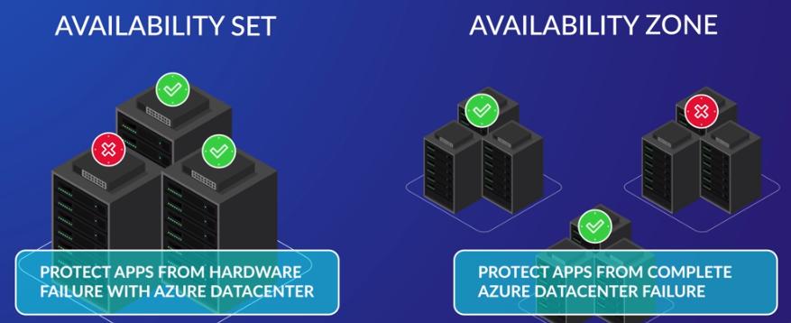

# Azure Compute 

> <small>This is not an exhaustive documentation of all the existing Azure Services. These are summarized notes for the Azure Certifications. To see the complete documentation, please go to: [Azure documentation](https://learn.microsoft.com/en-us/azure/?product=popular)</small>

- [Compute Services](#compute-services)
- [Virtual Machines](#virtual-machines)
   - [Pre-requisite Resources](#pre-requisite-resources)
   - [Pricing](#pricing)
   - [VM Options](#vm-options)
   - [Availability and Scalability Options](#availability-and-scalability-options)
      - [Availability Sets](#availability-sets)
      - [Availability Zones](#availability-zones)
      - [Multi-Region Deployments](#multi-region-deployments)
      - [Regional Pairs](#regional-pairs)
      - [Scale Sets](#scale-sets)
      - [Scale Set Types](#scale-set-types)
- [Azure App Service](#azure-app-service)
   - [Supported languages](#supported-languages)
   - [App Service Plan](#app-service-plan)
      - [Pricing Tier](#pricing-tier)
      - [Scaling](#scaling)
      - [Considerations](#considerations)
- [Resources](#resources)

## Compute Services 

Azure compute is an on-demand computing service for running cloud-based applications.

- Virtual machines
- Containers
- Azure App Service
- Serverless computing

<!-- This page will be focusing on virtual machines.  -->

<small>[Back to the top](#azure-compute)</small>

## Virtual Machines 

Azure Virtual Machines (VMs) let you create and use virtual machines in the cloud. They provide infrastructure as a service (IaaS) in the form of a virtualized server and can be used in many ways.

- Commonly used for hosting applications, offering benefits of virtualization without managing physical hardware.
- Managing tasks such as configuration, patching, and software installation is necessary.

**Key uses and features of Azure virtual machines**

- Quick and easy setup, making them ideal for development and test environments.
- Pay-as-you-go nature allows organizations to host applications in Azure cost-effectively.
- Often employed to extend on-premises data centers to Azure using virtual networks and site-to-site VPNs.

**Considerations when designing an application infrastructure with Azure VMs**

- Establish virtual machine naming conventions.
- Deploy VMs in locations closest to users for optimal access.
- Determine VM sizing requirements and consider Microsoft Azure's CPU and VM quotas.
- Decide on the operating system and VM configuration needed for application requirements.

<small>[Back to the top](#azure-compute)</small>

### Pre-requisite Resources 

To deploy an Azure virtual machine, certain prerequisite resources are essential. Generally, these resources will be automatically created if they do not exist prior to VM creation. Here are the key dependencies:

- **Resource Group**
   Must exist before creating a virtual machine, as each VM needs to be contained within a resource group.

- **Virtual Network and NIC**
   A virtual machine requires a virtual network, and consequently, a virtual Network Interface Card (NIC) for connectivity.

- **Storage Account (if using unmanaged disks)**
   Required to hold virtual hard disks for VMs using unmanaged disks. Not needed for VMs using only managed disks.

- **Public IP Address (for remote access)**
   Necessary if the virtual machine will be accessed remotely. If accessed only internally, a public IP address is not required.

- **Data Disks (optional but recommended)**
   While not mandatory, attaching data disks to a virtual machine is advisable to expand storage capabilities, especially if hosting applications.

<small>[Back to the top](#azure-compute)</small>

### Pricing 

There are multiple purchasing options for Azure virtual machines:

- **Pay-as-You-Go**
   - Pay for compute capacity by the second.
   - No long-term commitments or upfront payments.
   - Flexible scalability—increase or decrease capacity as needed.
   - Recommended for customers seeking cost-effectiveness and flexibility.

- **Reserved VM Instances**
   - Involves an upfront commitment to purchase a virtual machine for one or three years.
   - Offers cost savings of up to 72% compared to pay-as-you-go pricing.
   - Suitable for applications with steady-state usage or for those seeking budget predictability.
   - Requires a commitment to using the VM for at least a year.

- **Spot Pricing**
   - Allows the purchase of unused Azure compute capacity at a discount of up to 90% compared to pay-as-you-go prices.
   - Workloads must tolerate interruptions, making it ideal for interruptible applications.
   - Not suitable for workloads that must adhere to strict SLAs.

Each option provides distinct advantages, catering to different usage scenarios and budget considerations.

<small>[Back to the top](#azure-compute)</small>

### VM Options

Azure virtual machines come in various types, each tailored for specific workloads:

- **General-Purpose Virtual Machines:**
   - Balanced CPU to memory ratio.
   - Suitable for development, testing, small databases, and low-traffic web servers.

- **Compute-Optimized Virtual Machines:**
   - High CPU to memory ratios.
   - Ideal for medium traffic web servers, network appliances, batch processing, and application servers.

- **Memory-Optimized Virtual Machines:**
   - High memory to core ratios.
   - Used for relational database servers, large caches, and in-memory analytics.

- **Storage-Optimized Virtual Machines:**
   - High disk throughput and IO.
   - Perfect for big data, SQL, and NoSQL databases.

- **GPU Virtual Machines:**
   - Specialized for graphic rendering and video editing.
   - Available with single or multiple GPUs.

- **High-Performance Compute Virtual Machines:**
   - Fastest and most powerful CPU virtual machines.
   - Designed for high-performance compute workloads like molecular modeling, genomic research, and financial risk modeling.
   - Some include optional high throughput network interfaces.

Selecting the appropriate virtual machine type depends on the specific workload requirements and performance considerations.

<small>[Back to the top](#azure-compute)</small>

### Availability and Scalability Options

 

#### Availability Sets

An availability set is a logical grouping of two or more VMs that help keep your application available during planned or unplanned maintenance.
- Provides redundancy and availability for virtual machines (VMs).
- Requirement for SLA: At least two VMs, two fault domains, and two update domains for Microsoft’s 99.95% uptime guarantee.

**Components of Availability Sets**

- **Update Domains** 
   - Groups VMs to manage planned downtime during Azure updates.
   - Update domains (up to 20) group VMs for sequential reboots during maintenance.

- **Fault Domains** 
   - Separates VMs based on different power sources and network switches to minimize downtime due to hardware failures.
   - Fault domains (up to 3) group VMs with a common power source and network switch.
   - Protects against network outages, hardware failures, and power interruptions within an Azure data center.

#### Availability Zones

Availability zones protect applications from the failure of an entire Azure data center.

- A unique physical location within an Azure region, with each zone containing at least one data center.
- Consists of fault domains (1) and update domains (1).
- Protects applications from complete Azure data center failures.
- Deploying VMs in an availability zone guarantees a 99.99% VM uptime SLA.
- Deploying three or more VMs across three zones ensures distribution across different fault and update domains.
- Used to safeguard applications from entire Azure data center failures.

#### Multi-Region Deployments 

If you need higher availability than a single region can provide, you'll have to use multiple regions. 

- In most cases, it’d be sufficient to simply back up your VMs to another region. 
- If the region where your VMs are deployed goes down, you can temporarily bring up replacement VMs in the second region by using your backups. 
- If you can’t tolerate almost any downtime, then you could have VMs running in the backup region all the time.

#### Regional Pairs

When choosing a backup region, consider regional pairs for increased reliability.
- Nearly every one of Azure’s regions is paired with another region. 
- Some Azure services replicate their data across regional pairs if you choose certain options. 

For example, if you choose the geo-redundant storage option for an Azure Storage account, then your data will be replicated to the paired region.

NOTE:

- While storage accounts replicate data across regional pairs, VMs do not.
- Store VM backups in the paired region.
- In the event of an outage, Microsoft tries to make at least one region in each pair available.

<small>[Back to the top](#azure-compute)</small>

#### Scale Sets

There are two available approach to scaling a VM:

   - **Vertical Scaling:** Increase VM size individually.
   - **Horizontal Scaling:** Add more VMs for increased capacity.

Azure Virtual Machine Scale Sets let you create and manage a group of identical, load balanced VMs.

- Make the application tier stateless; store data in a shared external datastore.
- Scale sets distributes VMs across fault domains and update domains.
- It Automatically adjusts VM count based on defined rules.
- Utilizes CPU, disk, network metrics, and OS metrics (enabled through the diagnostics extension).
- Supports custom metrics from application logs.
- Configurable maximum and minimum VM count (up to 1,000 VMs in a scale set, or 600 VMs for custom images).

#### Scale Set Types

- **Zonal Scale Set** 
   - Deployed in a single zone.
   - This is the default.

- **Regional Scale Set** 
   - Spans availability zones for optimal availability and scalability.

By combining availability sets, availability zones, and scale sets, organizations can achieve both high availability and scalability for their VM-based applications in Azure. These architectural considerations ensure continuous operation during hardware failures, planned maintenance, and fluctuating demand.

<small>[Back to the top](#azure-compute)</small>

## Azure App Service

When it comes to hosting websites on Azure, there are several options available, each catering to different needs. 

- For static websites without user interactions, Azure Storage is a suitable choice. 

- For more sophisticated requirements, deploying on Azure virtual machines with content management systems or utilizing Azure Kubernetes Service for microservices-based applications are viable options.

However, the most popular and versatile way is through **Azure App Service**. 

App Service is a platform-as-a-service (PaaS) offering that simplifies web application deployment while providing flexibility and a rich set of features. 

- It manages the underlying infrastructure, alleviating concerns such as operating system patching.
- Frameworks come preinstalled and are automatically updated with new patches or releases.
- Most frameworks allow choosing between Windows and Linux hosting.
- For applications in different programming languages, App Service supports Docker containers with required dependencies.

**Additional features:**

- Well-integrated with Visual Studio and Visual Studio Code.
- Seamless integration with continuous integration/continuous delivery tools such as Azure DevOps, GitHub, and BitBucket.
- App Service can host mobile backends and APIs.
- Guarantees 99.95% uptime in most cases.
- Configurable to automatically scale resources based on demand.
- Provides authentication capabilities for restricting access to authorized users.
- Enables control over allowed or denied IP addresses for site access.

### Supported languages

- ASP.NET
- ASP.NET Core
- Java
- Ruby
- Node.js
- PHP
- Python

<small>[Back to the top](#azure-compute)</small>

### App Service Plan 

When using Azure App Service, one of the critical decisions is configuring the **App Service Plan**. This defines the type of infrastructure your web application will utilize. The three primary settings to decide in an App Service Plan are the following:

- **Operating System**
   - Choose between **Windows or Linux** based on your application's compatibility and requirements.

- **Region**
   - Select the region closest to your target audience for optimal performance.
   - Note: The region is immutable; you can't change it after the plan is created.

- **Pricing Tiers**
   - Pricing tiers determine compute resources, features, and costs associated with the App Service Plan.
   - The tiers include Free, Shared, Basic, Standard, Premium, and Isolated.

Regular assessments of scaling strategies and the chosen pricing tier help maintain application efficiency in response to varying workloads.

#### Pricing Tier 

1. **Free Tier**
   - Suitable for development and testing.
   - Provides up to 60 CPU minutes per day.
   - Shared compute resources.

2. **Shared (D1) Tier**
   - Offers up to 240 CPU minutes per day.
   - Shared compute resources.
   - Allows the use of a custom domain.

3. **Basic Tier**
   - Apps run on dedicated virtual machines.
   - Various options based on CPU cores and memory.
   - All options come with 10 GB of storage.

4. **Standard Tier**
   - Similar to Basic tier but with 50 GB of storage.
   - Supports autoscaling.
   - Allows up to 10 VM instances.

5. **Premium Tier**
   - More CPU, memory, and storage options.
   - Supports autoscaling.
   - Allows up to 30 VM instances.

6. **Isolated Tier**
   - Provides a private, dedicated environment.
   - VMs in their own virtual network, isolated from other App Service instances.
   - Allows up to 100 VM instances.

#### Scaling

- **Scaling Out (Horizontal Scaling)**
  - Add more virtual machine instances, up to the limit of the selected pricing tier.
  - Multiple apps within the same service plan share compute resources.

- **Scaling Up (Vertical Scaling)**
  - Switch to a pricing tier with more powerful instances or a higher limit on the number of instances.
  - Easy to perform, taking effect in seconds.

#### Considerations

- **Multiple Apps in a Service Plan**
  - Possible, but all apps share the same compute resources.
  - Excessive apps in one plan may lead to performance issues.

- **Scaling Strategies**
  - Choose between scaling out (horizontal) and scaling up (vertical) based on performance needs.
  - Autoscaling is a more advanced scaling strategy covered in a separate course.

<small>[Back to the top](#azure-compute)</small>

## Resources 

- [Learning About Azure](https://cloudacademy.com/learning-paths/learning-about-azure-5663/)