# Azure Storage 

> <small>This is not an exhaustive documentation of all the existing Azure Services. These are summarized notes for the Azure Certifications. To see the complete documentation, please go to: [Azure documentation](https://learn.microsoft.com/en-us/azure/?product=popular)</small>

- [Benefits of Azure Storage](#benefits-of-azure-storage)
- [Core Azure Storage Services](#core-azure-storage-services)
- [Storage Account types](#storage-account-types)
   - [Key Features](#key-features)
   - [Important Points](#important-points)
- [Azure Blob Storage](#azure-blob-storage)
   - [Key Resources](#key-resources)
   - [Access Tiers](#access-tiers)
   - [From the UI](#from-the-ui)
- [Azure Files](#azure-files)
   - [Management and Operations](#management-and-operations)
   - [Resilience and Reliability](#resilience-and-reliability)
- [Azure Queues](#azure-queues)
- [Azure Table Storage](#azure-table-storage)
   - [Components](#components)
   - [Key Relationships](#key-relationships)
- [Azure Managed Disks](#azure-managed-disks)
   - [Benefits](#benefits)
   - [Encryptions](#encryptions)
   - [Disk Types](#disk-types)
- [Redundancy Options](#redundancy-options)
   - [Locally-Redundant Storage LRS](#locally-redundant-storage-lrs)
   - [Zone-Redundant Storage ZRS](#zone-redundant-storage-zrs)
   - [Geo-Redundant Storage GRS](#geo-redundant-storage-grs)
   - [Read-Access Geo-Redundant Storage RA-GRS](#read-access-geo-redundant-storage-ra-grs)
   - [Geo-Zone-Redundant Storage GZRS](#geo-zone-redundant-storage-gzrs)
   - [Read-Access Geo-Zone-Redundant Storage RA-GZRS](#read-access-geo-zone-redundant-storage-ra-gzrs)
- [Redundancy Pricing](#redundancy-pricing)
- [Performance Levels](#performance-levels)
- [Data Transfer into Azure Storage](#data-transfer-into-azure-storage)
- [Migration Tools](#migration-tools)
- [Resources](#resources)

## Benefits of Azure Storage 

**Durability and Availability**
- Built-in redundancy ensures data safety during hardware failures.
- Cross-data center and cross-region replication protect against disasters or local failures.

**Security and Access Control**
- Automatic encryption for all stored data ensures inherent security.
- Fine-grained control over data access is maintained.

**Scalability and Accessibility**
- Designed to be massively scalable to meet diverse data storage requirements.
- Access data globally over HTTP or HTTPS with support for various client libraries and languages.
- Multiple access methods include .NET, Java, Python, PHP, PowerShell, Azure CLI, Azure portal, and Azure Storage Explorer.

## Core Azure Storage Services

**Azure Blobs**
- Provides object storage for unstructured data (e.g., text, binary data).

**Azure Managed Disks**
- Block-level storage volumes managed by Azure for virtual machines.
- Types include ultra disks, premium SSD disks, standard SSD disks, and standard HDD disks.

**Azure Files**
- Fully managed file share system accessible via the SMB protocol.
- Supports mounting from Windows, Linux, and MacOS machines, on-prem and in the cloud.

**Azure Queue Storage**
- Designed for storing and managing large numbers of messages in distributed applications.

**Azure Table Storage**
- Ideal for structured NoSQL data with a key/attribute store and a schema-less design.

<small>[Back to the top](#azure-storage)</small>

## Storage Account types

1. **General-Purpose V2 Account**
   - Basic storage account suitable for hosting blobs, files, queues, and tables.
   - Recommended for most scenarios requiring Azure storage.
  
2. **General-Purpose V1 Account**
   - Legacy account hosting blobs, files, queues, and tables.
   - Similar functionality to V2 accounts, but Microsoft recommends using V2 for future-proofing.

3. **Block Blob Storage Account**
   - Offers premium performance for block blobs and append blobs.
   - Ideal for high transaction rates and scenarios requiring low storage latency.

4. **File Storage Account**
   - Exclusive files-only storage account.
   - Recommended for enterprise and high-performing applications.

5. **Blob Storage Account**
   - Legacy account used for blob-only storage.
   - Microsoft recommends using general-purpose V2 accounts instead.

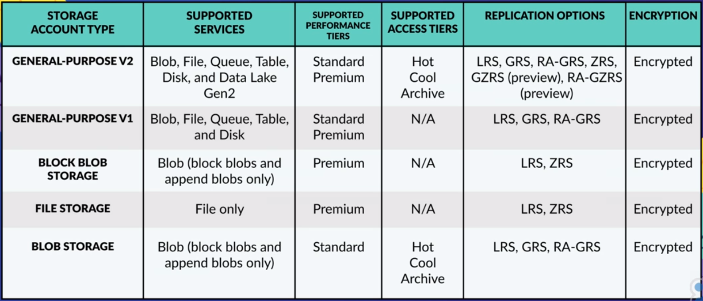

<small>[Back to the top](#azure-storage)</small>

### Key Features
- All storage account types are encrypted using Storage Service Encryption (SSE) for data at rest.
- Archive storage and blob-level tiering support only block blobs.
- Zone-Redundant Storage (ZRS) and Geo Zone-Redundant Storage (GZRS) are available for standard general-purpose V2 accounts, block blob accounts, and file storage accounts in certain regions.
- Premium performance for general-purpose V2 and general-purpose V1 accounts is available for disk storage and page blobs. For block blobs and append blobs, it's exclusive to block blob accounts. Files-only storage accounts support premium performance for files.

### Important Points

- Archive storage and blob-level tiering support only block blobs.
- ZRS and GZRS are available only for standard general-purpose V2 accounts, block blob accounts, and file storage accounts in certain regions.
- Premium performance for general-purpose V2 and general-purpose V1 accounts is only for disk storage and page blobs. Block blob accounts support premium performance for block blobs and append blobs, and files-only storage accounts support premium performance for files.

Detailed information on the different storage accounts available at: [https://docs.microsoft.com/en-us/azure/storage/common/storage-account-overview](https://docs.microsoft.com/en-us/azure/storage/common/storage-account-overview).

<small>[Back to the top](#azure-storage)</small>

## Azure Blob Storage 

Azure Blob storage is an object storage solution designed for storing massive amounts of unstructured data, including text and binary data. 

- Commonly used to host images, documents for web browsing, stream video or audio, store log files, backups, archive data, and data for analysis by on-prem or Azure-hosted processes.
- Objects in Blob storage can be accessed using HTTP or HTTPS.
- Accessible through Azure Storage REST API, Azure PowerShell, Azure CLI, or Azure storage client libraries (Java, PHP, .NET, etc.).

Blob data stands for **Binary Large Object** data. Blob data and can represent a wide variety of types of data you normally store on your computer including images, videos, and documents.

### Key Resources

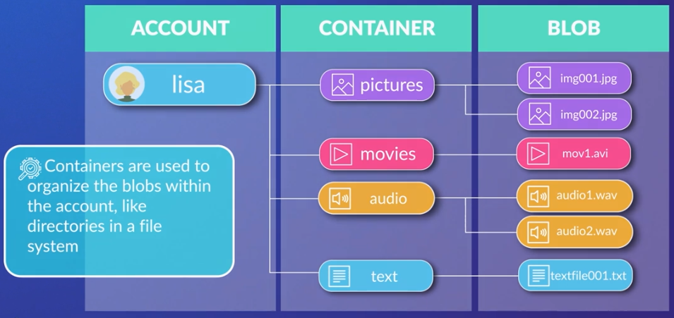

1. **Storage Account**
   - Creates a unique namespace in Azure for accessing data.
   - Forms the base address for objects in the storage account.
   - Example URL: `http://mystorage.blob.core.windows.net` for a storage account named MyStorage.

2. **Containers**
   - Used to organize blobs within a storage account, akin to directories in a file system.
   - Unlimited containers within a storage account, each capable of storing an unlimited number of blobs.

3. **Blob Types**
   - **Block Blobs**
     - Can store up to about 190.7 TiB of text and binary data.
     - Consists of manageable blocks of data, hence the name.
   - **Append Blobs**
     - Optimized for append operations.
     - Suitable for logging data from virtual machines.
   - **Page Blobs**
     - Used for storing random access files up to 8 TiB.
     - Ideal for storing VHD files, serving as disks for Azure virtual machines.
      

      

      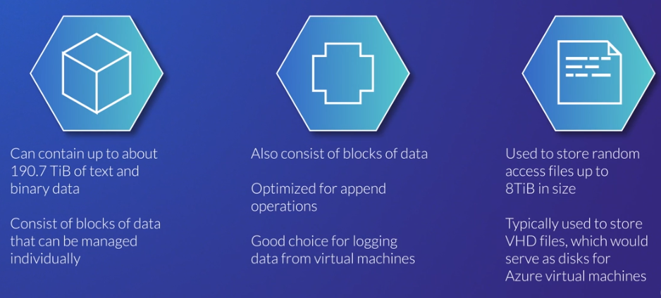
      

**Resource Relationship**
The storage account, containers, and blobs have a hierarchical relationship, forming a structured organization for your data.

<small>[Back to the top](#azure-storage)</small>

### Access Tiers 

- **Hot:** 

   - Intended for frequently accessed data.

- **Cool:** 

   - For infrequently-accessed data.
   - Optimized for data still needing immediate retrieval.
   - Lower storage cost but higher cost for reads and writes.
   - Data must be in cool tier for at least 30 days.

- **Archive:** 

   - Cost-effective for rarely accessed data 
   - Retrieval times of up to 15 hours.
   - 5x cheaper than cool tier for storage but much more expensive for reads.
   - Data must be in archive tier for at least 180 days.

Blob Storage allows setting a default access tier for the entire storage account and supports individual blob tier configurations. 

**Azure Data Lake Storage** Gen2 provides hierarchical storage on top of Blob Storage for specialized use cases.

### From the UI  

In the example below, we can see the important details in the **Overview** section of the Storage account. 

|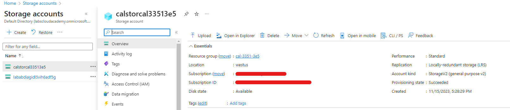|
|-|

- **Disk State** 
   - Indicates that the storage location is Available. 
   - In the event of an outage in Azure, you may see a different value here. 
   
- **Location** 
   - Determines the locations of primary and secondary storage location.
   - This storage account has no secondary storage location, but you can create storage accounts with primary and secondary storage locations. 

- **Performance** 
   
   - **Premium Storage** 
      - Use this when you need guaranteed latency 
      - Higher storage costs because they use solid-state drives (SSDs) 
   
   - S**tandard storage** 
      - Uses magnetic spinning hard disk drives (HDDs).

- **Replication** 
   - Sets the durability and availability of the storage. 
   - The following options are available:

      - **Locally-redundant storage (LRS)** 
      
         - The cheapest option and stores the data in a single data center. 
         - If that data center goes offline you will not be able to access the data.

      - **Zone-redundant storage (ZRS)** 
      
         - Stores data across three data centers in a region. 
         - It can tolerate individual data center outages but not regional outages.

      - **Geo-redundant storage (GRS)** 
      
         - Stores data across multiple data centers in two regions, a primary region and a secondary region. 
         - This option is more expensive but can tolerate entire regional outages. 
         
      - **Read-access geo-redundant storage (RA-GRS)** 
      
         - Allows you to read from the secondary region compared to GRS which only allows you to access the secondary in the case of a Microsoft-initiated region failover to the secondary.

- **Account kind** 

   - **General-purpose** 
      
      - Allow storage of blobs, tables, files, and queues 
   
   - **Specialized kinds** 
   
      - Only allow one type such as only blob storage. 
      - There are different pricing models for each account kind so a specialized kind may reduce your costs. 
      - **StorageV2** is the recommended default.

For more information: [Azure Blob Storage Introduction](https://docs.microsoft.com/en-us/azure/storage/blobs/storage-blobs-introduction).

<small>[Back to the top](#azure-storage)</small>

## Azure Files 

Azure Files makes file shares available in the cloud, offering a fully managed solution.

- Supports access through the **Server Message Block (SMB) protocol**, an industry-standard. 
- Azure file shares can be mounted from Windows, Linux, and Mac OS machines, both in the cloud and on-premises.
- **Azure File Sync** Allows caching Azure file shares on Windows servers close to users for faster data access.
- Azure Files can replace or supplement on-premises file servers and NAS devices.
- Enables control of Azure file share permissions through on-prem Active Directories. 
- Useful for lifting and shifting applications to the cloud, especially those relying on file shares for data storage.
 
### Management and Operations
- **Fully Managed**: Azure Files is a fully managed service, eliminating concerns about hardware management, OS installation, patching, and security upgrades.
- **Command Line and Portal Management:**
    - Use familiar PowerShell commands and Azure CLI commands for creating, mounting, and managing Azure file shares.
    - Management through the Azure portal and Azure Storage Explorer is also supported.

### Resilience and Reliability

- **Built to Be Resilient:** Azure Files is designed with resilience, eliminating worries about file server upgrades, local power outages, and network issues affecting on-prem file shares.

By leveraging Azure Files, organizations can simplify file storage management, enhance accessibility, and ensure reliability without the overhead of traditional on-premises file servers. 

<small>[Back to the top](#azure-storage)</small>

## Azure Queues 

Azure Queue Storage provides a scalable and reliable solution for managing messages in distributed applications, enhancing communication and coordination among various system components.

- Messages are not emails but serve as communication units in distributed applications.
- Accessible globally through authenticated HTTP or HTTPS calls.

**Components of Azure Queue Service**

1. **URL Format** 
    - Specific URL format required to access a queue, including the storage account name and queue name.
    - Example URL: `http://mystorageaccount.queue.core.windows.net/images-to-process`
2. **Storage Account:**
   - All access to Azure storage services, including queues, is through a storage account.
   - The storage account acts as the overarching container for Azure storage.

3. **Queue** 
    - A queue is essentially a set of messages.
    - When naming a queue, use all lowercase letters.

4. **Message**
    - Messages can be in any format. and can be up to 64 kB in size.
    - Messages play a crucial role in enabling communication between different components of a distributed application.

<small>[Back to the top](#azure-storage)</small>

## Azure Table Storage 

Azure Table Storage is a NoSQL datastore, providing a schema-less and flexible approach to storing structured non-relational data. 

- Ideal for storing structured non-relational data.
- Key/attribute store with a schema-less design, allowing flexibility in data storage without rigid schema requirements.
- Commonly used for flexible databases, such as user data in web applications, address books, or device information.
- Suited for scenarios with large amounts of structured data, especially when complex joins, foreign keys, or stored procedures are not necessary.
- Useful for scenarios involving large datasets that require fast access without the need for complex relational features. 

### Components 

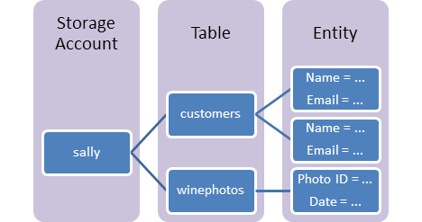

1. **URL Format for Access:**
   - Format: `http://<storage account>.table.core.windows.net/<table>`
   - Unique URL with storage account name and table name.
2. **Storage Account:**
   - All access to Azure storage, including table storage, is via a storage account.
3. **Table:**
   - A collection of entities; unlike relational databases, tables do not enforce a strict schema.
4. **Entity:**
   - Comparable to a traditional database row.
   - Essentially, a set of properties.
   - Each entity can be up to 1 MB in size.
5. **Properties:**
   - Name-value pairs.
   - Up to 252 properties per entity.
   - Three system properties: 
        - partition key
        - row key
        - timestamp

### Key Relationships

- **Hierarchy:** Storage account > Tables > Entities > Properties.
- **Access:** The URL serves as the means to access the entire structure.

<small>[Back to the top](#azure-storage)</small>

## Azure Managed Disks 

Azure virtual machines (VMs) use Azure disks as their attached disk storage. 

- Azure disks are built-on top of page blobs which are the type of blobs optimized for random access. 
- When you create Azure disks you can choose to manage the storage account yourself or to use managed disks where Azure manages the storage account for you. 
- Managed disks are the preferred option.

Azure Managed Disks provide a virtualized, scalable, and highly available storage solution for Azure VMs. 

- Virtualized block-level storage volumes used with Azure VMs and managed by Microsoft Azure.
- The encryption options (SSE and ADE) enhance data security, and the distinction between data, OS, and temporary disks allows for efficient and purpose-driven disk management within the Azure infrastructure.

   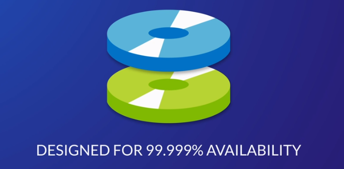

### Benefits

  1. **Availability**
        - Designed for 99.999% availability with three replicas of data per disk, protecting against two failures of disk replicas.
  2. **Scalability**
        - Supports up to 50,000 VM disks of a specific type per region in each subscription, enabling the creation of numerous virtual machines.
  3. **Integration:**
        - With availability sets: 
            - Isolation of VM disks within an availability set, guarding against a single point of failure within an Azure data center.
        - With availability zones: 
            - Protection against entire Azure data center failures.
  4. **Backup and Restore**
        - Integrated with Azure backup, supporting backup and restore of managed disks, making VM restores easy.
  5. **Access Control** 
        - Granular access control through Azure role-based access control (RBAC), allowing specific permissions for managed disks.
  6. **Upload Ease** 
        - Facilitates the upload of on-prem VMs to Azure through direct upload, streamlining the VHD file transfer process.

### Encryptions

  1. **Server-side Encryption (SSE)**
     - Default for all managed disks.
     - Provides encryption at rest for data, snapshots, and images.
  2. **Azure Disk Encryption (ADE)**
     - Enables encryption on OS and data disks of a VM.
     - Uses **BitLocker** for Windows VMs 
     - Used **DM-crypt** for Linux VMs.

### Disk Types

  1. **Data Disks**
     - Attached to a VM to store applications and data.
     - Registered as a SCSI drive, assignable drive letters, 
     - Max capacity of 32 terabytes.
     - Number of data disks depends on VM size.

  2. **OS Disks**
     - Deployed with a VM, hosts OS and boot volume.
     - Max capacity of 4 terabytes.

  3. **Temporary Disks**
     - Not a managed disk, not intended for important data.
     - Every VM contains a temporary disk, 
     - Used for page files and swap files, 
     - Data may be lost during maintenance events or VM redeployment.
     - Assigned the drive letter D on Windows and 
     - Assigned to /dev/sdb on Azure Linux VMs.

         |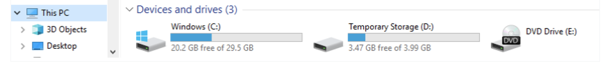|
         |-|

<small>[Back to the top](#azure-storage)</small>

## Redundancy Options 

Azure Storage provides six redundancy options, ranging from locally-redundant to read-access geo-zone-redundant storage. Each option offers different levels of redundancy and pricing. 

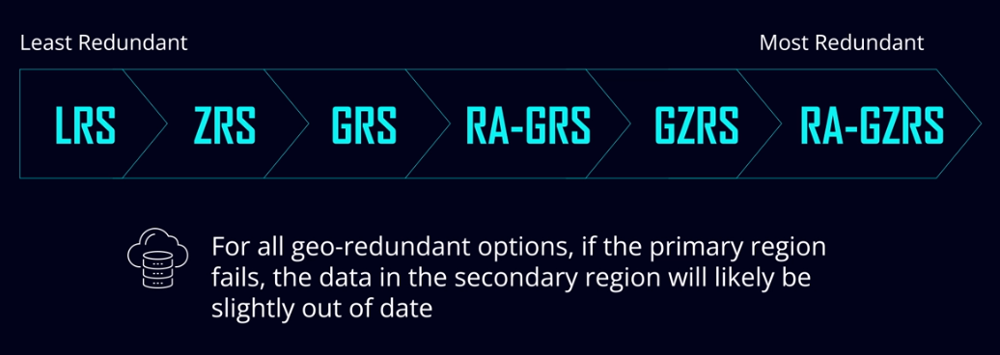

Note that not all of these options are available in every region or for every type of data.

### Locally-Redundant Storage (LRS)

- **Replication:** Across racks in the same data center.
- **Disaster Consideration:** Data could be lost in a data center disaster.
- **Recommendation:** Use only if data reconstruction is easily achievable.

   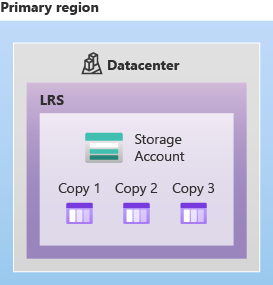

### Zone-Redundant Storage (ZRS)

- **Replication:** Across three zones within one region.
- **Disaster Consideration:** Ensures data availability even if an entire zone goes down.

   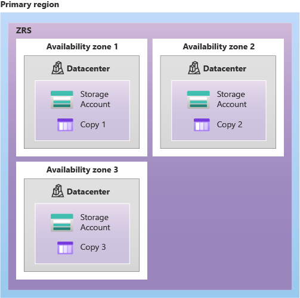

### Geo-Redundant Storage (GRS)

- **Replication:** Across two regions.
- **Disaster Consideration:** Requires geo-failover in the event of a regional disaster to access data in the secondary region.

   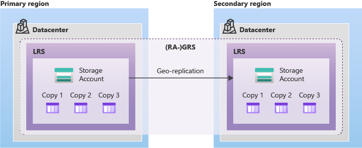

### Read-Access Geo-Redundant Storage (RA-GRS)

- **Replication:** Same as GRS.
- **Additional Feature:** Allows reading data immediately from the secondary region in case of a disaster in the primary region.
- **Write Access:** Not available until Microsoft restores availability in the primary region.

   

### Geo-Zone-Redundant Storage (GZRS)

- **Replication:** Across three availability zones in the primary region.
- **Difference from GRS:** Combines zone-redundant storage and geo-redundant storage.

   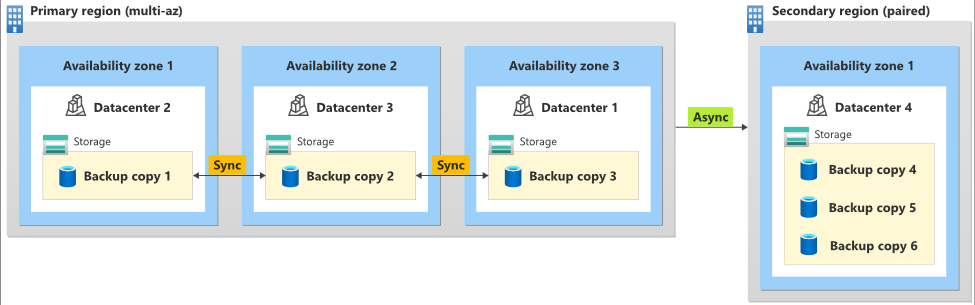

### Read-Access Geo-Zone-Redundant Storage (RA-GZRS)

- **Replication:** Same as GZRS.
- **Additional Feature:** Allows immediate reading from the secondary region in case of a disaster in the primary region.
- **Write Access:** Not available until Microsoft restores availability in the primary region.

   

## Redundancy Pricing 

Naturally, each of these redundancy options has a different price. 

- Locally-redundant storage being the cheapest and 
- Read-access geo-zone-redundant storage being the most expensive. 
- RA-GRS is actually more expensive than GZRS even though it’s less redundant because it provides instant access to your data in the secondary region. 

<small>[Back to the top](#azure-storage)</small>

## Performance Levels

Aside from the redundancy level and the default access tier, there’s yet another option you need to set when you create a storage account: the performance level.

- **Standard (Default)**

   - **Account Type:** General-purpose v2 account.
   - **Recommendation:** Suitable for most cases.

- **Premium**

   - **Account Type:** Higher-performance option.
   - **Consideration:** More expensive and limits redundancy options.
   - **Usage:** Recommended only if significantly faster performance is necessary.

## Data Transfer into Azure Storage

- **Azure Portal**

   - **Use:** For uploading a small number of files from the desktop.
   - **Capability:** Allows file upload and download directly through the portal.

- **AzCopy (Command-Line Utility)**

   - **Use:** For faster upload/download, especially for a large number of files.
   - **Capability:** Supports file and folder copying, including cross-cloud transfers.

- **Azure Storage Explorer (Graphical User Interface)**

   - **Use:** For managing files, changing access tiers, and copying files using a graphical interface.
   - **Capability:** Provides file management features beyond simple copying.

- **Azure File Sync**

   - **Use:** Specialized use case for creating a local cache of Azure Files on Windows servers.
   - **Capability:** Enhances access speed to an Azure file share in an on-premises environment.

## Migration Tools

- **Azure Migrate**

   - **Use:** Comprehensive tool for discovering, assessing, and migrating on-premises servers, web apps, and databases to Azure.
   - **Process:** Discovers on-premises resources, assesses size and cost of equivalent Azure services, facilitates migration.

- **Azure Data Box**

   - **Use:** For sending a large amount of data during migration.
   - **Process:** Microsoft ships a Data Box storage device, data is copied to the device, shipped back to Microsoft, and data is transferred to the Azure storage account.
   - **Consideration:** Typically used for data transfers exceeding 40 terabytes due to time and expense involved.

<small>[Back to the top](#azure-storage)</small>

## Resources 

- [Learning About Azure](https://cloudacademy.com/learning-paths/learning-about-azure-5663/)