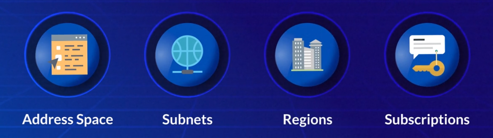
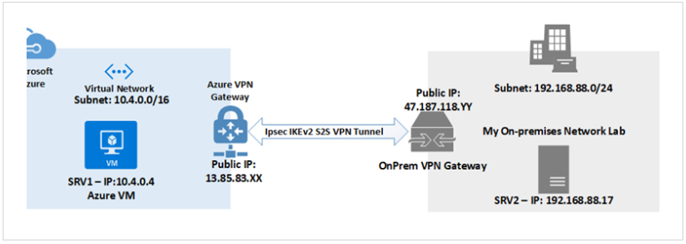
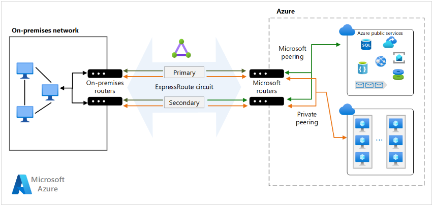
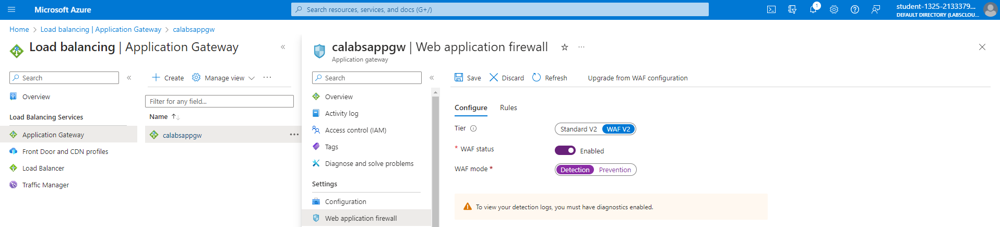
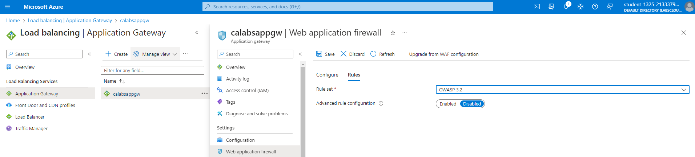
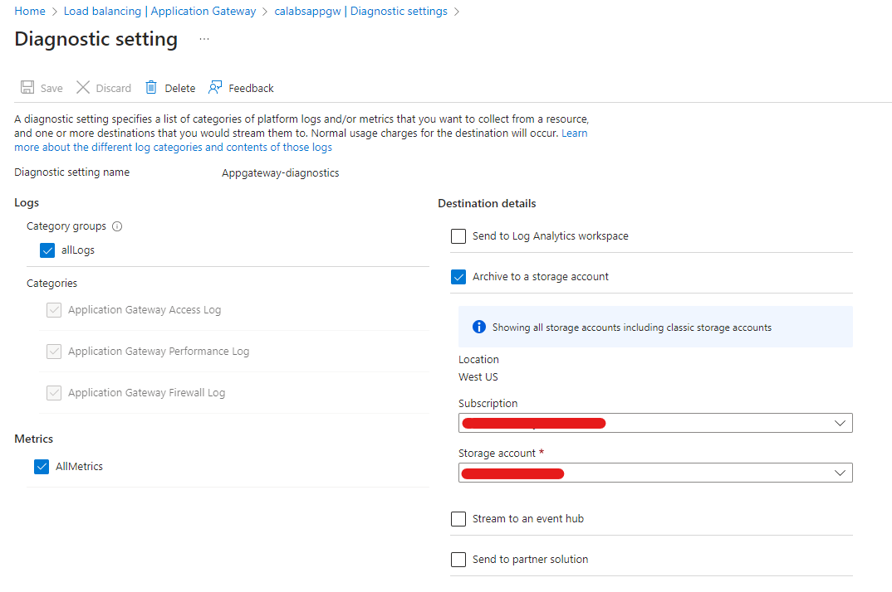

# Azure Networking 

> <small>This is not an exhaustive documentation of all the existing Azure Services. These are summarized notes for the Azure Certifications. To see the complete documentation, please go to: [Azure documentation](https://learn.microsoft.com/en-us/azure/?product=popular)</small>

- [Virtual Networks](#virtual-networks)
    - [Key Concepts](#key-concepts)
    - [Best Practices for Virtual Networks](#best-practices-for-virtual-networks)
- [Internet Communication](#internet-communication)
- [Communication Between Azure Resources](#communication-between-azure-resources)
    - [Deployment in the same vNet](#deployment-in-the-same-vnet)
    - [Service Endpoints](#service-endpoints)
    - [Private Links](#private-links)
    - [vNet Peering](#vnet-peering)
- [Communication with On-Prem Networks](#communication-with-on-prem-networks)
    - [Point-to-Site VPN](#point-to-site-vpn)
    - [Site-to-Site VPN](#site-to-site-vpn)
    - [Azure ExpressRoute](#azure-expressroute)
- [Filtering and Routing](#filtering-and-routing)
    - [Security Groups](#security-groups)
    - [Network Virtual Appliances NVA](#network-virtual-appliances-nva)
    - [Route Tables](#route-tables)
- [VPN Gateway](#vpn-gateway)
- [Point-to-Site VPNs](#point-to-site-vpns)
    - [Protocols](#protocols)
    - [Authentication Methods](#authentication-methods)
    - [Gateway SKUs Supporting P2S VPNs](#gateway-skus-supporting-p2s-vpns)
- [Site-to-Site VPNs](#site-to-site-vpns)
    - [Creating the Connection](#creating-the-connection)
- [ExpressRoute](#expressroute)
    - [Connectivity Options](#connectivity-options)
    - [Key Benefits](#key-benefits)
    - [Bandwidth Options](#bandwidth-options)
    - [Billing Models](#billing-models)
    - [ExpressRoute Premium Add-On](#expressroute-premium-add-on)
- [vNet Peering](#vnet-peering)
    - [Key Features](#key-features)
    - [Types of Peering](#types-of-peering)
- [Resources](#resources)

## Virtual Networks 

Azure Virtual Networks are foundational to Azure resource deployment, providing enhanced scalability, availability, and isolation.

- Enables secure communication across resources.
- Similar to physical networks but offers improved availability, scalability, and isolation.

**Internet Communication**
- Outbound to the internet is available by default.
- Inbound from the internet:
  - Assign a public IP address to the resource.
  - Provision a public load balancer.

### Key Concepts

**Address Space**
- Defines private or public addresses conforming to RFC 1918.
- Resources in the virtual network get assigned addresses from this space.

**Subnets**
- Segment the virtual network into subnetworks, improving address space efficiency.
- Allows better security through Network Security Groups (NSGs).

**Regions**
- Virtual networks are scoped to a single region or location.
- Connectivity across regions is achieved through virtual network peering.

**Subscriptions**
- Each virtual network is scoped to a specific subscription.

<small>[Back to the top](#azure-networking)</small>

### Best Practices for Virtual Networks

**Address Space Overlap**
- Ensure the defined virtual network address space doesn't overlap with existing network ranges.
- Critical for scenarios like site-to-site VPN connections.

**Subnet Planning**
- Avoid creating subnets that cover the entire virtual network address space.
- Plan subnets with reserved address space for future use.

**Fewer Larger Virtual Networks**
- Prefer defining fewer large virtual networks over numerous smaller ones.
- Minimizes management overhead.

**Utilize Network Security Groups (NSGs)**
- Secure virtual networks using NSGs.
- Filter network traffic with defined security rules for inbound and outbound traffic.

For more information: [Learn more about Network Security Groups](https://docs.microsoft.com/en-us/azure/virtual-network/security-overview).

<small>[Back to the top](#azure-networking)</small>

## Internet Communication

- Outbound to the internet is available by default.
- Inbound from the internet:
  - Assign a public IP address to the resource.
  - Provision a public load balancer.

## Communication Between Azure Resources

### Deployment in the same vNet

Resources like VMs, Scale Sets, and App Service Environments deployed to the same virtual network can communicate with each other.

### Service Endpoints

Enables secure and direct connectivity from the virtual network to the Azure resources using a secure and optimized route over the Azure backbone network.

For more information: [Service Endpoints Overview](https://docs.microsoft.com/en-us/azure/virtual-network/virtual-network-service-endpoints-overview)

### Private Links

A private link can be used to privately access specific service instances from virtual network or on-prem.

For more information: [Private Link Overview](https://docs.microsoft.com/en-us/azure/private-link/private-link-overview)

### vNet Peering

Connect two virtual networks, enabling communication between Azure resources. For more information: [vNet Peering](#vnet-peering)

<small>[Back to the top](#azure-networking)</small>
 
## Communication with On-Prem Networks

### Point-to-Site VPN

Connect a single computer to the virtual network.

- For each on-prem computer or client, a separate connection is used
- Typically used for remote worker access.
 

    

    
    

For more information: [Point-to-Site VPNs](#point-to-site-vpns)

### Site-to-Site VPN

Connect entire on-prem network to Azure virtual network.

- Secure, encrypted connection over the internet.
- Utilizes Azure VPN Gateway.
 

    

    
    

For more information: [Site-to-Site VPNs](#site-to-site-vpns)

### Azure ExpressRoute

Private connection between on-prem network and Azure.

- No internet flow, established through an ExpressRoute partner.
- Offers a more robust and dedicated connection.
  

    

    
    

For more information: [Azure ExpressRoute](#expressroute)

<small>[Back to the top](#azure-networking)</small>

## Filtering and Routing

Traffic filtering in production virtual networks can be done through network security groups (NSGs) and application security groups (ASGs).

- Filter traffic between subnets.
- Allow certain traffic while blocking others.

### Security Groups 

As mentioned, there are two types of security groups:

- **Network Security Groups**

    - Can be assigned to a specific NIC or entire subnet,
    - Rule specified here is applied to the NIC or all NICs and VMs on the subnet.
    - This works for most scenarios, but is still less flexible than application security groups 

- **Application Security Groups**
        
    - You can logically group NICs of different VMs on the same virtual network.
    - You can then apply NSG rules to specific groups of NICs.
    - Allows for creating different traffic rules for different groups of NICs on the same network.
    - Usig a separate ASG for each group of VMs allows you to manage the network security rules for each different group of VMs.

### Network Virtual Appliances (NVA)

An NVA is a virtual machine performing specific network tasks 

- Act as a firewall
- Provide WAN optimization.
- Examples include Barracuda CloudGen WAF for Azure, Citrix SD-WAN Center.

### Route Tables 

**Default Routing**
Azure handles routing by default between subnets, vNets, on-prem networks, and the internet. To enable custom routes, use route tables and BGP routes.

**Route Tables**
Custom tables that allows you to define custom routes for subnets.

**BGP Routes**
Propagates on-prem BGP routes to Azure virtual networks, through the use of:
- Azure VPN Gateway
- ExpressRoute connection

For more information: [BGP Routes](https://docs.microsoft.com/en-us/azure/vpn-gateway/vpn-gateway-bgp-overview?toc=/azure/virtual-network/toc.json)

## VPN Gateway 

A VPN Gateway is a specialized virtual network gateway used for encrypted network traffic over the public internet, and can be used to connect:

- Azure virtual network to on-prem network
- Azure virtual network to another Azure virtual network

Note that only one VPN gateway can be defined per virtual network. However, a VPN gateway can support multiple connections to it.

**How it works**
Azure deploys at least two hidden VMs in a specified gateway subnet.
- Hidden VMs contain routing tables and gateway services.
- VMs are not visible or configurable by users.
- Deployment of VPN gateways can take up to 45 minutes to complete.
  
**Gateway Types**
The type of VPN gateway is specified during deployment:
  - "VPN" type for typical VPN connections.
  - "ExpressRoute" for configuring an ExpressRoute connection.

**After Deployment**
Once the VPN Gateway is deployed, you can create an IPSec or IKE VPN tunnel between the newly deployed vNet gateway and any one of a number of other gateways.
- vNet-to-vNet connection to another VPN gateway in Azure.
- Site-to-site connection to an on-prem VPN device.
- Point-to-site connection for remote location access.

For more information: [Azure VPN Gateway Documentation](https://docs.microsoft.com/en-us/azure/vpn-gateway/vpn-gateway-about-vpngateways)

<small>[Back to the top](#azure-networking)</small>

## Point-to-Site VPNs 

A Point-to-Site (P2S) VPN gateway connection is a secure means to link a single client computer to an Azure virtual network, often favored by remote workers seeking access to Azure resources. This connection type is initiated directly from the client computer.

### Protocols 

When creating a P2S VPN, you have the flexibility to select from various protocols:

- **OpenVPN Protocol:**
  - SSL/TLS-based, it traverses firewalls through TCP port 443 outbound.
  - Compatible with Android, Windows, Linux, and Mac OSX.

- **Secure Socket Tunneling Protocol (SSTP):**
  - Proprietary VPN protocol leveraging TLS.
  - Penetrates firewalls, but exclusively supports Windows devices.

- **IKEv2 VPN:**
  - Standards-based IPSec VPN solution.
  - Suitable for connecting from Mac OSX devices.

### Authentication Methods

Users initiating a P2S VPN connection to Azure must undergo authentication which can done through various methods:

- **Azure Certificate Authentication:**
  - Requires a client certificate on the connecting device, validated by the VPN gateway during the connection handshake.

- **Azure AD Authentication:**
  - Users connect using Azure AD credentials, supported only for OpenVPN protocol.
  - Windows 10 necessitates the Azure VPN Client for compatibility.

- **Traditional AD Domain Authentication:**
  - Users in a traditional AD domain are authenticated via a RADIUS server integrated with the domain controller.

### Gateway SKUs Supporting P2S VPNs

Refer to the table below for Azure gateway SKUs supporting Point-to-Site VPNs:

| Gateway SKU           | P2S VPN Support |
|-----------------------|-----------------|
| Standard              | Yes             |
| HighPerformance       | Yes             |
| VpnGw1                | Yes             |
| VpnGw2                | Yes             |
| VpnGw3                | Yes             |

For more information: [official documentation](https://docs.microsoft.com/en-us/azure/vpn-gateway/point-to-site-about). 

<small>[Back to the top](#azure-networking)</small>

## Site-to-Site VPNs 

When bridging on-premises networks to Azure virtual networks, the go-to solution is often a Site-to-Site VPN gateway. 

- This connection type establishes a secure IPSec or IKE VPN tunnel, linking your on-prem network to the Azure vNet. 
- The key ingredient for deploying this connection is a VPN device on-premises, equipped with a public IP address for seamless communication with the Azure VPN gateway.

### Creating the Connection

1. **Azure Virtual Network Setup:**
   - Begin by crafting the Azure virtual network that will connect to your on-prem network.

2. **Gateway Subnet and VPN Gateway Creation:**
   - Establish a gateway subnet within your virtual network.
   - Next, create the VPN gateway. 
   - While the gateway subnet takes only minutes, deploying the VPN gateway may take up to 45 minutes.

3. **Local Network Gateway Setup:**
   - Once the VPN gateway is in place, set up the local network gateway, symbolizing the on-premises endpoint of the impending VPN connection.

4. **Configuration of On-Prem VPN Device:**
   - Customize the on-premises VPN device configuration. 
   - Note: The process may vary based on your specific device.

5. **Azure VPN Connection Deployment:**
   - With both VPN and local network gateways ready, deploy the VPN connection in Azure. 
   - This step establishes the site-to-site link between the Azure VPN gateway (representing the Azure side) and the local network gateway (representing the on-prem endpoint).

6. **Verification of Connection:**
   - After provisioning the VPN connection, thorough verification is crucial to ensure a seamless and secure link between on-premises and Azure networks.

<small>[Back to the top](#azure-networking)</small>

## ExpressRoute 

Microsoft ExpressRoute is a powerful solution for extending on-premises networks into Azure, providing a private connection facilitated by third-party connectivity providers. 

Unlike traditional site-to-site connections that traverse the public internet, ExpressRoute ensures enhanced security, reliability, and speed.

### Connectivity Options

- **Any-to-Any Network:**
  - Establish connectivity from any network to Azure.

- **Point-to-Point Ethernet Network:**
  - Direct, dedicated connection between on-premises and Azure.

- **Virtual Cross-Connection:**
  - Facilitated through a connectivity provider at a co-location facility.

### Key Benefits

- **Enhanced Security:**
  - Connections bypass the public internet.

- **Global Connectivity:**
  - Access Microsoft cloud services across all regions with the ExpressRoute premium add-on.

- **Dynamic Routing with BGP:**
  - Enables dynamic routing between on-prem networks and Microsoft.

- **Built-in Redundancy:**
  - Ensures higher reliability with a 99.95% connection uptime SLA for dedicated circuits.

### Bandwidth Options

Choose from a range of ExpressRoute circuit bandwidths:

- 50 Mbps
- 100 Mbps
- 200 Mbps
- 500 Mbps
- 1 Gbps
- 2 Gbps
- 5 Gbps
- 10 Gbps

**Scalability Bonus:** Increase bandwidth without tearing down existing connections.

### Billing Models

1. **Unlimited Data Billing:**
   - Monthly fee offering unlimited inbound and outbound transfer.

2. **Metered Data Billing:**
   - Monthly fee with free inbound data transfer; outbound data transfer charged on a per-GB basis.

### ExpressRoute Premium Add-On

- **Route Limits:**
  - Increases Azure public and private peering route limits from 4,000 to 10,000.

- **Global Connectivity:**
  - Expands connectivity globally (excluding national clouds).

- **vNet Links:**
  - Raises the default limit of 10 vNet links per circuit based on circuit bandwidth.

For more information: [ExpressRoute FAQ](https://docs.microsoft.com/en-us/azure/expressroute/expressroute-faqs)

<small>[Back to the top](#azure-networking)</small>

## Application Gateway 

### Enabling WAF 

We can enable the Application Gateway WAF to ensure that it logs any threat that it detects. Using Azure Diagnostics, Application Gateways can store logs in a Storage Account or Log Analytics Workspace.

To enable WAF in the Application Gateway, go to **Application gaetways** page, select your gateway, and click **Web application firewall** on the left-hand side. Toggle the **WAF status.**

**Modes**

- Detection mode monitors and logs all threats and alerts but will not block incoming requests. 

- Prevention mode will additionally action on the threats and alerts and will take measures to block those attacks. 

It's good practice to use detection mode first and then work your way up to prevention.

**Rulesets**

Rule sets are used to protect web applications against common vulnerabilities and exploits. This allows Cloud engineers and developers to keep up with mitigating against the latest attacks. 

The OWASP core 3.2 rule set is a new pre-defined rule set that provides a new engine and rule set for defending against Java infections and fixes many false positives.

**Log Destination**

As mentioned above, the logs can be stored in a Storage Account or Log Analytics Workspace. Go to **Diagnostic setting** and add a diagnostic setting. Here we can specify to store both:
- Logs 
- Metrics 

For the destination, select between Log Analytics workspace or archive the logs to a storage account.

### WAF Policy 

Web Application Firewall policy is a stand-alone resource type that can be used to manage policies for multiple Application Gateways as well as per site or backend pool in each Application Gateway.

## vNet Peering 

In scenarios requiring seamless connectivity between distinct Azure virtual networks, a solution that you can use is Virtual Network Peering, or **vNet Peering**. 

- Enables smooth integration of different Azure virtual networks, presenting them as a unified entity. 
- All inter-network traffic utilizes the robust Microsoft backbone infrastructure.
- Peering can be created without downtime.

### Key Features

- **Compatibility:**
  - Connects networks created via Azure Resource Manager, including those from the classic deployment model.

- **No Downtime:**
  - Peering creation and completion cause no downtime for associated resources.

- **Privacy and Security:**
  - Traffic remains private, bypassing the need for public Internet, gateways, or encryption.

- **Consistent Latency:**
  - Latency between VMs on peered virtual networks mirrors that within a single virtual network.

- **Security Groups Integration:**
  - Apply network security groups to control access between peered virtual networks or subnets.

### Types of Peering

1. **Virtual Network Peering:**
   - Connects virtual networks within the same Azure region.

2. **Global Virtual Network Peering:**
   - Links virtual networks deployed in different Azure regions.

Whether opting for local or global peering, both choices offer low-latency, high-bandwidth connectivity. This connectivity spans across virtual networks in diverse Azure subscriptions, Azure Active Directory tenants, and Azure regions.

<small>[Back to the top](#azure-networking)</small>

## Resources 

- [Learning About Azure](https://cloudacademy.com/learning-paths/learning-about-azure-5663/)