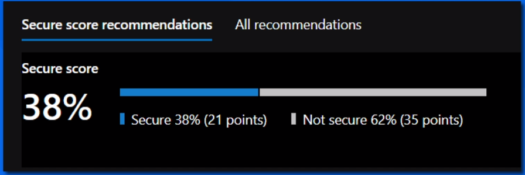
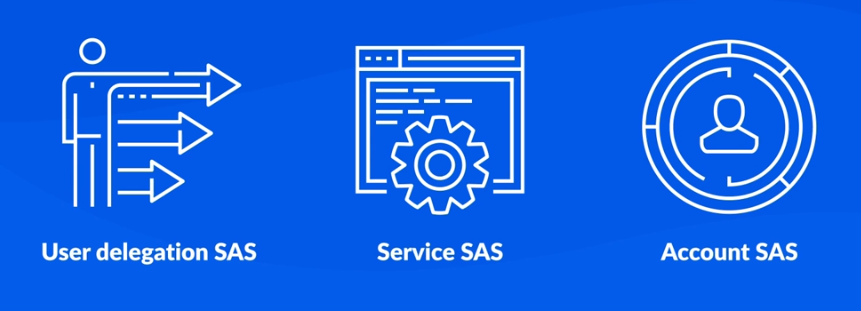
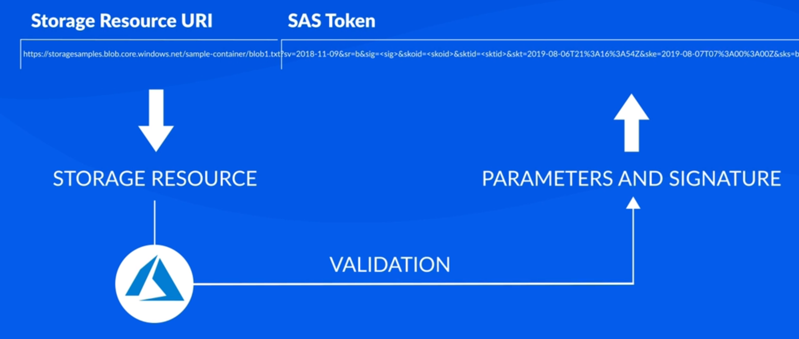

# Azure Security 

> <small>This is not an exhaustive documentation of all the existing AWS Services. This is just my quick summarized study notes for the Azure Certifications.</small>
> <small>To see the complete documentation, please go to: [Azure documentation](https://learn.microsoft.com/en-us/azure/?product=popular)</small>

- [Shared Responsibility Model](#shared-responsibility-model)
- [Azure Security Services](#azure-security-services)
    - [Microsoft Defender for Cloud](#microsoft-defender-for-cloud)
    - [Azure Key Vault](#azure-key-vault)
    - [Azure Monitor](#azure-monitor)
    - [Azure Sentinel](#azure-sentinel)
- [Identity and Access Management](#identity-and-access-management)
    - [Role-Based Access Control RBAC](#role-based-access-control-rbac)
    - [Azure Active Directory Azure AD](#azure-active-directory-azure-ad)
- [Networking Security](#networking-security)
    - [Network Security Groups NSG](#network-security-groups-nsg)
    - [Azure VPN Gateway](#azure-vpn-gateway)
    - [Azure ExpressRoute](#azure-expressroute)
    - [Web Application Firewall WAF](#web-application-firewall-waf)
    - [Azure Firewall](#azure-firewall)
    - [Azure DDoS Protection](#azure-ddos-protection)
    - [Virtual Network Service Endpoints](#virtual-network-service-endpoints)
- [Storage Security](#storage-security)
    - [Azure Storage Service Encryption](#azure-storage-service-encryption)
    - [Shared Access Signatures SAS](#shared-access-signatures-sas)
    - [Storage Account Keys](#storage-account-keys)
    - [Azure Storage Analytics](#azure-storage-analytics)
- [Database Security](#database-security)
    - [Azure SQL Firewall Rules](#azure-sql-firewall-rules)
    - [Azure SQL Always Encrypted](#azure-sql-always-encrypted)
    - [Azure SQL Transparent Data Encryption TDE](#azure-sql-transparent-data-encryption-tde)
    - [Azure SQL Database Auditing](#azure-sql-database-auditing)
- [Dynamic Data Masking in Azure SQL](#dynamic-data-masking-in-azure-sql)
    - [Use Case](#use-case)
    - [Configuration](#configuration)
    - [Masking Functions](#masking-functions)
    - [Additional Notes](#additional-notes)
- [Resources](#resources)

## Shared Responsibility Model

The shared responsibility model outlines the distribution of security responsibilities between the organization and the cloud provider (Microsoft) based on the hosting environment (on-premises or cloud) and workload type (SaaS, IaaS, PaaS). 
- Critical for organizations considering a move to the cloud.
- Defines security tasks handled by the cloud provider (Microsoft) and those handled by the organization.

**On-Premises**

- **Customer Responsibility:**
    - Responsible for all aspects of security and operations.
    - Complete ownership and control over security and operational aspects.

**IaaS (Infrastructure as a Service)**
  
- **Cloud Provider Responsibility:**
    - Tangible aspects (servers, network hardware).
    - Hypervisor and physical datacenters.

- **Customer Responsibility:**
    - Securing and managing operating systems on servers.
    - Network configurations.
    - Deployed applications.
    - Identity management.
    - Data security.

**PaaS (Platform as a Service)**

- **Cloud Provider Responsibility:**
    - Responsibilities from IaaS.
    - Additional responsibility for managing and securing network controls.
    - Cloud provider assumes more responsibilities compared to IaaS.

- **Customer Responsibility:**
    - Partial responsibility for securing and managing applications.
    - User identities.
    - Data.

**SaaS (Software as a Service)**

- **Cloud Provider Responsibility:**
    - Extensive responsibility as the provider delivers the application as a service.

- **Customer Responsibility:**
    - Focus on ensuring proper data classification.
    - Shared responsibility for managing users and endpoint devices.
    - Provider handles underlying components, emphasizing service delivery.

## Azure Security Services 

These Azure security services collectively provide a comprehensive approach to securing workloads, managing secrets, monitoring and analyzing data, and responding to security threats across the enterprise.

### Microsoft Defender for Cloud

Microsoft Defender for Cloud is a security posture management and threat protection tool that is designed to protect workloads, track security posture, and streamline security management.

**Secure Score**
- Aggregated value representing security posture.
- Higher score indicates lower identified risk.

    

    
    

**Security Recommendations**
- Guidance and tasks to harden resources.
- Implement within Defender for Cloud.

**Security Alerts**
- Identifies threats and generates alerts.
- Alerts can be viewed in Azure portal or sent via email.

**Defender Features**
- Microsoft Defender for Servers
- Defender for Storage
- Defender for SQL
- Microsoft Defender for Containers
- Microsoft Defender for App Service
- Defender for Key Vault
- Defender for Resource Manager
- Defender for DNS
- Microsoft Defender Open-Source Relational Databases.

### Azure Key Vault

Azure Key Vault is a cloud solution for centrally storing and managing secrets, keys, certificates.

- Securely store things like tokens and passwords
- Key management for encryption keys
- Provision, manage, deploy TLS/SSL certificates
- Designed in such a way that Microsoft cannot, and does not, extract your data

**Authentication and Authorization**
- Authentication by Azure Active Directory.
- Authorization via role-based access control (RBAC) or Key Vault access policies.
- Supports hardware security modules (HSMs) and FIPS 140-2 Level 2 validated HSMs.

### Azure Monitor

Azure Monitor collects resource and activity logs and other monitoring data that can be analyzed to provide information on all resources across your entire environment.

**Events**
- Typically created by applications or services you are running 
- Usually provide information indicating when a specific resource was created or modified or when an error was detected in an application

**Features**

1. **Log Analytics:**
   - Used to write log queries and analyze log data.
   - Enables querying and extracting insights from collected log information.

2. **Data Explorer Analysis Engine:**
   - Interactively analyze log data.
   - Provides a powerful engine for working with large datasets.

3. **Application Insights Analytics Console:**
   - Located in the Azure portal.
   - Allows writing log queries and interactively analyzing log data.
   - Primarily used for application performance monitoring.

4. **Visualization:**
   - Render log data as tables or charts.
   - Pin visualizations to the Azure dashboard for quick access.

5. **Workbooks:**
   - Create workbooks to combine multiple sets of data into a single report.
   - Customize and organize data visualizations for better insights.

6. **Alert Rules:**
   - Configure log alert rules based on query results.
   - Receive notifications or trigger automated actions when defined conditions are met.

7. **Access Tools:**
   - Utilize various tools to access log query results.
     - Azure CLI
     - Azure PowerShell
     - REST API
     - Custom applications

8. **Building Workflows:**
   - Use Azure Monitor Logs to build workflows.
   - Retrieve log data and copy it to external locations using tools like Logic Apps.

### Azure Sentinel

Azure Sentinel is a cloud-based security information event management (SIEM) solution. All-in one solution for:

- Intelligent security analytics
- Threat intelligence
- Alert detection
- Threat visibility
- Proactive hunting
- Threat response.

**Features**
- Determines scope and root causes of potential security threats.
- Proactively hunt for security threats.
- Built-in automation and orchestration of common tasks.
- Integration with Azure technologies (logic apps, log analytics, AI).
- Community-provided workbooks, playbooks, hunting queries.

**Onboarding Sentine**
- Connect it first to existing data sources.
- Available connectors for Microsoft solutions and other sources.
- After connecting, monitor your data with  .

## Identity and Access Management

Azure provides a comprehensive suite of access management and identity services, allowing organizations to tailor their security measures based on specific needs. 

- Role-Based Access Control (RBAC) ensures granular control over resource Access.
- Azure AD facilitates secure identity and access management for users, applications, and external collaborations. 
- Additionally, services like Azure AD DS and Azure MFA enhance security and streamline authentication processes.

### Role-Based Access Control (RBAC)

RBAC is an authorization system built on Azure Resource Manager, providing fine-grained access management for Azure resources.
  - Manages user access to specific Azure resources, defining their permissions and scope.
  - Enables segregation of duties, granting users the least privilege needed for their tasks.
  - Minimizes security risks by granting least privilege.
  - Effective in complex organizations with diverse resource needs.

**Example Scenario**
  - Allow different user groups to manage distinct resources (e.g., VMs, virtual networks, SQL databases) based on their roles.

### Azure Active Directory (Azure AD)

Cloud-based identity and access management service by Microsoft which allows you to control access to internal and external resources. Applicable to IT Admins, App Developers, and service subscribers.

**Usage**

- IT Admins: 
   - Control access to applications
   - enforce multi-factor authentication
   - Automate user provisioning.

- App Developers: 
   - Add single sign-on to applications.

- Subscribers: 
   - Automatic Azure AD tenants for services like Microsoft 365, Office 365, and Azure.

**Azure AD Services**

- **Azure AD B2B (Business-to-Business)**
   - Enables secure sharing of apps and services with guest users from external organizations.
   - Provides an invitation and redemption process for external users.

- **Azure AD B2C (Business-to-Customer)**
   - Offers identity as a service for customer access via single sign-on.
   - Supports standards-based authentication protocols (OpenID Connect, OAuth 2.0, SAML).
   - Integrates with various applications and commercial software.

- **Azure AD Domain Services (Azure AD DS)**
   - Cloud offering providing managed domain services compatible with on-prem Active Directory.
   - Features domain join, LDAP, Kerberos, NTLM, and group policy support.
   - Eliminates the need for deploying, managing, or patching domain controllers.
   - Replicates identity information from Azure AD or synchronizes from on-prem Active Directory.

**Azure Multi-Factor Authentication (MFA)**
- Two-step verification for enhanced security, requiring multiple authentication methods.
- Combines something the user knows (password), possesses (e.g., smartphone), and is (biometrics).
- Usage:
   - Protects data and applications without compromising user experience.
   - Included in Azure AD Premium, Microsoft 365 Business, Azure AD Free, and standalone Office 365 licenses.
   - Additional features in premium versions, including Conditional Access policies.

## Networking Security 

Azure offers a robust suite of services for network security, providing solutions for filtering traffic, establishing secure connections, protecting web applications, and mitigating DDoS attacks. These services cater to diverse needs, ensuring the security and reliability of Azure resources and connections.

### Network Security Groups (NSG)

Used to filter network traffic to and from Azure resources connected to a virtual network.

  - Default security rules control inbound and outbound traffic; custom rules can be added.
  - Defines allowed or denied traffic based on source, destination, and port.
  - Enhances security by controlling communication between resources.

For more information: [Azure services compatible with NSG](https://docs.microsoft.com/azure/virtual-network/virtual-network-for-azure-services)).

### Azure VPN Gateway

Virtual network gateway facilitating encrypted traffic between Azure virtual networks, on-premises networks, or remote users.

  - Utilizes public Internet for encrypted traffic.
  - Supports multiple connections to a single gateway.
  - Deployed with specialized VMs in a dedicated subnet (gateway subnet).
  - Supports VNet-to-VNet, Site-to-Site, and Point-to-Site connections.

For more information: [Azure VPN Gateway Documentation](https://docs.microsoft.com/azure/vpn-gateway/vpn-gateway-about-vpngateways)

### Azure ExpressRoute

Private, dedicated connection between on-premises networks and Microsoft Cloud services.

  - Utilizes connectivity providers for a secure and reliable connection.
  - Layer 3 connectivity with any-to-any, point-to-point, or virtual cross-connection options.
  - Global connectivity across geopolitical regions.
  - Dynamic BGP routing, built-in redundancy.

For more information: [Azure ExpressRoute FAQs](https://docs.microsoft.com/azure/expressroute/expressroute-faqs)

### Web Application Firewall (WAF)

Provides centralized protection for web applications against malicious attacks.

  - Simplifies security management by patching known vulnerabilities centrally.
  - Included in Application Gateway service and Front Door service.

For more information: [Web Application Firewall Overview](https://docs.microsoft.com/azure/web-application-firewall/overview)

### Azure Firewall

Cloud-based network security service for protecting Azure Virtual Network resources.
  
  - Fully stateful with built-in high availability and unrestricted cloud scalability.
  - Centrally creates, enforces, and logs application and network connectivity policies.
  - Uses a static public IP address for easy identification of traffic from the virtual network.
  - Integrated with Azure Monitor for logging and analytics.

For more information: [Azure Firewall Documentation](https://docs.microsoft.com/azure/firewall/)

### Azure DDoS Protection

**DDoS Tiers**

- **Basic Tier:**
   - Automatically enabled in the Azure platform.
   - Provides always-on traffic monitoring and real-time mitigation of common network-level attacks.
- **Standard Tier:**
   - Offers additional mitigation capabilities.
   - Configurable protection policies with dedicated traffic monitoring and machine learning.

**Implementation**
  - Apply protection policies to public IP addresses associated with resources.
  - Protects against volumetric, protocol, and application-layer attacks.

For more information: [Azure DDoS Protection Overview](https://docs.microsoft.com/azure/virtual-network/ddos-protection-overview)

### Virtual Network Service Endpoints

Extends the private address space of an Azure virtual network.
  - Extends the identity of a virtual network to Azure services over a direct connection.
  - Locks down Azure service resources to only virtual networks.
  - Allows auditing and monitoring of outbound Internet traffic without impacting service traffic.

For more information: [Virtual Network Service Endpoints Overview](https://docs.microsoft.com/azure/virtual-network/virtual-network-service-endpoints-overview)

## Storage Security

These security options collectively enhance the protection, management, and monitoring of data stored in Azure Storage. Each option addresses specific aspects of security, access control, and logging for a comprehensive storage security strategy.

### Azure Storage Service Encryption

Automatically encrypts data in Azure Storage to meet security and compliance requirements.

- Enabled by default when creating a new storage account; cannot be disabled.
- Uses 256-bit AES encryption.
- Supported on Standard and premium storage accounts.
- No impact on Azure Storage performance.
- No additional cost for Azure Storage encryption.
- Resources Encrypted: Blobs, disks, files, queues, and tables, including metadata.

For more information: [Azure Storage Service Encryption](https://docs.microsoft.com/azure/storage/common/storage-service-encryption)

### Shared Access Signatures (SAS)

Provides secure granular access to storage resources without compromising data security.

**Types**

- **User Delegation SAS:** 
    - Applies to Blob storage
    - Secured with Azure AD credentials
    - Microsoft recommends to use Azure AD credentials whenever possible to enhance security

- **Service SAS:** 
    - Secured with the storage account key
    - Used to delegate access to a specific service (Blob, Queue, Table, or Azure Files)

- **Account SAS:** 
    - Secured with the storage account key
    - Used to delegate access to one or more storage services

**How SAS works** 

- SAS is a signed URI with a special token and query parameters, including a signature.
- SAS URI is then presented to Azure Storage as part of a request
- Azure checks SAS parameters and signature for validity; declines unauthorized requests.

### Storage Account Keys

When you create a storage account, Azure generates two 512-bit keys which you can use to authorize access to data that resides in your storage account via Shared Key authorization.

- Use Azure Key Vault to manage, rotate, and regenerate the keys
- Regularly rotate and regenerate keys
- Key rotations can be performed without interrupting the applications that use them
- Storage accoun access are essentially root passwords; protect them by not distributing, saving in plain text, or hard coding in apps.

### Azure Storage Analytics

Performs logging and provides metrics data for storage accounts.

- Ideal for tracing storage requests, analyzing usage trends, diagnosing storage account issues.
- Needs to be enabled for each service to monitor storage requests and analyze usage trends.
- 20TB limit for stored data, independent of the total storage account limit.

For more information: [Azure Storage Analytics](https://docs.microsoft.com/en-us/azure/storage/common/storage-analytics)

## Database Security

These security options provide a comprehensive approach to securing Azure SQL Databases, offering controls at various levels and addressing different aspects of data protection, access control, and auditing. 

Properly configuring and utilizing these features enhances the overall security posture of database environments on Azure.

### Azure SQL Firewall Rules

Controls access to the Azure SQL Database server's public endpoint through IP firewall rules.

**Levels**

- **Server-level IP Firewall Rules:** 
   - Allow access to the entire Azure SQL server, covering all hosted databases. 
   - Max of 128 rules.

- **Database-level IP Firewall Rules:** 
   - Allow access to specific databases on the SQL Database server. 
   - Max of 128 rules per database.

- **Configuration:** 
   - [SQL Database Firewall Rules Configuration](https://docs.microsoft.com/azure/sql-database/sql-database-firewall-configure)

### Azure SQL Always Encrypted

Encrypts sensitive data (e.g., credit card numbers) within client applications, ensuring separation of data owners and managers.

- Clients encrypt sensitive data before sending it to SQL Server, with decryption done transparently on query results
- Available in all editions of Azure SQL Database since SQL Server 2016

For more information: [Always Encrypted Documentation](https://docs.microsoft.com/sql/relational-databases/security/encryption/always-encrypted-database-engine)

### Azure SQL Transparent Data Encryption (TDE)

Encrypts Azure SQL Databases, Azure SQL Managed Instances, and Azure Synapse data at rest to protect against offline attacks.

- Real-time encryption/decryption without application changes
- Enabled by default for new Azure SQL databases
- Manual enabling required for older databases

For more information: [Transparent Data Encryption Documentation](https://docs.microsoft.com/azure/sql-database/transparent-data-encryption-azure-sql)

### Azure SQL Database Auditing

Azure SQL Database Auditing tracks database events, logging them to an audit log hosted in Azure storage, Log Analytics, or Event Hubs. It facilitates regulatory compliance, monitors database activity, identifies anomalies, and detects security violations.

**Configuration**

- **Database Auditing:** 
   - Specific to a database
   - Can be defined in a default server policy for all databases

- **Server Blob Auditing:** 
   - Audits databases on the server
   - Applies regardless of database-level settings

**Considerations** 
- Avoid simultaneous enabling of both server blob auditing and database blob auditing, unless necessary.

## Dynamic Data Masking in Azure SQL

Dynamic Data Masking (DDM) is a technology supported by Azure SQL Database, Azure SQL Managed Instance, and Azure Synapse Analytics. 

- It focuses on limiting exposure to sensitive data by dynamically masking it for users who lack the necessary permissions, preventing unauthorized access. 
- DDM operates as a policy-based security feature, concealing specific sensitive data returned from database queries without altering the data stored in the database.

### Use Case

An example scenario for DDM involves a call center employee who needs to identify a caller by confirming the last four digits of their social security number. 

- The employee doesn't require access to the entire social security number 
- DDM allows the definition of masking rules to hide sensitive data in query result sets
- Enables employees to perform tasks without unnecessary data exposure

### Configuration

**Accessing Dynamic Data Masking**

- **For SQL Database:**
    - Use the Dynamic Data Masking blade under Security in the SQL Database configuration pane.

- **For SQL Managed Instance:** 
    - Configuration is performed using PowerShell or REST API.
    - Not available in the Portal.

**Settings to Configure**

- **Excluded Users:**
    - Specifies SQL users or Azure AD identities excluded from masking.
    - Users with administrator privileges are always excluded.
    
- **Masking Rules:**
    - Defines fields to be masked using schema name, table name, and column name.
    - Specifies the masking function for each rule.

- **Masking Functions:**
    - Determines how data is exposed under specific conditions.

### Masking Functions

| Function            | Description                                             |
|---------------------|---------------------------------------------------------|
| Default             | Reveals a default value for masked data.                 |
| Email               | Shows the first character and replaces the rest with '*' for email addresses. |
| Custom String       | Reveals a specified prefix and replaces the rest with '*' for strings. |
| Random             | Randomly masks a portion of the data.                    |
| Credit Card         | Shows the last four digits of a credit card number.      |
| Social Security Number | Shows the last four digits of a social security number. |
| Number             | Shows a random portion of a number.                      |

### Additional Notes

- DDM configuration involves specifying users excluded from masking, defining masking rules, and setting masking functions.
- Users with administrator privileges are always excluded from masking.
- DDM doesn't modify data in the database; it dynamically masks data during query results.
- For SQL Managed Instance, PowerShell or REST API is required for configuration.

For more information: [Azure Official Documentation](https://docs.microsoft.com/azure/sql-database/sql-database-dynamic-data-masking-get-started).

## Resources 

- [Learning About Azure](https://cloudacademy.com/learning-paths/learning-about-azure-5663/)