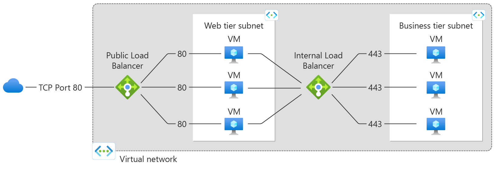
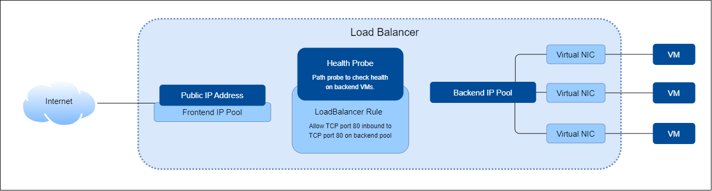
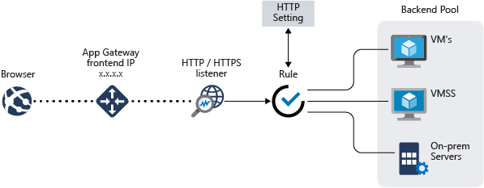
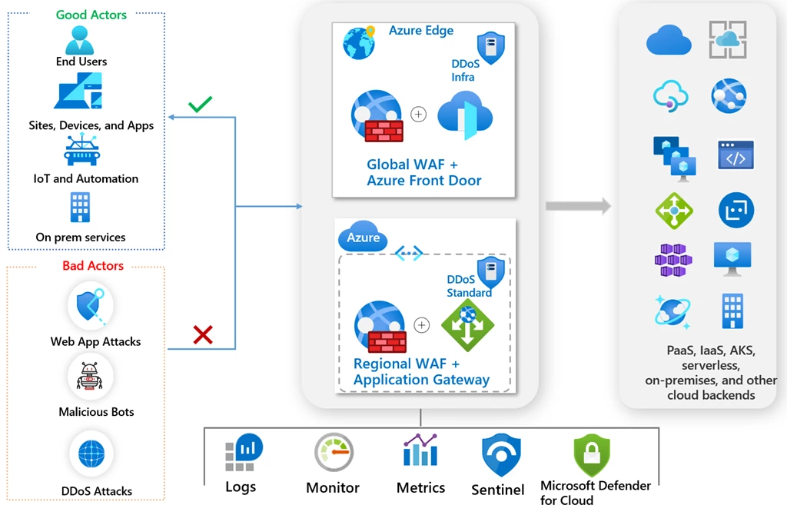
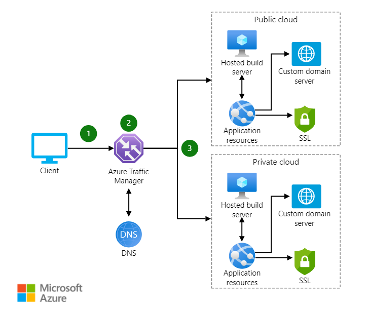
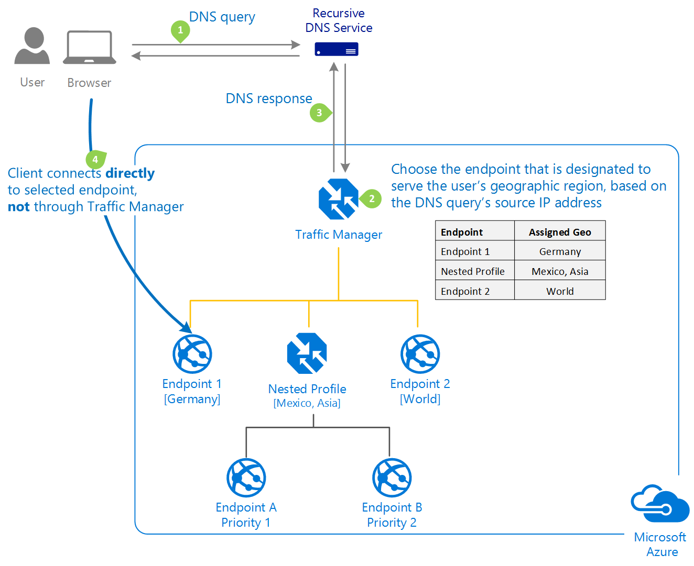

# Azure LoadBalancers

> <small>This is not an exhaustive documentation of all the existing Azure Services. These are summarized notes for the Azure Certifications. To see the complete documentation, please go to: [Azure documentation](https://learn.microsoft.com/en-us/azure/?product=popular)</small>

- [Load Balancing](#load-balancing)
- [Use Cases](#use-cases)
- [Types of Azure Load Balancers](#types-of-azure-load-balancers)
- [Load Balancer SKUs](#load-balancer-skus)
- [Components of Azure LoadBalancers](#components-of-azure-loadbalancers)
    - [Frontend IP Configuration](#frontend-ip-configuration)
    - [Backend Pool](#backend-pool)
    - [Health Probes](#health-probes)
    - [Load Balancing Rules](#load-balancing-rules)
    - [High Availability Ports](#high-availability-ports)
    - [Inbound NAT Rules](#inbound-nat-rules)
    - [Outbound Rules](#outbound-rules)
- [Application Gateway](#application-gateway)
    - [Key Features](#key-features)
    - [Additional Features](#additional-features)
    - [Components of an Application Gateway](#components-of-an-application-gateway)
        - [Front-end IP Addresses](#front-end-ip-addresses)
        - [Listeners](#listeners)
        - [Request Routing Rules](#request-routing-rules)
        - [HTTP Settings](#http-settings)
        - [Backend Pools](#backend-pools)
        - [Health Probes](#health-probes)
    - [Enabling WAF](#enabling-waf)
    - [WAF Policy](#waf-policy)
- [Azure Front Door](#azure-front-door)
    - [Key Features](#key-features)
- [Azure Web Application Firewall](#azure-web-application-firewall)
    - [Key Features](#key-features)
- [Azure Traffic Manager](#azure-traffic-manager)
    - [Key Features](#key-features)
    - [Typical Client-Endpoint Connection](#typical-client-endpoint-connection)
- [Resources](#resources)

## Load Balancing 

In the realm of networking, "load balancing" is the art of efficiently distributing incoming network traffic across multiple backend resources. 

- Typically, these resources are virtual machines organized in a "backend pool" or instances in a virtual machine scale set.
- Operates at the Transport Layer (Layer 4) of the OSI model.
- Serves as the single access point for applications running on virtual machines (VMs) or scale sets.
- Distributes incoming traffic across the deployed backend VMs or resources.

## Use Cases

- **Availability Enhancement**
  - Increase application availability by distributing it across multiple VMs and zones.

- **Outbound Connectivity**
  - Provide outbound Internet connectivity for VMs without assigning individual public IP addresses.

## Types of Azure Load Balancers

1. **Public Load Balancer**
   - Distributes Internet traffic to VMs.
   - Requires a public IP address on the frontend.
   - Provides outbound Internet connections for VMs within the virtual network.

2. **Internal Load Balancer (Private Load Balancer)**
   - Utilizes only private IP addresses on the frontend.
   - Designed for load balancing within the virtual network or from an on-premises network connected via VPN or ExpressRoute.  

**Common Use case**

||
|-|

<small>[Back to the top](#azure-loadbalancers)</small>

## Load Balancer SKUs

- **Basic Load Balancer**
  - Supports up to 300 instances.
  - No support for availability zones.
  - Open to the Internet by default.

- **Standard Load Balancer**
  - Supports up to 1000 instances.
  - Provides support for availability zones
  - Offers zone-redundant and zonal frontends for inbound and outbound traffic.
  - Adheres to the zero-trust model, enhancing security.
  - Integrated into the virtual network; inbound traffic requires explicit permission via network security groups.

**Microsoft's Recommendation**
Microsoft recommends using **Standard Load Balancers** whenever possible due to their built-in security features and extended capabilities, providing a robust solution for diverse scenarios.

<small>[Back to the top](#azure-loadbalancers)</small>

## Components of Azure LoadBalancers 

Azure Load Balancers are composed of several key components, each playing a crucial role in efficiently managing incoming network traffic. These componenets ensures:

- Effective load balancing of network traffic
- Optimize application availability
- Facilitate seamless communication between clients and backend resources. 

### Frontend IP Configuration

- **Point of Contact**
  - Represents the contact point for clients accessing the load-balanced application.
  - Can be a private or public IP address based on the load balancer type.
  - Multiple Frontend IP addresses can be assigned to a load balancer.

### Backend Pool

- **Service Handling**
  - Collection of VMs or instances within a scale set configured to handle incoming requests.
  - Automatically reconfigures when instances are added or removed to ensure optimal traffic distribution.

### Health Probes

- **Status Determination**
  - Assess the health and readiness of instances in the backend pool.
  - Identifies healthy instances capable of receiving traffic.
  - Load balancer ceases to send connections to unhealthy instances.

### Load Balancing Rules

- **Traffic Distribution**
  - Define how inbound traffic is distributed across backend pool instances.
  - Example: Load-balancing rule for port 80 (HTTP) routing traffic from the front-end IP to port 80 on backend instances.

### High Availability Ports

- **Protocol-Agnostic Load Balancing**
  - Configures a rule for 'protocol - all and port - 0.'
  - Facilitates load balancing for all TCP and UDP flows across all ports of an internal standard load balancer.

### Inbound NAT Rules

- **Traffic Forwarding**
  - Forwards inbound traffic with specific front-end IP and port combinations
  - Such traffic is sent to a designated VMs or instances in the backend pool.
  - Useful for scenarios requiring RDP connections to multiple VMs behind a load balancer.

### Outbound Rules

- **Outbound NAT Configuration**
  - Configures outbound network address translation (NAT) for all VMs within the backend pool.
  - Enables outbound communication to the Internet for instances within the backend pool.
  - Supported only on the standard load balancer
  - Not supported on the basic load balancer.

<small>[Back to the top](#azure-loadbalancers)</small>

## Application Gateway 

While Azure Load Balancer operates at the transport layer (Layer 4), Azure Application Gateway takes load balancing to the next level by functioning at the application layer (Layer 7) of the OSI model. 

Unlike the Load Balancer, Application Gateway makes routing decisions based on additional HTTP attributes.

- Utilizes HTTP attributes such as URI path and host headers for routing decisions. This is called **Application Layer Routing.**
- Example: Routing requests for /images to servers hosting images and /video to servers hosting videos.

### Key Features

1. **SSL Termination**
   - Offloads encryption and decryption to the gateway, easing the burden on backend servers.

2. **Autoscaling**
   - Automatically scales based on traffic load.
   - Only supported by Application Gateway Standard V2.

3. **Web Application Firewall (WAF)**
   - Centralized protection against common exploits and vulnerabilities.
   - Safeguards from SQL injection, cross-site scripting attacks, and more.

4. **Zone Redundancy**
   - Standard V2 Application Gateway spans multiple availability zones.
   - Eliminates the need for provisioning a separate gateway in each zone.

### Additional Features

- **Backend Pool Options**
  - Supports VMs, VM scale sets, and on-prem servers as backend pool resources.

- **Layer 7 Routing**
  - Enables intricate routing decisions based on application layer attributes.

- **Centralized Management**
  - Efficiently manages and distributes traffic to web applications.

For more information: [Azure Application Gateway Features](documentation-url)  

<small>[Back to the top](#azure-loadbalancers)</small>

### Components of an Application Gateway 

Azure Application Gateway comprises various components that collectively contribute to its effective functioning in managing web traffic. 

||
|-|

#### Front-end IP Addresses

- **Association**
  - Public, private, or both front-end IP addresses associated with the application gateway.
  - Supports one public or one private IP address.

#### Listeners

- **Connection Handling**
  - Check for incoming connection requests to the gateway.
  - Configuration includes protocol, port, hostname, and IP address.

#### Request Routing Rules

- **Routing Decisions**
  - Binds listeners, backend pools, and backend HTTP settings.
  - Determines how traffic on listeners should be routed to backend server pools.

#### HTTP Settings

- **Port and Protocol Configuration**
  - Specifies ports and protocols for communication between the gateway and backend servers.
  - Determines encryption status and usage of cookie-based session affinity.

#### Backend Pools

- **Resource Pools**
  - Directs traffic from the gateway to these resource pools.
  - Can consist of:
    - NICs, 
    - VM scale sets, 
    - public IP addresses, 
    - internal IP addresses, 
    - FQDNs, and 
    - multitenant backends.

#### Health Probes

- **Resource Monitoring**
  - Monitors the health of resources within the backend pool.
  - Detects unhealthy resources, removes them from service, and automatically restores them when healthy again.

For more information: [Azure Application Gateway Components Documentation](documentation-url)

<small>[Back to the top](#azure-loadbalancers)</small>

### Enabling WAF 

We can enable the Application Gateway WAF to ensure that it logs any threat that it detects. Using Azure Diagnostics, Application Gateways can store logs in a Storage Account or Log Analytics Workspace.

To enable WAF in the Application Gateway, go to **Application gaetways** page, select your gateway, and click **Web application firewall** on the left-hand side. Toggle the **WAF status.**

**Modes**

- Detection mode monitors and logs all threats and alerts but will not block incoming requests. 

- Prevention mode will additionally action on the threats and alerts and will take measures to block those attacks. 

It's good practice to use detection mode first and then work your way up to prevention.

**Rulesets**
Rule sets are used to protect web applications against common vulnerabilities and exploits. This allows Cloud engineers and developers to keep up with mitigating against the latest attacks. 

The OWASP core 3.2 rule set is a new pre-defined rule set that provides a new engine and rule set for defending against Java infections and fixes many false positives.

**Log Destination**
As mentioned above, the logs can be stored in a Storage Account or Log Analytics Workspace. Go to **Diagnostic setting** and add a diagnostic setting. Here we can specify to store both:
- Logs 
- Metrics 

For the destination, select between Log Analytics workspace or archive the logs to a storage account.

### WAF Policy 

Web Application Firewall policy is a stand-alone resource type that can be used to manage policies for multiple Application Gateways as well as per site or backend pool in each Application Gateway.

## Azure Front Door 

Azure Front Door is a service delivered from the edge of Microsoft's global network that revolutionizes global load balancing for applications and microservices. Front Door is a comprehensive solution for managing web traffic globally.#

### Key Features

1. **Improved App Performance**
   - Utilizes split TCP-based anycast protocol.
   - Ensures users connect to the nearest point of presence, enhancing access speed and reducing latency.

2. **Increased Availability**
   - Employs smart health probes to monitor backend resources for latency and availability.
   - Facilitates quick failover to remaining backend resources when one goes down.

3. **URL-Based Routing**
   - Routes traffic to backend pools based on URL paths in requests.
   - Enables granular configuration, directing requests to specific resources based on URL criteria.

4. **Session Affinity**
   - Provides cookie-based session affinity.
   - Ensures a specific user session remains on the same backend for the duration of the session.

5. **Additional Features**
   - **TLS Termination** Securely terminates TLS connections.
   - **Custom Domain Support** Supports custom domain configurations.
   - **URL Redirection** Facilitates URL redirection for enhanced flexibility.

For more information: [Azure Front Door Features Documentation](documentation-url)

<small>[Back to the top](#azure-loadbalancers)</small>

## Azure Web Application Firewall 

Azure Web Application Firewall (WAF) is a a powerful solution in the Azure security arsenal that provides a centralized defense against common web vulnerabilities and exploits. 

||
|-|

Designed to safeguard web applications from threats like SQL injection and cross-site scripting attacks, WAF simplifies protection efforts and enables rapid response to known vulnerabilities.

Azure Front Door seamlessly integrate with:

- Application Gateway
- Front Door 
- CDN

### Key Features

1. **Protection Across Services**
   - WAF can be deployed with Azure Application Gateway, Azure Front Door, and Azure Content Delivery Network (CDN).
   - Customizable features for each service ensure tailored protection.

2. **Application Gateway Deployment**
   - Protects web applications without requiring changes to application code.
   - Secures multiple applications concurrently, hosting and protecting up to 40 websites on a single Application Gateway instance.
   - Custom WAF policies for diverse site protection.

3. **Front Door Deployment**
   - Centralized protection on the edge locations of the Azure network worldwide.
   - Inspects every incoming request at the network edge, preventing attacks before entering the virtual network.

4. **Azure CDN Deployment**
   - Safeguards web content globally.
   - Mitigates attacks closer to their sources, enhancing security before reaching the network.

For more information: [Azure WAF Documentation](documentation-url)

<small>[Back to the top](#azure-loadbalancers)</small>

## Azure Traffic Manager

Unlike other load balancer offerings, Azure Traffic Manager is a DNS-specific load balancing solution used to distribute traffic to services across different global Azure regions.

||
|-|

Through this mechanism, Azure Traffic Manager enhances application availability and responsiveness for users in various geographical locations.

<small>[Back to the top](#azure-loadbalancers)</small>

### Key Features

1. **Global Load Balancing**
   - Distributes traffic globally to services across Azure regions.
   - Ensures European users access the application from the nearest endpoint, while North American users connect to the closest service endpoint.

2. **DNS-Based Traffic Routing**
   - Leverages DNS to direct access requests to the service endpoint with the least latency, considering configured routing methods and endpoint health.
   - Supports Internet-facing services both inside and outside Azure.

3. **Routing Methods**
   - **Priority** 
        - Sends all traffic to a primary service endpoint, with backup endpoints available.
   - **Weighted** 
        - Splits traffic across multiple endpoints based on defined weights.
   - **Performance** 
        - Routes users to the closest endpoint, reducing latency.
   - **Geographic** 
        - Forces users to the closest endpoint based on their geographic location.
   - **Multivalue** 
        - For Traffic Manager profiles with IPv4 or IPv6 addresses as endpoints.
   - **Subnet** 
        - Maps specific user IP address ranges to specific endpoints.

4. **Traffic Manager as a Traffic Cop**
   - Not a proxy or gateway.
   - Directs clients to endpoints; traffic passes directly between clients and endpoints.

<small>[Back to the top](#azure-loadbalancers)</small>

### Typical Client-Endpoint Connection

||
|-|

1. **DNS Query**
   - Client initiates a DNS query for the application.

2. **DNS Service reaches out Name Servers**
   - DNS service reaches out to the name servers for the domain hosting the application.
   - Those name servers return the CNAME record that points to the Traffic Manager implementation for the app. 
   - The root domain will always be trafficmanager.net for Traffic Manager implementations.
   - After finding the name servers for the trafficmanager.net domain, the client’s DNS service sends a request for the DNS name.

3. **DNS Reaches out Traffice Manager**
   - The client’s DNS service finds the name servers for the trafficmanager.net domain. 
   - These servers are provided by the Traffic Manager service itself.

4. **Endpoint Determination**   
   - Name servers determine the correct endpoint based on configured settings.   

5. **CNAME Record Return**
   - Traffic Manager returns the CNAME record of the proper endpoint to the client’s DNS service.

5. **Endpoint Resolution**
   - Client's DNS service resolves the endpoint DNS name (e.g., `bluewidget-us.cloudapp.net`).

6. **Connection Establishment**
   - Client connects directly to the resolved endpoint.

For more information: [Azure Traffic Manager Documentation](https://learn.microsoft.com/en-us/azure/traffic-manager/traffic-manager-overview).

<small>[Back to the top](#azure-loadbalancers)</small>

## Resources 

- [Learning About Azure](https://cloudacademy.com/learning-paths/learning-about-azure-5663/)