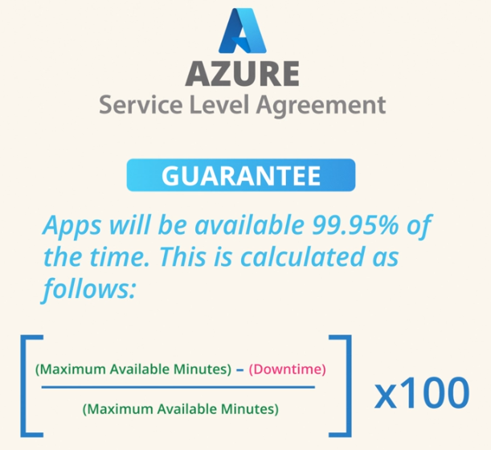
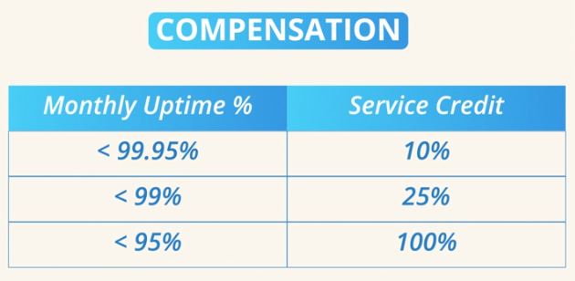
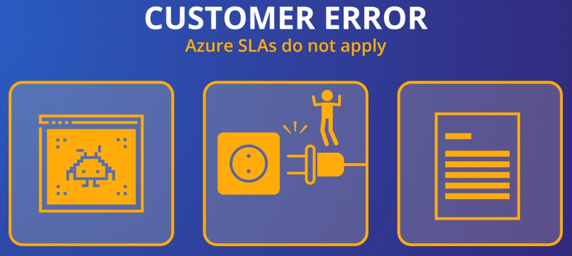
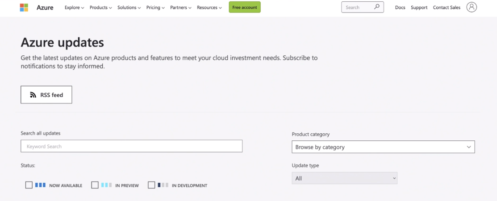

# Azure SLA and Lifecycle

> <small>This is not an exhaustive documentation of all the existing Azure Services. These are summarized notes for the Azure Certifications.<br>To see the complete documentation, please go to: [Azure documentation](https://learn.microsoft.com/en-us/azure/?product=popular)</small>


- [Azure SLA and Lifecycle](#azure-sla-and-lifecycle)
- [Azure Service Level Agreement SLA](#azure-service-level-agreement-sla)
    - [Key Concepts](#key-concepts)
    - [Factors Affecting SLAs](#factors-affecting-slas)
    - [Customer-Caused Exceptions](#customer-caused-exceptions)
- [Azure Modern Lifecycle Policy](#azure-modern-lifecycle-policy)
- [Considerations for Preview Services](#considerations-for-preview-services)
- [Resources](#resources)


## Azure Service Level Agreement (SLA)

When relying on Azure services to run critical applications, ensuring their reliability and performance is crucial for organizational success. Microsoft provides Service Level Agreements (SLAs) as guarantees, outlining the expected level of service and compensation if those levels are not met.

### Key Concepts
    
**1. Availability/Uptime**

- Example: Azure App Service with a 99.95% SLA.
- Calculation: Monthly calculation, considering the total minutes in a month.
<br>

    

**2. Compensation**

- Claim Process: Customers must submit a claim for compensation.
- Credit Amounts: Vary based on the percentage of uptime:
     - 99% to 99.95%: 10% credit
     - 95% to 99%: 25% credit
     - Below 95%: 100% credit (rare)
        <br>

        

**3. Azure Service Health**

- Monitoring Tool: Azure Service Health tracks outages and can be configured to send alerts.
- Usage: Helps identify Azure-caused downtime for SLA claims.

**4. Free Tier Exclusions**

- SLA Applicability: SLAs may not apply to free tiers; no guarantees for unpaid services.


<small>[Back to the top](#azure-sla-and-lifecycle)</small>


### Factors Affecting SLAs

**1. Azure Virtual Machines (VMs)**

- Uptime Guarantee: Varies based on VM type, disk type (HDD/SSD), and redundancy configurations.
- Redundancy Options: Availability sets (99.95%) vs. Availability zones (99.99%).

**2. Cosmos DB**

- Complex SLA: Offers guarantees for uptime, throughput, consistency, and latency.
- Consideration: SLAs can be multifaceted and service-specific.

### Customer-Caused Exceptions

**1. SLA Exclusions**

- Examples: Customer-induced downtime (e.g., shutting down a VM, application bugs).
- Responsibility: Customers causing SLA deviations are not eligible for compensation.



<small>[Back to the top](#azure-sla-and-lifecycle)</small>


## Azure Modern Lifecycle Policy 

Microsoft Azure regularly introduces and retires services as part of its evolving ecosystem. These services undergo a lifecycle, from initial availability to retirement, with Microsoft following a **Modern Lifecycle Policy** that ensures users receive ample notice before the end of service support.

To check out the services in preview, go to the [Azure updates](https://azure.microsoft.com/updates/) page for announcements.



There are two types of preview:

**Public Preview:**
- Available in the Azure portal with "preview" next to the name.
- Sometimes requires enabling preview features.

**Private Preview:**
- Accessible by registering as a test user.
- Microsoft approval is required for access.

To try if there's a new Azure Portal Preview, navigate to:

```bash
www.preview.portal.azure.com
```

## Considerations for Preview Services

**Production Workloads:**

- Although possible, running production workloads on preview services is not recommended.
- Lack of service level agreement (SLA) means no performance guarantees.

Pricing:

- Preview services may be free or have lower costs, but this isn't universal.


<small>[Back to the top](#azure-sla-and-lifecycle)</small>


## Resources 

- [Learning About Azure](https://cloudacademy.com/learning-paths/learning-about-azure-5663/)