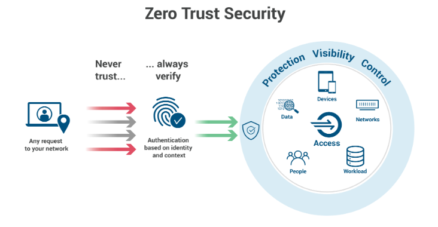
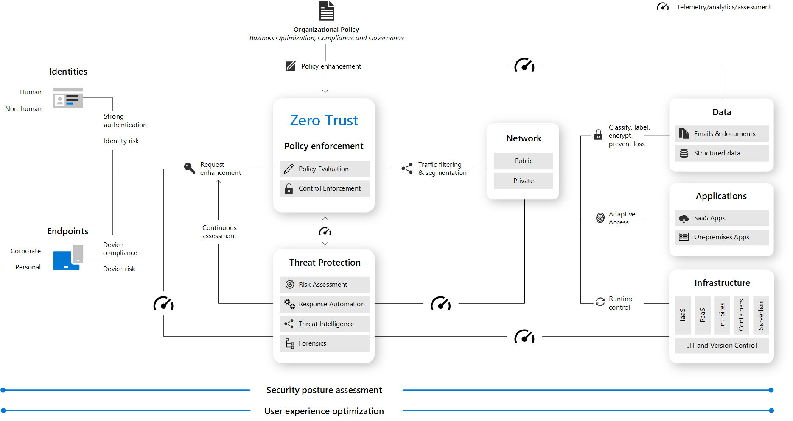
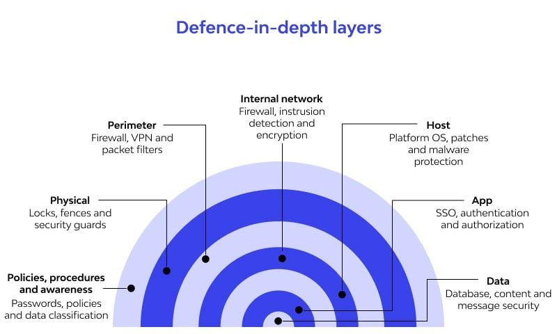

# Zero Trust and Defense in Depth

> <small>This is not an exhaustive documentation of all the existing Azure Services. These are summarized notes for the Azure Certifications. To see the complete documentation, please go to: [Azure documentation](https://learn.microsoft.com/en-us/azure/?product=popular)</small>

- [Zero Trust](#zero-trust)
    - [Key Principles of Zero Trust](#key-principles-of-zero-trust)
    - [Zero Trust Architecture](#zero-trust-architecture)
- [Defense in Depth](#defense-in-depth)
    - [Three Types of Data Protection](#three-types-of-data-protection)
    - [Layers of Defense in Depth in Azure](#layers-of-defense-in-depth-in-azure)
    - [Comprehensive Data Protection](#comprehensive-data-protection)
- [Resources](#resources)

## Zero Trust

In the realm of cybersecurity, the traditional approach of relying solely on perimeter defenses to keep networks secure is deemed insufficient. 

||
|-|

A paradigm shift to a "**zero trust**" model is advocated, where trust is not automatically granted based on location or network boundaries. Microsoft employs specific principles in its zero-trust architecture, emphasizing a more secure and robust approach.

### Key Principles of Zero Trust

**1. Verify Explicitly**

- **Identity Verification**

    - Base user access on comprehensive identity verification.
    - Authentication factors include user ID and password, device status, and location.

- **Conditional Access**

    - Implement conditional access policies based on various data points.
    - Consider user behavior and location before granting access.
    - Utilize tools like Identity Protection for enhanced security.
    
- **Administrator Access**

    - Exercise extra precautions, especially with administrator access.
    - Leverage services like Privileged Identity Management for controlled and monitored access.

**2. Use "Least Privilege" Access**

    
- **Minimal Access**

    - Grant the minimum level of access required for specific tasks.
    - Adopt the principle of least privilege to limit potential damage.

- **Role-Based Access**

    - Assign roles tailored to specific tasks.
    - For instance, grant SQL DB Contributor role instead of broader permissions.

- **Administrator Access Control**

    - Exercise caution with administrator access.
    - Implement just-in-time access through Privileged Identity Management.

**3. Assume Breach**

    
- **Designing for Breach**

    - Assume compromise of network or identities.
    - Design architecture to mitigate and limit damage in case of an attack.
    
- **Minimizing Blast Radius**

    - Control access for each infrastructure element independently.
    - Restricting access to one element should not grant access to others.
    
- **Additional Security Measures**

    - Run threat detection services to identify and respond to breaches.
    - Ensure encryption for all network traffic to heighten the complexity for attackers.

### Zero Trust Architecture

A Zero Trust approach extends throughout the entire digital estate and serves as an integrated security philosophy and end-to-end strategy.

This illustration provides a representation of the primary elements that contribute to Zero Trust.

||
|-|

To learn more: [Zero Trust architecture](https://learn.microsoft.com/en-us/azure/security/fundamentals/zero-trust#zero-trust-architecture)

<small>[Back to the top](#zero-trust-and-defense-in-depth)</small>

## Defense in Depth 

Implementing a zero-trust philosophy in your Azure infrastructure involves a strategic approach known as **defense in depth**. This strategy focuses on safeguarding data by ensuring confidentiality, integrity, and availability. 

The goal is to create multiple layers of protection so that even if one layer is breached, others remain resilient, slowing down attackers and increasing the likelihood of detection.

### Three Types of Data Protection

- **Confidentiality**

    - Ensures only authorized users can access the data.

- **Integrity**

    - Guarantees the data has not been altered by malicious users.

- **Availability**

    - Ensures authorized users can access the data, defending against denial-of-service attacks.

### Layers of Defense in Depth in Azure

- **Physical Security**

    - Managed by Microsoft at datacenters.
    - Least likely layer for attackers to target.

- **Identity and Access**

    - Provided by Azure Active Directory and role-based access control.
    - Enhanced security through features like conditional access and Identity Protection.

- **Perimeter Security**

    - Azure DDoS defense defends against denial-of-service attacks- .

- **Network Security**

    - Network security groups establish firewall rules for Azure virtual networks- .

- **Compute Layer**

    - Regularly patch operating systems, managed automatically in many Azure compute services.
    - Requires manual patching for services like virtual machines.

- **Application Security**

    - Ensures developers write applications securely.
    - Involves secure coding practices and adherence to security guidelines.

- **Data Layer**

    - Azure storage services offer security features, including encryption.
    - Implement Advanced Threat Protection in Azure SQL Databases.

### Comprehensive Data Protection

- **Multi-Layered Security**

    - Combines Microsoft's responsibilities (e.g., physical security) with user responsibilities (e.g., application security).

- **Increased Detection Probability**

    - Slows down attackers and enhances the likelihood of detecting security breaches.

- **Collaborative Effort**

    - Utilizes a combination of Azure services and user implementation to fortify data protection.

<small>[Back to the top](#zero-trust-and-defense-in-depth)</small>

## Resources 

- [Learning About Azure](https://cloudacademy.com/learning-paths/learning-about-azure-5663/)