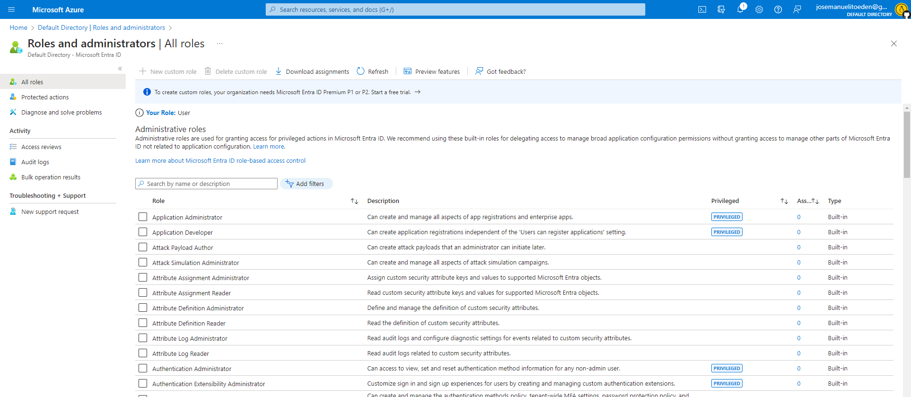
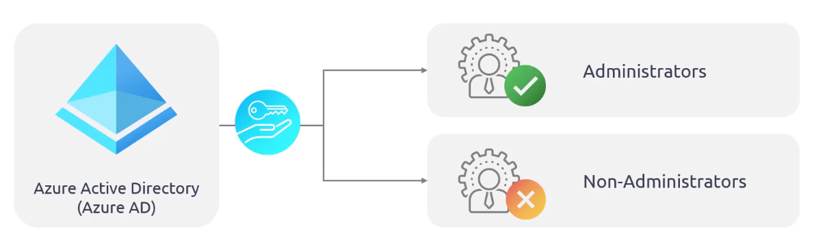

# Securing Azure Solutions with Azure Active Directory

- [Azure Active Directory](#azure-active-directory)
- [Azure AD vs. Azure AD DS vs. ADDS](#azure-ad-vs-azure-ad-ds-vs-adds)
- [Roles in Azure AD](#roles-in-azure-ad)
    - [Azure AD Specific Roles](#azure-ad-specific-roles)
    - [Service-Specific Roles](#service-specific-roles)
    - [Cross-Service Roles](#cross-service-roles)
- [Built-in Roles](#built-in-roles)
- [ADDS - Pros and Cons](#adds---pros-and-cons)

## Azure Active Directory 

Main features:

- Single Sign-on (SSO) 
- Application Managemenet 
- Identity Protection 
- Monitoring 
- Multi-Factor Authentication 
- B2B and B2C 
- Hybrid Identities 
- Seamless Integration with Azure Services and Third-party Services 

To learn more, check out [Azure Identity and Access Management (IAM)](110_azure_iam.md)

## Azure AD vs. Azure AD DS vs. ADDS

**Azure AD (Azure Active Directory)**
- Cloud-based identity and access management service.
- Manages user identities and authentication for cloud applications.
- Supports single sign-on (SSO) and multi-factor authentication (MFA).
- Focuses on modern authentication and authorization for cloud resources.
- Enable collaboration with B2B and B2C

**Azure AD DS (Azure Active Directory Domain Services)**
- Fully-managed domain service 
- Enables domain-joined resources in Azure 
- Supports LDAP, Kerberos, and NTLM authentication 
- Useful for lift-and-shift scenarios  
- Integrates with existing Azure AD tenant for user sign-in and control
- Scalability and Disaster recovery with multiple replica sets in different Azure regions

**ADDS (Active Directory Domain Services)**
- On-premises Windows Server-based directory service.
- Provides authentication and authorization services 
- Requires on-premises domain controllers.
- Integrates with Azure AD for hybrid identity scenarios.

## Roles in Azure AD 

### Azure AD Specific Roles

This roles grants specialize permissions exclusively for managing resources within Azure AD. 

- Application Administrator
- User Administrator
- Groups Administrator

### Service-Specific Roles

Roles specific to major Microsoft 365 services which are non-Azure AD. 

- Exchange Administrator
- Intune Administrator
- Sharepoint Administrator
- Teams Administrator

### Cross-Service Roles 

These are roles that are not confined to a particular service but strethc their influence across multiple solutions.

- **Global Roles**
    - Grants access across all Microsoft 365 services
    - Global Administrator 
    - Global Reader 

- **Security-related Roles**
    - Grants access across multiple security services
    - Security Administrator 
    - Security Reader   

- **Compliance Administrator Role**
    - For managing compliance-related settings

## Built-in Roles 

**1. Global Administrator**
- Highest level of access.
- Full control over all aspects of Azure AD.
- Can delegate roles to other users.

**2. Security Administrator**
- Focused on security-related aspects of Azure AD 
- Manages security settings, security policies, and security events 
- Responsible for ensuring security of Azure AD resources

**3. Billing Administrator**
- Manages billing and subscription-related tasks in Azure AD 
- Handles cost, budgets, and resource optimization

**4. Global Reader**
- Read-only access to Azure AD resources 
- Can view configurations, setting, and reports, but cannot make changes 
- Useful for auditors or stakeholders 

## ADDS - Pros and Cons 

Pros:

- Simplified domain service without managing domain controllers 
- Supports LDAP, Kerberos, and NTLM authentication 
- Integrates with existing Azure AD tenant for user sign-in and control
- Enables domain-joined resources in Azure 
- Scalability and Disaster recovery with multiple replica sets in different Azure regions

Cons: 

- Limited administrative access 
- Restricted customization 
- Shipped with pre-defined configurations 
- Limited application compatibility 
- No domain trust support 
- No LDAP write access 
- Limited operating system support 
- Limited network integration 
- Availability may vary based on regions 
- Cost considerations 

