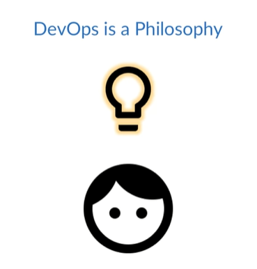
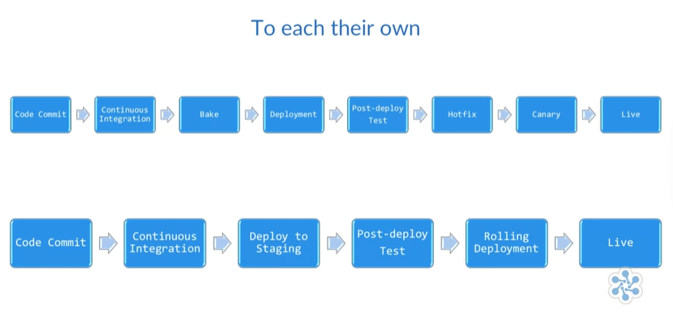
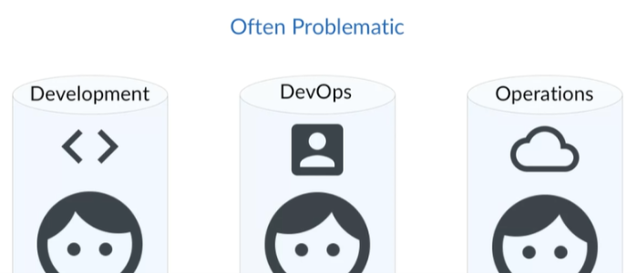
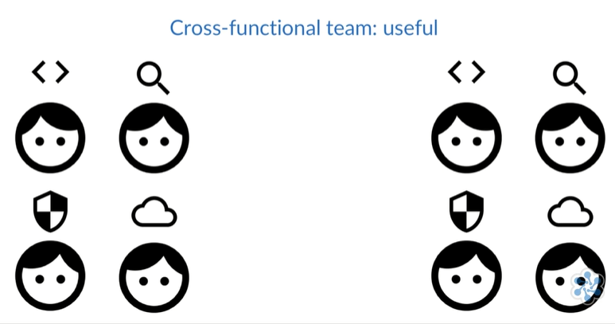

# DevOps 

- [In a Nutshell](#in-a-nutshell)
- [What is DevOps?](#what-is-devops)

## In a Nutshell 

The concept is that from development through the deployment process and onto actually running your code in production, these three things are connected as a sort of pipeline for your software to flow through.

## What is DevOps?

If you were to ask 100 technical people what DevOps is, chances are you'll get at least 100 different answers back. So knowing that there isn't consensus on a single definition might make you a bit leery about this whole DevOps thing, and that's completely understandable. But the lack of any standard definition doesn't detract from its value. It's really quite the opposite, and that's because DevOps is a philosophy.

  

DevOps is the philosophy of the efficient development, deployment, and operation of the highest quality software possible. Being a philosophy, it allows each company to implement it in the way that best supports them.

  

There's no one right way to adopt a DevOps philosophy, though there are definitely wrong ways. What we find is that some practices and strategies help support the philosophy and some don't. 

  

For instance, creating a DevOps team tends to be an example of what not to do, since it creates a new silo for engineers to become isolated in. 

Whereas, having cross-functional teams made of developers, QA, security, and operations engineers could be a useful strategy since it promotes collaboration.

  