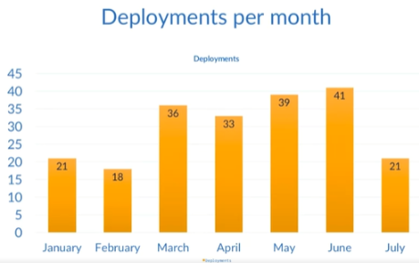
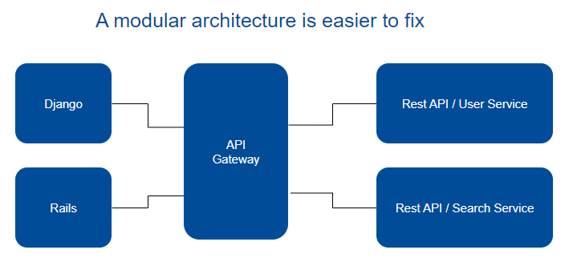
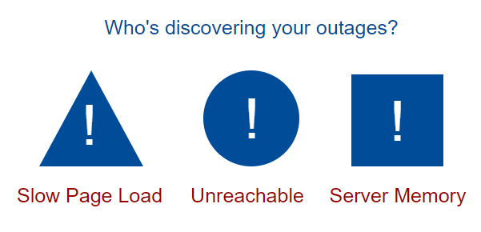
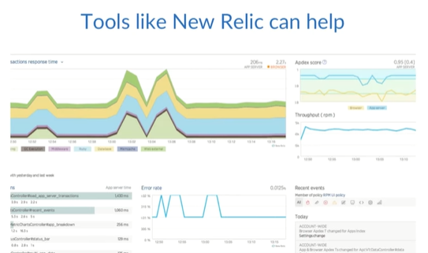

# Metrics 

- [Metrics](#metrics)
- [Deployment Frequency](#deployment-frequency)
- [Mean Time to Recovery MTTR](#mean-time-to-recovery-mttr)
- [Mean time to discovery MTTD](#mean-time-to-discovery-mttd)
- [System Availability](#system-availability)
- [Service Performance](#service-performance)
- [Customer Complaints](#customer-complaints)
- [Lead Time](#lead-time)

## Metrics 

Metrics provide insights into the impact of DevOps practices on the pipeline's efficiency and the overall quality of the software produced.

**DevOps Philosophy and Metrics**

- DevOps focuses on efficient development, deployment, and operation of high-quality software.
- To gauge efficiency and quality, specific metrics are crucial for evaluation.

## Deployment Frequency

- Key metric reflecting pipeline health.
- Ideally shows an upward trend during active development, reaching a plateau when software stabilizes.

## Mean Time to Recovery (MTTR)

- Represents the average time to resolve production environment issues.
- Encompasses various problems impacting end users, such as outages, severe bugs, and security vulnerabilities.

  

Failures are inevitable, regardless of meticulous planning or the quality of our code and infrastructure. Designing software and infrastructure for maximum flexibility eases the handling of failures. The objective is to reduce the frequency of failures over time. 

While the ideal scenario is a lack of failures, acknowledging their inevitability and understanding the average resolution time aids in identifying potential bottlenecks in the resolution process.

  

## Mean time to discovery (MTTD)

Despite the inevitability of failures, the key question is: How quickly can you identify these failures? Is it through automated methods, or are your customers the ones discovering the issues for you?

Where MTTR begins from the moment of discovery, MTTD begins from the moment any failure is introduced to production. So this is useful because it tells us how quickly we're identifying problems.

  

## System Availability

Even if you're not bound to some sort of uptime agreement with your customers, knowing the uptime of each system that comprises your software as well as the overall uptime percentage is valuable. Having an understanding of the availability of each of the components of your software, load balancers, web servers, CDNs, will help you identify areas that may need some attention from your engineers. 

For example, if your web servers have an uptime of roughly 90% for the month, this is probably a symptom of a larger problem.

  

## Service Performance

Like availability, service performance will help you identify potential problems. You should know at a glance if your systems are performing within the desired thresholds that you've set. 

For example, how long does it take for a response to come back from your REST APIs? Or how long does it take for your web pages to load? Are you optimizing your website so that people on mobile devices using non-Wi-Fi connectivity aren't pulling down three-megabyte background images? 

If you track the average response time for your systems and a code deployment significantly impacts those times, then you'll be able to better identify which code change caused the latency.

  

## Customer Complaints

This is something you're probably already tracking. If you're seeing a large percentage of your user base complaining about problems week after week, then you'll need to evaluate what the issues are and how to incorporate preventative measures into your pipeline. 

Recall that we need to avoid the blame culture, and instead determine what's going wrong and how to prevent it from going wrong in the future. Ideally, those preventative measures will be something that you can automate if it makes sense to do so.

  

## Lead Time

Lead time is the time it takes you to go from a feature request to that feature being released. Getting the customers the features they want as quickly as possible without sacrificing quality ties into our goal of efficiency. 

  

Also, the faster you can take an idea and put it onto staging servers for review, the faster you can either approve or reject new ideas, allowing you to fail fast enough to make experimentation possible. 

If it takes you weeks or months to get an idea from concept to running on a staging server, then experimentation becomes unsustainable, and without that experimentation you risk your software becoming stagnant.

**Conclusion**
No single metric should represent the complete picture, and all of these metrics are merely a conversation starter. They should be used to enhance your software pipeline, not to beat up engineers for not meeting some sort of arbitrary goal, such as lines of code per day.