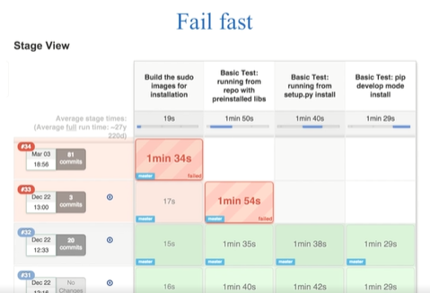
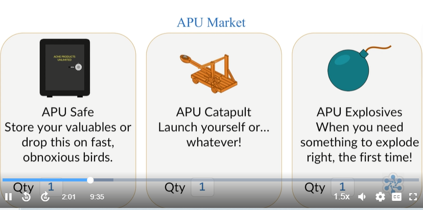
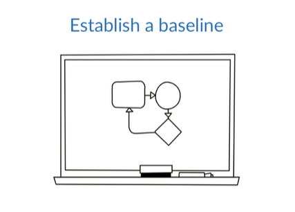
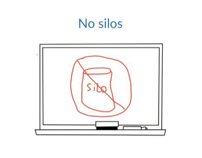
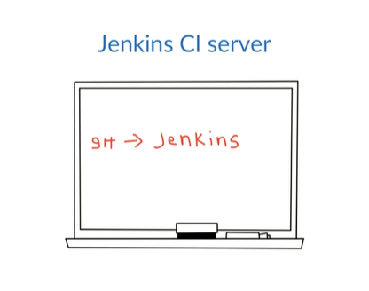
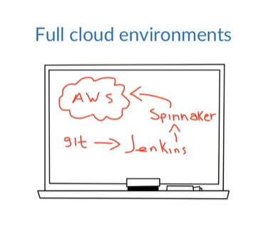
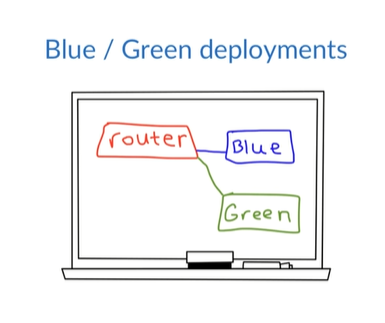
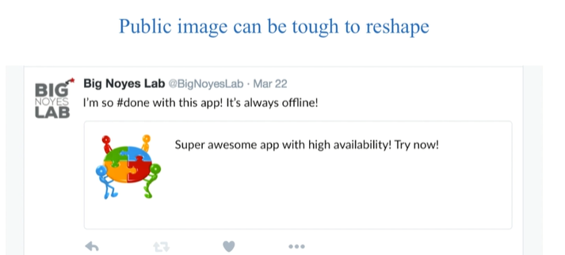

# Improving Lead Time, Stability, and Operational Costs 

- [How DevOps can Improve Lead Time](#how-devops-can-improve-lead-time)
- [How DevOps can Improve Stability](#how-devops-can-improve-stability)
- [How DevOps can Reduce Operational Costs](#how-devops-can-reduce-operational-costs)

## How DevOps can Improve Lead Time

DevOps addresses the challenge of instabilities arising from continuous change in software development. Developers introduce change through new features, bug fixes, and code refactoring, which can potentially disrupt operations. 

The solution is to establish an automated environment for rapid issue detection. Despite inevitable mistakes, early detection prevents them from escalating into production problems.

  

Detecting mistakes in production incurs high costs, whereas catching errors shortly after a developer commits or even before the commit is cost-effective. In the realm of software development and deployment, lead time encompasses the duration from idea inception to release.

Now, let's consider a fictional case study of Acme Products Unlimited (APU) to illustrate how DevOps can enhance lead time. APU, a prominent pest management product manufacturer, transitioned from monthly code deployments to multiple daily releases. 

Despite overcoming past quality issues, the company faced challenges due to surging traffic on their successful online marketplace.

  

They have a backlog of features that they want to get developed and released to the users, including a forum for users to chat about what works for them. They also want to release their latest annoying bird detection and capture devices.

  

Concerns about site downtime have restrained Acme Products Unlimited (APU) from implementing changes, given historical deployment issues lasting hours. 

- Their development cycle spans a few weeks, involving code handover to QA after conflict resolution. 
- The iterative process ensues: 
    - QA identifies defects, 
    - developers rectify them, and 
    -  cycle repeats until QA approves. 
- Once cleared, the code proceeds to the operations team, and deployment is scheduled, typically on a Saturday.

On Deployment Saturday, developers and operations convene for the deployment process. Operations withdraws a web server from the load balancer, executes a Git pull command for code update, and tests the result. 

However, this conventional approach often leads to a 500 Error in the browser, lacking specific details due to debug mode deactivation.

  

Depending on the engineer, they may either troubleshoot server logs or enable debug mode to identify errors remotely. A common issue at APU is new dependencies or unmentioned database changes. The operations and development teams collaborate to resolve issues and restart servers or roll back if needed.

While development and QA collaborate, the operations team focuses on maintaining the site, often configuring new virtual machines. APU lacks a DevOps culture with silos and manual deployments, hindering efficiency and automation. Infrequent deployments signal an inefficient process, and companies often avoid them due to perceived complexity.

In contrast, a year later under a new CTO embracing DevOps, APU undergoes a cultural shift. The CTO emphasizes measurement, establishing baselines for lead time, uptime, deployment frequency, MTTD, and MTTR.

  

Once he had his metrics, he started forming autonomous cross-functional teams, teams comprised of developers, QA, security, and operations engineers. 

- No longer would there be a hand-off model. 
- The teams each worked on their own product from start to finish. 
- If you created it, you ran it in production. 
- Engineers implement a fully automated continuous integration and continuous delivery pipeline.

  

The continuous integration was implemented with Jenkins. The developers would check their code into a Git repository and Jenkins would grab those changes. 

- It would build the project and create an artifact, then it would run all of the tests to make sure that the build was successful, and mark it as successful only if everything passed. 
- The QA and security members worked with the entire team to devise a complete set of tests, including things like load testing and security audits.

  

The developers began using feature toggles to ensure that features that weren't ready for release wouldn't impact the running code and production but could still be deployed, thus allowing the main branch of the repo to serve as the canonical source. 

  

And deployments were happening several times a day, usually with no impact on stability. 

- The closer collaboration between developers and operations promoted a more efficient code base, reducing the total number of servers required. 
- The culture of automation inspired a complete push to the cloud and the adoption of an elastic infrastructure.

  

When the server load on the web servers gets too high, the auto scaling adds a new server. The new server is an immutable, pre-baked image made with Spinnaker. 

- When the server load dies down, the newly created server is terminated. 
- The team also switched to a blue green deployment model that has allowed them to deploy multiple times per day and roll back if they need to. 
- Overall, APU is now able to deploy multiple times per day with less down time and better lead time.

  

In this scenario, how did APU improve their lead time?

- They implemented a series of changes that allowed code to be deployed throughout the day, thus removing their largest constraint. 

- Their developers can focus on creation rather than unplanned work. 

What were their steps? 

- They established a clear baseline, allowing them to determine the success of their efforts. 
- Then they made top down cultural changes.
- They implemented a completely automated continuous delivery process. 

What this means?

- As soon as developers check in their code, the process takes over and ensures the code meets all the requirements to be production quality. 
- It allows for a person to deploy to any environment with a push of a button. 

To enhance lead time, assess your entire development, deployment, and operations pipeline. Identify and plan to eliminate or minimize constraints continuously until your goals are met. 

Automation aids in overcoming constraints and ensures a consistent process. In summary, lead time is the duration from feature request to release, and a robust DevOps plan is crucial for identifying and addressing constraints that impede efficiency.

## How DevOps can Improve Stability

Still using Acme Products Unlimited's shift from monthly to daily deployments, let's look at it from the perspective of system stability.

The challenge arises as changes from development conflict with operations' pursuit of stability. APU faced issues with their E-Commerce site and manual server configurations before adopting a DevOps approach, leading to burnout and extended downtime.

Analyzing stability, key changes had a significant impact:

1. **Cultural Shift:** Breaking down silos, APU fostered collaboration among operations, developers, QA, and security engineers. Cross-functional teams enabled proactive problem-solving, enhancing software quality and, consequently, stability.

2. **Metric Utilization:** Embracing metrics provided a performance baseline, enabling engineers to identify and address issues promptly. This contributed to greater stability by swiftly recognizing and resolving problems caused by changes.

3. **Automation:** APU automated processes, introducing continuous integration to catch issues before reaching production. Elastic infrastructure scaled dynamically, ensuring system stability under varying traffic demands. Immutable server models and blue-green deployments further minimized instabilities, ensuring smooth transitions between changes.

In summary, DevOps enhances stability by ingraining quality into software, automating infrastructure management for scalable responses, and ensuring predictability and consistency in deployments.

## How DevOps can Reduce Operational Costs

While we've already covered enhanced lead time and stability, it's essential to tackle how we can minimize operational costs.

Consider the financial impact of downtime for your company. For giants like Amazon, an hour of downtime can incur millions in losses. The same holds true for payment companies like PayPal or Stripe. With today's high costs of outages, ensuring service stability is crucial for protecting the bottom line, a topic we explored in the previous lecture on DevOps and stability.

  

Considerations beyond measurable metrics include the public perception of your product, a factor influenced by a history of outages or security issues. While quantifying the value of public image is challenging, such incidents impact it significantly.

Now, let's briefly overview how Acme Products Unlimited enhanced operational costs:

1. They prioritized a more stable product, improving code quality and operational processes, ultimately impacting operational costs positively.

2. Implementation of a system allowing multiple daily deploys improved lead time, preventing users from seeking alternatives due to delayed features.

3. Unplanned work for engineers was reduced, allowing the majority of time to contribute value to the software.

4. By alleviating the stress on engineers dealing with constant issues, Acme aimed to reduce turnover rates, contributing to overall operational cost improvements.

In summary, with improved stability, faster lead times, minimized unplanned work, and increased job satisfaction, Acme achieved a holistic enhancement in operational costs.