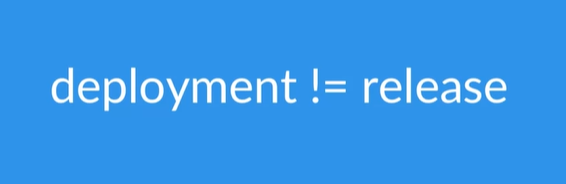
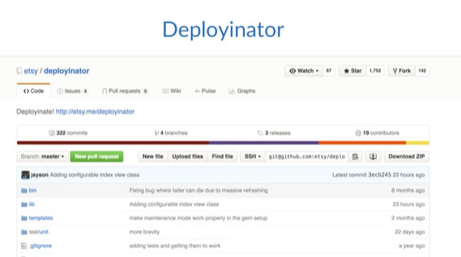
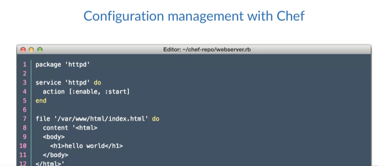
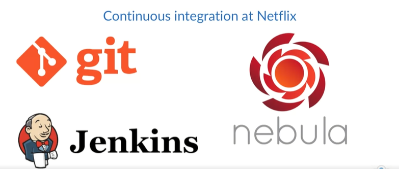

# What Companies Practice DevOps?

This section discuss real companies using DevOps practices, companies like Etsy, Netflix, and Amazon. 

## Etsy 

Etsy is an online marketplace for handmade and vintage items. Their system supports 54 million members. They have 1.4 million active sellers and 19.8 million active buyers. They deploy code around 50 times per day.

  

Let's clarify the difference between deployments and releases:

- Deployment involves pushing changes to an environment, like production, while 
- Release means enabling a feature for end users. 

Etsy's evolution from an initial tech stack of Ubuntu, PostGreSQL, Lighttpd, PHP, and Python, with SQL-stored procedures for business logic, faced challenges like regular maintenance outages during bi-weekly four-hour deployments. Recognizing the unsustainability, Etsy organically embraced a DevOps culture, prioritizing collaboration, transparency, and shared responsibility. 

They implemented continuous deployment using a tool called **Deployinator**, enabling one-click deployments, even for engineers on their first day. Etsy's shift to DevOps marked a significant improvement in their development, deployment, and operations pipeline, fostering efficiency and high quality.

  

They started using Chef for configuration management, and even started open sourcing some of their Chef plugins. 

  

Etsy transitioned to making frequent small code changes rather than infrequent large deployments, enhancing problem identification. 

- They adopted an ORM, avoiding multiple instances of business logic. 
- Switching to a MySQL Cluster with master-master replication and strategic schema migrations improved efficiency.

Etsy prioritizes using well-established tech for reliability over cutting-edge options with potential documentation and skill gaps. 

- Their current tech stack is a standard LAMP stack with Memcached D for database caching. 
- While they became a DevOps success story organically, it's essential to know when to adopt new tech and when to rely on proven solutions.

Etsy's journey, documented in talks by team members, showcases their organic shift from challenging, infrequent deployments to an inspiring frequency of 50 deployments per day, making them a beacon of DevOps success. Explore Etsy's story for valuable insights.

## Netflix 

Netflix recently announced that they had completed their cloud migration. Their entire operation is now in the cloud. 

- The tech stack used at Netflix seems to center around Java for the most part, though not exclusively. 
- They used Git, Jenkins, and Nebula for continuous integration. 
- Developers test locally using Nebula, and once everything is passed, they commit their code to Git. 
- Jenkins builds, tests, and bundles once again using Nebula.

  

In the context of an application project:

- Nebula generates an installable OS package, saving the artifact to the repository upon a successful build and passing of tests. 
- Jenkins triggers Spinnaker, adhering to Netflix's immutable server model, emphasizing prebaking the OS with application code and avoiding post-deployment OS changes.

Spinnaker utilizes **Aminator** to bake the AMI with the created artifact. 

- If successful, the build deploys to a staging environment for testing and review. 
- When ready for production, teams employ Spinnaker's blue-green deployment model. 

Netflix acknowledges the inevitability of failures in their dynamic, large-scale environment and introduces the Simian Army, featuring **Chaos Monkey** for testing infrastructure resilience. Chaos Monkey randomly terminates systems to validate redundancy.

The Simian Army also includes Janitor Monkey, clearing unused resources, and Conformity Monkey, ensuring instances adhere to best practices. Netflix proactively addresses failure scenarios through these tools, emphasizing preparedness and practice.

## Amazon 

Initially, Amazon.com operated as a monolith, a common setup for many websites. As the need for scalability and new features arose, Amazon transitioned to a microservices model. 

- They adopted the "two-pizza teams" approach, forming small teams (six to eight people) responsible for the complete lifecycle of their product.

- Teams at Amazon were granted autonomy to choose tools and technology, and they were accountable for their services, running them in production and addressing issues, fostering a culture of thorough testing. 

- Implementation of a fully automated continuous delivery pipeline. 

- This allowed new teams to automate testing and deployments, resulting in over 50 million deployments in 2014 across thousands of teams.

Similar to the other companies discussed, Amazon shares insights and practices on their tech blog, providing valuable information about their journey to a highly efficient development, deployment, and operations pipeline. Each company followed a distinct toolset but shared a common trajectory toward efficiency.