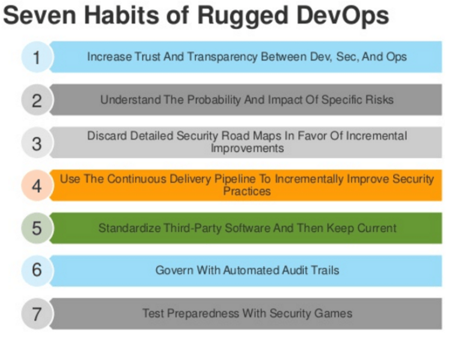
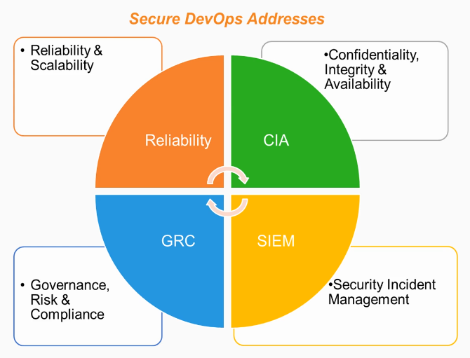
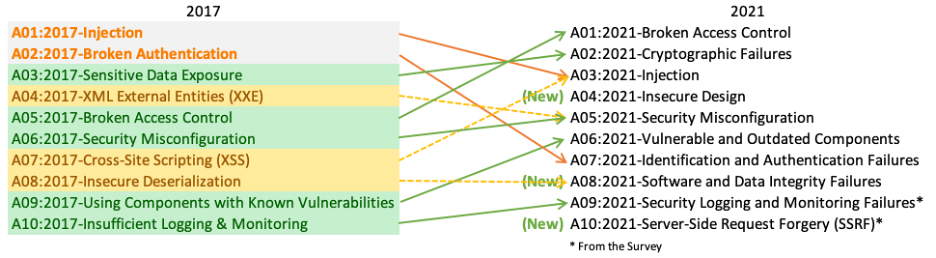

# Adopting DevSecOps 

- [DevOps to Accelerate Digital Transformation](#devops-to-accelerate-digital-transformation)
- [Avoid Late Security Checks](#avoid-late-security-checks)
- [Enter the "Rugged Manifesto"](#enter-the-rugged-manifesto)
- [Secure Devops for Application Security](#secure-devops-for-application-security)
- [Business-Driven Strategies](#business-driven-strategies)
    - [Strategy 1: Being Security Champs into the Devops Organization](#strategy-1-being-security-champs-into-the-devops-organization)
    - [Strategy 2: Integrate Security into DevOps Processes](#strategy-2-integrate-security-into-devops-processes)
    - [Strategy 3: Integrate Security Technology into DevOps Tools](#strategy-3-integrate-security-technology-into-devops-tools)
- [OWASP Security Guidelines](#owasp-security-guidelines)
- [Resources](#resources)

## DevOps to Accelerate Digital Transformation
 
As a refresher, the different phases of DevOps include:

- **Planning**
    - Business features are defined 
    - Backlogs are created and tasks are prioritized 
    - Impementing Scrum and Kanban

- **Coding**
    - Implementation of small chunks of software untis 
    - Automated builds are versioned and stored in repository

- **Testing**  
    - Automation suites are used
    - Perform code covergae and dynamic analysis
    - Implement techniques such as Test-Driven Development (TDD)

- **Release**
    - CICD Pipeline is leveraged 
    - End-to-end testing, making software ready for deployment 

- **Deployment**
    - Utilize tools such as Ansibel, uppet, and Chef for configuration management 

- **Operate**    
    - Monitor systems through metrics, alerts, and health  checks

## Avoid Late Security Checks

Avoiding security checks that are late in the release cycle prevents:

- slower release cycles and slower throughput 
- Higher cost 
- Breakdown of Agile and DevOps practices

Seucrity threats are constantly evolving and organizations require application with improved response to these threats. As a possible solution, we can follow the "Rugged Manifesto". 

## Enter the "Rugged Manifesto" 

"Rugged" describes software development organizations that have culture of rapidly evolving their ability to create available, survivable, defensible, secure, and resilient software.

- Security as the primary consideraton at every phase 
- Makes DevSecOps and DevOps are both critical in an environment
- Adds robust security methods to traditional DevOps practices 
- Add increased trust, transparency, and clearer understanding of probable risk
- Adopt security measure into all stages of software design and requirements

## Secure Devops for Application Security 

DevSecOps signifies a shift in security as it orchestrates and integrates config management. 

**Planning:**

- Address security at planning stage 
- Prepare threat modelling and data flow diagram 

**Coding:**
- Security architecture should be done with code inspector and environment hardening
- Choose security tools and solutions that integrate within the development environment

**Testing:**
- Interactive applications can help in instrumenting the app from the inside
- Perform other activites such as protocol and input fuzzing, and application vulnrability correlation

**Release Phase**: 

- Further security checks can be done, such as penetration testing 

**Deployment Phase:**

- Harden the system 
- Binary is signed and timestamped in the config phase 
- Signatures are checked before deploying to the  CICD pipeline
- Perform chaos testing to observe how application behaves in unsual circumstances

**Operate:**

- Check signature of binaries 
- Focus on configuration assurance at instantiation by security controls

**Monitor:** 

- Not all vulnerabilities will be identifies, and some may reach production 
- Continuous monitoring can check for irregular behavior in production

  

## Business-Driven Strategies

### Strategy 1: Being Security Champs into the Devops Organization 

- Foster mutual respect between developers, security, and business professinals
- Invite security experts into the DevOps team to balance the priorities 
- Emphatize with the Security experts 
- Learn all of your product's vulnerabilities

### Strategy 2: Integrate Security into DevOps Processes 

- Align processes to enable delivery speed 
- Treat all feature and defects alike
- Collaborate to build relationships and speed response 
- Adopt "incremental mindset"; embrace incremental changes 
 
### Strategy 3: Integrate Security Technology into DevOps Tools 

- "Shift-left" security, which means considering security at the early stage pf the project 
- Govern with automatic audit trails
- Add security to quality gates Use output data from security and testing tools
- Test preparedness withs ecurity games 

## OWASP Security Guidelines 

The Open Web Application Security Project® (OWASP) is a nonprofit foundation dedicated to improve the security of software. OWASP provides resources on methodologies, tools, and technologies in the field of application security.

The [OWASP Top 10](https://owasp.org/www-project-top-ten/) is a standard awareness document for developers and web application security. It represents a broad consensus about the most critical security risks to web applications.

## Resources 

- [Practical DevOps Security](https://www.packtpub.com/product/practical-devops-security-video/9781788394901)