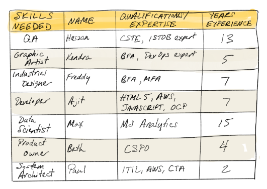

# Building the Team

- [The Goal](#the-goal)
- [The Right People For Your Team](#the-right-people-for-your-team)
- [Co-Location](#co-location)
- [Get Yourself A Coordinator](#get-yourself-a-coordinator)
- [Good Questions to Ask](#good-questions-to-ask)
- [The Talent And Skills Spreadsheet](#the-talent-and-skills-spreadsheet)

## The Goal

You need to identify the skills necessary to deliver the outcomes of your project, and match those skills to available talent.

You also need to make sure the individuals you choose have the behaviors and characteristics to succeed in an agile environment.

## The Right People For Your Team

You’ll need to align the right skills to the right part of the project.

When it comes to sourcing team members, here are some good things to look for in candidates:

- A commitment to excellence and continuous improvement
- A high level of emotional intelligence
- Comfort with ambiguity and supportive of an agile approach
- Pride and accountability for their work
- Flexibility to pivot as new information is obtained

## Co-Location

Try hard to keep your team members working in the same workspace together. You’ll find it much easier to manage your team. This will also accelerate communication, streamline development, and promote trust and mutual respect.

In a remote work environment, you can accomplish this via video conferencing and technology to support collaborative brainstorming, like Miro.

## Get Yourself A Coordinator

Seek out an experienced Scrum Master or Disciplined Agile Team Lead to serve as the coordinator and facilitator for your project. Be sure this person has an even and approachable temperament and ensure that they are able to educate your team about an agile way of working.

## Good Questions to Ask

Questions to ask yourself:

* Is your Scrum Master or Disciplined Agile Lean Scrum Master experienced?
* Do your team members have the behaviors and characteristics to succeed in an agile environment?

Questions to ask your team:

- Do your sponsor and team members understand the nature of an agile way of working and support the choice?

## The Talent And Skills Spreadsheet

Create a talent and skills spreadsheet that lists the skills you need.

Talent should be uniquely identified by name, qualifications, and experience level, and not simply by “Engineer” or “Analyst”.

Consider the geographical distribution of the team members.

  

Building a team is not a one-time event. You’ll need a mixture a people with different skill sets and abilities. Make sure that as a group, they represent everything you need.

Start by thinking about all the skills you’re going to need for the development of the GrowBot software. How does this list look so far?

* Developer
* Graphic Artist
* Subject Matter Expert
* QA Automation Engineer
* User Interface Designer

Remember, your team is tasked with the construction of just the app and the software. A separate project team is working on physical garden box and its hardware.

Plug the necessary skill sets into your spreadsheet. Begin thinking of the individuals who could get those jobs done.

Document each person’s qualifications and expertise, level of experience, proficiency, and location.

Then, identify whether each member is available. It’s your job to decide with the functional managers on the availability of the team members.