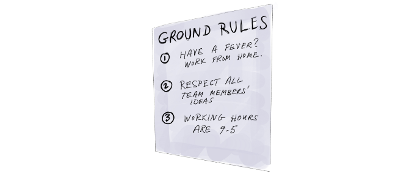

# Setting up the Environment

- [The Goal](#the-goal)
- [Creating The Right Environment](#creating-the-right-environment)
- [Ground Rules For A Happy Team](#ground-rules-for-a-happy-team)
- [Good Questions to Ask](#good-questions-to-ask)

## The Goal

Ideally, the whole team has an effective, dedicated space for the duration of the project.

The space should have everything the team needs to be happy and productive: whiteboards and markers, sticky notes, and any other supplies. This should also be a place where stakeholders can visit to get updates on the project.

## Creating The Right Environment

The team should discuss and decide what their space should include (within reason). Ask them what they need to be comfortable, productive, and successful.

## Ground Rules For A Happy Team

Get your team together and have them create some working agreements, or ground rules. Rules could include things like the following:

  

## Good Questions to Ask

* Does everyone have what they need to be comfortable and productive?
* Does everyone understand and agree with the working agreements?

