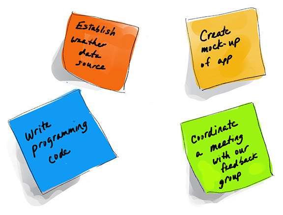

# The Sprint Planning 

- [The Goal](#the-goal)
- [Creating Tasks](#creating-tasks)
- [Good Questions to Ask](#good-questions-to-ask)
- [The Start Of Each Sprint](#the-start-of-each-sprint)
- [Assign Tasks Points Using the Fibonacci Sequence](#assign-tasks-points-using-the-fibonacci-sequence)

## The Goal

You’re about to populate your Scrum board with sticky notes that display all the work that will be accomplished during this sprint.

The idea is to have all the work up on the wall, visible, organized, and accessible by the team, so they all understand what they’ll be working this sprint, and whom is accountable for each piece of work.

You’ll be organized, prioritized, and ready to hit the ground running when the sprint begins.

You will feel prepared, energized, and excited to get started after this meeting.

## Creating Tasks

Your Scrum board is about to become the centerpiece of your team room.

Your **Scrum Master** or **Disciplined Agile Lean Scrum Master** will facilitate this meeting at the beginning of each sprint.

Your guidance on the sequencing of work to produce the highest value may be needed.

## Good Questions to Ask

* Has the Scrum Master or Disciplined Agile Scrum Master worked with the team to determine the tasks that will be completed during the sprint?
* Are the user story point estimates in the sprint agreed to by the team members?
* Does everyone understand the work they need to complete during this upcoming sprint?
* Does the workload realistically match the team’s capacity?

## The Start Of Each Sprint

During the sprint planning meeting, the team breaks the **user stories** into tasks and writes each task on a sticky note. Each team member should have a pile of sticky notes by the end.

The length of time each task will take to complete is determined by the team member working on the specific task. **Story points** are assigned to each task, typically using the Fibonacci sequence.

All the stickies go into the product backlog.

Next, the team forecasts how much work they can accomplish during this sprint, moves the tasks from the product backlog to the upcoming sprint, into the “TO DO” section of the Scrum board to tee up the work for the upcoming sprint.

Here's an example user story:

> *“As a gardener, I want a device that measures and corrects sun levels, so that I don’t have to worry about my plants getting fried by the sun.”*

The user story can be broken down to individual tasks:

- Coordinate a meeting with our feedback group

- Create mock-up of app interface

- Write programming code to trigger the sun shade when necessary

- Establish weather data source

These tasks will be displayed on your Scrum board.

  

## Assign Tasks Points Using the Fibonacci Sequence

Your team will need to assign each task a number that represents how much effort it requires to complete the task. Instead of assigning hours to each task, we use the Fibonacci sequence to show relativity of work across all tasks in the project.

This is a math concept that is based on adding successive integers.

Fibonacci numbers typically used in planning meetings are 1, 3, 5, 8 and 13. The number 1 indicates that only a small amount of work is needed to complete the task. The number 13 indicates that the entire two-week sprint is needed to complete the task.

> **Story points:**  1, 3, 5, 8, 13

If a task needs more than the two weeks to be completed, it should be further broken down.

Don’t confuse points with hours! One point is not equal to one hour. The Fibonacci sequence shows relativity of work across all tasks in the project.

Remember, every feature, epic, user story, and task needs acceptance criteria before it goes into the sprint.

Your team has already created the acceptance criteria for these tasks.

You can do this with a couple of bullet points, or you can use a format similar to user stories. Its framework looks like this: given/when/that.

Now it’s your turn to help point the tasks using the Fibonacci sequence. 

Here's an example:

> **Task**: 
> Coordinate a meeting with our feedback group.
>
> **Acceptance criteria**: 
> A meeting is on the calendar and 95% of the group has confirmed attendance.

Since this is fairly easy, we can assign this a story point of 1.

Here's another one:

> **Task**: 
> Create a mock-up of a user interface.
>
> **Acceptance criteria**: 
> Mock-up is high-fidelity enough to allow users to play around with all the major functions of the app. Must be designed to work on a phone.

This is a relatively mid-sized task, which could have a story point of 5.

Another one:

> **Task**: 
> Write programming code to trigger the sun shade when necessary..
>
> **Acceptance criteria**: 
> When a the sun is too strong, shade must cover the bed to shade the plants. When a the sun is not strong, the shade must retract.

This is a relatively large task. This can be given a story point of 13.