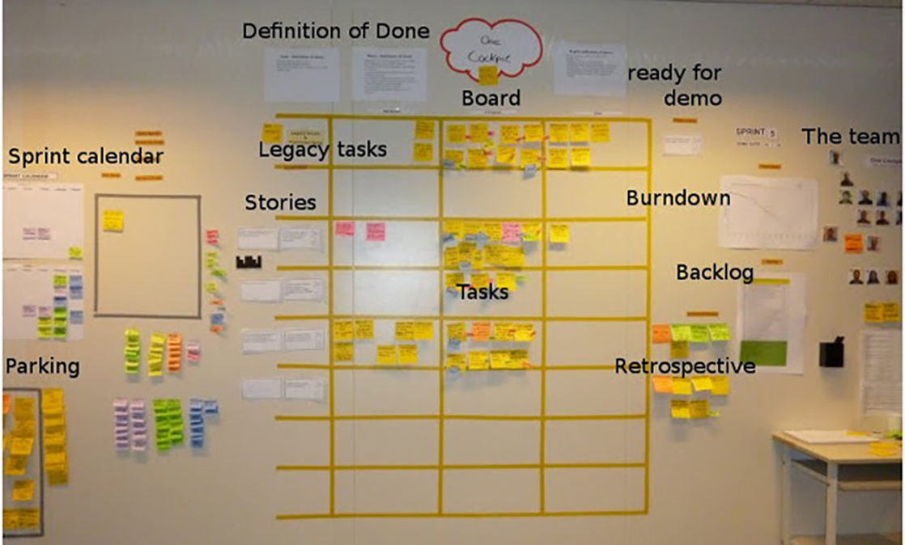

# The Scrum Board

- [Make Friends With The Scrum Board](#make-friends-with-the-scrum-board)
- [Transparency Is Everything](#transparency-is-everything)
- [Create the Scrum Board](#create-the-scrum-board)

## What it is

The Scrum board is a physical or digital board where work items, and their current status, are displayed to team members, sponsors, and anyone else.

## Transparency Is Everything

Everyone can see the state of every piece of work at any time. You can hang it at your desk or in your team room. If your team is not co-located, there are many free online tools that can help you do this, too.

## Create the Scrum Board 

First you need the right spot. It should be nice and large, and in a place where people can’t miss it. You want people to be able to walk up to it and move work items around.

Things you’ll need:

* Either a white board or a big wall space
* Masking tape or painter’s tape
* Sticky notes
* Markers
* Your team!

Team members are responsible for keeping it up-to-date. Everyone should update it daily.

  

To start your Scrum board, get your team together. Hand out sticky notes, and assign colors to either types of tasks, or individual team members.

Have the team capture each task on a separate sticky. If you’re just starting your project, most of your stickies will be in “To Do”. As the project progresses, you’ll move the tasks into the “Done” column.

To keep things moving, try your hardest to limit work in progress. Try to move a small amount of tasks at a time through the cycle, if possible.